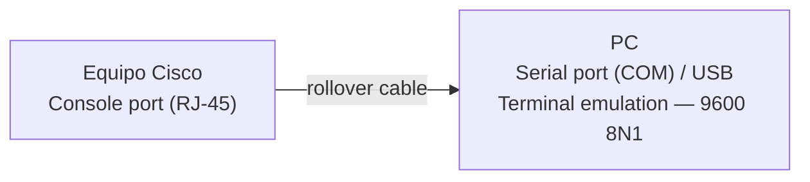
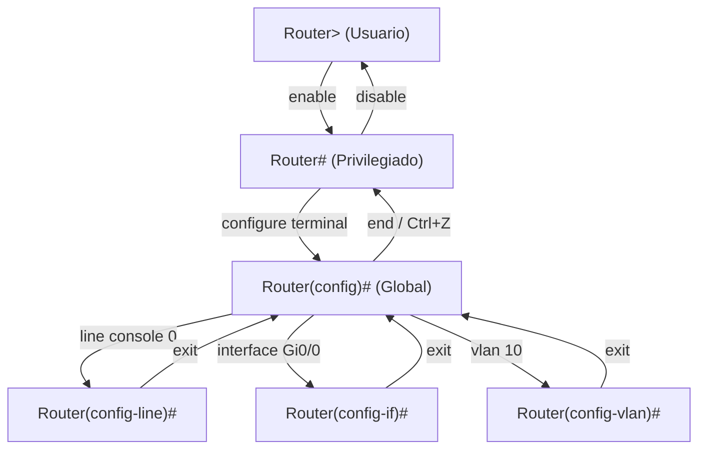

Un router o switch recién sacado de la caja no tiene dirección IP configurada,
por lo que no se puede administrar por red. El primer acceso siempre se hace por
el **puerto de consola** (_console port_), un puerto de administración dedicado
que no requiere configuración previa.

## Acceso por consola

Para conectarte por consola necesitas:

- Un **rollover cable** (Cisco) que conecta el **console port** del equipo con el
  **serial port (COM)** o USB de tu PC.
- Un programa de **terminal emulation**: PuTTY, Tera Term, SecureCRT, o la
  consola del sistema operativo.
- Una configuración de puerto: típicamente **9600 baud rate**, **8 data bits**,
  **no parity**, **1 stop bit** (8N1), **no flow control**.



> **Puerto de consola:** puerto de administración out-of-band. Permite
> recuperar contraseñas y configurar el equipo aunque no tenga dirección IP o
> la red esté caída.

Al conectar y presionar Enter, verás el prompt en **modo usuario**:

```ios

Router>
```
## Los modos de la CLI de IOS

La interfaz de línea de comandos (CLI) de IOS organiza los comandos en niveles
jerárquicos llamados **modos**. Cada modo tiene su propio prompt y su conjunto
de comandos.

### Modo usuario (User EXEC)

- Prompt: `>` (ej. `Router>`).
- Acceso limitado: comandos de consulta básicos y `show`.
- Es el nivel inicial de la sesión.
- No permite cambios de configuración.

### Modo privilegiado (Privileged EXEC)

- Prompt: `#` (ej. `Router#`).
- Se entra con el comando `enable`.
- Acceso a todos los comandos `show`, además de `copy`, `debug`, `reload`, etc.
- Se sale con `disable`.

### Modo de configuración global (Global Configuration)

- Prompt: `(config)#` (ej. `Router(config)#`).
- Se entra desde el modo privilegiado con `configure terminal`.
- Los cambios se aplican al **running-config** en RAM al instante.
- Se sale con `exit` (vuelve al modo privilegiado) o `end` / `Ctrl+Z` (vuelve
  directamente al modo privilegiado).

### Modos de subconfiguración

Desde el modo de configuración global se entra a submodos específicos:

| Submodo        | Comando de entrada        | Prompt                | Configura qué                |
| :------------- | :------------------------ | :--------------------- | :---------------------------- |
| Línea          | `line console 0`          | `Router(config-line)#` | Puertos console, aux y VTY    |
| Interfaz       | `interface GigabitEthernet0/0` | `Router(config-if)#` | Interfaces del dispositivo |
| VLAN           | `vlan 10`                 | `Router(config-vlan)#` | VLANs del switch              |
| Routing        | `router ospf 1`           | `Router(config-router)#` | Protocolos de enrutamiento  |



## Navegación y ayuda de la CLI

IOS ofrece ayuda contextual y abreviaturas para agilizar el trabajo:

- **`?`**: muestra ayuda. Si se escribe solo, lista todos los comandos del modo
  actual; después de un comando incompleto, muestra los parámetros disponibles.
- **Tab**: completa el comando (autocompletado).
- **Abreviaturas**: basta con escribir lo que no sea ambiguo. Ej.
  `en`, `conf t`, `sh run` en lugar de `enable`, `configure terminal`,
  `show running-config`.
- **`Ctrl+Z`** o **`end`**: vuelve al modo privilegiado desde cualquier submodo.
- **`exit`**: retrocede un nivel en la jerarquía de modos.
- **`Ctrl+Shift+6`**: interrumpe un comando en ejecución (ej. un ping largo).
- **Historial**: flechas arriba/abajo para recorrer comandos anteriores.
- **`show history`**: muestra los comandos recientes de la sesión.

```ios
  Exec commands:
    clear    Reset functions
    configure  Enter configuration mode
    copy     Copy from one file to another
    ...
```

> **Pista CCNA:** memoriza los prompts. En un examen, identificar en qué modo
> estás te dice qué comandos son válidos. `>` = usuario, `#` = privilegiado,
> `(config)#` = configuración global.

## Comandos de verificación básicos

En modo privilegiado puedes ver el estado del equipo:

| Comando                    | Qué muestra                             |
| :-------------------------- | :---------------------------------------- |
| `show running-config`       | Configuración activa (en RAM)             |
| `show startup-config`       | Configuración guardada (en NVRAM)         |
| `show version`              | Versión de IOS, memoria, uptime, modelo   |
| `show interfaces`           | Estado y estadísticas de las interfaces   |
| `show ip interface brief`   | Resumen de interfaces (IP y estado)       |
| `show clock`                | Fecha y hora del dispositivo              |

## Preguntas tipo CCNA

1. **¿Cuál es el primer método de acceso a un switch nuevo sin configuración?**
   El **puerto de consola** con un cable rollover y un emulador de terminal.

2. **¿Qué comando te devuelve del modo privilegiado al modo usuario?**
   `disable`.

3. **¿En qué modo estás cuando el prompt es `Switch(config-line)#`?**
   En el **submodo de configuración de línea**, dentro del modo de configuración
   global.

4. **¿Qué hace `Ctrl+Shift+6`?**
   Interrumpe un comando en ejecución, por ejemplo un ping largo.

5. **¿Por qué el acceso por consola es out-of-band?**
   Porque no usa la red de datos: es un puerto de administración separado que
   funciona aunque el equipo no tenga dirección IP.

## Resumen

- El acceso por consola es **out-of-band**: funciona aunque el equipo no tenga
  IP configurada o la red esté caída.
- La CLI de IOS tiene una jerarquía de modos: **usuario `>`**, **privilegiado `#`**
  y **configuración `(config)#`** con sus submodos.
- `?`, **Tab** y las abreviaturas aceleran el trabajo en la CLI.
- Los cambios de configuración se aplican al running-config en RAM.
