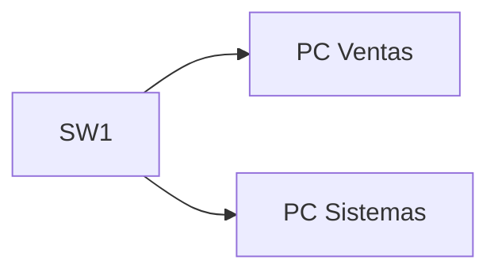

Hay que configurar el SW1 para que sea identificable y cuente con contraseñas de seguridad.



## Objetivos

1. Dar identidad a cada equipo (`hostname`).
2. Proteger el acceso (contraseña privilegiada, líneas, banner).
3. Habilitar **SSH** para administrar sin consola.
4. Guardar la configuración.

## Pasos

### 1. Configuración base de SW1

```ios
Switch# configure terminal
Switch(config)# hostname SW1

SW1(config)# enable secret ClaveSegura!
SW1(config)# service password-encryption
SW1(config)# banner motd #ACCESO AUTORIZADO SOLO PARA PERSONAL AUTORIZADO.#
SW1(config)# username admin privilege 15 secret ClaveSegura!

SW1(config)# line console 0
SW1(config-line)# password cisco123
SW1(config-line)# login
SW1(config-line)# exit
SW1(config)# line vty 0 15
SW1(config-line)# login local
SW1(config-line)# transport input ssh
SW1(config-line)# exit

SW1(config)# ip domain-name edificio.local
SW1(config)# crypto key generate rsa modulus 2048
SW1(config)# ip ssh version 2
SW1(config)# end
SW1# copy running-config startup-config
```

### 2. Verificación

```ios
SW1# show running-config
SW1# show ip ssh
SW1# show users
```

En el módulo 3, podremos conectarnos por SSH desde una PC.

## Comprobación final

| Pregunta                            | Respuesta esperada                   |
| :---------------------------------- | :----------------------------------- |
| Prompt de SW1                       | `SW1#`                               |
| ¿`enable secret` en running-config? | Aparece como hash (no texto plano)   |
| ¿Líneas vty solo SSH?               | `transport input ssh`                |
| ¿Configuración persistente?         | `copy running-config startup-config` |

> Cuando reinicies un equipo y siga con su configuración, el ejercicio está
> completo.

## Resumen

- Los tres equipos quedan con identidad, contraseñas y banner.
- SSH está habilitado (versión 2) y las líneas remotas solo aceptan SSH.
- La configuración se guardó en NVRAM en los tres equipos.

La red aún no transmite tráfico entre áreas. En el [Módulo 3](../03-network-configuration/)
añadirás las VLANs, el direccionamiento y el routing.
