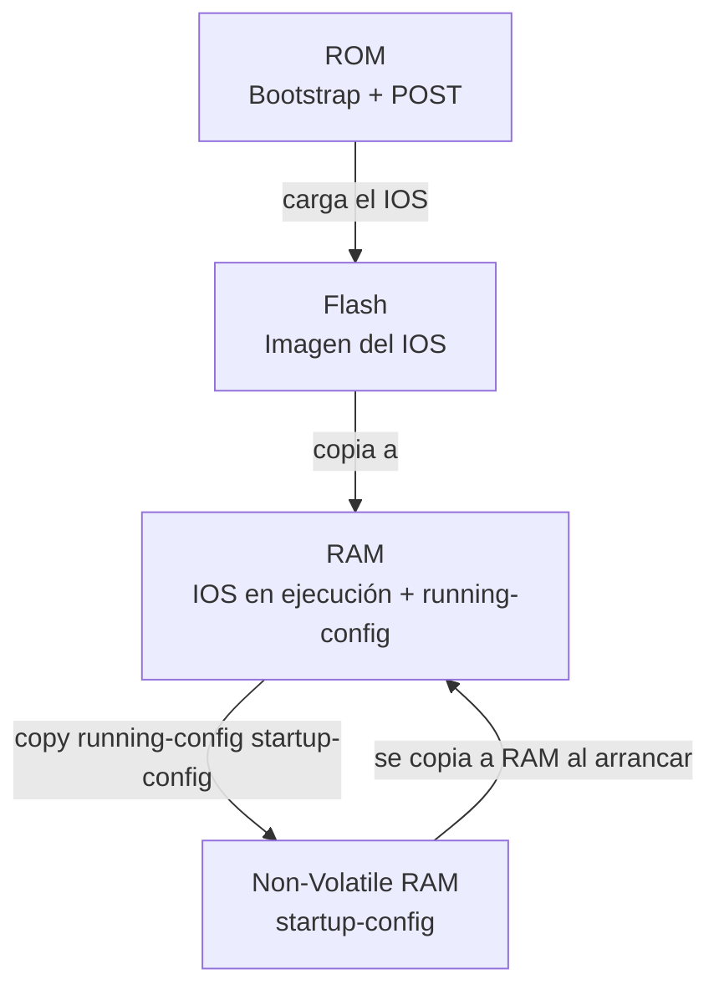

Un dispositivo Cisco almacena el sistema operativo (IOS) y sus configuraciones en
diferentes memorias. Saber dónde vive cada archivo es clave para no perder
trabajo al reiniciar y para recuperarse ante un fallo.

## Memorias y archivos

| Memoria  | Contenido                                | Volatilidad                         |
| :------- | :--------------------------------------- | :---------------------------------- |
| RAM      | IOS en ejecución, running-config, tablas | Se pierde al apagar                 |
| NVRAM    | startup-config                          | Persistente (se conserva)           |
| Flash    | Imagen del IOS, backups, archivos       | Persistente, reescribible           |
| ROM      | Bootstrap, monitor ROM, mini-IOS        | Solo lectura, arranque inicial      |


- **Flash**: almacena de forma persistente la imagen del **IOS** y el
  `startup-config` en algunos equipos. Permite actualizar el sistema operativo.
- **NVRAM**: guarda el `startup-config`; al arrancar se copia a RAM y pasa a ser
  el `running-config`.
- **RAM**: ejecuta el IOS y contiene la configuración activa; todo se pierde al
  apagar.

> Si el equipo arranca sin configuración válida, pregunta si deseas entrar al
> **modo de setup** (asistente inicial). Se sale con `Ctrl+C` y se continúa por
> CLI.

## Los archivos de configuración

| Archivo          | Dónde vive | Cuándo se usa            |
| :--------------- | :--------- | :----------------------- |
| `running-config` | RAM        | Configuración activa     |
| `startup-config` | NVRAM      | Configuración al arrancar |

Comandos para gestionarlos:

```ios
R1-Oficina# show startup-config       # ver la config guardada

R1-Oficina# copy running-config startup-config   # guardar cambios (save)
R1-Oficina# copy startup-config running-config   # recargar la guardada en RAM
R1-Oficina# erase startup-config                 # borrar la config guardada
```

> **Importante:** `copy startup-config running-config` **no** es un "undo":
> fusiona ambos archivos y no elimina comandos del running-config. Para volver a
> la config guardada de forma limpia se usa `reload` (reiniciar) o se revierten
> los comandos a mano.

La forma corta de guardar es `write memory` o simplemente `wr`:

```R1-Oficina# write memory
Building configuration...
[OK]
```
## El sistema operativo IOS

La imagen del IOS se identifica con **`show version`** y su nombre suele seguir
el patrón: `c2900-universalk9-mz.SPA.152-4.M1.bin`. El archivo vive en **Flash**.

| Comando          | Qué muestra                                     |
| :--------------- | :---------------------------------------------- |
| `show version`   | Versión de IOS, uptime, modelo, memorias, `system image file` |
| `show flash`     | Contenido de Flash, espacio libre, archivos     |
| `show boot`      | Archivo de arranque configurado (`boot system`) |

```R1-Oficina# show version
Cisco IOS Software, C2900 Software (C2900-UNIVERSALK9-M), Version 15.2(4)M1
...
System image file is "flash:c2900-universalk9-mz.SPA.152-4.M1.bin"
```

Configurar qué imagen cargar al arrancar:

```ios
R1-Oficina(config)# boot system tftp://192.168.1.10/ios.bin
R1-Oficina(config)# end
R1-Oficina# copy running-config startup-config
```
## Respaldo y restauración

La configuración y el IOS se pueden respaldar en un servidor **TFTP**, **FTP**
o **SCP**. El comando `copy` permite copiar desde y hacia cualquier origen
destino soportado.

### Respaldar y restaurar la configuración

```ios
R1-Oficina# copy running-config tftp://192.168.1.10
Address or name of remote host [192.168.1.10]?
Destination filename [R1-Oficina-confg]?
Writing running-config... [OK]

# Restaurar desde el servidor
R1-Oficina# copy tftp://192.168.1.10 startup-config
```
### Respaldar y actualizar la imagen del IOS

```ios
R1-Oficina# copy flash tftp://192.168.1.10

# Actualizar/instalar una nueva imagen desde el servidor
R1-Oficina# copy tftp flash
Address or name of remote host? 192.168.1.10
Source filename? c2960-lanbasek9-mz.150-2.SE.bin
Destination filename [c2960-lanbasek9-mz.150-2.SE.bin]?
...
```

> Antes de actualizar el IOS, verifica que el archivo nuevo quepa en Flash
> (`show flash`) y deja la configuración guardada (`copy running-config
> startup-config`). El cambio de imagen se aplica tras `reload`.

## Preguntas tipo CCNA

1. **¿Dónde se almacena el startup-config?**
   En **NVRAM**, por eso persiste al reiniciar.

2. **¿Qué comando guarda el running-config en NVRAM?**
   `copy running-config startup-config`.

3. **¿Qué comando muestra la versión del IOS y la imagen de arranque?**
   `show version`.

4. **¿Por qué `copy startup-config running-config` no elimina comandos?**
   Porque **fusiona** la config guardada con la activa; no revierte nada.

5. **¿Qué comando borra la configuración guardada para devolver el equipo a
   su estado de fábrica?**
   `erase startup-config` (y luego `reload` para aplicar el estado limpio).

## Resumen

- **RAM** = running-config (volátil); **NVRAM** = startup-config (persistente);
  **Flash** = imagen del IOS.
- `copy running-config startup-config` guarda los cambios.
- `show version` y `show flash` muestran la imagen y el espacio del IOS.
- `copy ... tftp ...` respalda configuraciones y la imagen del IOS.