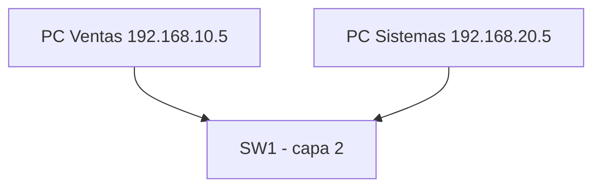
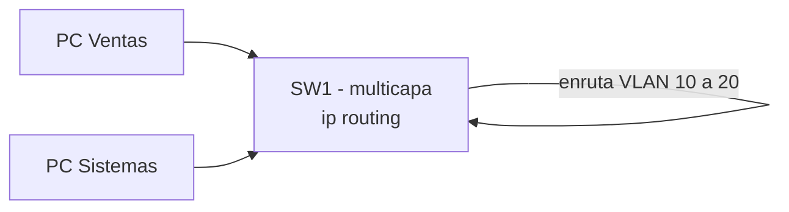

Las VLANs aíslan el tráfico, pero los equipos de VLANs distintas **necesitan
hablarse** (un equipo de Ventas debe llegar al servidor de Sistemas). Para eso
hace falta darle una **dirección IP** a la propia red y a los dispositivos de
capa 3 que la enrutan: el switch y el router. Este tema cubre dónde se ponen
esas IPs y cómo se hace el **enrutamiento entre VLANs**.

## El problema: VLANs aisladas no se hablan

**Situación:** en el piso tienes dos áreas: Ventas (VLAN 10) y Sistemas (VLAN
20). Una PC de Ventas y una de Sistemas, aunque estén en el mismo switch, están
en dominios de broadcast distintos: no se ven entre sí.



Para que se comuniquen hace falta **enrutar** entre esas subredes. El
enrutamiento necesita dos cosas:

1. Una **IP en cada subred** que actúe de **gateway** (la "puerta" de salida).
2. Un dispositivo de **capa 3** (router o switch multicapa) que conozca ambas
   subredes y reenvíe el paquete de una a otra.

El **gateway** que usan las PCs siempre es la IP del dispositivo que enruta en
esa subred. En una PC se configura a mano (o por DHCP):

```ios
# En la PC de Ventas
IP:        192.168.10.5
Máscara:   255.255.255.0
Gateway:   192.168.10.1
```

## Direccionamiento del switch: la SVI

Un switch capa 2 no enruta: sus puertos no tienen IP. Pero el switch **sí**
necesita una IP para ser administrado y, si es un switch **multicapa** (con
`ip routing`), para enrutar entre VLANs. Eso se hace con una **SVI** (Switch
Virtual Interface): una interfaz virtual asociada a una VLAN.

### SVI para administración (VLAN de gestión)

Todos los switches, sean capa 2 o no, tienen una SVI de gestión. Por buenas
prácticas se usa una **VLAN de administración dedicada** (la 99) y se le asigna una IP del rango de esa
VLAN:

```ios
SW1(config)# interface vlan 99
SW1(config-if)# ip address 192.168.99.1 255.255.255.0
SW1(config-if)# no shutdown
SW1(config-if)# exit
SW1(config)# ip default-gateway 192.168.99.2
```

| Comando                   | Función                                  |
| :------------------------ | :--------------------------------------- |
| `interface vlan <id>`     | Crea/entra a la SVI de esa VLAN          |
| `ip address <ip> <mask>`  | Asigna la IP de gestión al switch        |
| `ip default-gateway <ip>` | Gateway del switch (necesario en capa 2) |
| `no shutdown`             | Levanta la SVI                           |

> En un switch **capa 2**, `ip default-gateway` es obligatorio si quieres
> administrarlo por SSH desde otra subred: el propio switch no enruta, necesita
> un gateway de capa 3. En un **multicapa** con `ip routing`, no hace falta.

### SVI para enrutar entre VLANs (switch multicapa)

En redes corporativas grandes, la comunicación entre diferentes VLANs (por ejemplo, Ventas y Sistemas) generaba un volumen masivo de tráfico. En un esquema con router tradicional (Router-on-a-Stick), todo ese paquete tenía que viajar hasta el router, ser procesado por software en la CPU del router y regresar al switch.

El switch L3 integra la capacidad de enrutamiento (Capa 3) directo en el hardware del switch mediante chips especializados llamados ASIC, logrando enrutar datos a la misma velocidad de cable (wire-speed) que conmuta paquetes de Capa 2.

La misma SVI sirve de **gateway** para los hosts y enruta entre VLANs:

```ios
SW1(config)# ip routing
SW1(config)# interface vlan 10
SW1(config-if)# ip address 192.168.10.1 255.255.255.0
SW1(config-if)# no shutdown
SW1(config-if)# exit
SW1(config)# interface vlan 20
SW1(config-if)# ip address 192.168.20.1 255.255.255.0
SW1(config-if)# no shutdown
SW1(config-if)# exit
```

Con eso, una PC de Ventas (gateway 192.168.10.1) puede llegar a una de Sistemas
(gateway 192.168.20.1): **el switch enruta entre sus propias VLANs** sin
necesidad de un router externo.



## Direccionamiento del router: IP en la interfaz

En el router la IP se vincula **directo en el puerto** físico que mira hacia cada red:

```ios
R1(config)# interface GigabitEthernet0/0
R1(config-if)# ip address 192.168.10.1 255.255.255.0
R1(config-if)# no shutdown
R1(config-if)# exit
R1(config)# interface GigabitEthernet0/1
R1(config-if)# ip address 192.168.20.1 255.255.255.0
R1(config-if)# no shutdown
R1(config-if)# exit
```

| Comando                  | Función                                   |
| :----------------------- | :---------------------------------------- |
| `ip address <ip> <mask>` | Asigna la IP (gateway) a la interfaz      |
| `no shutdown`            | Activa la interfaz (por defecto apagada)  |
| `description <texto>`    | Documenta qué hay del otro lado del cable |

La IP de cada interfaz del router **es el gateway** de los hosts de esa subred.
El router ve ambas redes como **conectadas** (código `C` en `show ip route`) y
las enruta entre sí automáticamente.

## Verificación

```ios
SW1# show ip interface brief
Interface             IP-Address      OK? Method Status                  Protocol
Vlan10                192.168.10.1    YES manual up                      up
Vlan20                192.168.20.1    YES manual up                      up
Vlan99                192.168.99.1    YES manual up                      up
```

```ios
R1# show ip interface brief
Interface             IP-Address      OK? Method Status                  Protocol
GigabitEthernet0/0    192.168.10.1    YES manual up                      up
GigabitEthernet0/1    192.168.20.1    YES manual up                      up

R1# show ip route
      10.0.0.0/8 is variably subnetted
C      192.168.10.0/24 is directly connected, GigabitEthernet0/0
L      192.168.10.1/32 is directly connected, GigabitEthernet0/0
C      192.168.20.0/24 is directly connected, GigabitEthernet0/1
L      192.168.20.1/32 is directly connected, GigabitEthernet0/1
```

| **Característica**          | `show ip interface brief`                                                                         | `show ip route`                                                                                                |
| --------------------------- | ------------------------------------------------------------------------------------------------- | -------------------------------------------------------------------------------------------------------------- |
| **Objetivo**                | Ver el **estado local** de los puertos e interfaces.                                              | Ver las **rutas y destinos** que el equipo conoce.                                                             |
| **Capa OSI principal**      | Capa 1 (Física) y Capa 2 (Enlace de datos).                                                       | Capa 3 (Red).                                                                                                  |
| **Información que entrega** | Nombre de la interfaz, IP asignada, estado físico (`Status`) y estado del protocolo (`Protocol`). | Redes de destino, métricas, distancia administrativa, siguiente salto (_next-hop_) y cómo se aprendió la ruta. |
| **Pregunta que responde**   | _"¿Están mis cables conectados y mis puertos encendidos con la IP correcta?"_                     | _"Si llega un paquete para la red X, ¿a dónde o a qué IP lo debo enviar?"_                                     |

Prueba final desde una PC:

```bash
PC-Ventas# ping 192.168.20.5
```

> Ventas: .10.5, Sistemas: .20.5

## Preguntas tipo CCNA

1. **¿Qué es una SVI y para qué sirve?**
   Es una **interfaz virtual** asociada a una VLAN; da IP al switch para
   administrarlo y, en un switch multicapa, sirve de gateway y enruta entre
   VLANs.

2. **¿Dónde se configura el gateway por defecto en un switch capa 2?**
   Con `ip default-gateway <ip>`, apuntando al router o switch multicapa que
   enruta su VLAN de gestión.

3. **¿Qué comando convierte un switch capa 2 en capa 3?**
   `ip routing` (y las SVI con IP). Sin él, el switch solo conmuta en capa 2.

4. **¿Cuál es el gateway de los hosts de la VLAN 10 en el ejemplo?**
   La IP de la SVI 10 (192.168.10.1) o de la subinterfaz/interface del router
   que enruta esa subred.

5. **¿Cómo aparece una red conectada en `show ip route`?**
   Con el código `C` (connected) y `L` (local): son las redes de las interfaces
   con IP, que el router conoce sin ningún protocolo.

## Resumen

- Los hosts de VLANs distintas necesitan un **gateway** de capa 3 para
  hablarse (enrutamiento entre VLANs).
- **Switch:** la IP se configura en una **SVI** (`interface vlan <id>`); en
  capa 2 sirve solo para gestión (con `ip default-gateway`), en multicapa con
  `ip routing` además enruta.
- **Router:** la IP va en cada **interfaz física**; esa IP es el gateway de la
  subred y la red aparece como conectada (`C`) en la tabla de rutas.
- Verifica siempre con `show ip interface brief` y un `ping` de extremo a
  extremo.
- Con varias VLANs y un solo enlace hacia el router, pasa a las
  [subinterfaces](./subinterfaces).
