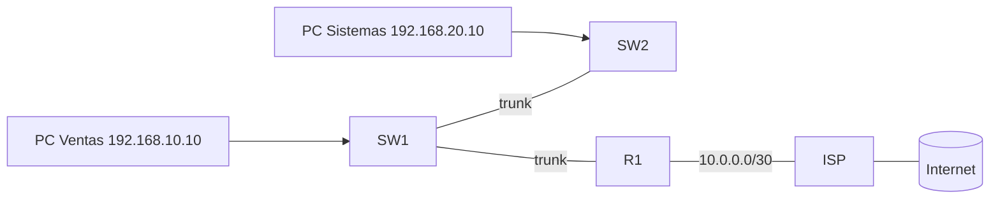

Segunda parte de la serie. Sobre los equipos que dejaste configurados en el
[ejercicio anterior](../02-device-management/ejercicio), ahora vas a hacer que
la red **funcione**: segmentar en VLANs, dar direccionamiento, enrutar entre
VLANs con subinterfaces y dar salida hacia el ISP. Al terminar, una PC de
Ventas podrá llegar a una de Sistemas y a internet.



## Requisitos

- Configuración básica de [Parte 1](../02-device-management/ejercicio): los
  tres equipos con hostname, secret, SSH y config guardada, y la **interfaz WAN
  de R1 hacia el ISP** ya documentada y activa.
- VLANs planificadas: **10 Ventas** (192.168.10.0/24), **20 Sistemas**
  (192.168.20.0/24), **99 Administración** (192.168.99.0/24, nativa), y el
  enlace al ISP en **10.0.0.0/30**.

## Objetivos

1. Crear y asignar las VLANs en los switches.
2. Levantar los trunks SW1-SW2 y SW1-R1.
3. Dar direccionamiento: SVI de gestión y subinterfaces en R1.
4. Enrutar entre VLANs (router-on-a-stick) y hacia el ISP (ruta default).
5. Verificar de extremo a extremo.

## Pasos

### 1. VLANs y puertos access en SW1

```ios
SW1(config)# vlan 10
SW1(config-vlan)# name Ventas
SW1(config-vlan)# vlan 20
SW1(config-vlan)# name Sistemas
SW1(config-vlan)# vlan 99
SW1(config-vlan)# name Administracion
SW1(config-vlan)# exit
SW1(config)# interface FastEthernet0/1 - 12
SW1(config-if-range)# switchport mode access
SW1(config-if-range)# switchport access vlan 10
SW1(config-if-range)# exit
```

Crea las mismas VLANs en **SW2** y asigna sus puertos de PC a las VLAN 10 y 20.

### 2. Trunks

```ios
SW1(config)# interface range GigabitEthernet0/1 - 2
SW1(config-if-range)# switchport mode trunk
SW1(config-if-range)# switchport trunk native vlan 99
SW1(config-if-range)# switchport trunk allowed vlan 10,20,99
```

Repite en **SW2** el trunk hacia SW1. El puerto de **SW1** que sube al router
R1 (Gi0/24) también va en **trunk**:

```ios
SW1(config)# interface GigabitEthernet0/24
SW1(config-if)# switchport mode trunk
SW1(config-if)# switchport trunk native vlan 99
SW1(config-if)# switchport trunk allowed vlan 10,20,99
```

### 3. Direccionamiento del switch (SVI de gestión)

```ios
SW1(config)# interface vlan 99
SW1(config-if)# ip address 192.168.99.1 255.255.255.0
SW1(config-if)# no shutdown
SW1(config-if)# exit
SW1(config)# ip default-gateway 192.168.99.254

SW2(config)# interface vlan 99
SW2(config-if)# ip address 192.168.99.2 255.255.255.0
SW2(config-if)# no shutdown
SW2(config-if)# exit
SW2(config)# ip default-gateway 192.168.99.254
```

> El gateway 192.168.99.254 es la subinterfaz de la VLAN 99 en R1, que
> configurarás a continuación.

### 4. Subinterfaces en R1 (router-on-a-stick)

```ios
R1(config)# interface GigabitEthernet0/0
R1(config-if)# no shutdown
R1(config-if)# interface GigabitEthernet0/0.10
R1(config-subif)# encapsulation dot1q 10
R1(config-subif)# ip address 192.168.10.254 255.255.255.0
R1(config-subif)# exit
R1(config)# interface GigabitEthernet0/0.20
R1(config-subif)# encapsulation dot1q 20
R1(config-subif)# ip address 192.168.20.254 255.255.255.0
R1(config-subif)# exit

# VLAN 99 (nativa): se atiende en la interfaz física, sin etiqueta
R1(config)# interface GigabitEthernet0/0
R1(config-if)# ip address 192.168.99.254 255.255.255.0
```

### 5. Enlace hacia el ISP y ruta default

> El enlace WAN hacia el ISP lo dejaste documentado en la Parte 1; aquí le
> pones la IP y la ruta por defecto. La teoría completa — tipos de enlace,
> encapsulaciones HDLC/PPP y qué hay del otro lado del cable — está en el
> [Módulo 7](../07-internet-wan/), donde además lo configurarás en detalle.

```ios
R1(config)# interface Serial0/0/0        # o la interfaz WAN que corresponda
R1(config-if)# ip address 10.0.0.1 255.255.255.252
R1(config-if)# no shutdown
R1(config-if)# exit
R1(config)# ip route 0.0.0.0 0.0.0.0 10.0.0.2
R1(config)# end
```

> En el lado del ISP ya hay una ruta de regreso hacia las redes
> 192.168.10.0/24, 192.168.20.0/24 y 192.168.99.0/24 vía 10.0.0.1.

### 6. (Opcional) Routing dinámico con OSPF

Si en vez de rutas estáticas quieres practicar protocolos dinámicos, anuncia el
enlace y deja las redes LAN como pasivas:

```ios
R1(config)# router ospf 1
R1(config-router)# router-id 1.1.1.1
R1(config-router)# network 10.0.0.0 0.0.0.3 area 0
R1(config-router)# passive-interface default
R1(config-router)# no passive-interface Serial0/0/0
R1(config-router)# end
```

Puedes probar también **EIGRP** (`router eigrp 100`) o **RIP** (`router rip` +
`version 2`) en el mismo enlace; revisa la comparativa en
[Protocolos de Enrutamiento Dinámico](./routing-protocols).

## Verificación

### En los switches

```ios
SW1# show vlan brief
SW1# show interfaces trunk
```

`SW1` debe mostrar la VLAN 99 como nativa y los trunks `trunking`.

### En el router

```ios
R1# show ip interface brief
R1# show vlans
R1# show ip route
```

Debes ver `C` para las tres subredes LAN, `S*` (o `O` si usaste OSPF) para el
ISP, y en `show vlans` las subinterfaces etiquetadas 10 y 20.

### De extremo a extremo

```bash
PC-Ventas# ping 192.168.20.10        # hacia la otra VLAN
PC-Ventas# ping 10.0.0.2             # hacia el ISP
PC-Sistemas# ping 192.168.99.1       # hacia la SVI de gestión del SW1
```

Si el ping entre VLANs falla, revisa en orden: el **gateway** de las PCs, la
encapsulación `dot1q` de cada subinterfaz, que el trunk hacia R1 esté activo y
que las VLANs estén permitidas en él.

## Comprobación final

| Pregunta                          | Respuesta esperada                          |
| :-------------------------------- | :------------------------------------------ |
| ¿PC Ventas llega a PC Sistemas?   | Sí, a través de R1 (router-on-a-stick)      |
| ¿`show vlans` en R1?              | .10 y .20 etiquetadas; VLAN 99 en la física |
| ¿Salida a internet?               | `S* 0.0.0.0/0` hacia 10.0.0.2               |
| ¿Switches administrables por SSH? | Sí, desde 192.168.99.1 y .2                 |

## Resumen

- La red quedó segmentada (VLANs) y **funcionando de extremo a extremo**.
- El router enruta entre VLANs por subinterfaces y sale al ISP por la ruta
  default.
- Guarda la configuración en los tres equipos:
  `copy running-config startup-config`.

En el [Módulo 4](../04-redundancy-security/) harás esta misma red **redundante
y segura**: STP, EtherChannel, HSRP y seguridad de capa 2.
