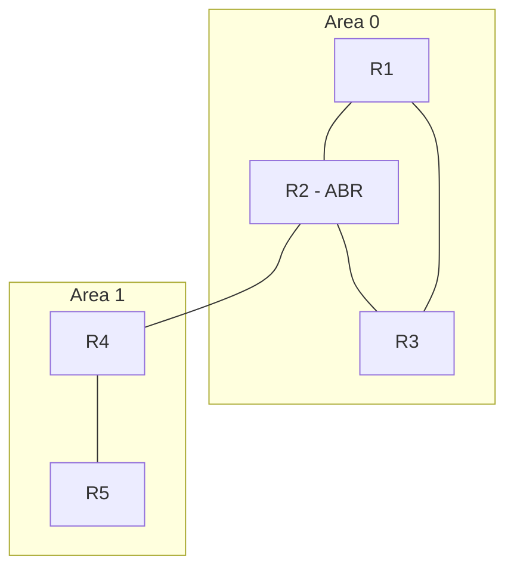
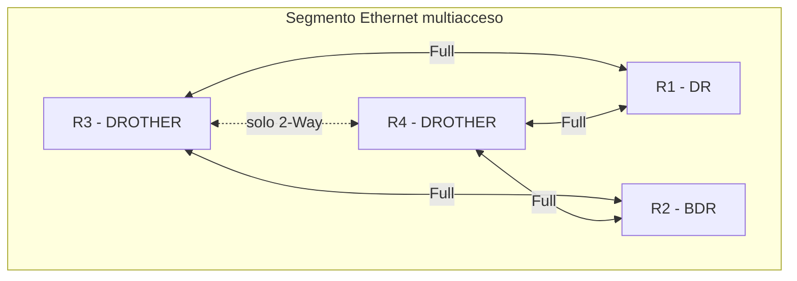

En una red pequeña las [rutas estáticas](./static-default-routes) alcanzan:
escribirlas a mano y listo. Pero cuando los routers crecen o la topología
cambia, mantenerlas a mano es un error a la espera de ocurrir. Los **protocolos
de enrutamiento dinámico** se encargan solos: los routers intercambian
información entre sí y calculan las rutas. Este documento cubre **OSPF**, el
protocolo que más detalle exige el CCNA; **EIGRP** y **RIP** están cubiertos
en [EIGRP y RIP](./eigrp-rip).

## Estado de enlace vs. vector de distancia

| Aspecto       | OSPF (estado de enlace)   | EIGRP / RIP (vector de distancia) |
| :------------ | :------------------------ | :-------------------------------- |
| Conocimiento  | Topología completa (LSDB) | Solo "hacia dónde"                |
| Cálculo       | Algoritmo SPF             | Actualización hop a hop           |
| Convergencia  | Rápida                    | Variable                          |
| Escalabilidad | Grandes redes (áreas)     | Redes pequeñas/medianas           |

- **LSA (Link-State Advertisement / Anuncio de Estado de Enlace):** paquete de
  datos o mensaje informativo que un router envía a sus vecinos para notificar
  el estado de sus conexiones locales.
- **LSDB (Link-State Database / Base de Datos de Estado de Enlace):** base de
  datos organizada donde un router almacena todas las LSA que ha generado él
  mismo y las que ha recibido de los demás routers de la red (o área).

## OSPF

**OSPF** (Open Shortest Path First) es de **estado de enlace** para IPv4
(OSPFv2). Cada router conoce la topología completa de su área y calcula la
mejor ruta con el algoritmo **SPF** (Dijkstra).

### Áreas y el backbone

Cada router solo mantiene la LSDB completa de su propia área, y entre áreas solo se intercambian rutas ya resumidas (LSAs de resumen), no el detalle de cada enlace. Así, un enlace inestable en un área remota deja de forzar un recálculo en las demás.

- **Área 0 (backbone)**: todas las áreas deben conectarse a ella.
- Las áreas se numeran desde 0 (el área **0.0.0.0** es el backbone).
- Los routers **ABR** (Area Border Router) conectan el backbone con otras áreas.



R1, R2 y R3 forman el **área 0**, también llamada **backbone** — es la única área que puede existir sola y a la que todas las demás deben conectarse, directa o indirectamente. R4 y R5 forman una segunda área, el **área 1**, que solo conoce el detalle de sus propios enlaces; todo lo que hay más allá del área 0 le llega como rutas resumidas.

R2 aparece marcado como **ABR** (Area Border Router) porque es el único router con interfaces en las dos áreas a la vez: una pata en el área 0, otra en el área 1. Esa posición no es casual — es justamente el trabajo del ABR: mantener la LSDB completa de ambas áreas donde participa, y traducir entre ellas resumiendo lo que una necesita saber de la otra sin exponer el detalle completo. Si existiera un área 2, tendría que llegar a la red también a través de un ABR conectado al área 0 — nunca directamente entre área 1 y área 2 — porque el backbone es el único tránsito permitido entre áreas.

### La métrica: coste

OSPF usa el **coste** (cost) de cada enlace:

$$
\text{coste} = \frac{\text{banda de referencia}}{\text{ancho de banda del enlace}}
$$

Con la banda de referencia por defecto de **100 Mbps** (100.000 Kbps):

| Enlace   | Banda      | Coste |
| :------- | :--------- | :---- |
| 10 Mbps  | 10.000     | 100   |
| 100 Mbps | 100.000    | 10    |
| 1 Gbps   | 1.000.000  | 1     |
| 10 Gbps  | 10.000.000 | 1     |

La ruta más corta es la de **menor coste acumulado**. Con enlaces de 1 Gbps o más, varios terminan con coste 1 y OSPF deja de distinguirlos — por eso, al tener fibra o enlaces de 10 Gbps, conviene subir la banda de referencia:

```ios
R1(config-router)# auto-cost reference-bandwidth 10000
```

### Router ID (RID): qué es y cómo se determina

El **Router ID** es el identificador único de cada router dentro del proceso
OSPF: se escribe con formato de IP (`1.1.1.1`) aunque no tiene por qué ser una
dirección asignada a ninguna interfaz. Lo usan los vecinos para reconocerlo y
sirve de desempate en elecciones de DR/BDR.

Si no se fija a mano, se determina automáticamente en este orden:

1. La dirección del comando **`router-id`** (si está configurada).
2. La **IP más alta** entre las interfaces **loopback**.
3. La **IP más alta** de las **interfaces físicas activas**.

**Qué pasa si no hay ninguna opción:** para arrancar, el proceso OSPF necesita
de dónde sacar un RID — si al iniciarlo no existe ninguna interfaz activa con
IP (y tampoco `router-id` configurado), el proceso **no puede levantarse**
hasta que exista una fuente válida o se fije el RID a mano.

Además, una vez elegido, el RID **no cambia solo**: ni agregando loopbacks ni
subiendo IPs de interfaces. Para aplicar uno nuevo hay que reiniciar el
proceso:

```ios
R1(config-router)# router-id 1.1.1.1
R1# clear ip ospf process
```

> Dejarlo al azar es un problema clásico: si el RID salió de una IP física y
> esa interfaz desaparece, el siguiente reinicio del proceso puede elegir otro
> RID y forzar una nueva elección de DR/BDR sin que nadie tocara nada. Por eso
> se fija explícitamente.

### Vecinos OSPF

OSPF forma **adyacencias** intercambiando **hello packets** (multicast
224.0.0.5):

| Parámetro                | Por defecto         |
| :----------------------- | :------------------ |
| Hello interval           | 10 s                |
| Dead interval            | 40 s (4 x hello)    |
| Área y Router ID         | **Deben coincidir** |
| Autenticación            | **Debe coincidir**  |
| Coste / MTU / submáscara | **Deben coincidir** |

Estados de la vecindad: **Down → Init → 2-Way → ExStart → Exchange → Loading → Full**.
Solo en **Full** la LSDB de ambos routers está sincronizada.

### Elección del DR y el BDR

En redes **multiacceso** (Ethernet con varios routers en el mismo segmento),
formar adyacencia completa entre todos sería un desperdicio: con *n* routers
habría n(n-1)/2 adyacencias (5 routers = 10 sesiones sincronizando LSDBs). Para
evitarlo, cada segmento elige dos referencias:

| Rol       | Qué hace                                                          |
| :-------- | :---------------------------------------------------------------- |
| **DR**    | Designated Router: centraliza la sincronización del segmento      |
| **BDR**   | Backup DR: espera en caliente; asume al instante si el DR falla   |
| DROTHER   | El resto: solo forma adyacencia Full con el DR y con el BDR       |



Cada DROTHER intercambia actualizaciones solo con el DR (que las reenvía a
todos) y con el BDR; entre DROTHERs la relación queda frenada en **2-Way**.
Así, con DR/BDR el número de adyacencias baja a **2n-3** (5 routers: 10 → 7).
Los DROTHERs envían hacia 224.0.0.6 (todos los DR); el DR anuncia a todo el
segmento por 224.0.0.5.

**Criterios de elección**, en orden:

1. **Mayor prioridad** gana (`ip ospf priority`, por defecto 1). Con prioridad
   **0** el puerto queda fuera de la elección: nunca será DR ni BDR.
2. Si empatan, gana el **Router ID más alto**.
3. El segundo mejor puntaje queda como **BDR**.

Dos detalles que suelen preguntar:

- **No son preventivas:** un router que llega después con prioridad más alta NO
  roba el rol al DR activo — tiene que esperar a que el DR caiga para aspirar.
- Si cae el DR, el **BDR asume al momento** y recién entonces se elige un BDR
  nuevo. En enlaces punto a punto no hay elección: no hace falta.

```ios
R1(config)# interface GigabitEthernet0/1
R1(config-if)# ip ospf priority 100
```

> En la salida de `show ip ospf neighbor`, la columna State lo refleja:
> `FULL/DR` (el vecino es el DR), `FULL/BDR` y `FULL/DROTHER`; un vecino
> `2WAY/DROTHER` todavía no sincronizó porque ninguno de los dos es DR ni BDR.

### Configuración: área única

#### Network (clásico, con wildcard)

```ios
R1(config)# router ospf 1
R1(config-router)# router-id 1.1.1.1
R1(config-router)# network 192.168.1.0 0.0.0.255 area 0
R1(config-router)# passive-interface default
R1(config-router)# no passive-interface GigabitEthernet0/1
R1(config-router)# exit

R1(config)# interface GigabitEthernet0/1
R1(config-if)# ip ospf 1 area 0
```

#### Por Interfaz (recomendado y simple)

```ios
R1(config)# router ospf 1
R1(config-router)# router-id 1.1.1.1
R1(config-router)# passive-interface default
R1(config-router)# no passive-interface GigabitEthernet0/1
R1(config-router)# exit

R1(config)# interface GigabitEthernet0/1
R1(config-if)# ip ospf 1 area 0
```

| Comando                             | Función                                                  |
| :---------------------------------- | :------------------------------------------------------- |
| `router ospf <pid>`                 | Inicia el proceso OSPF (PID local)                       |
| `router-id <ip>`                    | Fija el Router ID                                        |
| `ip ospf <pid> area <n>`            | Habilita OSPF en una interfaz                            |
| `network <red> <wildcard> area <n>` | Habilita OSPF en las redes que coincidan                 |
| `passive-interface default`         | No envía hellos por las LAN (solo enlaces entre routers) |
| `ip ospf priority <0-255>`          | Prioridad del puerto en la elección de DR/BDR            |

> Las **interfaces pasivas** anuncian su red pero **no envían hellos** (no
> forman adyacencias); evitan tráfico OSPF innecesario hacia las LAN.

### Configuración: multi-área

```ios
R2(config)# router ospf 1
R2(config-router)# router-id 2.2.2.2
R2(config)# interface GigabitEthernet0/0      # hacia el backbone
R2(config-if)# ip ospf 1 area 0
R2(config)# interface GigabitEthernet0/1      # hacia el área 1
R2(config-if)# ip ospf 1 area 1
```

R2 es un **ABR**: mantiene las áreas 0 y 1, y anuncia las redes resumidas entre
ellas.

### Verificación OSPF

```ios
R1# show ip ospf neighbor
Neighbor ID     Pri   State           Dead Time   Address         Interface
2.2.2.2           1   FULL/DR         00:00:35    192.168.1.2     GigabitEthernet0/1

R1# show ip route ospf
     10.0.0.0/24 is subnetted, 1 subnets
O       10.0.0.0/24 [110/2] via 192.168.1.2, 00:02:14, GigabitEthernet0/1
```

- `O` = ruta OSPF, `[110/2]` = AD 110 / coste 2.
- En redes multiacceso, revisar quién quedó como **DR/BDR**: si un router con
  peor capacidad ganó la elección, conviene ajustar prioridades.

### Tipos de LSA (resumen)

| LSA | Tipo         | Anuncia                         |
| :-- | :----------- | :------------------------------ |
| 1   | Router LSA   | Las redes del propio router     |
| 2   | Network LSA  | La red multiacceso (DR)         |
| 3   | Summary LSA  | Redes de otras áreas (ABR)      |
| 4   | ASBR LSA     | Ubicación del ASBR              |
| 5   | External LSA | Rutas externas (redistribución) |

## Preguntas tipo CCNA

1. **¿Qué algoritmo usa OSPF y de qué tipo de protocolo es?**
   El algoritmo **SPF (Dijkstra)**; es un protocolo **de estado de enlace**.

2. **¿Cómo se determina el Router ID?**
   En orden: el comando **`router-id`**, si no la **loopback** con IP más alta,
   y si tampoco, la **interfaz física activa** con IP más alta. Sin ninguna
   fuente, el proceso OSPF ni siquiera inicia.

3. **¿Quién gana la elección de DR?**
   El router con **mayor prioridad** (default 1); desempata el **Router ID más
   alto**. Con prioridad 0 nunca será elegible.

4. **¿Qué pasa cuando cae el DR?**
   El **BDR asume al instante** y se elige un BDR nuevo. No hay "preemption":
   un router con mejor prioridad que llegue después no toma el rol hasta la
   próxima elección.

5. **¿Qué es un ABR y para qué sirven las áreas?**
   Un **ABR** conecta el backbone (área 0) con otras áreas; las áreas limitan
   la LSDB y aceleran la convergencia.

6. **¿Por qué en OSPF conviene `passive-interface default`?**
   Para no enviar hellos por las LAN: solo los enlaces entre routers deben
   formar adyacencias.

## Resumen

- **OSPF** (estado de enlace): topología completa en la **LSDB** (armada con
  **LSAs**) y rutas calculadas con **SPF/Dijkstra**.
- **Áreas** con backbone (**área 0**): limitan el detalle y aceleran la
  convergencia; los **ABR** resumen entre áreas.
- Métrica = **coste** (banda de referencia / ancho de banda del enlace).
- **Router ID**: `router-id` > loopback más alta > interfaz activa más alta;
  sin fuente válida el proceso no inicia y no cambia sin `clear ip ospf
  process`.
- En segmentos multiacceso se eligen **DR y BDR** (mayor prioridad, desempata
  RID; no preventivas) para reducir adyacencias de n(n-1)/2 a 2n-3.
- Se verifica con `show ip ospf neighbor` y `show ip route ospf`.
