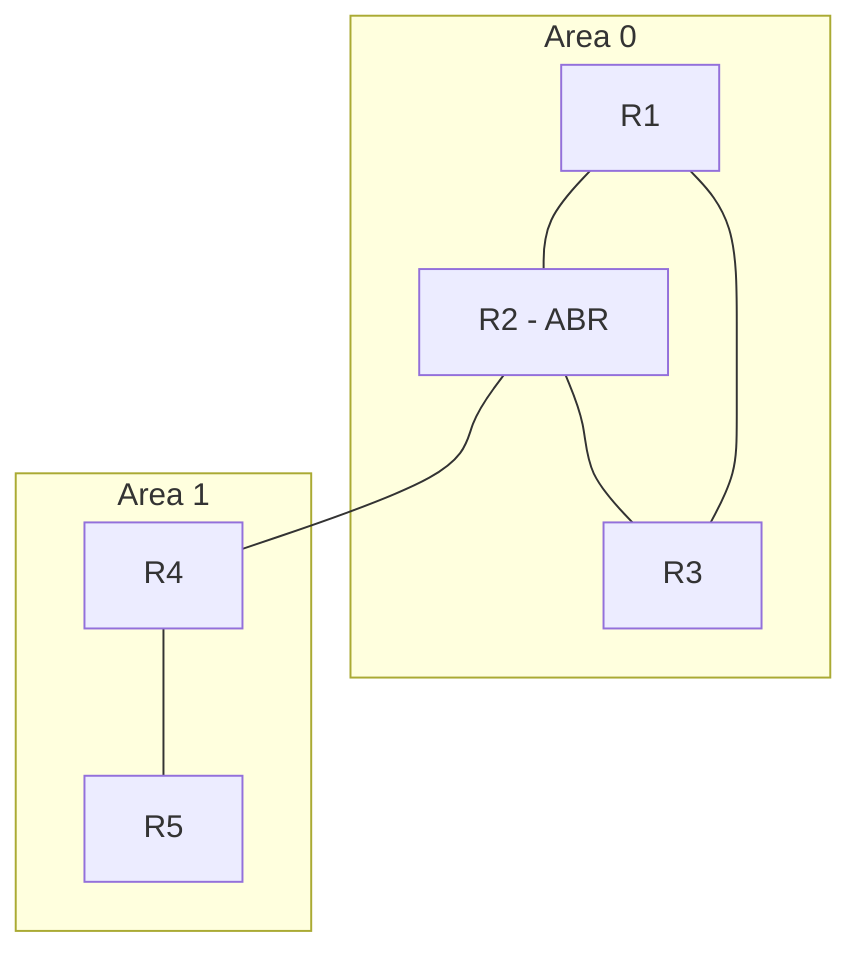

En una red pequeña las [rutas estáticas](./static-default-routes) alcanzan:
escribirlas a mano y listo. Pero cuando los routers crecen o la topología
cambia, mantenerlas a mano es un error a la espera de ocurrir. Los **protocolos
de enrutamiento dinámico** se encargan solos: los routers intercambian
información entre sí y calculan las rutas. Los tres que pide CCNA son **OSPF**,
**EIGRP** y **RIP**.

## Estado de enlace vs. vector de distancia

| Aspecto       | OSPF (estado de enlace)   | EIGRP / RIP (vector de distancia) |
| :------------ | :------------------------ | :-------------------------------- |
| Conocimiento  | Topología completa (LSDB) | Solo "hacia dónde"                |
| Cálculo       | Algoritmo SPF             | Actualización hop a hop           |
| Convergencia  | Rápida                    | Variable                          |
| Escalabilidad | Grandes redes (áreas)     | Redes pequeñas/medianas           |

## OSPF (el más detallado)

**OSPF** (Open Shortest Path First) es de **estado de enlace** para IPv4
(OSPFv2). Cada router conoce la topología completa de su área y calcula la
mejor ruta con el algoritmo **SPF** (Dijkstra).

### Áreas y el backbone

Cada router solo mantiene la LSDB completa de su propia área, y entre áreas solo se intercambian rutas ya resumidas (LSAs de resumen), no el detalle de cada enlace. Así, un enlace inestable en un área remota deja de forzar un recálculo en las demás.

- **Área 0 (backbone)**: todas las áreas deben conectarse a ella.
- Las áreas se numeran desde 0 (el área **0.0.0.0** es el backbone).
- Los routers **ABR** (Area Border Router) conectan el backbone con otras áreas.



R1, R2 y R3 forman el **área 0**, también llamada **backbone** — es la única área que puede existir sola y a la que todas las demás deben conectarse, directa o indirectamente. R4 y R5 forman una segunda área, el **área 1**, que solo conoce el detalle de sus propios enlaces; todo lo que hay más allá del área 0 le llega como rutas resumidas.

R2 aparece marcado como **ABR** (Area Border Router) porque es el único router con interfaces en las dos áreas a la vez: una pata en el área 0, otra en el área 1. Esa posición no es casual — es justamente el trabajo del ABR: mantener la LSDB completa de ambas áreas donde participa, y traducir entre ellas resumiendo lo que una necesita saber de la otra sin exponer el detalle completo. Si existiera un área 2, tendría que llegar a la red también a través de un ABR conectado al área 0 — nunca directamente entre área 1 y área 2 — porque el backbone es el único tránsito permitido entre áreas.

### La métrica: coste

OSPF usa el **coste** (cost) de cada enlace:

$$
\text{coste} = \frac{\text{banda de referencia}}{\text{ancho de banda del enlace}}
$$

Con la banda de referencia por defecto de **100 Mbps** (100.000 Kbps):

| Enlace   | Banda      | Coste |
| :------- | :--------- | :---- |
| 10 Mbps  | 10.000     | 100   |
| 100 Mbps | 100.000    | 10    |
| 1 Gbps   | 1.000.000  | 1     |
| 10 Gbps  | 10.000.000 | 1     |

La ruta más corta = **menor coste acumulado** al destino.

La ruta más corta es la de **menor coste acumulado**. Con enlaces de 1 Gbps o más, varios terminan con coste 1 y OSPF deja de distinguirlos — por eso, al tener fibra o enlaces de 10 Gbps, conviene subir la banda de referencia:

```ios
R1(config-router)# auto-cost reference-bandwidth 10000
```

### Elección del Router ID

El **Router ID** identifica a cada router dentro de OSPF, y si no se fija a mano puede cambiar solo: se elige, en orden:

1. La dirección del comando **`router-id`** (si está configurada).
2. La **IP más alta** de las **loopbacks**.
3. La **IP más alta** de las interfaces físicas activas.

Para que sea predecible, se configura explícitamente:

```ios
R1(config-router)# router-id 1.1.1.1
```

> Dejarlo al azar es un problema clásico al reiniciar una interfaz: el Router ID puede cambiar y forzar una nueva elección de DR/BDR sin que nadie tocara la configuración. Por eso se fija explícitamente:

### Vecinos OSPF

OSPF forma **adyacencias** intercambiando **hello packets** (multicast
224.0.0.5):

| Parámetro                | Por defecto         |
| :----------------------- | :------------------ |
| Hello interval           | 10 s                |
| Dead interval            | 40 s (4 x hello)    |
| Área y Router ID         | **Deben coincidir** |
| Autenticación            | **Debe coincidir**  |
| Coste / MTU / submáscara | **Deben coincidir** |

Estados de la vecindad: **Down → Init → 2-Way → ExStart → Exchange → Loading → Full**.
Solo en **Full** la LSDB de ambos routers está sincronizada.

### Configuración: área única

#### Network (clásico, con wildcard)

```ios
R1(config)# router ospf 1
R1(config-router)# router-id 1.1.1.1
R1(config-router)# network 192.168.1.0 0.0.0.255 area 0
R1(config-router)# passive-interface default
R1(config-router)# no passive-interface GigabitEthernet0/1
R1(config-router)# exit

R1(config)# interface GigabitEthernet0/1
R1(config-if)# ip ospf 1 area 0
```

#### Por Interfaz (recomendado y simple)

```ios
R1(config)# router ospf 1
R1(config-router)# router-id 1.1.1.1
R1(config-router)# passive-interface default
R1(config-router)# no passive-interface GigabitEthernet0/1
R1(config-router)# exit

R1(config)# interface GigabitEthernet0/1
R1(config-if)# ip ospf 1 area 0
```

| Comando                             | Función                                                  |
| :---------------------------------- | :------------------------------------------------------- |
| `router ospf <pid>`                 | Inicia el proceso OSPF (PID local)                       |
| `router-id <ip>`                    | Fija el Router ID                                        |
| `ip ospf <pid> area <n>`            | Habilita OSPF en una interfaz                            |
| `network <red> <wildcard> area <n>` | Habilita OSPF en las redes que coincidan                 |
| `passive-interface default`         | No envía hellos por las LAN (solo enlaces entre routers) |

> Las **interfaces pasivas** anuncian su red pero **no envían hellos** (no
> forman adyacencias); evitan tráfico OSPF innecesario hacia las LAN.

### Configuración: multi-área

```ios
R2(config)# router ospf 1
R2(config-router)# router-id 2.2.2.2
R2(config)# interface GigabitEthernet0/0      # hacia el backbone
R2(config-if)# ip ospf 1 area 0
R2(config)# interface GigabitEthernet0/1      # hacia el área 1
R2(config-if)# ip ospf 1 area 1
```

R2 es un **ABR**: mantiene las áreas 0 y 1, y anuncia las redes resumidas entre
ellas.

### Verificación OSPF

```ios
R1# show ip ospf neighbor
Neighbor ID     Pri   State           Dead Time   Address         Interface
2.2.2.2           1   FULL/DR         00:00:35    192.168.1.2     GigabitEthernet0/1

R1# show ip route ospf
     10.0.0.0/24 is subnetted, 1 subnets
O       10.0.0.0/24 [110/2] via 192.168.1.2, 00:02:14, GigabitEthernet0/1
```

- `O` = ruta OSPF, `[110/2]` = AD 110 / coste 2.
- **DR/BDR**: en redes multiacceso (Ethernet), OSPF elige un Designated Router
  y un Backup DR para reducir adyacencias.

### Tipos de LSA (resumen)

| LSA | Tipo         | Anuncia                         |
| :-- | :----------- | :------------------------------ |
| 1   | Router LSA   | Las redes del propio router     |
| 2   | Network LSA  | La red multiacceso (DR)         |
| 3   | Summary LSA  | Redes de otras áreas (ABR)      |
| 4   | ASBR LSA     | Ubicación del ASBR              |
| 5   | External LSA | Rutas externas (redistribución) |

---

## EIGRP

**EIGRP** (Enhanced Interior Gateway Routing Protocol) es un protocolo **híbrido**
de Cisco: combina la velocidad de OSPF con la simplicidad de un vector de
distancia. Usa el algoritmo **DUAL**, que guarda rutas de respaldo
(_feasible successors_) para converger casi al instante.

### La métrica compuesta

Por defecto solo usa **banda mínima** y **retardo total**:

$$
\text{métrica} = \left( \frac{10^7}{\text{banda mínima}} + \text{retardo total} \right) \times 256
$$

Menor métrica = mejor ruta. El resto de factores (carga, confiabilidad) existe
pero queda desactivado por defecto.

### Configuración

```ios
R1(config)# router eigrp 100
R1(config-router)# network 192.168.1.0 0.0.0.255
R1(config-router)# network 10.0.0.0
R1(config-router)# no auto-summary
```

| Comando                    | Función                                      |
| :------------------------- | :------------------------------------------- |
| `router eigrp <as>`        | Inicia EIGRP (el número es el AS local)      |
| `network <red> [wildcard]` | Anuncia redes (wildcard opcional en EIGRP)   |
| `no auto-summary`          | No resume redes en su clase (imprescindible) |
| `passive-interface <if>`   | No envía hellos por esa interfaz             |

EIGRP también elige Router ID (loopback más alta > IP más alta) y usa hellos,
pero los intervalos van **por interfaz** (por defecto 5 s en LAN). No necesita
configurar áreas.

### Verificación EIGRP

```ios
R1# show ip eigrp neighbors
IP-EIGRP neighbors for process 100
Address       Interface      Hold Uptime   SRTT   RTO  Q  Seq
192.168.1.2   Gi0/1            13 00:04:15    1  200  0  12

R1# show ip route eigrp
D       10.0.0.0/8 [90/3328] via 192.168.1.2, 00:04:15, GigabitEthernet0/1
```

- `D` = ruta EIGRP (DUAL), `[90/3328]` = AD 90 / métrica compuesta 3328.

---

## RIP

**RIP** (Routing Information Protocol) es el protocolo de enrutamiento más
antiguo y simple: un **vector de distancia** puro cuya métrica es el **número
de saltos** (hops). Sirve sobre todo como concepto y para redes muy pequeñas.

### Configuración

```ios
R1(config)# router rip
R1(config-router)# version 2
R1(config-router)# network 192.168.1.0
R1(config-router)# no auto-summary
```

| Comando                  | Función                                   |
| :----------------------- | :---------------------------------------- |
| `router rip`             | Inicia el proceso RIP                     |
| `version 2`              | Usa RIPv2 (subredes y autenticación)      |
| `network <red>`          | Anuncia la red **en clase**               |
| `no auto-summary`        | No resume a la clase de la red            |
| `passive-interface <if>` | No envía actualizaciones por esa interfaz |

> `network` en RIP recibe la red **en clase** (sin wildcard): `network 10.0.0.0`
> anuncia las interfaces que caigan en esa clase, no una subred concreta.

### Verificación RIP

```ios
R1# show ip route rip
R       10.0.0.0/8 [120/1] via 192.168.1.2, 00:00:09, GigabitEthernet0/1
```

- `R` = ruta RIP, `[120/1]` = AD 120 / 1 salto.
- RIP actualiza cada **30 s** y descarta rutas a más de **15 saltos**
  (infinito = 16).

---

## Comparativa final

| Protocolo | Tipo                | Métrica              | AD  | Convergencia | Configuración               |
| :-------- | :------------------ | :------------------- | :-- | :----------- | :-------------------------- |
| OSPF      | Estado de enlace    | Coste (banda)        | 110 | Rápida       | `router ospf <pid>` + áreas |
| EIGRP     | Híbrido (DUAL)      | Banda + retardo ×256 | 90  | Muy rápida   | `router eigrp <as>`         |
| RIP       | Vector de distancia | Saltos (hops)        | 120 | Lenta        | `router rip` + `version 2`  |

Recordatorio de la selección de ruta: **prefijo más largo → menor AD → menor
métrica** (ver [Métricas y Distancia Administrativa](../04-redundancy-security/metrics-administrative-distance)).

## Preguntas tipo CCNA

1. **¿Qué algoritmo usa OSPF y de qué tipo de protocolo es?**
   El algoritmo **SPF (Dijkstra)**; es un protocolo **de estado de enlace**.

2. **¿Cuál es la métrica de OSPF y la de RIP?**
   OSPF usa el **coste** (banda de referencia / ancho de banda); RIP usa el
   **número de saltos** (máx. 15).

3. **¿Qué es un ABR y para qué sirven las áreas?**
   Un **ABR** conecta el backbone (área 0) con otras áreas; las áreas limitan
   la LSDB y aceleran la convergencia.

4. **¿Cuál es la distancia administrativa de OSPF, EIGRP y RIP?**
   OSPF **110**, EIGRP **90**, RIP **120** (menor = más confiable).

5. **¿Qué comando inicia cada protocolo?**
   `router ospf <pid>`, `router eigrp <as>` y `router rip` (con `version 2`).

6. **¿Por qué en OSPF conviene `passive-interface default`?**
   Para no enviar hellos por las LAN: solo los enlaces entre routers deben
   formar adyacencias.

## Resumen

- Los protocolos **dinámicos** aprenden y mantienen las rutas solos; los
  estáticos hay que escribirlos a mano.
- **OSPF** (estado de enlace): coste por banda, áreas con backbone (área 0),
  Router ID configurable, `show ip ospf neighbor`.
- **EIGRP** (híbrido): métrica compuesta (banda + retardo ×256), AD 90,
  respaldo automático con DUAL.
- **RIP** (vector de distancia): saltos como métrica, AD 120, máximo 15 saltos.
- Selección de ruta: **prefijo más largo → menor AD → menor métrica**.
- Se verifica con `show ip route`, `show ip ospf/eigrp/rip` según protocolo.
