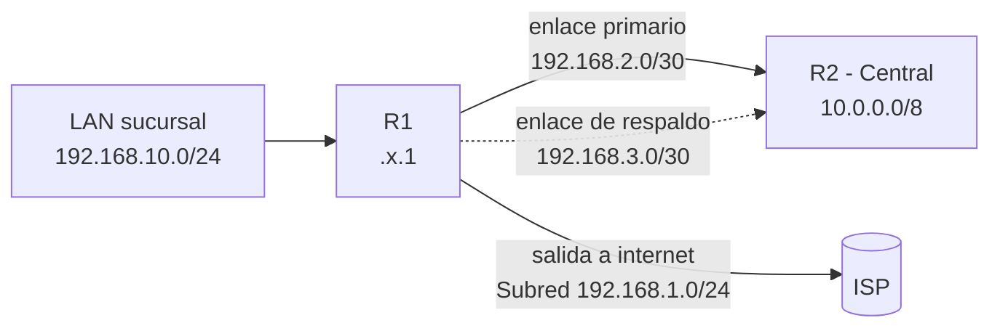

Las tablas de enrutamiento determinan el destino del tráfico. Sin una ruta explícita para una red privada, el router descarta el paquete o lo envía a la interfaz equivocada (como la ruta por defecto o la salida del internet).

| Origen    | Cómo aparece  | Cómo se aprende                   |
| :-------- | :------------ | :-------------------------------- |
| Conectada | `C`           | Automáticamente (interfaz con IP) |
| Estática  | `S`           | Comando `ip route`                |
| Dinámica  | `O`, `D`, `R` | Protocolo de enrutamiento         |



## Rutas estáticas

- **Red destino:** `10.0.0.0/8` (Red Central)
- **Siguiente salto:** `192.168.2.2` (IP de R2 en el enlace WAN)

```ios
R1(config)# ip route 10.0.0.0 255.0.0.0 192.168.2.2
```

> Siguiente Salto (Next Hop): Es la dirección IP del próximo router en el camino que se hará cargo del paquete

**Variaciones del comando `ip route`**

| **Método**             | **Sintaxis / Uso**                              | **Caso de uso**                          |
| ---------------------- | ----------------------------------------------- | ---------------------------------------- |
| **Siguiente Salto**    | `ip route [Red] [Mascara] [IP_Siguiente_Salto]` | Enrutamiento estándar hacia otro router. |
| **Interfaz de salida** | `ip route [Red] [Mascara] [Interfaz]`           | Enlaces punto a punto dedicados.         |

**Verificación (`show ip route`)**

```ios
R1# show ip route
S    10.0.0.0/8 [1/0] via 192.168.2.2
```

- **`S`**: Ruta Estática.
- **`[1/0]`**: Distancia Administrativa (1) / Métrica (0).
- **`via 192.168.2.2`**: Dirección IP del próximo salto.

## Ruta flotante (respaldo)

Una **ruta flotante** es la misma ruta estática hacia `10.0.0.0/8`, pero por el enlace de respaldo, con una **distancia
administrativa** más alta que la ruta primaria. Con una AD mayor, el router
la ignora mientras la ruta principal esté presente, y la activa solo cuando
esa ruta desaparece de la tabla — sin que nadie tenga que intervenir.

```ios
R1(config)# ip route 10.0.0.0 255.0.0.0 192.168.3.2 150
```

El `150` al final es la AD de esta ruta (por defecto, una estática normal
tiene AD 1). En cuanto el enlace primario cae y su ruta sale de la tabla, la
de AD 150 pasa a ser la única disponible hacia `10.0.0.0/8` y el router
empieza a usarla automáticamente; cuando el primario vuelve, la ruta con AD 1
reaparece y vuelve a tener prioridad.

## Ruta por defecto (default route)

Falta resolver la salida a internet. Configurar una ruta
estática por cada red posible en internet no es viable, así que se usa la
**ruta por defecto** (`0.0.0.0/0`): captura cualquier tráfico que no coincida
con ninguna otra ruta de la tabla.

```ios
R1(config)# ip route 0.0.0.0 0.0.0.0 192.168.1.254
```

```ios
R1# show ip route
Gateway of last resort is 192.168.1.254 to network 0.0.0.0

S    10.0.0.0/8 [1/0] via 192.168.2.2
S*   0.0.0.0/0 [1/0] via 192.168.1.254
```

El `*` marca la ruta por defecto — también llamada _gateway of last resort_.
Sin ella, cualquier destino que R1 no reconozca (la mayoría de internet) se
descarta con un ICMP _destination unreachable_, en vez de salir hacia el ISP.

> El ISP (Internet Service Provider o Proveedor de Servicios de Internet) es la empresa o entidad que te proporciona acceso a Internet.

## Rutas estáticas IPv6

La misma lógica aplica en IPv6, con `ipv6 route`:

```ios
R1(config)# ipv6 route 2001:db8:10::/64 2001:db8:1::2
R1(config)# ipv6 route ::/0 2001:db8:1::254
```

## Cómo elige el router entre varias rutas

Con la tabla de R1 ya completa (conectada, estática hacia la central, ruta
flotante de respaldo y ruta por defecto), un paquete puede tener más de una
entrada candidata. El router decide en este orden:

1. La coincidencia **más específica** (el prefijo más largo) gana siempre —
   por eso el tráfico a `10.20.5.10` usa la ruta a `10.0.0.0/8` y no la
   default, aunque ambas técnicamente lo cubran.
2. Entre rutas del mismo destino pero de distinto origen, gana la de menor
   **distancia administrativa** — por eso la ruta flotante (AD 150) queda en
   espera mientras la primaria (AD 1) esté disponible.
3. Entre rutas del mismo origen y mismo destino, gana la de menor **métrica** (distancia física).

## Verificación

```ios
R1# show ip route static
S    10.0.0.0/8 [1/0] via 192.168.2.2
S    10.0.0.0/8 [150/0] via 192.168.3.2
S*   0.0.0.0/0 [1/0] via 192.168.1.254
```

Con el enlace primario caído, la misma salida cambia: la ruta con AD 1 hacia
`192.168.2.2` desaparece, y la de AD 150 hacia `192.168.3.2` pasa a ser la
que efectivamente se usa — se confirma con `show ip route 10.0.0.0` mientras
dura la falla.

## Resumen

- `ip route <red> <máscara> <siguiente-salto>` define una ruta estática — sin
  ella, un enlace físico activo no basta para que el tráfico lo use.
- Una **ruta flotante** (AD mayor que la principal) automatiza el respaldo:
  solo entra en la tabla cuando la ruta primaria desaparece.
- La **ruta por defecto** (`0.0.0.0/0`, marcada `S*`) captura el tráfico que
  no coincide con ninguna ruta más específica — típicamente, la salida al ISP.
- La selección entre rutas sigue este orden: **prefijo más largo** → **menor
  distancia administrativa** → **menor métrica**.
