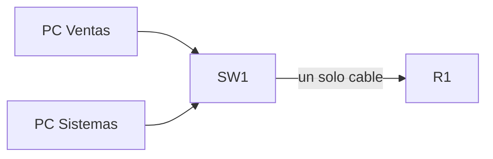
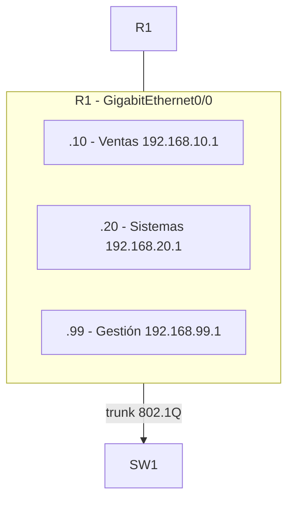
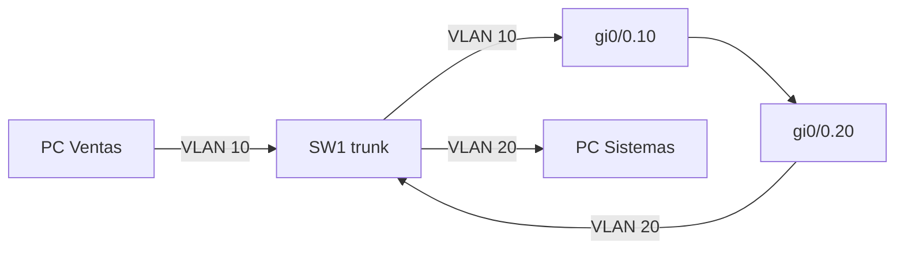

Cuando tienes **varias VLANs** pero el switch y el router solo se conectan por
**un cable**, no alcanza con asignar una IP a la interfaz física: esa interfaz
pertenecería a una sola subred. La solución es partir esa interfaz física en
**subinterfaces** lógicas, una por VLAN, y etiquetar el tráfico con 802.1Q. Es
el diseño llamado **router-on-a-stick** ("router en un palito").

## El problema: un enlace, varias VLANs

**Situación:** el switch SW1 tiene las VLANs 10 (Ventas) y 20 (Sistemas) y
llega al router R1 por un único cable.



Si pones una sola IP en GigabitEthernet0/0, R1 solo pertenece a **una** subred:
la otra VLAN no tiene gateway. Necesitas que R1 sea el gateway de **ambas**
VLANs por el mismo cable.

## La solución: subinterfaces

Una **subinterfaz** es una partición lógica de una interfaz física. Cada una se
asocia a una **VLAN** con el comando `encapsulation dot1q <id>`: el router mira
la etiqueta 802.1Q de cada trama y la procesa en la subinterfaz correcta.



```ios
R1(config)# interface GigabitEthernet0/0.10
R1(config-subif)# encapsulation dot1q 10
R1(config-subif)# ip address 192.168.10.1 255.255.255.0
R1(config-subif)# exit

R1(config)# interface GigabitEthernet0/0.20
R1(config-subif)# encapsulation dot1q 20
R1(config-subif)# ip address 192.168.20.1 255.255.255.0
R1(config-subif)# exit
```

| Comando                           | Función                                               |
| :-------------------------------- | :---------------------------------------------------- |
| `interface gi0/0.<id>`            | Crea la subinterfaz para esa VLAN                     |
| `encapsulation dot1q <id>`        | Asocia la subinterfaz a la VLAN (etiqueta 802.1Q)     |
| `ip address <ip> <mask>`          | IP que será el gateway de esa VLAN                    |
| `encapsulation dot1q <id> native` | Marca la subinterfaz de la VLAN nativa (sin etiqueta) |

### La otra punta del cable: el trunk

Del lado del switch, ese puerto debe estar en modo **trunk** con las VLANs
permitidas (ver [VLANs y Trunking](./vlans-trunking)):

```ios
SW1(config)# interface GigabitEthernet0/1
SW1(config-if)# switchport mode trunk
SW1(config-if)# switchport trunk allowed vlan 10,20,99
```

La regla de oro del módulo de VLANs sigue aplicando: **"¿qué hay del otro lado
del cable?"** — hacia un router con subinterfaces, el puerto del switch es
trunk, no access.

## VLAN nativa y subinterfaces

La **VLAN nativa** viaja **sin etiqueta** por el trunk. En el router hay dos
formas de tratarla:

- **Opción A (recomendada):** no usar subinterfaz para la nativa; la VLAN
  nativa se atiende en la **interfaz física**.
- **Opción B:** crear la subinterfaz con `encapsulation dot1q <id> native`,
  así el router espera tramas sin etiqueta en esa subinterfaz.

```ios
# Opción A: gestión en la interfaz física (nativa)
R1(config)# interface GigabitEthernet0/0
R1(config-if)# ip address 192.168.99.1 255.255.255.0

# Opción B: subinterfaz para la nativa
R1(config)# interface GigabitEthernet0/0.99
R1(config-subif)# encapsulation dot1q 99 native
R1(config-subif)# ip address 192.168.99.1 255.255.255.0
```

Lo importante es que la **VLAN nativa coincida** en ambos extremos del trunk,
como ya viste en VLANs: si el switch envía sin etiqueta (nativa 99) y el router
espera todo etiquetado, ese tráfico no se procesa en la subinterfaz correcta.

## Enrutamiento entre VLANs, completo

Con las subinterfaces configuradas, el flujo de una PC de Ventas hacia una de
Sistemas es:

1. PC Ventas envía a su gateway: **192.168.10.1** (subinterfaz .10).
2. SW1 recibe la trama **etiquetada** (trunk) con VLAN 10 y la entrega al router.
3. R1 procesa la trama en gi0/0.10, mira que el destino es la VLAN 20 y la
   reenvía por gi0/0.20.
4. SW1 la recibe etiquetada con VLAN 20 y la entrega a la PC de Sistemas.



## Verificación

```ios
R1# show ip interface brief
Interface             IP-Address      OK? Method Status                  Protocol
GigabitEthernet0/0    192.168.99.1    YES manual up                      up
GigabitEthernet0/0.10 192.168.10.1    YES manual up                      up
GigabitEthernet0/0.20 192.168.20.1    YES manual up                      up

R1# show vlans
Virtual LAN ID: 10 (Ventas)
  Untagged   : none
  Tagged     : GigabitEthernet0/0.10

Virtual LAN ID: 20 (Sistemas)
  Untagged   : none
  Tagged     : GigabitEthernet0/0.20
```

`show vlans` es el comando clave del router-on-a-stick: te muestra **qué
subinterfaz está etiquetada para qué VLAN**. Si una subinterfaz no aparece,
revisa que el `encapsulation dot1q` coincida con la VLAN del switch.

Prueba de extremo a extremo:

```bash
PC-Ventas# ping 192.168.20.5
```

## Preguntas tipo CCNA

1. **¿Qué es una subinterfaz?**
   Una **interfaz lógica** dentro de una interfaz física, asociada a una VLAN
   mediante `encapsulation dot1q <id>`.

2. **¿Qué es router-on-a-stick?**
   El diseño en el que **un solo enlace** entre switch y router transporta
   varias VLANs etiquetadas; el router las enruta entre subinterfaces.

3. **¿Qué comando asocia una subinterfaz a la VLAN 20?**
   `encapsulation dot1q 20` dentro de `interface gi0/0.20`.

4. **¿Cómo debe estar el puerto del switch hacia el router?**
   En modo **trunk** (802.1Q), con las VLANs necesarias en
   `switchport trunk allowed vlan`.

5. **¿Qué pasa si la VLAN nativa no coincide en ambos extremos?**
   El tráfico sin etiqueta se interpreta mal y se mezcla entre VLANs (native
   VLAN mismatch); debe coincidir en switch y router.

## Resumen

- **Router-on-a-stick:** un solo cable switch→router para todas las VLANs.
- Cada VLAN tiene su **subinterfaz** (`gi0/0.<id>`) con
  `encapsulation dot1q <id>` e IP de gateway.
- El puerto del switch se configura como **trunk** con las VLANs permitidas.
- La **VLAN nativa** viaja sin etiqueta; que coincida en ambos extremos.
- Verifica con `show ip interface brief` y `show vlans`; comprueba con `ping`
  entre VLANs.
