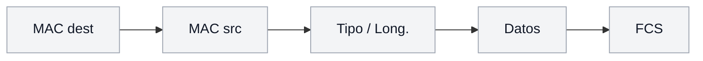
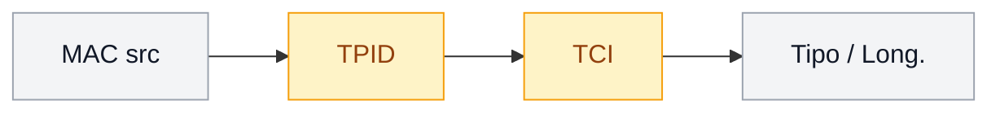
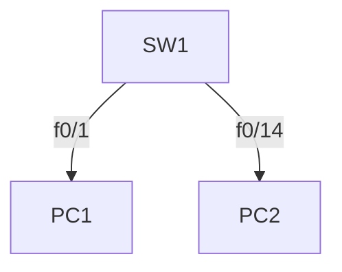
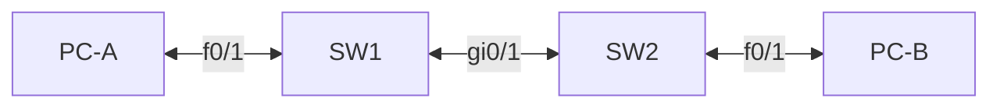

Una **VLAN** es un dominio de broadcast separado de forma lógica dentro del
switch. Dos estaciones en VLANs distintas no se ven entre sí ni intercambian
broadcast, aunque estén conectadas al mismo equipo.

## ¿Por qué usar VLANs?

| Beneficio            | Descripción                                                                 |
| :------------------- | :-------------------------------------------------------------------------- |
| Segmentación         | Divide el dominio de broadcast                                              |
| Seguridad            | Aísla usuarios y departamentos entre sí                                     |
| Organización         | Agrupa por función (ventas, IT, invitados) sin importar la ubicación física |
| Reducción de tráfico | Limita broadcasts y multicast al grupo correspondiente                      |
| Rendimiento          | Reduce colisiones y tráfico innecesario                                     |

> Sin VLANs, todo el switch comparte un único dominio de broadcast. Cuanto más
> grande el dominio, más tráfico de broadcast y menos rendimiento.

## Etiquetado 802.1Q

El estándar **IEEE 802.1Q** inserta una etiqueta de **4 bytes** en la trama
Ethernet para indicar a qué VLAN pertenece:

**Sin etiqueta** (trama de un puerto access):



**Con etiqueta 802.1Q** (trama de un puerto trunk):



Los campos principales de la etiqueta (resaltada en amarillo, 4 bytes):

| Campo                              | Tamaño  | Función                                                            |
| :--------------------------------- | :------ | :----------------------------------------------------------------- |
| **TPID** (Tag Protocol Identifier) | 2 bytes | Indica que la trama está etiquetada                                |
| **TCI**                            | 2 bytes | Contiene la **VID** (VLAN ID, 12 bits → 4094 VLANs) y la prioridad |

La *_VLAN nativa_ es la que se envía por el trunk **sin etiqueta** (por
compatibilidad con equipos que no entienden 802.1Q). Debe ser la misma en ambos
extremos del trunk.

## Vlan para dispositivos finales (Access)

En el piso donde tienes el switch tienes dos áreas el de ventas y de sistemas, así que para evitar el consumo de tráfico y un entorno de seguridad y privacidad entre áreas, necesitas que no puedan interactuar entre si.



```ios
SW1(config)# vlan 10
SW1(config-vlan)# name Ventas
SW1(config-vlan)# vlan 20
SW1(config-vlan)# name Sistemas
SW1(config-vlan)# exit

SW1(config)# int range f0/1 - 12
SW1(config-if-range)# switchport mode access
SW1(config-if-range)# switchport access vlan 10
SW1(config-if-range)# exit
SW1(config)# int range f0/13 - 24
SW1(config-if-range)# switchport mode access
SW1(config-if-range)# switchport access vlan 20
SW1(config-if-range)# exit
```

| Comando                     | Función                            |
| :-------------------------- | :--------------------------------- |
| `vlan 10`                   | Crea la VLAN 10 y entra al submodo |
| `name Ventas`               | Da un nombre descriptivo           |
| `switchport mode access`    | Marca el puerto como access        |
| `switchport access vlan 10` | Asigna el puerto a la VLAN 10      |

> **Puerto access**: pertenece a una única VLAN y entrega tramas **sin
> etiqueta**.

## Vlan para equipos de red (Trunk)

Ahora tienes que replicar la configuración al 2do piso, a diferencia de las pc, los switch deben poder distinguir la configuración vlan.



```ios
SW1(config)# vlan 99
SW1(config-vlan)# name Administración
SW1(config-vlan)# exit
SW1(config-vlan)# int range g0/1 - 2
SW1(config-if-range)# switchport mode trunk
SW1(config-if-range)# switchport trunk allowed vlan 99
```

Lo mismo en el SW2

```ios
SW2(config)# vlan 99
SW2(config-vlan)# name Administración
SW2(config-vlan)# int range g0/1 - 2
SW2(config-if-range)# switchport mode trunk
SW2(config-if-range)# switchport trunk allowed vlan 99
```

- SW1 y SW2 están conectados en la VLAN 99.

Se verifica con:

```ios
SW1# show interfaces trunk

Port        Mode         Encapsulation  Status        Native vlan
Gi0/1      on           802.1q         trunking      1
```

Si `Gi0/1` aparece en esa tabla como `trunking`, el enlace ya lleva la VLAN
99 etiquetada entre los dos switches, y PC-A debería poder ver a PC-C.

## VLAN Nativa (Native VLAN)

Por defecto, la VLAN nativa es la **VLAN 1**. La VLAN nativa es la **única VLAN cuyo tráfico viaja SIN etiqueta (untagged)** a través de un enlace trunk (para mantener compatibilidad con equipos heredados).

### El problema: Native VLAN Mismatch

Si los dos extremos del trunk no coinciden en cuál es la VLAN nativa, el switch generará alertas CDP en los logs (`%CDP-4-NATIVE_VLAN_MISMATCH`) y provocará **fuga de tráfico entre VLANs distintas**.

```ios
SW1# show interfaces trunk
Port      Native vlan
Gi0/1    1

SW2# show interfaces trunk
Port      Native vlan
Gi0/1    99
```

En este escenario, cualquier trama sin etiquetar que envíe SW1 (creyendo que es VLAN 1) será recibida por SW2 e interpretada erróneamente como parte de la VLAN 99.

### Solución y Buenas Prácticas

1. **Igualar la VLAN Nativa en ambos extremos:**

```ios
SW1(config)# interface GigabitEthernet0/1
SW1(config-if)# switchport trunk native vlan 99
```

```ios
SW2(config)# interface GigabitEthernet0/1
SW2(config-if)# switchport trunk native vlan 99
```

Buena práctica: usa una VLAN dedicada como nativa (no la VLAN 1) y que no
tenga tráfico de usuarios — así, si alguna trama llega sin etiquetar por
error, cae en una VLAN vacía y no se mezcla con tráfico real.

## VLAN de voz

Para teléfonos IP que comparten puerto con un PC, el teléfono se asigna a una
VLAN de voz y el PC a la de datos:

```ios
SW1(config)# interface FastEthernet0/1
SW1(config-if)# switchport mode access
SW1(config-if)# switchport access vlan 10
SW1(config-if)# switchport voice vlan 100
```

- **VLAN 10 (Datos):** Tráfico del PC (viaja sin etiqueta).
- **VLAN 100 (Voz):** Tráfico del teléfono IP (viaja etiquetado con prioridad CoS 802.1p/Q).

## Verificación

**Vlans en modo access**

```ios
SW1# show vlan brief

VLAN Name                             Status    Ports
---- -------------------------------- --------- -------------------------------
1    default                          active    Gi0/2
10   Ventas                           active    Fa0/1, Fa0/2, Fa0/3, Fa0/4
                                                Fa0/5, Fa0/6, Fa0/7, Fa0/8
                                                Fa0/9, Fa0/10, Fa0/11, Fa0/12
20   Sistemas                         active    Fa0/13, Fa0/14, Fa0/15, Fa0/16
                                                Fa0/17, Fa0/18, Fa0/19, Fa0/20
                                                Fa0/21, Fa0/22, Fa0/23, Fa0/24
99   Administracion                   active
100  Voz                              active
```

**Vlans en modo trunk**

```ios
SW1# show interfaces trunk

Port        Mode         Encapsulation  Status        Native vlan
Gi0/1       on           802.1q         trunking      99
```

## Preguntas tipo CCNA

1. **¿Qué es una VLAN y qué limita?**
   Una VLAN es un **dominio de broadcast** separado de forma lógica dentro del
   switch.

2. **¿Qué diferencia hay entre un puerto access y un trunk?**
   El access pertenece a **una VLAN** y envía tramas sin etiqueta; el trunk
   transporta **varias VLANs** con tramas etiquetadas (802.1Q).

3. **¿Qué es la VLAN nativa en un trunk 802.1Q?**
   La VLAN cuyas tramas viajan **sin etiqueta**; debe coincidir en ambos
   extremos del trunk.

4. **¿Cuántas VLANs admite el identificador 802.1Q?**
   12 bits → hasta **4094** VLANs utilizables (1-1001 por defecto, 1002-1005
   reservadas, 1006-4094 extendidas).

5. **¿Qué comando restringe las VLANs que cruzan un trunk?**
   `switchport trunk allowed vlan <lista>`.

## En resumen

- **Access** = una puerta a un solo cuarto: un dispositivo final, una VLAN,
  sin etiqueta.
- **Trunk** = el maletero del auto: varias VLANs a la vez, cada una
  etiquetada con 802.1Q para no mezclarse.
- La pregunta clave siempre es "¿qué hay del otro lado del cable?" — un
  dispositivo final pide access; otro switch o router casi siempre pide trunk.
- Si dos VLANs iguales en switches distintos no se ven entre sí, sospecha
  primero del enlace entre los switches: probablemente sigue en access.
- La VLAN nativa (la que va sin etiqueta) debe coincidir en ambos extremos
  del trunk, o vas a ver tráfico mal clasificado.
- Verifica con `show vlan brief` (puertos access) y `show interfaces trunk`
  (puertos trunk, encapsulación, VLAN nativa).
