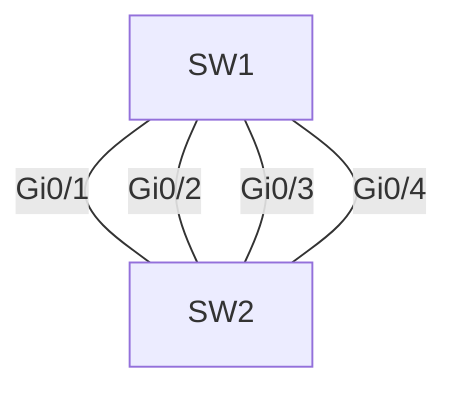

**EtherChannel** (también llamado port-channel) agrupa varios enlaces físicos en
un único enlace **lógico**. En lugar de que STP bloquee los enlaces redundantes,
estos se combinan para aportar ancho de banda y redundancia al mismo tiempo.

## ¿Por qué EtherChannel?

| Beneficio    | Descripción                                            |
| :----------- | :----------------------------------------------------- |
| Ancho de banda | 4 x 1 Gbps = un enlace lógico de 4 Gbps               |
| Redundancia  | Si falla un enlace físico, el canal sigue activo       |
| Sin bloqueo  | STP ve el canal como un solo enlace: no bloquea los demás |
| Simplicidad  | Una sola dirección lógica para gestionar y verificar  |


Sin EtherChannel, STP bloquearía 3 de los 4 enlaces. Con EtherChannel, los 4 se
usan como un solo enlace lógico (Port-Channel).

## Protocolos de negociación

| Protocolo      | Estándar           | Notas                                   |
| :------------- | :----------------- | :-------------------------------------- |
| **PAgP**       | Propietario Cisco  | Modos `auto` y `desirable`              |
| **LACP**       | IEEE 802.3ad       | Abierto, interoperable; modos `active` y `passive` |

### Modos de negociación

| Modo    | Protocolo | Qué hace                                  |
| :------ | :-------- | :---------------------------------------- |
| `on`    | Ninguno   | Activa el canal sin negociar (forzado)    |
| `active`| LACP      | Negocia activamente (inicia)              |
| `passive`| LACP     | Espera a que el otro lado inicie          |
| `desirable`| PAgP   | Negocia activamente (inicia)              |
| `auto`  | PAgP      | Espera a que el otro lado inicie          |

> Para que el canal se forme, ambos extremos deben ser **compatibles**:
> `active` + `passive` o `active` + `active` (LACP); `desirable` + `auto` o
> `desirable` + `desirable` (PAgP). El modo `on` funciona sin negociación en
> ambos lados.

## Requisitos de los enlaces del canal

Todos los puertos del canal deben tener **exactamente las mismas**:

- Velocidad y dúplex.
- Configuración VLAN (mismo modo access/trunk, misma VLAN o native).
- Configuración de trunk (mismas VLANs permitidas).

Si los parámetros difieren, el canal **no se forma** o falla.

## Configuración de EtherChannel (LACP)

```ios
SW1(config-if-range)# channel-group 1 mode active
SW1(config-if-range)# exit

SW1(config)# interface Port-channel 1
SW1(config-if)# switchport mode trunk
SW1(config-if)# switchport trunk allowed vlan 10,20
```
Pasos clave:

| Comando                          | Función                                   |
| :------------------------------- | :---------------------------------------- |
| `channel-group 1 mode active`    | Asigna los puertos al canal 1 y negocia LACP |
| `interface Port-channel 1`       | Entra al canal lógico                     |
| `switchport mode trunk`          | Configura el canal (no cada puerto)       |

> En el canal, la configuración se aplica en `Port-channel 1`, no en cada
> interfaz física. Las interfaces físicas heredan la config del canal.

## Balanceo de carga

EtherChannel reparte las tramas entre los enlaces usando un **hash** sobre
campos del flujo:

| Método                       | Campos usados                    |
| :--------------------------- | :------------------------------- |
| `src-mac`                    | Dirección MAC origen             |
| `dst-mac`                    | Dirección MAC destino            |
| `src-dst-mac`                | MAC origen y destino (por flujo) |
| `src-ip` / `dst-ip`          | Direcciones IP                   |
| `src-dst-ip` (por defecto)   | IP origen y destino              |
| `src-dst-port`               | Puertos TCP/UDP                  |

```SW1(config)# port-channel load-balance src-dst-ip
```
> El balanceo es **por flujo**, no por paquete: cada flujo (misma combinación
> de campos del hash) usa siempre el mismo enlace, lo que evita reordenar
> tramas TCP.

## Verificación

```SW1# show etherchannel summary
Flags:  D - down        P - bundled in port-channel
        I - stand-alone s - suspended

Group  Port-channel  Protocol    Ports
------+-------------+-----------+-----------------------------------------------
1      Po1(SU)         LACP      Gi0/1(P)  Gi0/2(P)  Gi0/3(P)  Gi0/4(P)
```

- `Po1(SU)` = canal **up** en capa 2.
- `(P)` = puerto **bundled** (agregado al canal). Si un puerto no aparece con
  `P`, está `suspended` o `stand-alone` y hay que revisar los parámetros.

```SW1# show etherchannel load-balance
EtherChannel Load-Balancing Configuration: src-dst-ip
```

## Preguntas tipo CCNA

1. **¿Qué es EtherChannel y qué problema resuelve?**
   Agrupa enlaces físicos en **un enlace lógico**: usa varios enlaces a la vez
   en vez de que STP bloquee los redundantes.

2. **¿Cuáles son los dos protocolos de negociación y sus modos?**
   **LACP** (`active`/`passive`, estándar 802.3ad) y **PAgP**
   (`desirable`/`auto`, propietario Cisco); más el modo `on`.

3. **¿Qué requisitos deben cumplir los puertos del canal?**
   Misma **velocidad, dúplex, VLAN y config de trunk**.

4. **¿Cuántos puertos de un EtherChannel puede bloquear STP?**
   **Ninguno**: STP ve el canal como un **solo enlace** lógico.

5. **¿Qué hace el balanceo `src-dst-ip`?**
   Distribuye cada flujo (misma IP origen/destino) por un único enlace del canal.

## Resumen

- **EtherChannel** agrupa 2-8 enlaces físicos en un Port-Channel lógico.
- **LACP** (802.3ad, `active`/`passive`) y **PAgP** (Cisco, `desirable`/`auto`)
  negocian el canal; `on` lo fuerza.
- Los puertos deben ser **idénticos** (velocidad, VLAN, trunk).
- La config se hace en `interface Port-channel N`.
- El **balanceo por flujo** reparte el tráfico entre los enlaces del canal.