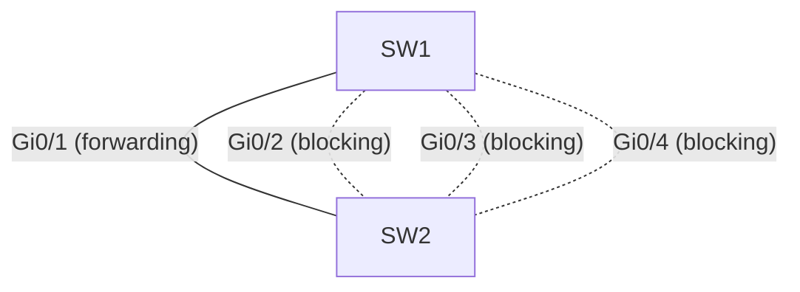
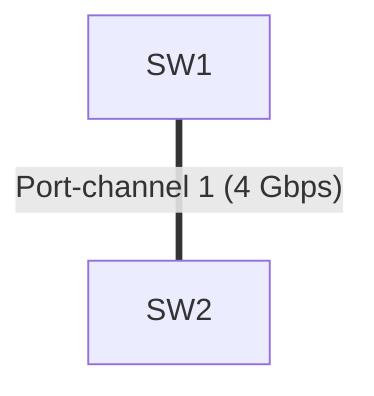

## El problema

SW1 y SW2 están conectados por **4 enlaces Gigabit** (Gi0/1 a Gi0/4), pensados
para dar redundancia y más ancho de banda. Pero al revisar STP con
`show spanning-tree`, ves que solo **uno** de los cuatro puertos está en estado
`forwarding`. Los otros tres están en `blocking`.



Esto es **normal**: STP detecta un bucle (4 caminos entre los mismos dos
switches) y bloquea 3 enlaces para evitarlo. El problema es que estás pagando
por 4 Gbps de capacidad y usando solo 1, y si Gi0/1 falla, STP tarda unos
segundos en reconverger antes de activar otro enlace.

## La solución: EtherChannel

EtherChannel agrupa los 4 enlaces físicos en **un solo enlace lógico**
(un _Port-Channel_). STP deja de ver 4 caminos redundantes y ve solo uno, así
que no bloquea nada: los 4 enlaces quedan activos y el tráfico se reparte
entre ellos. Si uno falla, el canal sigue funcionando con los que quedan, sin
esperar la reconvergencia de STP.



Para negociar el canal entre los dos switches se usa un protocolo:

| Protocolo | Estándar               | Modos                                  |
| :-------- | :--------------------- | :------------------------------------- |
| **LACP**  | IEEE 802.3ad (abierto) | `active` (inicia) / `passive` (espera) |
| **PAgP**  | Propietario Cisco      | `desirable` (inicia) / `auto` (espera) |

También existe el modo `on`, que activa el canal sin negociar nada — funciona,
pero si un puerto queda mal cableado o mal configurado, el canal no lo
detecta solo, porque no hay negociación que verifique la coherencia. Por eso
en producción casi siempre se usa LACP.

Para que el canal se forme, los dos extremos deben quedar en modos
compatibles: `active`-`passive`, `active`-`active` (LACP), o
`desirable`-`auto`, `desirable`-`desirable` (PAgP). Combinar `passive` con
`passive`, o `auto` con `auto`, no funciona: ninguno de los dos inicia la
negociación.

## Configurarlo con LACP

En **SW1**, se agrupan los 4 puertos y se levanta el canal:

```ios
SW1(config)# interface range GigabitEthernet 0/1 - 4
SW1(config-if-range)# channel-group 1 mode active
SW1(config-if-range)# exit
SW1(config)# interface Port-channel 1
SW1(config-if)# switchport mode trunk
SW1(config-if)# switchport trunk allowed vlan 10,20
SW1(config-if)# exit
```

En **SW2**, lo mismo (con `passive`, ya que SW1 va a iniciar la negociación):

```ios
SW2(config)# interface range GigabitEthernet 0/1 - 4
SW2(config-if-range)# channel-group 1 mode passive
SW2(config-if-range)# exit
SW2(config)# interface Port-channel 1
SW2(config-if)# switchport mode trunk
SW2(config-if)# switchport trunk allowed vlan 10,20
SW2(config-if)# exit
```

Un punto clave: la configuración de VLAN y trunk se aplica en
`interface Port-channel 1`, **no** en cada puerto físico. Las interfaces
físicas heredan automáticamente esa configuración en cuanto entran al canal.

Se verifica con:

```ios
SW1# show etherchannel summary
Flags:  D - down        P - bundled in port-channel
        I - stand-alone s - suspended

Group  Port-channel  Protocol    Ports
------+-------------+-----------+----------------------------------------
1      Po1(SU)         LACP      Gi0/1(P)  Gi0/2(P)  Gi0/3(P)  Gi0/4(P)
```

`Po1(SU)` confirma que el canal está _up_ en capa 2, y la `(P)` en cada
puerto confirma que los 4 quedaron _bundled_ (agregados). Ahora
`show spanning-tree` va a mostrar un solo puerto — el Port-channel 1 — en
`forwarding`, y los 4 Gbps están disponibles.

## Segundo problema: el canal no termina de formarse

Supón que en SW2 alguien configuró Gi0/3 como `access` en lugar de `trunk`
por error. Al revisar el canal:

```ios
SW2# show etherchannel summary
Group  Port-channel  Protocol    Ports
------+-------------+-----------+----------------------------------------
1      Po1(SU)         LACP      Gi0/1(P)  Gi0/2(P)  Gi0/3(D)  Gi0/4(P)
```

Gi0/3 aparece con `(D)` — _down_ — en vez de `(P)`. El canal sigue funcionando
con los otros 3 enlaces, pero uno se quedó fuera y ya no da ancho de banda.

La causa casi siempre es la misma: **para que un puerto entre al canal, su
configuración debe ser idéntica a la de los demás puertos del grupo** —
misma velocidad, mismo dúplex, mismo modo (access/trunk), mismas VLANs
permitidas. Si algo difiere, LACP/PAgP lo dejan fuera del canal en vez de
formarlo mal.

La solución es corregir el puerto para que coincida con el resto:

```ios
SW2(config)# interface GigabitEthernet 0/3
SW2(config-if)# switchport mode trunk
SW2(config-if)# switchport trunk allowed vlan 10,20
SW2(config-if)# exit
```

Al volver a revisar `show etherchannel summary`, Gi0/3 debería pasar a
`(P)` en unos segundos, sin necesidad de tocar el `channel-group`.

## Balanceo de carga: por qué un enlace se ve más cargado que otros

Con el canal ya arriba, es común notar en `show interfaces` que un puerto del
Port-channel mueve mucho más tráfico que los otros tres. Esto no es un fallo:
por defecto, el switch reparte el tráfico calculando un **hash** sobre la IP
origen y destino (`src-dst-ip`), y cada flujo (misma combinación de IPs)
siempre usa el mismo enlace, para no desordenar los paquetes de una misma
conexión TCP. Si hay pocos flujos con mucho tráfico (por ejemplo, un backup
masivo entre dos servidores), el hash puede mandarlos todos al mismo enlace.

Cambiar el criterio del hash a puertos TCP/UDP suele repartir mejor cuando el
tráfico es de pocas IPs pero muchas conexiones distintas:

```ios
SW1(config)# port-channel load-balance src-dst-port
```

Se verifica con:

```ios
SW1# show etherchannel load-balance
EtherChannel Load-Balancing Configuration: src-dst-port
```

No existe un método que garantice un reparto perfecto — el balanceo siempre
es por flujo, no por paquete individual —, pero elegir el campo del hash
según el tipo de tráfico real de la red ayuda a evitar que un solo enlace
cargue con todo.

## En resumen

- STP bloquea enlaces redundantes; EtherChannel los agrupa en un Port-channel
  lógico para que STP no bloquee nada y se aproveche todo el ancho de banda.
- LACP (`active`/`passive`) es el protocolo estándar para negociar el canal;
  PAgP es la alternativa propietaria de Cisco.
- La configuración va en `interface Port-channel N`, no en cada puerto físico.
- Si un puerto no entra al canal (`(D)` o `(I)` en vez de `(P)`), revisa que
  su configuración sea idéntica a la de los demás puertos del grupo.
- El balanceo de carga es por flujo; el campo del hash (`port-channel
load-balance`) se ajusta según cómo se comporte realmente el tráfico.
