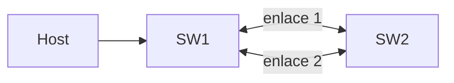

La **redundancia** es imprescindible en una red: si falla un enlace, otro toma
el relevo. El problema es que un enlace redundante entre switches, tal cual,
no funciona — genera un **bucle de capa 2**. El **Spanning Tree Protocol
(STP)** existe para permitir la redundancia física sin sufrir ese problema.

## El problema: bucles de capa 2

**Situación:** dos switches de un mismo piso se conectan con dos cables, para que si uno se desconecta el otro siga dando servicio.

**Problema:** Una trama de broadcast que entra por SW1 sale por
ambos enlaces hacia SW2. SW2 la reenvía de vuelta a SW1 por el enlace que le
queda libre. SW1 la vuelve a reenviar. La trama nunca deja de circular:



Consecuencias concretas de ese bucle:

- **Tormenta de broadcast**: las tramas se multiplican y saturan el ancho de
  banda hasta dejar la red inutilizable.
- **Tabla MAC inestable**: el switch ve la misma MAC de origen llegando por
  los dos puertos casi a la vez, y la reescribe sin parar.
- **Tramas duplicadas**: el destino recibe varias copias del mismo paquete.

**La solución no es evitar los dos cables** (perderías la redundancia que
buscabas), sino dejar uno de los dos **lógicamente bloqueado** hasta que se
necesite. Eso es exactamente lo que hace STP.

## Cómo decide STP qué puerto bloquear

STP construye un **árbol de expansión** sin bucles siguiendo tres pasos, en
este orden:

1. Elegir un **switch raíz** (_root bridge_): el punto de referencia desde el
   que se mide "el mejor camino" en el resto de la red.
2. En cada switch que no es la raíz, elegir su **puerto raíz** (_root port_):
   el puerto por el que ese switch llega más rápido a la raíz.
3. En cada segmento de red, elegir un **puerto designado** (_designated
   port_): el que va a reenviar tráfico en ese segmento. El resto de los
   puertos de ese segmento quedan **bloqueados**.

Para decidir todo esto, los switches se intercambian **BPDUs** (Bridge
Protocol Data Units) — mensajes de control que anuncian quién cree ser la
raíz y a qué distancia está.

### Cómo se elige la raíz

**Situación:** una oficina tiene tres switches conectados en triángulo (los
tres enlazados entre sí, por redundancia). Los tres necesitan ponerse de
acuerdo en cuál es la raíz, sin que nadie se lo diga manualmente.

<div style="text-align:center;">

<svg viewBox="0 0 400 280" xmlns="http://www.w3.org/2000/svg" role="img" aria-label="Tres switches conectados en triángulo" style="max-width:500px;height:auto;place-self:anchor-center;">
  <g fill="none" stroke="currentColor" stroke-opacity="0.5" stroke-width="2">
    <line x1="200" y1="70" x2="80" y2="220"/>
    <line x1="200" y1="70" x2="320" y2="220"/>
    <line x1="80" y1="220" x2="320" y2="220"/>
  </g>
  <g fill="none" stroke="currentColor" stroke-width="2">
    <rect class="stp-switch" x="150" y="50" width="100" height="40" rx="6"/>
    <rect class="stp-switch" x="30" y="200" width="100" height="40" rx="6"/>
    <rect class="stp-switch" x="270" y="200" width="100" height="40" rx="6"/>
  </g>
  <g fill="currentColor" font-size="14" text-anchor="middle">
    <text x="200" y="77">SW1</text>
    <text x="80" y="227">SW2</text>
    <text x="320" y="227">SW3</text>
  </g>
  <g fill="currentColor" fill-opacity="0.85" font-size="11" text-anchor="middle">
    <text x="145" y="128">
      <tspan x="105" dy="0">Designated</tspan>
      <tspan x="105" dy="13">Port</tspan>
    </text>
    <text x="285" y="128">
      <tspan x="295" dy="0">Designated</tspan>
      <tspan x="295" dy="13">Port</tspan>
    </text>
    <text x="200" y="250">Bloqueado</text>
  </g>
</svg>

</div>

**Razonamiento:** se elige por el **Bridge ID** más bajo, que se arma con dos
datos:

- **Prioridad** (2 bytes) — por defecto **32768** en todos los switches,
  configurable en pasos de 4096.
- **Dirección MAC** (6 bytes) — de fábrica, siempre distinta.

Si todos tienen la misma prioridad por defecto, **gana la MAC más baja** —
que en la práctica suele ser el switch más viejo de la red, no necesariamente
el que vos querrías como raíz. Por eso, en una red real, se ajusta la
prioridad manualmente en el switch que sí querés como raíz (por ejemplo, el
del núcleo, con mejor capacidad), para no dejarlo al azar de qué MAC es más
baja.

### Roles de puerto, en la práctica

| Rol                | Qué es                                                                |
| :----------------- | :-------------------------------------------------------------------- |
| Root port          | El mejor camino de este switch hacia la raíz (uno por switch no raíz) |
| Designated port    | El puerto que reenvía tráfico en un segmento de red                   |
| Blocked port       | El puerto redundante: no reenvía, pero sigue escuchando BPDUs         |
| Alternate / Backup | Puertos bloqueados que ya tienen listo un camino de respaldo (RSTP)   |

<div style="text-align:center;">

<svg viewBox="0 0 440 380" xmlns="http://www.w3.org/2000/svg" role="img" aria-label="Topología STP: root bridge con puertos designados, SW4 con puerto raíz y enlace bloqueado" style="max-width:500px;height:auto;place-self:anchor-center;">
  <g fill="none" stroke="currentColor" stroke-opacity="0.5" stroke-width="2">
    <line x1="220" y1="75" x2="90" y2="190"/>
    <line x1="220" y1="75" x2="350" y2="190"/>
    <line x1="90" y1="230" x2="185" y2="315"/>
    <line x1="350" y1="230" x2="255" y2="315" stroke-dasharray="6,4" stroke-opacity="0.7"/>
  </g>
  <g fill="none" stroke="currentColor" stroke-width="2">
    <rect class="stp-switch" x="170" y="35" width="100" height="40" rx="6"/>
    <rect class="stp-switch" x="40" y="190" width="100" height="40" rx="6"/>
    <rect class="stp-switch" x="300" y="190" width="100" height="40" rx="6"/>
    <rect class="stp-switch" x="170" y="315" width="100" height="40" rx="6"/>
  </g>
  <g fill="currentColor" font-size="14" text-anchor="middle">
    <text x="220" y="62">Root SW</text>
    <text x="90" y="217">SW2</text>
    <text x="350" y="217">SW3</text>
    <text x="220" y="342">SW4</text>
  </g>
  <g fill="currentColor" fill-opacity="0.85" font-size="12" text-anchor="middle">
    <text x="165" y="110">DP</text>
    <text x="275" y="110">DP</text>
    <text x="143" y="264">RP</text>
    <text x="272" y="262">Bloqueado</text>
  </g>
</svg>

</div>

Un puerto **bloqueado no está apagado**: sigue escuchando BPDUs para saber si
el camino activo falla. Si eso pasa, STP recalcula y ese puerto puede pasar a
reenviar tráfico.

```ios
# Root primary
SW1(config)# spanning-tree mode pvst
SW1(config)# spanning-tree vlan 10 root primary

# Root secundary
SW2(config)# spanning-tree mode pvst
SW2(config)# spanning-tree vlan 10 root secondary

SW3(config)# spanning-tree mode pvst

SW4(config)# spanning-tree mode pvst
SW4(config)# interface GigabitEthernet0/1
SW4(config-if)# spanning-tree vlan 10 cost 4
```

- Con `root primary` SW1 baja su prioridad a **24576** (o 4096 menos que la
  raíz actual) y se convierte en el _Root SW_ de la gráfica;
- `root secondary` prepara a SW2 como respaldo con prioridad **28672**.
- Ajustando el `cost` en los enlaces de un switch no raíz se decide por qué
  puerto se elige su **root port**. En el resto de la red, con todas las
  prioridades por defecto, STP asigna los roles automáticamente: designated
  en los segmentos y bloqueado en los enlaces redundantes.

### Estados de puerto y por qué tarda tanto

Antes de reenviar tráfico, un puerto de STP pasa por varios estados:

| Estado     | Reenvía tramas | Aprende MAC | Tiempo               |
| :--------- | :------------- | :---------- | :------------------- |
| Blocking   | No             | No          | 20 s (max age)       |
| Listening  | No             | No          | 15 s (forward delay) |
| Learning   | No             | Sí          | 15 s (forward delay) |
| Forwarding | Sí             | Sí          | —                    |

**Por qué existe esta espera:** STP prefiere tardar en converger antes que
arriesgarse a reabrir un bucle por apurar el proceso. El costo es que la
convergencia clásica tarda hasta **50 segundos** (20 + 15 + 15) — un tiempo
que, en un puerto donde solo hay conectada una PC, es un desperdicio total:
ahí no hay ningún riesgo real de bucle. Ese caso puntual es el que resuelve
PortFast, más abajo.

## RSTP: la misma idea, mucho más rápido

**RSTP (802.1w)** resuelve el problema de los 50 segundos sin cambiar el
objetivo de STP — sigue evitando bucles — pero converge en 1-2 segundos:

- Los puertos **alternate/backup** ya tienen un camino de respaldo calculado
  de antemano, así que ante una falla no hay que esperar temporizadores: se
  activa al instante.
- Distingue enlaces **punto a punto** (entre switches) de enlaces de
  **borde** (hacia hosts), y trata cada uno con la lógica que corresponde.
- Es retrocompatible: si un switch vecino solo habla STP clásico (802.1D),
  RSTP se adapta automáticamente y no rompe la topología.

| Aspecto              | STP (802.1D)   | RSTP (802.1w)                        |
| :------------------- | :------------- | :----------------------------------- |
| Convergencia         | 30-50 segundos | 1-2 segundos                         |
| Estados de puerto    | 4 principales  | 3 (discarding, learning, forwarding) |
| Puertos alternativos | No             | Sí, failover inmediato               |

### La versión de Cisco: PVST+ y Rapid PVST+

**PVST (Per-VLAN Spanning Tree)** es la extensión propietaria de Cisco al
estándar: en vez de correr **un solo árbol** para todo el switch (como hace
802.1D), corre **una instancia de STP por VLAN**. Cada VLAN tiene así su
propia elección de root bridge, sus propios roles de puerto y sus propios
bloqueos.

- **PVST**: la versión original, pensada para el encapsulado propietario
  **ISL**.
- **PVST+**: la versión mejorada, compatible con **trunks 802.1Q** — la que
  usan los switches Cisco en la práctica.
- **Rapid PVST+**: la misma idea de PVST+ pero sobre **RSTP (802.1w)**, con
  convergencia de 1-2 segundos. Es el modo estándar en switches Cisco
  modernos.

**Para qué sirve en la práctica:** permite **balancear la carga** entre dos
enlaces redundantes en vez de dejar uno completamente inactivo. Por ejemplo,
con dos switches unidos por dos trunks, se puede hacer que el enlace 1 sea el
activo para las VLANs de datos y el enlace 2 el activo para las VLANs de voz
— ambos cables trabajan, en vez de que uno quede bloqueado todo el tiempo.

```ios
# Root primary
SW1(config)# spanning-tree mode rapid-pvst
SW1(config)# spanning-tree vlan 10 root primary

# Root secundary
SW2(config)# spanning-tree mode rapid-pvst
SW2(config)# spanning-tree vlan 10 root secondary

SW3(config)# spanning-tree mode rapid-pvst

SW4(config)# spanning-tree mode rapid-pvst
SW4(config)# interface GigabitEthernet0/1
SW4(config-if)# spanning-tree vlan 10 cost 4
```

### PortFast y BPDU guard:

**Situación:** un puerto access con una PC conectada tarda 30-50 segundos en
empezar a pasar tráfico cada vez que la PC se prende o se reinicia, porque
pasa por todos los estados de STP como si fuera un enlace entre switches.

**Solución — PortFast:** en puertos de acceso a hosts (PCs, impresoras,
teléfonos), el puerto salta directo a _forwarding_, sin pasar por listening
ni learning. Tiene sentido porque un host final nunca va a generar un bucle
por sí solo.

**El riesgo que abre PortFast:** si alguien conecta un switch no autorizado
(o un router mal configurado) a ese mismo puerto en vez de una PC, ese switch
sí podría generar un bucle — y PortFast lo dejaría pasar directo sin
protección.

**Solución al riesgo — BPDU guard:** si un puerto con PortFast llega a
recibir una BPDU (algo que una PC nunca envía, pero un switch sí), BPDU
guard **deshabilita el puerto** (errdisable) automáticamente. Así, PortFast
gana velocidad para los hosts sin dejar la puerta abierta a que alguien
conecte un switch no autorizado.

```ios
SW1(config)# interface FastEthernet0/1
SW1(config-if)# spanning-tree portfast
SW1(config-if)# spanning-tree bpduguard enable
```

> `switchport host` configura access + PortFast + BPDU guard en un solo
> comando — la combinación recomendada para cualquier puerto de usuario final.

## Verificación

```ios
VLAN0010
  Spanning tree enabled protocol ieee
  Root ID    Priority    32769
             Address     aaaa.bbbb.cccc
             This bridge is the root
  ...

  Interface        Role Sts Cost      Prio.Nbr Type
  ---------------- ---- --- --------- -------- --------------------------------
  Gi0/24           Desg FWD 4         128.24   P2p
```

- **FWD** = forwarding, **BLK** = blocking, **LRN** = learning, **LSN** =
  listening.
- `Root ID` muestra qué switch es la raíz para esa VLAN — el primer dato a
  revisar si algo en la red converge distinto de lo esperado.

### Comandos adicionales

| Comando                                         | Función                                         |
| :---------------------------------------------- | :---------------------------------------------- |
| `spanning-tree vlan <id> priority <0-61440>`    | Cambia la prioridad manualmente (pasos de 4096) |
| `spanning-tree vlan <id> port-priority <0-240>` | Cambia la prioridad del puerto (pasos de 16)    |
| `spanning-tree portfast default`                | Activa PortFast en todos los puertos access     |
| `spanning-tree bpduguard default`               | Activa BPDU guard en todos los puertos portfast |
| `spanning-tree guard root`                      | Root guard: impide que el puerto sea la raíz    |
| `spanning-tree bpdufilter enable`               | Descarta BPDUs sin deshabilitar el puerto       |
| `spanning-tree uplinkfast`                      | Acelera la convergencia del root port           |
| `show spanning-tree summary`                    | Resumen del estado de STP en el switch          |
| `show spanning-tree root`                       | Muestra el root bridge de cada VLAN             |
| `errdisable recovery cause bpduguard`           | Rehabilita puertos errdisable por BPDU guard    |

## Preguntas tipo CCNA

1. **¿Qué problema evita STP y cómo?**
   Los **bucles de capa 2**: construye un árbol lógico y deja puertos
   redundantes en _blocking_ para que no circule tráfico por ellos.

2. **¿Cómo se elige el root bridge?**
   Por el **Bridge ID más bajo** (prioridad + dirección MAC). Con la misma
   prioridad, gana la MAC más baja.

3. **¿Qué es el root port?**
   El puerto de cada switch no raíz con el **mejor camino hacia la raíz**.

4. **¿Cuál es la prioridad por defecto de un switch?**
   **32768**; se ajusta en pasos de 4096.

5. **¿Por qué PortFast necesita BPDU guard junto a él?**
   Porque PortFast salta las protecciones normales de STP en ese puerto; si
   alguien conecta ahí un switch no autorizado, BPDU guard es lo que detecta
   la BPDU inesperada y deshabilita el puerto antes de que se forme un bucle.

## Resumen

- Los enlaces redundantes entre switches, sin STP, forman **bucles de capa
  2** (tormenta de broadcast, tabla MAC inestable, tramas duplicadas).
- STP resuelve esto sin quitar la redundancia: elige una raíz, un root port
  por switch y un designated port por segmento; el resto queda bloqueado.
- **RSTP** hace lo mismo en 1-2 segundos en vez de 50, gracias a puertos
  alternate/backup ya calculados de antemano.
- Cisco corre **una instancia por VLAN** (PVST+ / Rapid PVST+), lo que
  permite balancear carga entre enlaces redundantes.
- **PortFast** acelera los puertos de hosts; **BPDU guard** los protege de
  que alguien conecte ahí un switch no autorizado.
