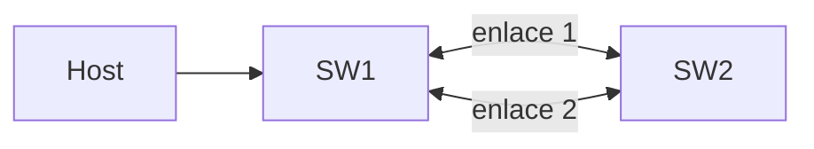
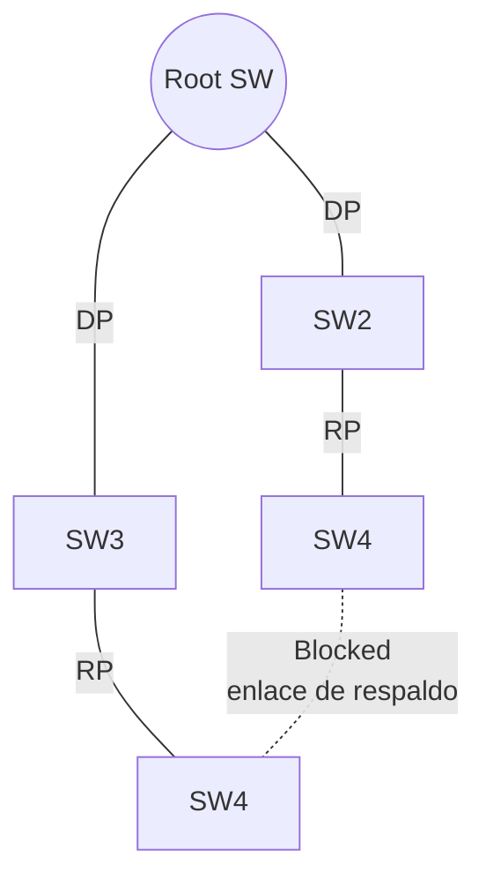

La **redundancia** es imprescindible en una red: si falla un enlace, otro toma
el relevo. Pero los enlaces redundantes entre switches generan **bucles de
capa 2** que el protocolo **Spanning Tree (STP)** debe evitar.

## El problema: bucles de capa 2

Sin STP, dos switches conectados por dos enlaces crean un bucle en el que las
tramas de broadcast/multicast circulan para siempre:


Consecuencias de un bucle:

- **Tormenta de broadcast**: las tramas se reenvían infinitamente y saturan la red.
- **Inestabilidad de la tabla MAC**: la misma dirección MAC se aprende por
  puertos distintos y cambia constantemente.
- **Duplicación de tramas**: el destino recibe varias copias de la misma trama.

## Cómo funciona STP

STP (IEEE 802.1D) construye un **árbol de expansión** sin bucles: deja
**bloqueados** los puertos que formarían un bucle y solo reenvía por el resto.
Se logra con tres pasos:

1. Elegir un **switch raíz** (_root bridge_).
2. Elegir el **puerto raíz** (_root port_) en cada switch no raíz (el mejor
   camino hacia la raíz).
3. Elegir un **puerto designado** (_designated port_) en cada segmento de red;
   el resto de puertos quedan **bloqueados**.

### BPDUs y Bridge ID

Los switches intercambian **BPDUs** (Bridge Protocol Data Units) para descubrir
la topología y elegir la raíz.

- El **Bridge ID** = prioridad (2 bytes) + dirección MAC (6 bytes).
- **Prioridad por defecto**: 32768 (configurable en saltos de 4096).
- El switch con el **Bridge ID más bajo** es la raíz.

### Roles de puerto

| Rol            | Qué es                                          |
| :------------- | :---------------------------------------------- |
| Root port      | Mejor camino hacia la raíz (uno por switch no raíz) |
| Designated port | Mejor puerto de un segmento de red              |
| Blocked port   | Puerto redundante que no reenvía tráfico         |
| Alternate / Backup | Puertos bloqueados de respaldo (RSTP)        |



### Estados de puerto

| Estado     | Reenvía tramas | Aprende MAC | Tiempo |
| :--------- | :------------- | :---------- | :----- |
| Blocking   | No             | No          | 20 s (max age) |
| Listening  | No             | No          | 15 s (forward delay) |
| Learning   | No             | Sí          | 15 s (forward delay) |
| Forwarding | Sí             | Sí          | —      |

La convergencia clásica de STP tarda hasta **50 segundos** (20 + 15 + 15).

## RSTP: convergencia rápida

**RSTP (802.1w)** mejora STP con convergencia casi instantánea (1-2 segundos):

- Los puertos **alternate/backup** permiten un failover inmediato sin esperar
  temporizadores.
- Distingue enlaces **punto a punto** y de **borde** (a hosts).
- Es retrocompatible: si un switch solo habla 802.1D, RSTP degrada a STP.

| Aspecto            | STP (802.1D)                 | RSTP (802.1w)           |
| :----------------- | :--------------------------- | :---------------------- |
| Convergencia       | 30-50 segundos               | 1-2 segundos            |
| Estados de puerto  | 4 principales                | 3 (discarding, learning, forwarding) |
| Puertos alternativos | No                        | Sí, failover inmediato  |

## PVST+ y Rapid PVST+

Cisco ejecuta **una instancia de STP por VLAN**:

- **PVST+**: STP por VLAN sobre trunks 802.1Q.
- **Rapid PVST+**: RSTP por VLAN (el estándar en switches Cisco modernos).

Ventaja: permite **balancear carga**, usando enlaces distintos como activos en
VLANs distintas.

```SW1(config)# spanning-tree mode rapid-pvst
```
## Configuración de STP

```ios
SW1(config)# spanning-tree vlan 30 priority 24576
SW1(config)# interface GigabitEthernet0/1
SW1(config-if)# spanning-tree portfast
SW1(config-if)# spanning-tree bpduguard enable
```

| Comando                                   | Función                                  |
| :---------------------------------------- | :--------------------------------------- |
| `spanning-tree mode rapid-pvst`           | Usa RSTP por VLAN                        |
| `spanning-tree vlan X root primary`       | Fuerza que este switch sea la raíz       |
| `spanning-tree vlan X root secondary`     | Switch de respaldo si la raíz falla      |
| `spanning-tree vlan X priority <val>`     | Ajusta la prioridad del Bridge ID        |
| `spanning-tree portfast`                  | El puerto pasa directo a forwarding      |
| `spanning-tree bpduguard enable`          | Deshabilita el puerto si recibe una BPDU |

### PortFast y protección BPDU

- **PortFast**: en puertos **de acceso a hosts** (PCs, impresoras, teléfonos),
  el puerto salta directo a *forwarding* sin esperar los 15-30 s de STP.
- **BPDU guard**: si un puerto con PortFast recibe una BPDU, **se deshabilita**
  (errdisable). Impide que un usuario conecte un switch no autorizado.

```ios
SW1(config-if-range)# switchport host
```
> El comando `switchport host` configura access + PortFast + BPDU guard en un
> solo paso.

## Verificación

```ios

VLAN0010
  Spanning tree enabled protocol ieee
  Root ID    Priority    32769
             Address     aaaa.bbbb.cccc
             This bridge is the root
  ...

  Interface        Role Sts Cost      Prio.Nbr Type
  ---------------- ---- --- --------- -------- --------------------------------
  Gi0/24           Desg FWD 4         128.24   P2p
```

- **FWD** = forwarding, **BLK** = blocking, **LRN** = learning, **LSN** =
  listening.
- `Root ID` muestra qué switch es la raíz para esa VLAN.

## Preguntas tipo CCNA

1. **¿Qué protocolo de capa 2 evita los bucles y cómo?**
   **STP** (IEEE 802.1D) o **RSTP** (802.1w): construye un árbol lógico y deja
   puertos en *blocking* para eliminar bucles.

2. **¿Cómo se elige el root bridge?**
   Por el **Bridge ID más bajo** (prioridad + dirección MAC). Con la misma
   prioridad, gana la MAC más baja.

3. **¿Qué es el root port?**
   El puerto de cada switch no raíz con el **mejor camino hacia la raíz**.

4. **¿Cuál es la prioridad por defecto de un switch?**
   **32768**; se ajusta en pasos de 4096.

5. **¿Qué hace PortFast y por qué conviene en puertos de hosts?**
   Lleva el puerto directamente a *forwarding*, evitando los temporizadores de
   STP; se combina con **BPDU guard** para bloquear switches no autorizados.

## Resumen

- Los enlaces redundantes crean **bucles de capa 2** (tormentas de broadcast,
  inestabilidad MAC).
- **STP** elige root bridge, root ports y designated ports; el resto queda
  **bloqueado**.
- **RSTP** converge en 1-2 segundos gracias a puertos alternate/backup.
- Cisco usa **PVST+ / Rapid PVST+**: una instancia por VLAN.
- **PortFast + BPDU guard** aceleran los puertos de acceso y los protegen.