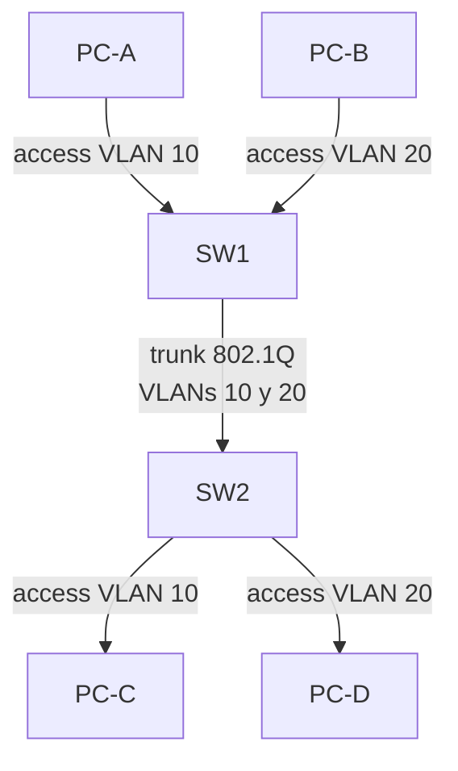
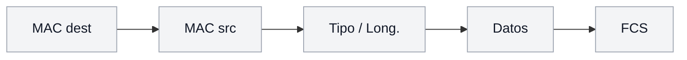
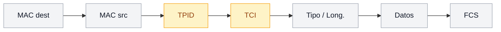

Una **VLAN** (Virtual LAN) es un dominio de broadcast separado de forma lógica
dentro del mismo switch. Dos estaciones en VLANs distintas no se ven entre sí
ni intercambian tráfico de broadcast, aunque estén en el mismo equipo.

## ¿Por qué usar VLANs?

| Beneficio            | Descripción                                                                 |
| :------------------- | :-------------------------------------------------------------------------- |
| Segmentación         | Divide el dominio de broadcast (la VLAN 1 lo comparte todo)                 |
| Seguridad            | Aísla usuarios y departamentos entre sí                                     |
| Organización         | Agrupa por función (ventas, IT, invitados) sin importar la ubicación física |
| Reducción de tráfico | Limita broadcasts y multicast al grupo correspondiente                      |
| Rendimiento          | Reduce colisiones y tráfico innecesario                                     |

> Sin VLANs, todo el switch comparte un único dominio de broadcast. Cuanto más
> grande el dominio, más tráfico de broadcast y menos rendimiento.

## Tipos de VLAN

| VLAN             | Descripción                                             |
| :--------------- | :------------------------------------------------------ |
| VLAN por defecto | La **VLAN 1**, no se puede borrar ni renombrar          |
| VLAN de datos    | Transporta tráfico de usuarios                          |
| VLAN de gestión  | Transporta tráfico de administración (SSH, telnet)      |
| VLAN nativa      | En un trunk, tramas sin etiqueta; por defecto la VLAN 1 |
| VLAN de voz      | Separa el tráfico de teléfonos IP (prioridad QoS)       |

## Puertos access y trunk

Un puerto de switch puede configurarse de dos formas, según **qué hay conectado
del otro lado**:

- **Puerto access**: pertenece a una única VLAN y entrega tramas **sin
  etiqueta**. Es el modo para un puerto conectado a un dispositivo final —una
  PC, una impresora, un punto de acceso Wi-Fi— que no sabe nada de VLANs y
  espera tramas Ethernet normales. El switch es el único que sabe a qué VLAN
  pertenece ese puerto; el dispositivo conectado ni se entera.

- **Puerto trunk**: transporta **varias VLANs** por el mismo cable físico,
  etiquetando cada trama con 802.1Q para que el otro extremo sepa de qué VLAN
  viene. Es el modo para un puerto conectado a **otro switch** (o a un router,
  o a un servidor con NIC virtualizada) que sí necesita distinguir tráfico de
  varias VLANs a la vez.

**Por qué la diferencia importa:** si conectaras dos switches con un puerto
**access**, solo podría cruzar el tráfico de una VLAN entre ellos — para tener
la VLAN 10 y la VLAN 20 en ambos switches necesitarías un cable físico por
cada VLAN. El trunk resuelve eso: un solo enlace lleva el tráfico de todas las
VLANs necesarias, etiquetado para que cada switch sepa separarlo al llegar.

**Regla práctica para elegir:**

- ¿Del otro lado del cable hay **un dispositivo final** (PC, impresora, AP)? →
  **access**, con la VLAN que le corresponda.
- ¿Del otro lado hay **otro switch, un router, o algo que debe ver más de una
  VLAN** por ese mismo enlace? → **trunk**.



En el diagrama, PC-A y PC-C están en la misma VLAN 10 aunque cuelguen de
switches distintos: eso solo es posible porque el enlace SW1–SW2 es un trunk
que lleva ambas VLANs a la vez. Si ese enlace fuera access, PC-A y PC-C nunca
podrían verse entre sí.

## Etiquetado 802.1Q

El estándar **IEEE 802.1Q** inserta una etiqueta de **4 bytes** en la trama
Ethernet para indicar a qué VLAN pertenece:

**Sin etiqueta** (trama de un puerto access):



**Con etiqueta 802.1Q** (trama de un puerto trunk):



Los campos principales de la etiqueta (resaltada en amarillo, 4 bytes):

| Campo                              | Tamaño  | Función                                                            |
| :--------------------------------- | :------ | :----------------------------------------------------------------- |
| **TPID** (Tag Protocol Identifier) | 2 bytes | Indica que la trama está etiquetada                                |
| **TCI**                            | 2 bytes | Contiene la **VID** (VLAN ID, 12 bits → 4094 VLANs) y la prioridad |

La *_VLAN nativa_ es la que se envía por el trunk **sin etiqueta** (por
compatibilidad con equipos que no entienden 802.1Q). Debe ser la misma en ambos
extremos del trunk.

## Configuración de VLANs

### Crear una VLAN y asignar puertos

```ios
SW1# configure terminal
SW1(config)# vlan 10
SW1(config-vlan)# name Ventas
SW1(config-vlan)# exit

SW1(config)# interface GigabitEthernet0/1
SW1(config-if)# switchport mode access
SW1(config-if)# switchport access vlan 10
SW1(config-if)# exit
```

| Comando                     | Función                            |
| :-------------------------- | :--------------------------------- |
| `vlan 10`                   | Crea la VLAN 10 y entra al submodo |
| `name Ventas`               | Da un nombre descriptivo           |
| `switchport mode access`    | Marca el puerto como access        |
| `switchport access vlan 10` | Asigna el puerto a la VLAN 10      |

Para asignar varios puertos a la vez se usa `interface range`:

```ios
SW1(config)# interface range f0/1 - 8
SW1(config-if-range)# switchport mode access
SW1(config-if-range)# switchport access vlan 20
```

### Configurar un trunk 802.1Q

```ios
SW1(config-if)# switchport mode trunk
SW1(config-if)# switchport trunk native vlan 99
SW1(config-if)# switchport trunk allowed vlan 10,20,99
```

| Comando                           | Función                                    |
| :-------------------------------- | :----------------------------------------- |
| `switchport mode trunk`           | Fuerza el puerto a modo trunk              |
| `switchport trunk native vlan 99` | Cambia la VLAN nativa (mejor que la 1)     |
| `switchport trunk allowed vlan`   | Restringe las VLANs permitidas en el trunk |

> **Buena práctica:** usa la **VLAN 1** solo como fallback y no pongas tráfico
> de usuario en ella. Separa también la **VLAN de gestión**.

### VLAN de voz

Para teléfonos IP que comparten puerto con un PC, el teléfono se asigna a una
VLAN de voz y el PC a la de datos:

```ios
SW1(config-if)# switchport mode access
SW1(config-if)# switchport access vlan 10
SW1(config-if)# switchport voice vlan 100
```

## Verificación

```ios
SW1# show vlan

VLAN Name                             Status    Ports
---- -------------------------------- --------- -------------------------------
1    default                          active    Gi0/2, Gi0/3, ...
10   Ventas                           active    Gi0/1
20   Informatica                      active
...
```

```ios
SW1# show interfaces trunk

Port        Mode         Encapsulation  Status        Native vlan
Gi0/24      on           802.1q         trunking      99
...
```

## Preguntas tipo CCNA

1. **¿Qué es una VLAN y qué limita?**
   Una VLAN es un **dominio de broadcast** separado de forma lógica dentro del
   switch.

2. **¿Qué diferencia hay entre un puerto access y un trunk?**
   El access pertenece a **una VLAN** y envía tramas sin etiqueta; el trunk
   transporta **varias VLANs** con tramas etiquetadas (802.1Q).

3. **¿Qué es la VLAN nativa en un trunk 802.1Q?**
   La VLAN cuyas tramas viajan **sin etiqueta**; debe coincidir en ambos
   extremos del trunk.

4. **¿Cuántas VLANs admite el identificador 802.1Q?**
   12 bits → hasta **4094** VLANs utilizables (1-1001 por defecto, 1002-1005
   reservadas, 1006-4094 extendidas).

5. **¿Qué comando restringe las VLANs que cruzan un trunk?**
   `switchport trunk allowed vlan <lista>`.

## Resumen

- Las VLANs segmentan el **dominio de broadcast** de forma lógica.
- **Access** = un dispositivo final, una VLAN, sin etiqueta; **trunk** = enlace
  entre switches/routers, varias VLANs, etiquetadas con 802.1Q.
- 802.1Q inserta una etiqueta de 4 bytes en la trama; la VLAN nativa no se
  etiqueta.
- Se crean con `vlan <id>` + `name` y se asignan con `switchport access vlan`.
- Verifica con `show vlan brief` y `show interfaces trunk`.
