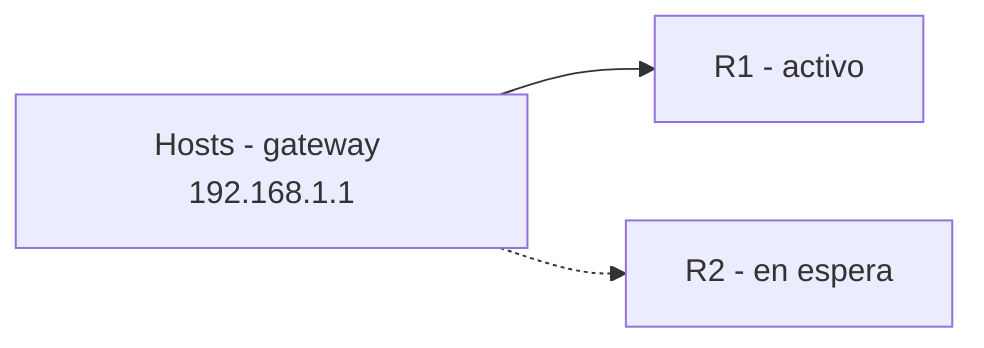
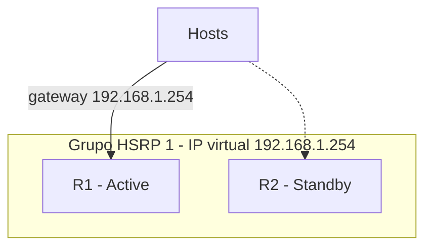

Si el **gateway por defecto** de los hosts falla, toda la subred pierde salida.
Los **protocolos FHRP** (First Hop Redundancy Protocols) comparten una **IP
virtual** entre varios routers: si uno cae, otro asume el papel sin que los
hosts noten nada.

## El problema


Los hosts solo conocen **un** gateway. Si R1 falla, nadie reenvía su tráfico.
FHRP hace que **R1 y R2** compartan la misma **IP virtual** de gateway; el grupo
elige quién la "posee" en cada momento.

## Protocolos FHRP

| Protocolo | Estándar          | Roles                    | Balanceo |
| :-------- | :---------------- | :----------------------- | :------- |
| **HSRP**  | Propietario Cisco | Active / Standby         | No       |
| **VRRP**  | RFC 3768 (abierto) | Master / Backup        | No       |
| **GLBP**  | Propietario Cisco | Active Virtual Gateway (AVG) + Active Virtual Forwarders (AVF) | Sí |

## HSRP

**HSRP** (Hot Standby Router Protocol) agrupa routers en un **grupo HSRP** con
una **IP virtual** y una **MAC virtual** compartidas.

- El **Active** router reenvía el tráfico (posee la IP/MAC virtual).
- El **Standby** vigila y toma el relevo si el Active desaparece (envío de
  hellos cada 3 s, holdtime 10 s por defecto).
- Los hosts usan la IP virtual como gateway.



### Configuración HSRP

```ios
R1(config-if)# ip address 192.168.1.1 255.255.255.0
R1(config-if)# standby version 2
R1(config-if)# standby 1 ip 192.168.1.254
R1(config-if)# standby 1 priority 150
R1(config-if)# standby 1 preempt
R1(config-if)# standby 1 track GigabitEthernet0/1 30

R2(config)# interface GigabitEthernet0/0
R2(config-if)# ip address 192.168.1.2 255.255.255.0
R2(config-if)# standby version 2
R2(config-if)# standby 1 ip 192.168.1.254
R2(config-if)# standby 1 priority 100
R2(config-if)# standby 1 preempt
```
| Comando                        | Función                                    |
| :----------------------------- | :----------------------------------------- |
| `standby version 2`            | Usa HSRPv2 (más grupos y IPv6)             |
| `standby <grupo> ip <IP>`      | Define la **IP virtual** del grupo         |
| `standby <grupo> priority <n>` | Prioridad (por defecto 100); el mayor es Active |
| `standby <grupo> preempt`      | Permite recuperar el papel de Active       |
| `standby <grupo> track <if> <decr>` | Reduce prioridad si el enlace cae (failover) |

> **Preemption** es clave: sin ella, si el Active cae y el Standby toma el
> relevo, cuando el original vuelve **no recupera** el papel automáticamente.

### Tracking de interfaz

Con `track`, la prioridad se reduce si una interfaz importante cae (por ejemplo
el enlace hacia el upstream). Eso fuerza el relevo hacia el otro router.

### Verificación HSRP

```R1# show standby
GigabitEthernet0/0 - Group 1
  State is Active
    2 state changes, last state change 00:03:21
  Virtual IP address is 192.168.1.254
  Active virtual MAC address is 0000.0c9f.f001
  Local virtual MAC address is 0000.0c9f.f001
  Priority 150 (configured 150)
  Preemption enabled
  Track interface GigabitEthernet0/1
    Decrement 30, state Up
```

## VRRP y GLBP (resumen)

**VRRP** es el estándar abierto equivalente a HSRP: un **Master** y uno o más
**Backup** comparten la IP virtual (también admite usar una IP real de un router
como IP virtual).

```ios
R1(config-if)# vrrp 1 ip 192.168.1.254
R1(config-if)# vrrp 1 priority 150
R1(config-if)# vrrp 1 preempt
```

**GLBP** además reparte la carga entre los routers del grupo: un **AVG** asigna
IPs/MACs virtuales por host y varios **AVF** reenvían el tráfico, balanceando
entre todos.

## Preguntas tipo CCNA

1. **¿Qué resuelven los protocolos FHRP?**
   La **redundancia del gateway por defecto**: si un router cae, otro asume la
   IP virtual sin reconfigurar los hosts.

2. **¿Qué protocolo FHRP es propietario de Cisco y cuál es estándar abierto?**
   **HSRP** y **GLBP** son de Cisco; **VRRP** (RFC 3768) es estándar.

3. **¿Cuáles son los roles de HSRP y cuál reenvía tráfico?**
   **Active** (reenvía) y **Standby** (toma el relevo si el Active falla).

4. **¿Qué hace `standby ... preempt`?**
   Permite que un router con mayor prioridad **recupere** el papel de Active
   cuando vuelve a estar disponible.

5. **¿Para qué sirve el tracking de interfaz en HSRP?**
   Para **reducir la prioridad** si un enlace crítico cae y provocar que el otro
   router asuma el papel de Active.

## Resumen

- **FHRP** da redundancia al gateway: HSRP, VRRP y GLBP.
- **HSRP**: grupo con IP/MAC virtual, roles Active/Standby, hello cada 3 s.
- **Prioridad + preempt** controlan quién es Active y permiten recuperarlo.
- **Tracking de interfaz** provoca failover cuando un enlace importante cae.
- **VRRP** es el estándar abierto (Master/Backup); **GLBP** añade balanceo de
  carga entre routers.