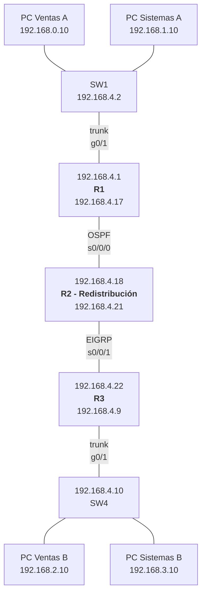

## Objetivos

1. Configurar VLANs, trunks y router-on-a-stick en los dos edificios.
2. Enrutar el edificio A con **OSPF** (R1-R2) y el edificio B con **EIGRP**
   (R3-R4).
3. **Redistribuir** rutas entre OSPF y EIGRP en R2.
4. Verificar que una PC de un edificio llega a la otra punta de la red.

## Plan de direccionamiento

| Name           | Address      | Prefix | Mask  |
| -------------- | ------------ | ------ | ----- |
| Ventas A       | 192.168.0.0  | 24     | 255.0 |
| Sistemas A     | 192.168.1.0  | 24     | 255.0 |
| Ventas B       | 192.168.2.0  | 24     | 255.0 |
| Sistemas B     | 192.168.3.0  | 24     | 255.0 |
| Administrative | 192.168.4.0  | 29     | 0.248 |
| Administrative | 192.168.4.8  | 29     | 0.248 |
| Wan1           | 192.168.4.16 | 30     | 0.252 |
| Wan2           | 192.168.4.20 | 30     | 0.252 |

## Pasos

### 1. VLANs y SVI en SW1

```ios
SW1(config)# vlan 10
SW1(config-vlan)# name Ventas
SW1(config-vlan)# vlan 20
SW1(config-vlan)# name Sistemas
SW1(config-vlan)# vlan 99
SW1(config-vlan)# name Administracion
SW1(config-vlan)# exit

SW1(config)# interface range f0/1 - 6
SW1(config-if)# switchport mode access
SW1(config-if)# switchport access vlan 10
SW1(config-if)# exit

SW1(config)# interface range f0/7 - 8
SW1(config-if)# switchport mode access
SW1(config-if)# switchport access vlan 20
SW1(config-if)# exit

SW1(config)# interface range g0/1 - 2
SW1(config-if)# switchport mode trunk
SW1(config-if)# switchport trunk native vlan 99
SW1(config-if)# switchport trunk allowed vlan 10,20,99
SW1(config-if)# no shutdown
SW1(config-if)# exit

SW1(config)# interface vlan 99
SW1(config-if)# ip address 192.168.4.2 255.255.255.248
SW1(config-if)# no shutdown
SW1(config-if)# exit

SW1(config)# ip default-gateway 192.168.4.1
```

### 2. Trunk y subinterfaces en R1

```ios
R1(config)# int g0/1
R1(config-if)# no shutdown

R1(config-if)# interface g0/1.10
R1(config-subif)# encapsulation dot1q 10
R1(config-subif)# ip address 192.168.0.1 255.255.255.0
R1(config-subif)# exit

R1(config)# interface g0/1.20
R1(config-subif)# encapsulation dot1q 20
R1(config-subif)# ip address 192.168.1.1 255.255.255.0
R1(config-subif)# exit

# VLAN 99 (nativa)
R1(config)# int g0/1.99
R1(config-if)# ip address 192.168.4.1 255.255.255.248
```

Repite los pasos 1 y 2 en el **Edificio B** con **SW4** y **R3**.

### 3. Enlaces seriales

Levanta los enlaces punto a punto Wan1 (R1-R2) y Wan2 (R2-R3):

```ios

# Wan1 R1-R2
R1(config)# interface Serial0/0/0
R1(config-if)# ip address 192.168.4.17 255.255.255.252
R1(config-if)# no shutdown

R2(config)# interface Serial0/0/0
R2(config-if)# ip address 192.168.4.18 255.255.255.252
R2(config-if)# no shutdown

# Wan2 R2-R3
R2(config)# interface Serial0/0/1
R2(config-if)# ip address 192.168.4.21 255.255.255.252
R2(config-if)# no shutdown

R3(config)# interface Serial0/0/0
R3(config-if)# ip address 192.168.4.22 255.255.255.252
R3(config-if)# no shutdown

```

### 4. OSPF en R1 y R2 (dominio del edificio A)

R1 anuncia sus VLANs; R2 adyacente por Serial0/0/0:

```ios
R1(config)# router ospf 1
R1(config-router)# router-id 1.1.1.1
R1(config-router)# passive-interface default
R1(config-router)# no passive-interface Serial0/0/0
R1(config-router)# exit
R1(config)# interface Serial0/0/0
R1(config-if)# ip ospf 1 area 0
R1(config-if)# exit
R1(config)# interface GigabitEthernet0/0.10
R1(config-subif)# ip ospf 1 area 0
R1(config)# interface GigabitEthernet0/0.20
R1(config-subif)# ip ospf 1 area 0
R1(config)# interface GigabitEthernet0/0
R1(config-if)# ip ospf 1 area 0
R1(config-if)# exit

R2(config)# router ospf 1
R2(config-router)# router-id 2.2.2.2
R2(config-router)# passive-interface default
R2(config-router)# no passive-interface Serial0/0/0
R2(config-router)# exit
R2(config)# interface Serial0/0/0
R2(config-if)# ip ospf 1 area 0
```

En R1 las LANs de usuarios se anuncian **pasivas** (no hay vecino allí); R2 solo
levanta adyacencia OSPF por el serial hacia R1, y por el serial hacia R3 usará
EIGRP (pasos 5-6).

### 5. EIGRP en R3 (dominio del edificio B)

EIGRP anuncia redes con wildcard y también conviene `no auto-summary`. R3
anuncia sus VLANs y el Wan2; R2 completará su lado EIGRP en el paso 6.

```ios
R3(config)# router eigrp 100
R3(config-router)# passive-interface default
R3(config-router)# no passive-interface Serial0/0/1
R3(config-router)# network 192.168.2.0 0.0.0.255
R3(config-router)# network 192.168.3.0 0.0.0.255
R3(config-router)# network 192.168.4.8 0.0.0.7
R3(config-router)# network 192.168.4.20 0.0.0.3
R3(config-router)# no auto-summary
```

Con esto, dentro de cada dominio las rutas fluyen: **R3** anuncia el edificio B
y **R2** el edificio A (paso 6). OSPF aprende `192.168.2.0/24`, `192.168.3.0/24`
y `192.168.4.8/29` solo después de redistribuir (paso 6), y EIGRP aprende
`192.168.0.0/24`, `192.168.1.0/24` y `192.168.4.0/29` también después de
redistribuir. Sin redistribución, los dos dominios no se ven.

### 6. Redistribución en R2

R2 corre **ambos protocolos** y es el punto de conversión. Cada protocolo
necesita sus propios comandos:

```ios
R2(config)# router ospf 1
R2(config-router)# redistribute eigrp 100 subnets
R2(config-router)# exit

R2(config)# router eigrp 100
R2(config-router)# passive-interface default
R2(config-router)# no passive-interface Serial0/0/1
R2(config-router)# network 192.168.4.20 0.0.0.3
R2(config-router)# redistribute ospf 1 metric 10000 100 255 1 1500
R2(config-router)# no auto-summary
```

- En OSPF: `redistribute eigrp 100 subnets` introduce las rutas EIGRP como
  externas (`O E2`). Falta `subnets` porque sin él OSPF solo redistribuye redes
  de clase mayor.
- En EIGRP: la métrica es **obligatoria** y no existe en OSPF, así que se
  declara en orden: **banda (Kbps) · retardo (×10 µs) · confiabilidad · carga ·
  MTU** → `metric 10000 100 255 1 1500`.

## Verificación

### Adyacencias

```ios
R1# show ip ospf neighbor
Neighbor ID   Pri   State   Dead Time   Address        Interface
2.2.2.2         0   FULL/  -   00:00:36    192.168.4.18   Serial0/0/0

R3# show ip eigrp neighbors
IP-EIGRP neighbors for process 100
Address       Interface      Hold Uptime   SRTT   RTO  Q  Seq
192.168.4.21  Se0/0/0          13 00:02:10    1  200  0  3
```

### Tablas de enrutamiento (rutas redistribuidas)

```ios
R1# show ip route ospf
O E2    192.168.2.0/24 [110/20] via 192.168.4.18, 00:01:00, Serial0/0/0
O E2    192.168.3.0/24 [110/20] via 192.168.4.18, 00:01:00, Serial0/0/0
O E2    192.168.4.8/29 [110/20] via 192.168.4.18, 00:01:00, Serial0/0/0
O E2    192.168.4.20/30 [110/20] via 192.168.4.18, 00:01:00, Serial0/0/0

R3# show ip route eigrp
D       192.168.4.20/30 [90/2195456] via 192.168.4.21, 00:01:00, Serial0/0/0
D EX    192.168.0.0/24 [170/2300416] via 192.168.4.21, 00:01:00, Serial0/0/0
D EX    192.168.1.0/24 [170/2300416] via 192.168.4.21, 00:01:00, Serial0/0/0
D EX    192.168.4.0/29 [170/2300416] via 192.168.4.21, 00:01:00, Serial0/0/0
```

- **`O E2`** es una ruta externa redistribuida en OSPF (métrica default 20).
- **`D EX`** es una ruta externa redistribuida en EIGRP: AD **170** (las
  internas son 90) — por eso se ve el `[170/…]`.

### De extremo a extremo

```bash
PC-VentasA# ping 10.0.10.10          # edificio B, cruzando OSPF→EIGRP
PC-SistemasB# ping 192.168.10.10     # edificio A, cruzando EIGRP→OSPF
R2# show ip protocols               # confirma que R2 corre ambos procesos
```

Si falla, revisa en orden: que cada dominio converja por separado (R1 ve a R2,
R3 ve a R4), que existan las rutas redistribuidas (`O E2` / `D EX`), y que en
EIGRP no falte la métrica en el `redistribute ospf`.

## Comprobación final

| Pregunta                                       | Respuesta esperada                                                                            |
| :--------------------------------------------- | :-------------------------------------------------------------------------------------------- |
| ¿PC Ventas A llega a PC Ventas B?              | Sí, vía OSPF→R2→EIGRP                                                                         |
| ¿Cómo aparecen en R1 las VLANs del edificio B? | Como `O E2` (redistribuidas por R2)                                                           |
| ¿Cómo aparecen en R4 las VLANs del edificio A? | Como `D EX` (redistribuidas, AD 170)                                                          |
| ¿Dónde ocurre la redistribución?               | En R2, que corre OSPF y EIGRP a la vez                                                        |
| ¿Por qué EIGRP exige métrica al redistribuir?  | OSPF no tiene banda/retardo; se declaran en `redistribute ospf 1 metric 10000 100 255 1 1500` |

## Resumen

- Los **VLANs + router-on-a-stick** repiten en dos edificios el ejercicio del
  Módulo 3, con subredes distintas.
- **OSPF** (R1-R2) y **EIGRP** (R3-R4) funcionaron completos por separado:
  cada dominio convergió solo.
- La **redistribución en R2** convirtió rutas entre protocolos: `O E2` hacia el
  lado OSPF y `D EX` (AD 170) hacia el lado EIGRP.
- Guarda la configuración de los seis equipos:
  `copy running-config startup-config`.

En el [Módulo 5](../05-redundancy-security/) harás esta misma red **redundante
y segura**: STP, EtherChannel, HSRP y seguridad de capa 2.
