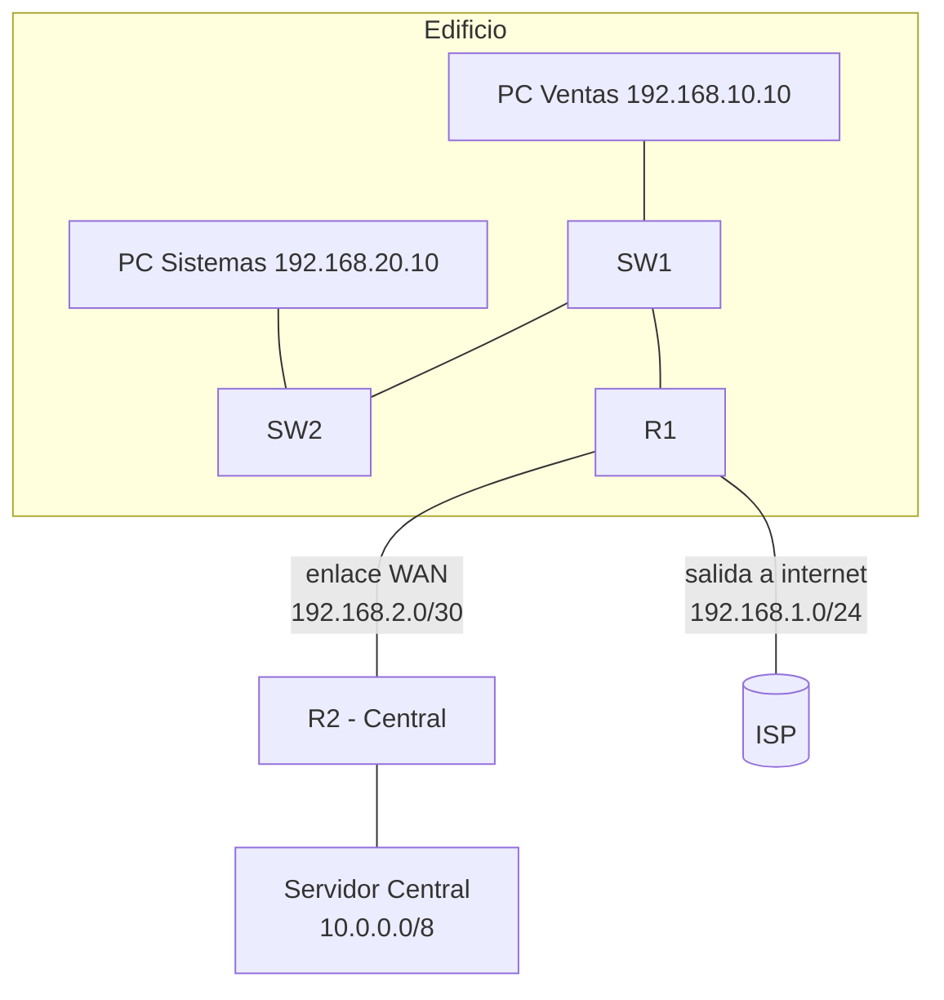

Cuarta parte de la serie. La red del edificio ya **enruta entre VLANs**
([ejercicio del Módulo 3](../03-network-configuration/exercise)). Ahora la
conectas con el exterior: añades un router de la central (R2) y un ISP, y
configuras rutas estáticas para que cualquiera de las dos redes llegue a la otra
y el edificio tenga salida a internet.



## Requisitos

- Red funcional del [ejercicio anterior](../03-network-configuration/exercise):
  VLANs 10/20/99, trunks y router-on-a-stick con R1.
- **R2**, router de la central, con la base del
  [Módulo 2](../02-device-management/exercise) (hostname, secret, SSH).

## Objetivos

1. Conectar R1 y R2 por un enlace punto a punto.
2. Configurar rutas estáticas en ambas direcciones (edificio ↔ central).
3. Añadir la **ruta por defecto** en R1 para la salida al ISP.
4. Verificar la conectividad de extremo a extremo.

## Pasos

### 1. Enlace punto a punto R1-R2

Configura el enlace serial entre ambos routers:

```ios
R1(config)# interface Serial0/0/0
R1(config-if)# ip address 192.168.2.1 255.255.255.252
R1(config-if)# no shutdown

R2(config)# interface Serial0/0/0
R2(config-if)# ip address 192.168.2.2 255.255.255.252
R2(config-if)# no shutdown
```

> Subred `/30`: solo R1 (`.1`) y R2 (`.2`). R2 conoce su red de la central por
> una interfaz conectada, por ejemplo la red `10.0.0.0/8`.

### 2. Rutas estáticas en R1 hacia la central

```ios
R1(config)# ip route 10.0.0.0 255.0.0.0 192.168.2.2
```

R2 necesita volver al edificio. Configura rutas estáticas hacia las tres VLANs
por el salto `192.168.2.1`:

```ios
R2(config)# ip route 192.168.10.0 255.255.255.0 192.168.2.1
R2(config)# ip route 192.168.20.0 255.255.255.0 192.168.2.1
R2(config)# ip route 192.168.99.0 255.255.255.0 192.168.2.1
```

### 3. Ruta por defecto en R1 (salida a internet)

R1 no puede tener una ruta por cada red de internet: usa la **ruta por defecto**
hacia el ISP.

```ios
R1(config)# ip route 0.0.0.0 0.0.0.0 192.168.1.254
```

> El enlace hacia el ISP `192.168.1.0/24` se levanta como interfaz conectada
> (por ejemplo `Serial0/0/1` con `192.168.1.1`). La salida completa a internet
> se retoma en el [Módulo 7](../07-ip-services/) con NAT y conexión al ISP.

### 4. (Opcional) Ruta flotante de respaldo

Si hubiera un segundo enlace a la central, la ruta de respaldo llevaría una
**distancia administrativa mayor** y solo se activaría al caer la principal:

```ios
R1(config)# ip route 10.0.0.0 255.0.0.0 192.168.3.2 150
```

## Verificación

### Tablas de enrutamiento

```ios
R1# show ip route static
S    10.0.0.0/8 [1/0] via 192.168.2.2
S*   0.0.0.0/0 [1/0] via 192.168.1.254

R2# show ip route static
S    192.168.10.0/24 [1/0] via 192.168.2.1
S    192.168.20.0/24 [1/0] via 192.168.2.1
S    192.168.99.0/24 [1/0] via 192.168.2.1
```

### De extremo a extremo

```bash
PC-Ventas# ping 10.1.1.5                # servidor de la central (R2)
PC-Ventas# ping 192.168.2.2             # salto WAN de R1
R2# ping 192.168.10.10                  # hacia la PC de Ventas
R1# ping 192.168.1.254                  # hacia el ISP
```

Si falla, revisa en orden: las IPs del enlace WAN, la ruta estática de cada
router hacia la red del otro y que las subredes destino estén en el rango de la
ruta configurada.

## Comprobación final

| Pregunta                         | Respuesta esperada                             |
| :------------------------------- | :--------------------------------------------- |
| ¿PC Ventas llega a la central?   | Sí, por la ruta `S` hacia `10.0.0.0/8`         |
| ¿La central llega al edificio?   | Sí, por las tres rutas `S` hacia `192.168.x.0` |
| ¿R1 sale a internet?             | Sí, por la ruta por defecto `S* 0.0.0.0/0`     |
| ¿Cuándo se usa la ruta flotante? | Solo si cae la ruta primaria (AD mayor, 150)   |

## Resumen

- Las **rutas estáticas** conectaron el edificio con la central en ambas
  direcciones.
- La **ruta por defecto** (`0.0.0.0/0`) da salida a internet en R1.
- En redes con demasiadas rutas, un **protocolo dinámico** (OSPF, EIGRP, RIP)
  las aprende solo: se cubre en los temas del
  [Módulo 4](../04-routing-protocols/).
- Guarda la configuración de todos los equipos:
  `copy running-config startup-config`.

En el [Módulo 5](../05-redundancy-security/) harás esta misma red **redundante
y segura**: STP, EtherChannel, HSRP y seguridad de capa 2.
