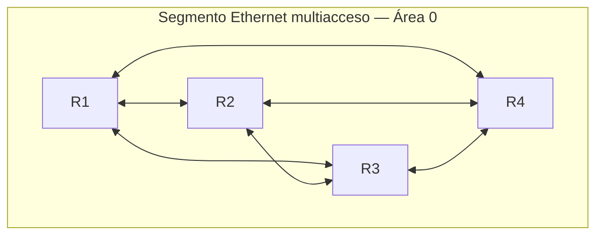
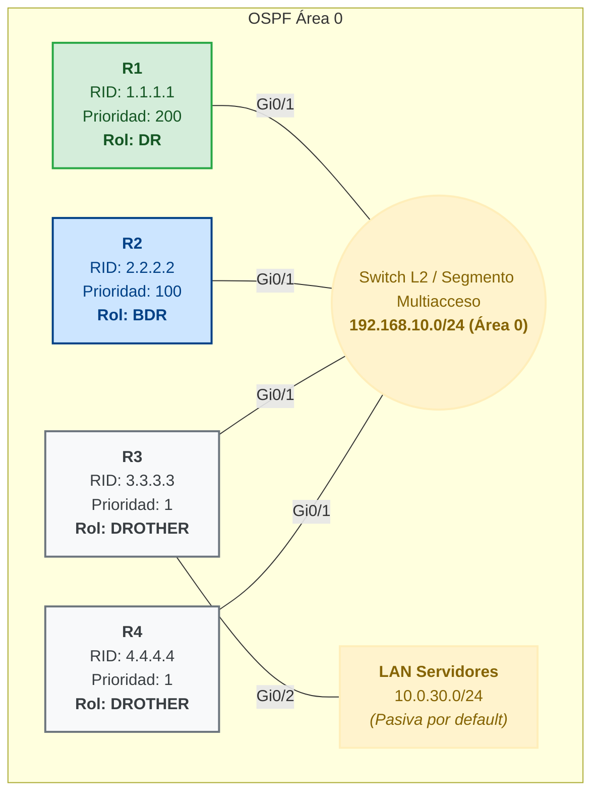

En una red pequeña las [rutas estáticas](./static-default-routes) alcanzan:
escribirlas a mano y listo. Pero cuando los routers crecen o la topología
cambia, mantenerlas a mano es un error a la espera de ocurrir. Los **protocolos
de enrutamiento dinámico** se encargan solos: los routers intercambian
información entre sí y calculan las rutas. Este documento cubre **OSPF**, el
protocolo estándar con más detalle; EIGRP y RIP están en [EIGRP y RIP](./eigrp-rip).

## Fundamentos: LSA y LSDB

**OSPF** (Open Shortest Path First) es de **estado de enlace** para IPv4 (OSPFv2): Al router se le permite construir un mapa completo de la topología y calcula la mejor ruta con el algoritmo **SPF** (Dijkstra), permitiendole escalar mejor.

- **LSA (Link-State Advertisement):** el mensaje que un router envía a sus vecinos para anunciar el estado de sus propios enlaces.
- **LSDB (Link-State Database):** la base de datos donde cada router guarda todas las LSA que generó él mismo y las que recibió de los demás.

Cada router OSPF mantiene tres tablas distintas que reflejan tres fases del proceso — conocer a los vecinos, conocer la topología completa y decidir por dónde reenviar:

| Base de datos           | Qué almacena                                      | Comando                 |
| :---------------------- | :------------------------------------------------ | :---------------------- |
| **Adjacency Database**  | Estado de cada vecino (ID, prioridad, estado, IP) | `show ip ospf neighbor` |
| **Link-State Database** | Todas las LSA recibidas del área (topología)      | `show ip ospf database` |
| **Forwarding Database** | Mejores rutas calculadas por SPF (tabla de rutas) | `show ip route ospf`    |

La primera se llena con los hello packets; la segunda, con el intercambio de LSA hasta llegar a `Full`; la tercera es el resultado del algoritmo SPF sobre la segunda. Si la LSDB de un router no está sincronizada (por ejemplo, dos vecinos stuck en `ExStart/Exchange`), la tabla de reenvío no puede calcular rutas correctas hacia esa zona.

## Área única

Toda red OSPF empieza aquí: un solo área, la **0** (el backbone). Tenemos 4 routers (R1 a R4) conectados al mismo switch, para que si uno falla los demás sigan dando salida — sin punto único de falla.



### Cómo se sincronizan los vecinos

Un **vecino** es cualquier router con el que intercambias **hello packets** (multicast `224.0.0.5`) por un enlace directo. Pero verse no es lo mismo que estar sincronizado — eso pasa por una serie de estados:

**Down → Init → 2-Way → ExStart → Exchange → Loading → Full**

- Down es "no sé que existe"
- 2-Way es "nos vemos mutuamente"
- solo en Full las LSDB de ambos routers quedan idénticas.

El paso de un estado al siguiente lo impulsan cinco tipos de paquetes OSPF — cada uno tiene una función concreta en el proceso de descubrimiento y sincronización:

| Paquete   | Función                                                                                                                                              | Estado asociado  |
| :-------- | :--------------------------------------------------------------------------------------------------------------------------------------------------- | :--------------- |
| **Hello** | Establece y mantiene la adyacencia: descubre vecinos, verifica que siguen activos y negocia parámetros (Hello/Dead intervals, área, etc.).           | Init → 2-Way     |
| **DBD**   | Database Description: contiene una **lista abreviada del LSDB** del router emisor — solo cabeceras de las LSA que posee, no el contenido completo.   | ExStart/Exchange |
| **LSR**   | Link-State Request: el router lo usa para **solicitar más información** — pide las LSA completas que identificó como faltantes en el DBD del vecino. | Exchange/Loading |
| **LSU**   | Link-State Update: **anuncia nueva información** — lleva las LSA completas pedidas por el vecino o generadas por un cambio local en la topología.    | Loading          |
| **LSack** | Link-State Acknowledgment: **confirma la recepción** de un LSU; sin esta confirmación, el emisor reenvía el LSU.                                     | Loading → Full   |

Así, de 2-Way a Full el proceso es: primero intercambian DBD para comparar qué LSAs tiene cada uno; luego intercambian LSR/LSU/LSack para completar las que faltan; al terminar ambas LSDB son idénticas y el estado llega a Full.

Aquí es donde el segmento multiacceso complica las cosas: si los 4 routers sincronizaran Full entre todos, serían $n(n-1)/2 = 6$ adyacencias, cada una duplicando tráfico de sincronización. OSPF lo resuelve eligiendo dos referencias por segmento:

| Rol         | Qué hace                                                                                |
| :---------- | :-------------------------------------------------------------------------------------- |
| **DR**      | Designated Router: centraliza la sincronización del segmento                            |
| **BDR**     | Backup DR: espera en caliente, asume al instante si el DR falla                         |
| **DROTHER** | El resto: solo llega a Full con el DR y el BDR, con los demás DROTHER se queda en 2-Way |

Con DR/BDR las adyacencias bajan de $n(n-1)/2$ a $2n-3$ — en este segmento, de 6 a 5.

La elección sigue este orden:

1. **Mayor prioridad** gana (`ip ospf priority`, por defecto 1). Prioridad **0** saca al puerto de la elección: nunca será DR ni BDR.
2. Si empatan, gana el **Router ID más alto**.
3. El segundo mejor puntaje queda como BDR.

Y dos detalles que suelen generar confusión: la elección **no es preventiva** — un router con mejor prioridad que llega después no le quita el puesto al DR activo, solo puede aspirar la próxima vez que quede vacante — y si el DR cae, el BDR asume de inmediato y recién ahí se elige un BDR nuevo.

```ios
R1(config)# interface GigabitEthernet0/1
R1(config-if)# ip ospf priority 200
```

### La métrica: coste

OSPF usa el **coste** de cada enlace, inversamente proporcional a su ancho de banda:

$$
\text{coste} = \frac{\text{banda de referencia}}{\text{ancho de banda del enlace}}
$$

Con la banda de referencia por defecto de **100 Mbps**:

| Enlace   | Banda      | Coste |
| :------- | :--------- | :---- |
| 10 Mbps  | 10.000     | 100   |
| 100 Mbps | 100.000    | 10    |
| 1 Gbps   | 1.000.000  | 1     |
| 10 Gbps  | 10.000.000 | 1     |

La ruta más corta es la de **menor coste acumulado**. Con enlaces de 1 Gbps o más, varios terminan con coste 1 y OSPF deja de distinguirlos — por eso, al tener fibra o enlaces de 10 Gbps, conviene subir la banda de referencia:

```ios
R1(config-router)# auto-cost reference-bandwidth 10000
```

### Router ID

El **Router ID** es el identificador único de cada router dentro del proceso
OSPF: se escribe con formato de IP (`1.1.1.1`) aunque no tiene por qué ser una
dirección asignada a ninguna interfaz. Lo usan los vecinos para reconocerlo y
sirve de desempate en elecciones de DR/BDR.

Si no se fija a mano, se determina automáticamente en este orden:

1. La dirección del comando **`router-id`** (si está configurada).
2. La **IP más alta** entre las interfaces **loopback**.
3. La **IP más alta** de las **interfaces físicas activas**.

**Qué pasa si no hay ninguna opción:** para arrancar, el proceso OSPF necesita
de dónde sacar un RID — si al iniciarlo no existe ninguna interfaz activa con
IP (y tampoco `router-id` configurado), el proceso **no puede levantarse**
hasta que exista una fuente válida o se fije el RID a mano.

Una vez elegido, el RID **no cambia solo** — ni agregando loopbacks ni subiendo IPs. Para aplicar uno nuevo hay que reiniciar el proceso:

```ios
R1(config-router)# router-id 1.1.1.1
R1# clear ip ospf process
```

Dejarlo al azar es un problema clásico: si el RID salió de una IP física y esa interfaz cae, el siguiente reinicio del proceso puede elegir otro RID y forzar una nueva elección de DR/BDR sin que nadie tocara nada. Por eso se fija explícitamente en los cuatro routers.

### Configuración

Los 4 routers comparten la LAN `192.168.10.0/24` por `GigabitEthernet0/1`. R3 además tiene una LAN de servidores detrás (`10.0.30.0/24`) que también va a anunciar por OSPF.



En **R1** (va a ganar como DR, prioridad más alta):

```ios
R1(config)# router ospf 1
R1(config-router)# router-id 1.1.1.1
R1(config-router)# passive-interface default
R1(config-router)# no passive-interface GigabitEthernet0/1
R1(config-router)# exit
R1(config)# interface GigabitEthernet0/1
R1(config-if)# ip ospf 1 area 0
R1(config-if)# ip ospf priority 200
```

En **R2** (va a ganar como BDR):

```ios
R2(config)# router ospf 1
R2(config-router)# router-id 2.2.2.2
R2(config-router)# passive-interface default
R2(config-router)# no passive-interface GigabitEthernet0/1
R2(config-router)# exit
R2(config)# interface GigabitEthernet0/1
R2(config-if)# ip ospf 1 area 0
R2(config-if)# ip ospf priority 100
```

En **R3** y **R4** (quedan como DROTHER, prioridad por defecto: no hace falta tocarla). R3 además habilita OSPF en su LAN de servidores:

```ios
R3(config)# router ospf 1
R3(config-router)# router-id 3.3.3.3
R3(config-router)# passive-interface default
R3(config-router)# no passive-interface GigabitEthernet0/1
R3(config-router)# exit
R3(config)# interface GigabitEthernet0/1
R3(config-if)# ip ospf 1 area 0
R3(config)# interface GigabitEthernet0/2
R3(config-if)# ip ospf 1 area 0
```

```ios
R4(config)# router ospf 1
R4(config-router)# router-id 4.4.4.4
R4(config-router)# passive-interface default
R4(config-router)# no passive-interface GigabitEthernet0/1
R4(config-router)# exit
R4(config)# interface GigabitEthernet0/1
R4(config-if)# ip ospf 1 area 0
```

`passive-interface default` desactiva los hellos en todas las interfaces — para no mandarlos hacia una LAN de usuarios sin otro router— y `no passive-interface` los reactiva solo donde sí hace falta adyacencia.

Verificando desde R1:

```ios
R1# show ip ospf neighbor
Neighbor ID   Pri   State          Dead Time   Address        Interface
2.2.2.2       100   FULL/BDR       00:00:32    192.168.10.2   GigabitEthernet0/1
3.3.3.3         1   2WAY/DROTHER   00:00:38    192.168.10.3   GigabitEthernet0/1
4.4.4.4         1   2WAY/DROTHER   00:00:35    192.168.10.4   GigabitEthernet0/1

R1# show ip route ospf
O    10.0.30.0/24 [110/11] via 192.168.10.3, 00:03:12, GigabitEthernet0/1
```

R1 llega a `FULL` con el BDR y se queda en `2WAY` con los DROTHER — el comportamiento esperado, no un fallo. `O` marca la ruta hacia la LAN de servidores de R3 como aprendida por OSPF, con AD 110.

## Preguntas tipo CCNA

1. **¿Qué algoritmo usa OSPF y de qué tipo de protocolo es?** El algoritmo **SPF (Dijkstra)**; es un protocolo **de estado de enlace**.

2. **¿Cómo se determina el Router ID?** En orden: el comando **`router-id`**, si no la **loopback** con IP más alta, y si tampoco, la **interfaz física activa** con IP más alta. Sin ninguna fuente, el proceso OSPF ni siquiera inicia.

3. **¿Quién gana la elección de DR, y qué pasa con los DROTHER entre sí?** Gana la **mayor prioridad** (desempata el RID más alto). Los DROTHER llegan a **Full** con el DR y el BDR, pero se quedan en **2-Way** entre ellos — no es un fallo, es el diseño.

4. **¿Qué pasa cuando cae el DR?** El **BDR asume al instante** y recién ahí se elige un BDR nuevo. No hay _preemption_: un router con mejor prioridad que llegue después no toma el rol hasta la próxima elección.

5. **¿Cuáles son las tres bases de datos OSPF y qué comando las muestra?** La **Adjacency Database** (vecinos, `show ip ospf neighbor`), la **Link-State Database** (topología completa, `show ip ospf database`) y la **Forwarding Database** (rutas calculadas, `show ip route ospf`).

## Resumen

- **OSPF** (estado de enlace): topología completa en la **LSDB** (armada con **LSAs**) y rutas calculadas con **SPF/Dijkstra**.
- Cada router mantiene tres bases de datos: la **Adjacency Database** (`show ip ospf neighbor`), la **Link-State Database** (`show ip ospf database`) y la **Forwarding Database** (`show ip route ospf`).
- **Área única**: ya hace falta resolver coste, Router ID y — en segmentos multiacceso — la elección de **DR/BDR**, que reduce las adyacencias de $n(n-1)/2$ a $2n-3$.
- Los diseños avanzados — **full-mesh punto a punto** (sin DR/BDR, sin switches) y **multi-área con ABR** — están en [OSPF avanzado](../06-routing-redundancy/ospf-advanced).
