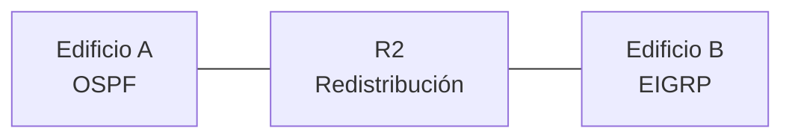

Un protocolo de enrutamiento **no comparte sus rutas con otro** por defecto: lo
que OSPF aprende queda en OSPF y lo que aprende EIGRP queda en EIGRP. Cuando
una misma red usa protocolos distintos en tramos diferentes, hace falta un
puente entre ambos: la **redistribución**.

## El problema: dominios que no se ven

Dos edificios conectados por un router de enlace. El tramo izquierdo corre
**OSPF**, el derecho corre **EIGRP**:



Cada dominio converge por separado: R2 habla OSPF con el edificio A y EIGRP con
el B. Pero las rutas no cruzan solas — sin redistribución, R2 sabe llegar a
cada dominio **pero nadie del dominio A sabe llegar a B** y viceversa. El
router que corre ambos protocolos y traduce rutas entre ellos es el **punto de
redistribución**.

## Rutas internas vs. externas

Al redistribuir, las rutas cambian de código y de distancia administrativa:

| Protocolo | Ruta interna                | Ruta redistribuida | AD                       |
| :-------- | :-------------------------- | :----------------- | :----------------------- |
| OSPF      | `O` (coste, SPF)            | `O E2` u `O E1`    | 110                      |
| EIGRP     | `D` (métrica compuesta, DUAL) | `D EX`           | 90 (interna) / **170** (externa) |

- **`O E2`** (external type 2): la **métrica es constante** — la que se fija al
  redistribuir (por defecto 20) — y no suma el coste interno hasta el punto de
  redistribución. Es la que se obtiene por defecto.
- **`O E1`** (type 1): suma a la métrica externa el coste del camino interno;
  es mejor cuando el punto de redistribución queda lejos de la red origen.
- **`D EX`** (external): la AD salta de 90 a **170**. Por eso una ruta
  redistribuida en EIGRP pierde confiabilidad frente a las internas — a los
  vecinos EIGRP les importa más su dominio interno que las foráneas.

## El problema de la métrica

Cada protocolo mide las rutas con su propia métrica, y al cruzar hay que
**inventarle una semilla** (_seed metric_) a la ruta entrante:

- **A OSPF** se le puede dejar la métrica por defecto o fijar un coste.
- **A EIGRP hay que darle sí o sí** banda, retardo, confiabilidad, carga y MTU:
  no tiene default razonable porque esas magnitudes _no existen_ en OSPF.

### Redistribuir hacia OSPF

```ios
R2(config)# router ospf 1
R2(config-router)# redistribute eigrp 100 subnets
```

- `subnets` es **imprescindible**: sin él, OSPF solo redistribuye las redes de
  **clase mayor** (`10.0.0.0/8`) y deja afuera las subredes (`10.0.10.0/24`).
- Sin `metric`, las rutas entran como `O E2` con métrica **20** por defecto.
  Se puede fijar otra: `redistribute eigrp 100 subnets metric 100` o convertirlas
  en `O E1` con `metric-type type-1`.

### Redistribuir hacia EIGRP

```ios
R2(config)# router eigrp 100
R2(config-router)# redistribute ospf 1 metric 10000 100 255 1 1500
```

Los cinco valores de la métrica compuesta, en orden:

| Valor  | Significado                               | Ejemplo |
| :----- | :---------------------------------------- | :------ |
| Banda  | Kbps del enlace semilla                   | 10000   |
| Retardo| En decenas de microsegundos (×10 µs)      | 100     |
| Confiabilidad | 0-255                              | 255     |
| Carga  | 0-255                                     | 1       |
| MTU    | Bytes del enlace semilla                  | 1500    |

## Configuración completa del punto de redistribución

```ios
R2(config)# router ospf 1
R2(config-router)# router-id 2.2.2.2
R2(config-router)# redistribute eigrp 100 subnets
R2(config-router)# exit

R2(config)# router eigrp 100
R2(config-router)# no auto-summary
R2(config-router)# redistribute ospf 1 metric 10000 100 255 1 1500
R2(config-router)# network 192.168.3.0 0.0.0.3
```

> El ejemplo completo de la topología con dos edificios, OSPF y EIGRP, está en
> el [Ejercicio: Routing entre Redes](./exercise).

## Bucles de redistribución

Redistribuir **en los dos sentidos en un solo router** es seguro. El problema
aparece cuando **dos routers se redistribuyen mutuamente**: una ruta puede
saltar OSPF→EIGRP→OSPF y volver como si fuera nueva, generando un bucle. Se
previene:

- **Filtrando** qué rutas entran y salen con un `route-map` (es el método
  clásico) o `distribute-list`.
- **Etiquetando** las rutas con un `tag` para que el otro sentido no las vuelva
  a redistribuir sobre el mismo protocolo de origen.

Para CCNA alcanza con entender el riesgo: la redistribución **mutua entre dos
routers** requiere filtrado; con un solo punto de redistribución, no.

## Verificación

```ios
R2# show ip protocols          # R2 aparece corriendo OSPF y EIGRP a la vez

R1# show ip route ospf
O E2    10.0.10.0/24 [110/20] via 192.168.2.2, 00:01:00, Serial0/0/0

R4# show ip route eigrp
D EX    192.168.10.0/24 [170/2300416] via 192.168.4.1, 00:01:00, Serial0/0/0

R2# debug ip routing           # muestra cuando entra/sale una ruta externa
```

- `O E2` y `D EX` confirman que las rutas **cruzaron** de protocolo.
- `show ip protocols` es la prueba de que el router corre los **dos procesos** —
  el requisito para redistribuir.

## Preguntas tipo CCNA

1. **¿Qué es la redistribución?** Tomar rutas aprendidas por un protocolo e
   insertarlas en la tabla de otro, en un router que corre ambos.

2. **¿Qué cambia al redistribuir?** El **código** de la ruta (`O E2`, `D EX`) y
   la **distancia administrativa** (EIGRP externa pasa de 90 a **170**).

3. **¿Por qué `redistribute eigrp 100 subnets`?** Porque sin `subnets`, OSPF
   solo redistribuye las redes de **clase mayor** y se pierden las subredes.

4. **¿Por qué EIGRP obliga a declarar la métrica al redistribuir?** Porque los
   componentes de su métrica (banda, retardo, confiabilidad, carga, MTU) no
   tienen equivalente en OSPF; hay que fijarlos con `redistribute ospf 1 metric
   <banda> <retardo> <confiabilidad> <carga> <mtu>`.

5. **¿Cuándo hay riesgo de bucle?** Cuando **dos routers se redistribuyen entre
   sí** ambos sentidos; se evita filtrando rutas con `route-map` o tagging.

## Resumen

- Los protocolos **no comparten rutas** por defecto: la **redistribución** las
  traduce en un router que corre ambos procesos.
- Las rutas redistribuidas cambian de código y AD: `O E2` (métrica fija) o
  `O E1` (acumula coste) en OSPF; `D EX` con AD **170** en EIGRP.
- **OSPF** acepta la ruta sin métrica (`subnets` para subredes); **EIGRP** exige
  los cinco valores de su métrica compuesta.
- Un **solo punto de redistribución** basta para conectarlos; dos routers que se
  redistribuyen mutuamente requieren filtrado para no formar bucles.