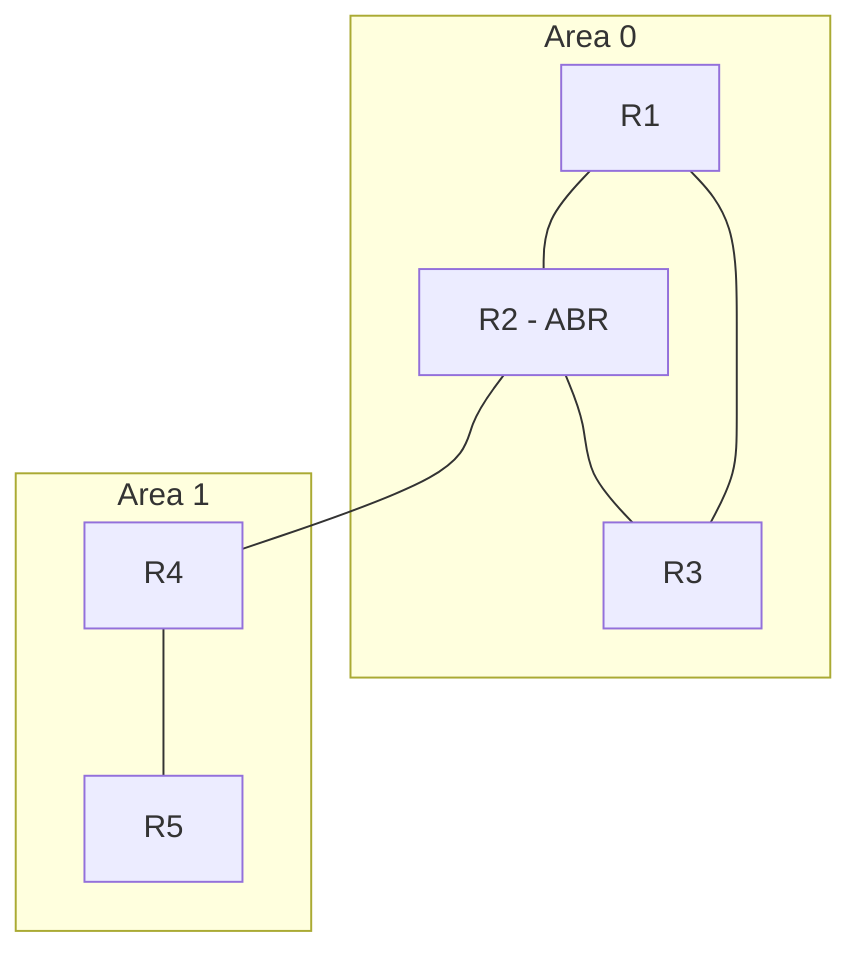

**OSPFv2** (Open Shortest Path First) es un protocolo de enrutamiento dinámico
**de estado de enlace** para IPv4. Cada router conoce la topología completa de
la red y calcula la mejor ruta con el algoritmo **SPF** (Shortest Path First, de
Dijkstra).

## Estado de enlace vs. vector de distancia

| Aspecto            | OSPF (estado de enlace)          | RIP/EIGRP (vector de distancia) |
| :----------------- | :------------------------------- | :------------------------------ |
| Conocimiento       | Topología completa (LSDB)        | Solo "hacia dónde"              |
| Cálculo            | Algoritmo SPF                    | Actualización hop a hop         |
| Convergencia       | Rápida                           | Variable                        |
| Escalabilidad      | Grandes redes (áreas)            | Redes pequeñas/medianas         |

## Áreas y el backbone

OSPF divide la red en **áreas** para escalar:

- **Área 0 (backbone)**: todas las áreas deben conectarse a ella.
- Las áreas se numeran desde 0 (el área **0.0.0.0** es el backbone).
- Los routers **ABR** (Area Border Router) conectan el backbone con otras áreas.
- Cada router solo conoce la topología de su área; los **LSAs resumidos**
  comunican el resto.


## La métrica: coste

OSPF usa el **coste** (cost) de cada enlace. Se calcula:

$$
\text{coste} = \frac{\text{banda de referencia}}{\text{ancho de banda del enlace}}
$$

Con la banda de referencia por defecto de **100 Mbps** (100.000 Kbps):

| Enlace       | Banda     | Coste |
| :----------- | :-------- | :---- |
| 10 Mbps      | 10.000    | 100   |
| 100 Mbps     | 100.000   | 10    |
| 1 Gbps       | 1.000.000 | 1     |
| 10 Gbps      | 10.000.000| 1     |

La ruta más corta = **menor coste acumulado** de la ruta al destino.

> Con enlaces ≥ 1 Gbps hay que ajustar la banda de referencia:
> `auto-cost reference-bandwidth 10000` (10 Gbps) para que todos los enlaces
> tengan un coste distinguible.

## Elección del Router ID

El **Router ID** identifica a cada router dentro de OSPF. Se elige:

1. La dirección del comando **`router-id`** (si está configurada).
2. La **IP más alta** de las **loopbacks**.
3. La **IP más alta** de las interfaces físicas activas.

Para que sea predecible, se configura explícitamente:

```ios
R1(config-router)# router-id 1.1.1.1
```
## Vecinos OSPF

OSPF forma **adyacencias** intercambiando **hello packets** (protocolo hello,
multicast 224.0.0.5):

| Parámetro                    | Por defecto |
| :--------------------------- | :---------- |
| Hello interval              | 10 s        |
| Dead interval               | 40 s (4 x hello) |
| Área y Router ID            | Deben coincidir |
| Autenticación               | Debe coincidir |
| Coste / MTU / submáscara    | Deben coincidir |

Estados de la vecindad: **Down → Init → 2-Way → ExStart → Exchange → Loading →
Full**. En el estado **Full** la adyacencia está sincronizada (LSDB idéntico).

## Configuración: área única

Se usan dos estilos: **network** (clásico, con wildcard) o **por interfaz**
(recomendado y más simple).

### Estilo por interfaz (recomendado)

```ios
R1(config-router)# router-id 1.1.1.1
R1(config-router)# network 192.168.1.0 0.0.0.255 area 0
R1(config-router)# passive-interface default
R1(config-router)# no passive-interface GigabitEthernet0/1

R1(config)# interface GigabitEthernet0/1
R1(config-if)# ip ospf 1 area 0
```
| Comando                          | Función                                  |
| :------------------------------- | :--------------------------------------- |
| `router ospf <pid>`              | Inicia el proceso OSPF (PID local)       |
| `router-id <ip>`                 | Fija el Router ID                        |
| `ip ospf <pid> area <n>`         | Habilita OSPF en una interfaz            |
| `network <red> <wildcard> area <n>` | Habilita OSPF en las redes que coincidan |
| `passive-interface default`      | No envía hellos por las LAN (solo por los enlaces entre routers) |

> Las **interfaces pasivas** anuncian su red pero **no envían hellos** (no
> forman adyacencias); evitan tráfico OSPF innecesario hacia las LAN.

## Configuración: multi-área

```ios
R2(config-router)# router-id 2.2.2.2
R2(config)# interface GigabitEthernet0/0      # hacia el backbone
R2(config-if)# ip ospf 1 area 0
R2(config)# interface GigabitEthernet0/1      # hacia el área 1
R2(config-if)# ip ospf 1 area 1
```
R2 es un **ABR**: mantiene las áreas 0 y 1, y anuncia las redes resumidas entre
ellas.

## Verificación

```ios
Neighbor ID     Pri   State           Dead Time   Address         Interface
2.2.2.2           1   FULL/DR         00:00:35    192.168.1.2     GigabitEthernet0/1

R1# show ip route ospf
     10.0.0.0/24 is subnetted, 1 subnets
O       10.0.0.0/24 [110/2] via 192.168.1.2, 00:02:14, GigabitEthernet0/1

R1# show ip ospf interface GigabitEthernet0/1
```

- `O` = ruta OSPF, `[110/2]` = AD 110 / coste 2.
- **DR/BDR**: en redes multiacceso (Ethernet), OSPF elige un Designated Router
  y un Backup DR para reducir adyacencias.

## Tipos de LSA (resumen)

| LSA | Tipo       | Anuncia                     |
| :-- | :--------- | :-------------------------- |
| 1   | Router LSA | Las redes del propio router |
| 2   | Network LSA| La red multiacceso (DR)     |
| 3   | Summary LSA| Redes de otras áreas (ABR)  |
| 4   | ASBR LSA   | Ubicación del ASBR          |
| 5   | External LSA | Rutas externas (redistribución) |

## Preguntas tipo CCNA

1. **¿Qué algoritmo usa OSPF y de qué tipo de protocolo es?**
   El algoritmo **SPF (Dijkstra)**; es un protocolo **de estado de enlace**.

2. **¿Cuál es la métrica de OSPF y cómo se calcula?**
   El **coste** = banda de referencia / ancho de banda del enlace. Menor coste =
   mejor ruta.

3. **¿Qué Router ID se prefiere?**
   El del comando **`router-id`**, luego la loopback más alta y por último la IP
   física más alta.

4. **¿Qué es un ABR y para qué sirven las áreas?**
   Un **ABR** conecta el backbone (área 0) con otras áreas; las áreas limitan la
   LSDB y aceleran la convergencia.

5. **¿Qué hace `passive-interface default`?**
   Evita enviar hellos OSPF por interfaces LAN; solo los enlaces entre routers
   (`no passive-interface`) forman adyacencias.

## Resumen

- OSPF es de **estado de enlace** y calcula rutas con **SPF**.
- Usa **áreas**; todas se conectan al **backbone (área 0)** vía ABR.
- Métrica = **coste** (banda de referencia / ancho de banda).
- Configuración: `router ospf` + `ip ospf <pid> area <n>` por interfaz.
- Se verifica con `show ip ospf neighbor` y `show ip route ospf`.