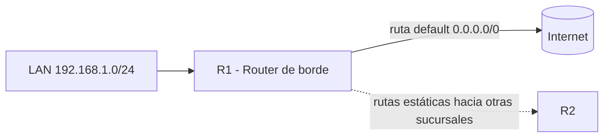

Un router decide por dónde enviar cada paquete mirando su **tabla de
enrutamiento**. Las rutas pueden ser **directas** (interfaces conectadas),
**estáticas** (configuradas a mano) o **dinámicas** (aprendidas por protocolos
como OSPF). Este tema cubre las rutas estáticas y la ruta por defecto.

## Tipos de rutas en la tabla

| Origen    | Cómo aparece  | Cómo se aprende                   |
| :-------- | :------------ | :-------------------------------- |
| Conectada | `C`           | Automáticamente (interfaz con IP) |
| Estática  | `S`           | Comando `ip route`                |
| Dinámica  | `O`, `D`, `R` | Protocolo de enrutamiento         |

```ios
R1# show ip route
Codes: L - local, C - connected, S - static, R - RIP, M - mobile, B - BGP
       D - EIGRP, EX - EIGRP external, O - OSPF, IA - OSPF inter area
       ...
Gateway of last resort is 192.168.1.2 to network 0.0.0.0

     192.168.1.0/24 is variably subnetted, 2 subnets, 2 masks
C       192.168.1.0/24 is directly connected, GigabitEthernet0/0
L       192.168.1.1/32 is directly connected, GigabitEthernet0/0
S       10.0.0.0/8 [1/0] via 192.168.1.2
S*      0.0.0.0/0 [1/0] via 192.168.1.254
```

## Rutas estáticas

Una ruta estática se configura manualmente y no cambia salvo que la modifiques.
Es útil para redes pequeñas, rutas de respaldo y hacia la salida a internet.

### Sintaxis del comando `ip route`

```ios
ip route <red-destino> <mask> {<IP-siguiente-salto> | <interfaz-de-salida>} [distancia-administrativa]
```

```ios
R1(config)# ip route 10.1.0.0 255.255.0.0 GigabitEthernet0/1
```

| Forma                      | Cuándo usarla                                                                     |
| :------------------------- | :-------------------------------------------------------------------------------- |
| **IP del siguiente salto** | Cuando la ruta va hacia otro router (normal)                                      |
| **Interfaz de salida**     | En enlaces punto a punto o para rutas sin ARP (ej. hacia el ISP en algunos casos) |
| **Siguiente salto + AD**   | **Ruta flotante** de respaldo                                                     |

### Ruta flotante (respaldo)

Una ruta estática **flotante** usa una distancia administrativa mayor que la
ruta principal. Solo aparece en la tabla si la principal desaparece.

```ios
R1(config)# ip route 10.0.0.0 255.0.0.0 192.168.2.2 150   # respaldo (AD 150)
```

## Ruta por defecto (default route)

La **ruta por defecto** (`0.0.0.0/0`) captura todo el tráfico que no coincide
con ninguna otra ruta de la tabla. Es la **gateway of last resort**.

```ios
R1(config)# ip route 0.0.0.0 0.0.0.0 192.168.1.254
```

```ios
R1# show ip route
S*   0.0.0.0/0 [1/0] via 192.168.1.254
```

> El `*` indica que es la ruta por defecto. Sin ella, el tráfico hacia redes
> desconocidas se descarta (ICMP "destination unreachable").

### Enrutamiento hacia un ISP

Es el caso típico de la ruta por defecto: el router de borde envía todo lo que
no es local hacia el proveedor.



## Rutas estáticas IPv6

Con IPv6 se usa `ipv6 route`:

```ios
R1(config)# ipv6 route 2001:db8:10::/64 2001:db8:1::2
R1(config)# ipv6 route ::/0 2001:db8:1::254
```

## Recapitulando la selección de ruta

1. El router busca la coincidencia **más específica** (prefijo más largo).
2. Si hay varias fuentes (estática vs OSPF vs conectada), gana la de menor
   **distancia administrativa** (ver [Métricas y Distancia Administrativa](./metrics-administrative-distance)).
3. Si hay varias rutas de la misma fuente, gana la de menor **métrica**.

## Preguntas tipo CCNA

1. **¿Qué comando define una ruta estática hacia 10.0.0.0/8 vía 192.168.1.2?**
   `ip route 10.0.0.0 255.0.0.0 192.168.1.2`.

2. **¿Qué es una ruta flotante y para qué sirve?**
   Una ruta estática con **distancia administrativa mayor** que la principal;
   sirve como **respaldo** y solo aparece si la principal falla.

3. **¿Qué red indica la ruta por defecto y a qué equivale?**
   `0.0.0.0/0`; equivale a "cualquier destino" (gateway of last resort).

4. **¿Cómo identificar la ruta por defecto en `show ip route`?**
   Por el código `S*` con destino `0.0.0.0/0`.

5. **¿Qué ruta gana: una estática o una conectada, y por qué?**
   La **conectada** (AD 0) gana sobre la estática (AD 1): menor distancia
   administrativa.

## Resumen

- Las rutas pueden ser **conectadas**, **estáticas** (`ip route`) o **dinámicas**.
- `ip route <red> <máscara> <siguiente-salto>` define una ruta estática.
- Una **ruta flotante** (con AD mayor) actúa de respaldo.
- La **ruta por defecto** `0.0.0.0/0` captura el tráfico sin destino conocido.
- La selección usa: **prefijo más largo** → **menor AD** → **menor métrica**.
