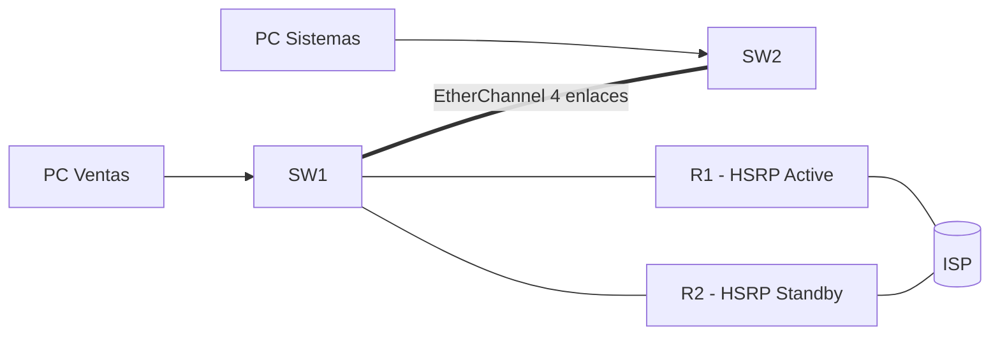

Tercera parte de la serie. La red del [ejercicio anterior](../03-network-configuration/exercise)
ya funciona; ahora la harás **redundante y segura**. Añade un segundo router de
oficina (R2) y un segundo enlace entre switches para que la red sobreviva a
fallas, y protege el acceso de capa 2 para que nadie pueda atacar desde un
puerto.



## Requisitos

- Red funcional del [ejercicio anterior](../03-network-configuration/exercise):
  VLANs 10/20/99, trunks y router-on-a-stick con R1.
- Se añade **R2**, un segundo router del edificio, conectado por trunk a SW1 y
  con su propio enlace al ISP (10.0.0.4/30, IP 10.0.0.5). Configúralo con la
  base del [Módulo 2](../02-device-management/exercise) (hostname, secret, SSH).

## Objetivos

1. Evitar bucles y acelerar la convergencia con **RSTP** (root primary/secondary
   y PortFast).
2. Aprovechar todos los enlaces SW1-SW2 con **EtherChannel (LACP)**.
3. Dar un gateway redundante a los hosts con **HSRP** (R1 y R2).
4. Asegurar la capa 2: Port Security, DHCP Snooping, DAI y IP Source Guard.
5. Verificar redundancia simulando fallas.

## Pasos

### 1. STP / RSTP

En los tres switches usa `rapid-pvst`. SW1 será la **raíz primaria** y SW2 la
**secundaria**, y los puertos de hosts usan PortFast + BPDU guard:

```ios
SW1(config)# spanning-tree mode rapid-pvst
SW1(config)# spanning-tree vlan 10,20,99 root primary

SW2(config)# spanning-tree mode rapid-pvst
SW2(config)# spanning-tree vlan 10,20,99 root secondary

SW1(config)# interface range FastEthernet0/1 - 12
SW1(config-if-range)# switchport host
```

> `switchport host` = access + PortFast + BPDU guard en un solo comando.

### 2. EtherChannel entre SW1 y SW2

Sustituye el enlace único entre SW1 y SW2 por **4 enlaces** agrupados en un
Port-channel con LACP:

```ios
SW1(config)# interface range GigabitEthernet0/1 - 4
SW1(config-if-range)# channel-group 1 mode active
SW1(config-if-range)# exit
SW1(config)# interface Port-channel 1
SW1(config-if)# switchport mode trunk
SW1(config-if)# switchport trunk native vlan 99
SW1(config-if)# switchport trunk allowed vlan 10,20,99
```

En **SW2**, lo mismo con `mode passive`. Recuerda: la config de trunk va en el
Port-channel, no en cada puerto físico.

### 3. HSRP en R1 y R2

Ambos routers comparten las IP virtuales de gateway (192.168.10.254,
192.168.20.254 y 192.168.99.254). En **R1** (Active):

```ios
R1(config)# interface GigabitEthernet0/0.10
R1(config-subif)# standby 10 ip 192.168.10.254
R1(config-subif)# standby 10 priority 150
R1(config-subif)# standby 10 preempt
R1(config-subif)# standby 10 track Serial0/0/0 30
R1(config-subif)# exit
R1(config)# interface GigabitEthernet0/0.20
R1(config-subif)# standby 20 ip 192.168.20.254
R1(config-subif)# standby 20 priority 150
R1(config-subif)# standby 20 preempt
R1(config-subif)# standby 20 track Serial0/0/0 30
R1(config-subif)# exit
```

En **R2** (Standby) repite lo mismo con prioridad 100. Las **PCs y los switches
no cambian su gateway**: siguen apuntando a las IP virtuales.

### 4. Seguridad de capa 2

En SW1 (y SW2 en sus puertos de PC):

```ios
# Port Security en los puertos de host
SW1(config)# interface range FastEthernet0/1 - 12
SW1(config-if-range)# switchport port-security
SW1(config-if-range)# switchport port-security maximum 2
SW1(config-if-range)# switchport port-security mac-address sticky
SW1(config-if-range)# switchport port-security violation restrict

# DHCP Snooping + DAI (el servidor DHCP estará en R1/R2 por el trunk)
SW1(config)# ip dhcp snooping
SW1(config)# ip dhcp snooping vlan 10,20
SW1(config)# interface GigabitEthernet0/24
SW1(config-if)# ip dhcp snooping trust
SW1(config)# interface range FastEthernet0/1 - 12
SW1(config-if-range)# ip dhcp snooping limit rate 10
SW1(config-if-range)# exit
SW1(config)# ip arp inspection vlan 10,20
SW1(config)# interface GigabitEthernet0/24
SW1(config-if)# ip arp inspection trust

# IP Source Guard en puertos de host
SW1(config)# interface range FastEthernet0/1 - 12
SW1(config-if-range)# ip verify source
```

> Marca como **trusted** solo el puerto hacia R1/R2 (trunk). El resto queda
> untrusted: no puede enviar ofertas DHCP ni ARP falsos.

## Verificación

### Redundancia

```ios
SW1# show spanning-tree vlan 10        # root: SW1
SW2# show spanning-tree vlan 10        # root: SW1 (root port hacia SW1)
SW1# show etherchannel summary         # Po1(SU), Gi0/1-4 (P)
R1# show standby                       # State Active, IP virtual .254
R2# show standby                       # State Standby
```

### Seguridad

```ios
SW1# show port-security interface FastEthernet0/1
SW1# show ip dhcp snooping binding
SW1# show ip arp inspection vlan 10
```

### Prueba de falla

1. Conecta una PC de Ventas y verifica que ping a la otra VLAN funcione.
2. Desconecta el enlace WAN de **R1**: el tráfico debe seguir saliendo por R2
   (HSRP hace el relevo en segundos).
3. Desconecta uno de los cables del EtherChannel: el tráfico sigue pasando por
   los 3 restantes sin cortarse.
4. Conecta un router doméstico con DHCP a un puerto de host: sus ofertas deben
   ser descartadas (DHCP Snooping).

## Comprobación final

| Pregunta                        | Respuesta esperada                      |
| :------------------------------ | :-------------------------------------- |
| ¿Quién es la raíz STP?          | SW1 (primary); SW2 secundario           |
| ¿Los 4 enlaces SW1-SW2 activos? | Sí, Po1 con Gi0/1-4 (P)                 |
| ¿Gateway redundante?            | HSRP: R1 Active, R2 Standby             |
| ¿Puerto con router doméstico?   | Se deshabilita/descarta (DHCP Snooping) |

## Resumen

- La red sobrevive a fallas de **enlaces** (EtherChannel), **switches** (STP)
  y **routers/gateway** (HSRP).
- La capa 2 está protegida: Port Security, DHCP Snooping, DAI e IP Source Guard.
- Guarda la configuración de todos los equipos:
  `copy running-config startup-config`.

En el [Módulo 6](../06-wireless-networks/) añadirás el acceso **inalámbrico**
(WLAN) a la misma red.
