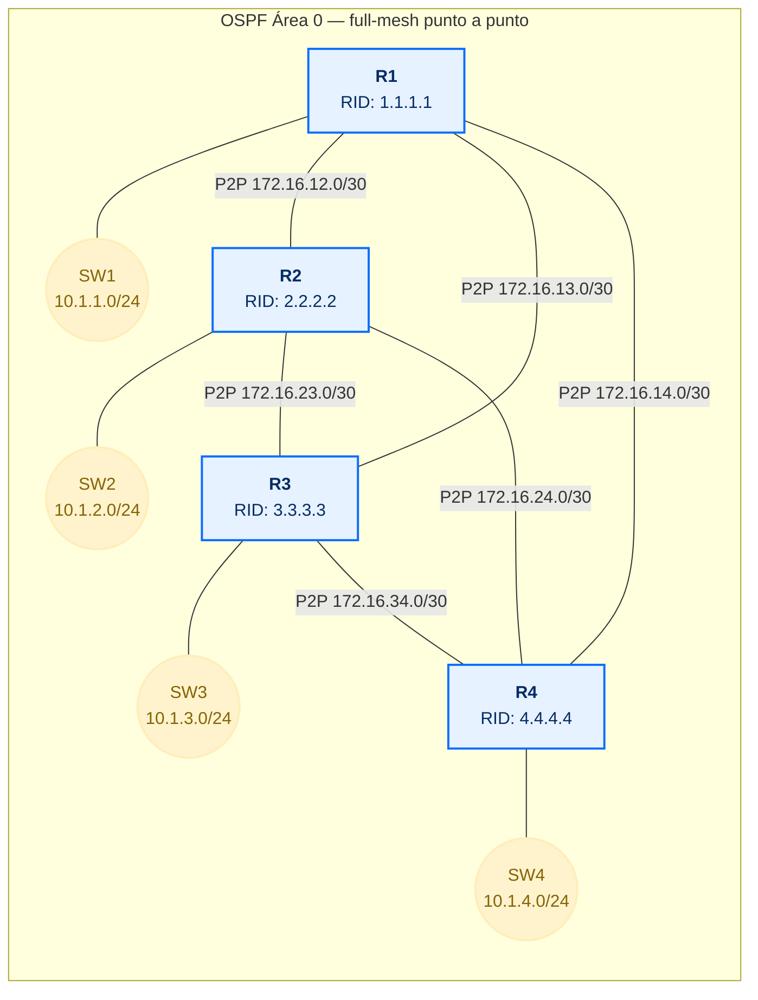
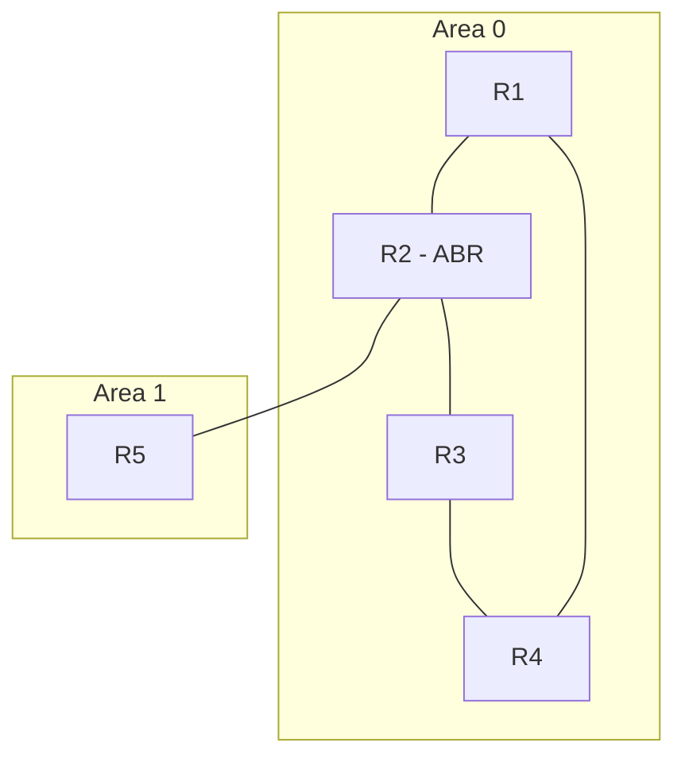
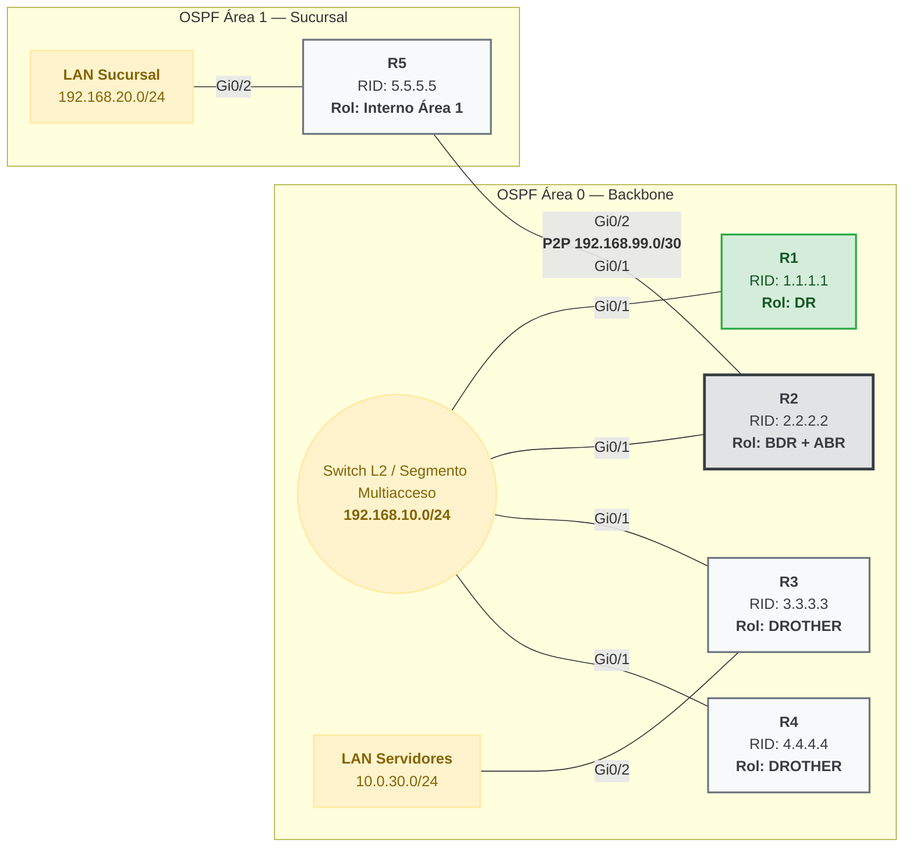

Este documento cubre los diseños que van más allá del área única descrita en
[OSPF](../04-routing-protocols/ospf): la malla completa punto a punto
(sin switch compartido, sin DR/BDR) y la separación en áreas con un ABR
resumiendo rutas.

## Diseño alternativo: full-mesh punto a punto

El switch compartido no es la única forma de conectar estos 4 routers. Una red que quiera eliminar ese switch como punto único de falla —o que simplemente vive en un entorno WAN, donde no hay un segmento Ethernet común entre sitios— puede unir cada router con los otros tres mediante enlaces **punto a punto** dedicados, y dejar la LAN de cada router detrás de su propio switch de acceso, sin mezclarla con el resto de la malla.



Con 4 routers, una malla completa son $\binom{4}{2} = 6$ enlaces — cada uno su propia subred `/30`, y cada router necesita 3 interfaces solo para la malla más una cuarta hacia su LAN. Es más cableado y más configuración que un switch compartido, pero a cambio no hay ningún elemento intermedio del que depender: si un enlace cae, solo afecta a esos dos routers, y el resto de la malla sigue intacta.

Esto también cambia la teoría: un enlace punto a punto solo puede tener **dos** extremos, así que la elección de DR/BDR no tiene nada que resolver —no hay tercer router con el que competir por sincronizar—. Por defecto, una interfaz Ethernet igual anuncia el segmento como tipo `broadcast` y OSPF elegiría un DR de todos modos (trivial, con un solo vecino), así que conviene decírselo explícitamente con `ip ospf network point-to-point`: la adyacencia pasa directo de `2-Way` a `ExStart` sin elección, y en `show ip ospf neighbor` el estado final se ve como `FULL/ -`, sin rol.

Direcciones de la malla:

| Enlace  | Subred           | Extremo A | Extremo B |
| :------ | :--------------- | :-------- | :-------- |
| R1 – R2 | `172.16.12.0/30` | R1: `.1`  | R2: `.2`  |
| R1 – R3 | `172.16.13.0/30` | R1: `.1`  | R3: `.2`  |
| R1 – R4 | `172.16.14.0/30` | R1: `.1`  | R4: `.2`  |
| R2 – R3 | `172.16.23.0/30` | R2: `.1`  | R3: `.2`  |
| R2 – R4 | `172.16.24.0/30` | R2: `.1`  | R4: `.2`  |
| R3 – R4 | `172.16.34.0/30` | R3: `.1`  | R4: `.2`  |

Configuración de **R1**, como plantilla del patrón que se repite en los otros tres (misma lógica, cambiando solo las IPs locales y el Router ID):

```ios
R1(config)# interface GigabitEthernet0/1
R1(config-if)# ip address 172.16.12.1 255.255.255.252
R1(config-if)# ip ospf network point-to-point
R1(config-if)# no shutdown
R1(config)# interface GigabitEthernet0/2
R1(config-if)# ip address 172.16.13.1 255.255.255.252
R1(config-if)# ip ospf network point-to-point
R1(config-if)# no shutdown
R1(config)# interface GigabitEthernet0/3
R1(config-if)# ip address 172.16.14.1 255.255.255.252
R1(config-if)# ip ospf network point-to-point
R1(config-if)# no shutdown
R1(config)# interface GigabitEthernet0/4
R1(config-if)# ip address 10.1.1.1 255.255.255.0
R1(config-if)# no shutdown
R1(config-if)# exit

R1(config)# router ospf 1
R1(config-router)# router-id 1.1.1.1
R1(config-router)# passive-interface default
R1(config-router)# no passive-interface GigabitEthernet0/1
R1(config-router)# no passive-interface GigabitEthernet0/2
R1(config-router)# no passive-interface GigabitEthernet0/3
R1(config-router)# network 172.16.12.0 0.0.0.3 area 0
R1(config-router)# network 172.16.13.0 0.0.0.3 area 0
R1(config-router)# network 172.16.14.0 0.0.0.3 area 0
R1(config-router)# network 10.1.1.0 0.0.0.255 area 0
```

R2, R3 y R4 llevan exactamente el mismo bloque, tomando sus IPs de la tabla de arriba y su propio Router ID (`2.2.2.2`, `3.3.3.3`, `4.4.4.4`) — cada uno con tres interfaces `point-to-point` activas hacia los otros tres routers, y la cuarta interfaz, hacia su LAN, quedando pasiva.

Verificando desde R1:

```ios
R1# show ip ospf neighbor
Neighbor ID   Pri   State    Dead Time   Address        Interface
2.2.2.2         1   FULL/ -  00:00:38    172.16.12.2    GigabitEthernet0/1
3.3.3.3         1   FULL/ -  00:00:35    172.16.13.2    GigabitEthernet0/2
4.4.4.4         1   FULL/ -  00:00:39    172.16.14.2    GigabitEthernet0/3
```

Los tres vecinos llegan a `FULL` directo, sin que ninguno pase por `2-Way` como estado final — porque en cada enlace solo hay dos extremos, no hace falta decidir quién centraliza nada. La diferencia frente al diseño con switch no es solo estética: aquí las 6 adyacencias corresponden a 6 enlaces físicos reales, así que no hay nada que optimizar — el ahorro de DR/BDR solo tiene sentido cuando varios routers comparten **un mismo** medio.

## Multi-área

El núcleo ya funciona, pero la empresa abre una sucursal con su propio router (R5) y su propia LAN (`192.168.20.0/24`). La opción fácil sería meter a R5 también en el área 0 — pero eso significa que la LSDB completa del núcleo crece con cada cambio de la sucursal, y un enlace inestable ahí fuerza un recálculo de SPF en los 4 routers del core, aunque no tenga nada que ver con ellos.

La solución es crear un área nueva para la sucursal — el **área 1** — y usar a **R2** (que ya está en el segmento del core) como puente entre ambas: agrega una segunda interfaz punto a punto hacia R5.



### Áreas, backbone y ABR

El **área 0**, también llamada **backbone**, es la única área que puede existir sola y a la que todas las demás deben conectarse — directa o indirectamente. El área 1 (la sucursal) solo conoce el detalle de sus propios enlaces; todo lo que hay en el área 0 le llega como rutas ya resumidas.

R2 pasa a ser el **ABR** (Area Border Router) porque queda con una pata en cada área: una hacia el segmento del core (área 0), otra hacia R5 (área 1). Ese es justamente el trabajo del ABR — mantener la LSDB completa de ambas áreas donde participa, y traducir entre ellas resumiendo lo que una necesita saber de la otra sin exponer el detalle completo de cada enlace. Si más adelante se abriera una segunda sucursal (área 2), tendría que llegar a la red también a través de un ABR conectado al área 0 — nunca directamente entre área 1 y área 2, porque el backbone es el único tránsito permitido entre áreas.

Ese resumen entre áreas se anuncia con un tipo específico de LSA:

| LSA | Tipo         | Anuncia                                 |
| :-- | :----------- | :-------------------------------------- |
| 1   | Router LSA   | Las redes del propio router             |
| 2   | Network LSA  | La red multiacceso (la anuncia el DR)   |
| 3   | Summary LSA  | Redes de otras áreas — la genera el ABR |
| 4   | ASBR LSA     | Ubicación del ASBR                      |
| 5   | External LSA | Rutas externas (redistribución)         |

Es exactamente la LSA tipo 3 la que va a hacer que la LAN de la sucursal aparezca en la tabla de R1, sin que R1 sepa nada del detalle interno del área 1.

### Configuración

En **R2**, se agrega la interfaz hacia R5 (enlace punto a punto `192.168.99.0/30`) dentro del área 1:



```ios
R2(config)# interface GigabitEthernet0/2
R2(config-if)# ip address 192.168.99.1 255.255.255.252
R2(config-if)# ip ospf network point-to-point
R2(config-if)# no shutdown
R2(config-if)# exit
R2(config)# router ospf 1
R2(config-router)# no passive-interface GigabitEthernet0/2
R2(config-router)# exit
R2(config)# interface GigabitEthernet0/2
R2(config-if)# ip ospf 1 area 1
```

En **R5**, la interfaz hacia R2 y la LAN de la sucursal quedan las dos en área 1:

```ios
R5(config)# interface GigabitEthernet0/1
R5(config-if)# ip address 192.168.99.2 255.255.255.252
R5(config-if)# ip ospf network point-to-point
R5(config-if)# no shutdown
R5(config)# interface GigabitEthernet0/2
R5(config-if)# ip address 192.168.20.1 255.255.255.0
R5(config-if)# no shutdown
R5(config-if)# exit
R5(config)# router ospf 1
R5(config-router)# router-id 5.5.5.5
R5(config-router)# passive-interface default
R5(config-router)# no passive-interface GigabitEthernet0/1
R5(config-router)# exit
R5(config)# interface GigabitEthernet0/1
R5(config-if)# ip ospf 1 area 1
R5(config)# interface GigabitEthernet0/2
R5(config-if)# ip ospf 1 area 1
```

Es el mismo comando que vimos en el diseño full-mesh de la sección anterior: como este enlace también une solo dos routers, no tiene sentido dejar que OSPF trate de elegir un DR ahí.

Verificando desde R2 — el enlace a R5 es punto a punto, así que no hay elección de DR/BDR:

```ios
R2# show ip ospf neighbor
Neighbor ID   Pri   State    Dead Time   Address        Interface
5.5.5.5         1   FULL/ -  00:00:38    192.168.99.2   GigabitEthernet0/2
```

Y desde R1, en el otro extremo del core, la LAN de la sucursal ya aparece en la tabla — pero marcada distinto de la ruta a R3 que vimos antes:

```ios
R1# show ip route ospf
O     10.0.30.0/24  [110/11] via 192.168.10.3, 00:03:12, GigabitEthernet0/1
O IA  192.168.20.0/24 [110/22] via 192.168.10.2, 00:01:15, GigabitEthernet0/1
```

`O IA` (_inter-area_) marca que esa ruta no se calculó con el detalle completo del enlace, como la de R3 — llegó resumida vía la LSA tipo 3 que generó R2 como ABR. Es la confirmación de que la separación en áreas está funcionando: R1 sabe llegar a la sucursal sin haber visto un solo detalle de su topología interna.

## Preguntas tipo CCNA

1. **¿Qué es un ABR y para qué sirven las áreas?** Un **ABR** tiene interfaces en dos o más áreas y resume entre ellas con LSA tipo 3; las áreas limitan el tamaño de la LSDB y evitan que un cambio remoto fuerza un recálculo de SPF en toda la red.

2. **¿Cómo se distingue en `show ip route` una ruta dentro del área de una que vino de otra área?** Con el código `O IA` (_inter-area_), a diferencia del `O` simple de una ruta calculada con el detalle completo dentro de la misma área.

3. **¿Por qué un enlace punto a punto no necesita DR/BDR?** Porque solo puede tener dos extremos — no hay un tercer router con el que competir por sincronizar. Con `ip ospf network point-to-point` la adyacencia pasa directo a `FULL/ -`, sin elección.

## Resumen

- En un diseño **full-mesh punto a punto** cada enlace une solo dos routers, la elección de DR/BDR se omite (`ip ospf network point-to-point`) y las adyacencias llegan a `FULL/ -` sin pasar por `2-Way`.
- **Multi-área** activa cuando un área única empieza a cargar cambios remotos innecesarios: el **ABR** resume con LSA tipo 3, y las rutas resumidas se identifican como `O IA` en la tabla.
- El **área 0** (backbone) es el tránsito obligatorio entre áreas — nunca hay conexión directa área-a-área sin pasar por ella.
- Se verifica con `show ip ospf neighbor` (estado de las adyacencias) y `show ip route ospf` (rutas intra-área u `O IA`).

Los conceptos base (DR/BDR, Router ID, métrica coste, configuración de un área única) están en [OSPF](../04-routing-protocols/ospf).
