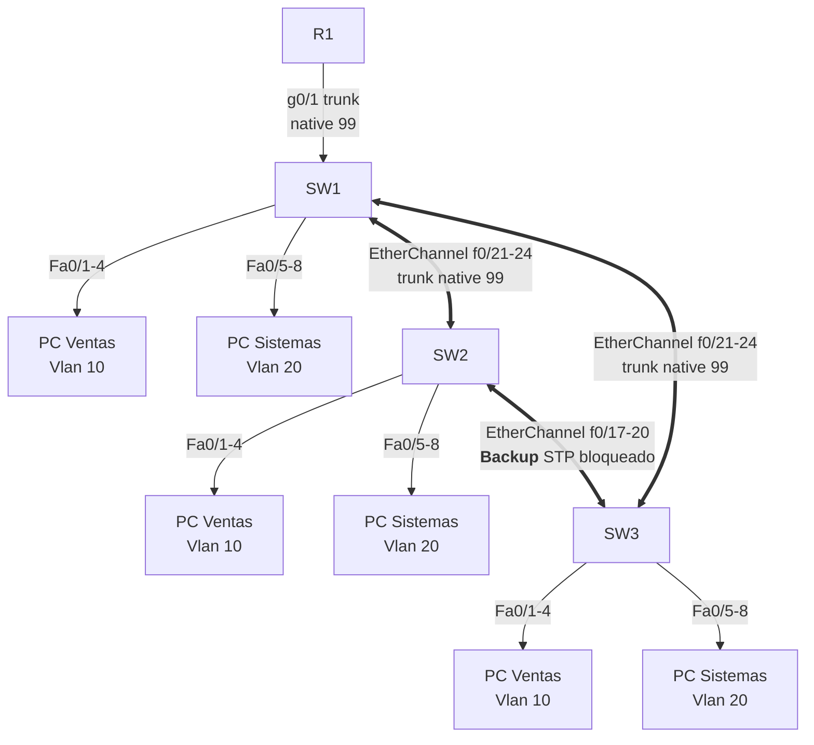

## Objetivos

1. Evitar bucles y acelerar la convergencia con **RSTP** (root primary/secondary
   y PortFast).
2. Aprovechar todos los enlaces del triángulo con **EtherChannel (LACP)**, con
   el enlace SW2↔SW3 como **backup**.
3. Asegurar la capa 2: Port Security, DHCP Snooping, DAI y IP Source Guard.
4. Verificar redundancia simulando fallas.

## Pasos

### 0. Configuración de VLANs

Distribuye los puertos de los switches (obviando el direccionamiento) así:

| Switch | VLAN 10  | VLAN 20  |
| :----- | :------- | :------- |
| SW1    | f0/1 - 4 | f0/5 - 8 |
| SW2    | f0/1 - 4 | f0/5 - 8 |
| SW3    | f0/1 - 4 | f0/5 - 8 |

La **VLAN 99** no tiene puertos de acceso: es la **VLAN nativa** de los trunks
(SW1↔SW2, SW1↔SW3 y el backup SW2↔SW3). La creas igual para que exista, pero
no la asignás a ningún puerto access.

Crea las VLANs y asigna los puertos de acceso en los tres switches:

```ios
! En SW1, SW2 y SW3
SW(config)# vlan 10
SW(config-vlan)# name Ventas
SW(config-vlan)# exit
SW(config)# vlan 20
SW(config-vlan)# name Sistemas
SW(config-vlan)# exit
SW(config)# vlan 99
SW(config-vlan)# name Native
SW(config-vlan)# exit

! Puertos de acceso
SW(config)# interface range f0/1 - 4
SW(config-if-range)# switchport mode access
SW(config-if-range)# switchport access vlan 10

SW(config)# interface range f0/5 - 8
SW(config-if-range)# switchport mode access
SW(config-if-range)# switchport access vlan 20
```

> Los puertos f0/21-24 (hacia SW1/SW2/SW3) y f0/17-20 (backup SW2↔SW3) se
> configuran como EtherChannel en el paso 2, con la VLAN 99 como nativa.

### 1. STP / RSTP

En los tres switches usa `rapid-pvst`. SW1 será la **raíz primaria** y SW2 la
**secundaria**, y los puertos de hosts usan PortFast + BPDU guard:

```ios
SW1(config)# spanning-tree mode rapid-pvst
SW1(config)# spanning-tree vlan 10,20,99 root primary

SW2(config)# spanning-tree mode rapid-pvst
SW2(config)# spanning-tree vlan 10,20,99 root secondary

SW3(config)# spanning-tree mode rapid-pvst

SW1(config)# interface range f0/1 - 8
SW1(config-if-range)# switchport host

SW2(config)# interface range f0/1 - 8
SW2(config-if-range)# switchport host

SW3(config)# interface range f0/1 - 8
SW3(config-if-range)# switchport host
```

> `switchport host` = access + PortFast + BPDU guard en un solo comando.
>
> SW3 no declara `root primary`/`root secondary`: queda como raíz secundaria de
> hecho (SW2 es secundario designado). El enlace SW2↔SW3 queda **bloqueado por
> STP** por ser redundante en el triángulo — actúa como respaldo.

### 2. EtherChannel entre SW1 ↔ SW2 y SW1 ↔ SW3

Grupa **4 enlaces** en un Port-channel con LACP para cada enlace del triángulo.

**SW1 ↔ SW2** (primario):

```ios
SW1(config)# interface range f0/21 - 24
SW1(config-if-range)# channel-group 1 mode active
SW1(config-if-range)# exit
SW1(config)# interface Port-channel 1
SW1(config-if)# switchport mode trunk
SW1(config-if)# switchport trunk native vlan 99
SW1(config-if)# switchport trunk allowed vlan 10,20,99

SW2(config)# interface range f0/21 - 24
SW2(config-if-range)# channel-group 1 mode passive
SW2(config-if-range)# exit
SW2(config)# interface Port-channel 1
SW2(config-if)# switchport mode trunk
SW2(config-if)# switchport trunk native vlan 99
SW2(config-if)# switchport trunk allowed vlan 10,20,99
```

**SW1 ↔ SW3**:

```ios
SW1(config)# interface range f0/17 - 20
SW1(config-if-range)# channel-group 2 mode active
SW1(config-if-range)# exit
SW1(config)# interface Port-channel 2
SW1(config-if)# switchport mode trunk
SW1(config-if)# switchport trunk native vlan 99
SW1(config-if)# switchport trunk allowed vlan 10,20,99

SW3(config)# interface range f0/21 - 24
SW3(config-if-range)# channel-group 1 mode passive
SW3(config-if-range)# exit
SW3(config)# interface Port-channel 1
SW3(config-if)# switchport mode trunk
SW3(config-if)# switchport trunk native vlan 99
SW3(config-if)# switchport trunk allowed vlan 10,20,99
```

**SW2 ↔ SW3** (backup):

```ios
SW2(config)# interface range f0/17 - 20
SW2(config-if-range)# channel-group 2 mode active
SW2(config-if-range)# exit
SW2(config)# interface Port-channel 2
SW2(config-if)# switchport mode trunk
SW2(config-if)# switchport trunk native vlan 99
SW2(config-if)# switchport trunk allowed vlan 10,20,99

SW3(config)# interface range f0/17 - 20
SW3(config-if-range)# channel-group 2 mode passive
SW3(config-if-range)# exit
SW3(config)# interface Port-channel 2
SW3(config-if)# switchport mode trunk
SW3(config-if)# switchport trunk native vlan 99
SW3(config-if)# switchport trunk allowed vlan 10,20,99
```

> Recuerda: la config de trunk va en el Port-channel, no en cada puerto físico.
> El enlace SW2↔SW3 queda **bloqueado por STP** (es el tercer camino del
> triángulo) y solo se activa si falla el enlace SW1↔SW2 o SW1↔SW3.

### 3. Seguridad de capa 2

Repite la configuración en **SW1, SW2 y SW3** sobre sus propios puertos de host
(f0/1-8). El **puerto trusted** es siempre el que apunta hacia el servidor
DHCP (que está en R1, alcanzable vía SW1): en SW1 es `g0/1`, y en SW2 y SW3
son sus trunks hacia SW1 (`Port-channel 1`).

```ios
# Port Security en los puertos de host
SW1(config)# interface range f0/1 - 8
SW1(config-if-range)# switchport port-security
SW1(config-if-range)# switchport port-security maximum 2
SW1(config-if-range)# switchport port-security mac-address sticky
SW1(config-if-range)# switchport port-security violation restrict
```

```ios
# DHCP Snooping (el servidor DHCP estará en R1 por el trunk)
SW1(config)# ip dhcp snooping
SW1(config)# ip dhcp snooping vlan 10,20
SW1(config)# interface g0/1
SW1(config-if)# ip dhcp snooping trust
SW1(config)# interface range f0/1 - 8
SW1(config-if-range)# ip dhcp snooping limit rate 10
SW1(config-if-range)# exit
# DAI
SW1(config)# ip arp inspection vlan 10,20
SW1(config)# interface g0/1
SW1(config-if)# ip arp inspection trust
exit

# IP Source Guard en puertos de host
SW1(config)# interface range f0/1 - 8
SW1(config-if-range)# ip verify source
```

En **SW2** y **SW3** el bloque es idéntico, salvo el puerto trusted, que es el
`Port-channel` que apunta a SW1:

```ios
! SW2 y SW3
SW(config)# ip dhcp snooping
SW(config)# ip dhcp snooping vlan 10,20
SW(config)# interface Port-channel 1
SW(config-if)# ip dhcp snooping trust
SW(config)# interface range f0/1 - 8
SW(config-if-range)# ip dhcp snooping limit rate 10
SW(config-if-range)# exit
SW(config)# ip arp inspection vlan 10,20
SW(config)# interface Port-channel 1
SW(config-if)# ip arp inspection trust
```

> Marca como **trusted** solo el puerto hacia el servidor DHCP (R1 vía SW1).
> El resto queda untrusted: no puede enviar ofertas DHCP ni ARP falsos.

## Verificación

### Redundancia

```ios
SW1# show vlan brief                       # VLANs 10, 20, 99 con sus puertos
SW1# show spanning-tree vlan 10            # root: SW1
SW2# show spanning-tree vlan 10            # root: SW1 (root port hacia SW1)
SW3# show spanning-tree vlan 10            # root: SW1 (root port hacia SW1)
SW1# show etherchannel summary             # Po1(SU), Po2(SU), puertos (P)
SW2# show etherchannel summary             # Po1 (SW1), Po2 (SW3) backup BLK
SW3# show etherchannel summary             # Po1 (SW1), Po2 (SW2) backup BLK
```

### Seguridad

```ios
SW1# show port-security interface FastEthernet0/1
SW1# show ip dhcp snooping binding
SW1# show ip arp inspection vlan 10
```

### Prueba de falla

1. Conecta una PC de Ventas y verifica que ping a la otra VLAN funcione.
2. Desconecta uno de los cables del EtherChannel: el tráfico sigue pasando por
   los 3 restantes sin cortarse.
3. **Corta el enlace SW1↔SW2 (desconecta el Port-channel 1 de SW2)**: el
   tráfico entre SW1 y SW2 debe reenrutarse por SW3 (el backup SW2↔SW3 pasa de
   bloqueado a forward). Verifica que ya no haya puertos `BLK` en
   `show spanning-tree`.
4. Conecta un router doméstico con DHCP a un puerto de host: sus ofertas deben
   ser descartadas (DHCP Snooping).

## Comprobación final

| Pregunta                       | Respuesta esperada                                  |
| :----------------------------- | :-------------------------------------------------- |
| ¿Quién es la raíz STP?         | SW1 (primary); SW2 secundario                       |
| ¿Los EtherChannels están "up"? | SW1: Po1+Po2 (P); SW2 y SW3 tienen su backup en BLK |
| ¿Qué pasa si corto SW1↔SW2?    | Converge por SW2↔SW3 (backup pasa a forwarding)     |
| ¿Puerto con router doméstico?  | Se deshabilita/descarta (DHCP Snooping)             |

## Resumen

- La red sobrevive a fallas de **enlaces** (EtherChannel) y de **switches**
  (STP).
- La topología en **triángulo** deja el enlace SW2↔SW3 como **backup**: queda
  bloqueado por STP y solo se activa si falla SW1↔SW2 o SW1↔SW3.
- La capa 2 está protegida: Port Security, DHCP Snooping, DAI e IP Source Guard.
- Guarda la configuración de todos los equipos:
  `copy running-config startup-config`.

En el [Módulo 6: Routing y Redundancia](../06-routing-redundancy/) añadirás el
**gateway redundante** con HSRP a la misma red.
