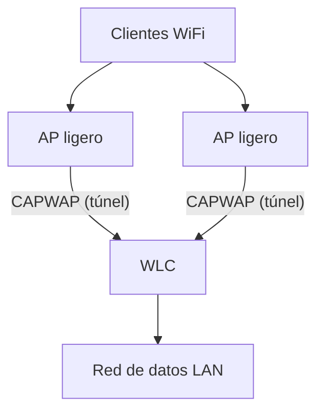

Las redes inalámbricas se construyen sobre **puntos de acceso (AP)**. Según cómo
se administran, hay dos arquitecturas: **autónoma** (cada AP es independiente)
y **centralizada** (APs ligeros gestionados por un controlador WLC).

## AP autónomo (standalone)

Un **AP autónomo** es un dispositivo que funciona solo: configuración local,
una sola WLAN/SSID, sin gestión central.

| Ventajas                       | Desventajas                        |
| :----------------------------- | :--------------------------------- |
| Simple, ideal para redes pequeñas | Sin gestión centralizada         |
| Bajo coste inicial             | Difícil de escalar                 |
| No requiere controlador        | Roaming y seguridad difíciles      |

## AP ligero y controlador WLC

En redes medianas/grandes se usa la arquitectura **centralizada**:

- **AP ligero (LAP)**: no toma decisiones; depende del **WLC** (Wireless LAN
  Controller) para configuración, autenticación y roaming.
- **WLC**: centraliza la configuración de todas las WLANs, el cifrado, la
  autenticación y el tráfico de gestión.


### CAPWAP

Los APs ligeros se comunican con el WLC mediante **CAPWAP** (Control And
Provisioning of Wireless Access Points, RFC 5415):

- **Canal de control**: gestión del AP (configuración, firmware).
- **Canal de datos**: el tráfico de los clientes viaja **tunelizado** hacia el
  WLC (o localmente con FlexConnect).
- Usa UDP: control en el puerto **5246**, datos en el **5247**.

> Los APs se descubren por **broadcast**, **DNS** (`CISCO-CAPWAP-CONTROLLER`),
> o configurando el WLC manualmente. Es una combinación de la arquitectura
> "split-MAC": parte de las funciones de la capa MAC se procesan en el AP y
> parte en el WLC.

## Modos de operación del AP ligero

| Modo          | Uso                                                |
| :------------ | :------------------------------------------------- |
| Local         | Modo por defecto: tráfico de clientes al WLC       |
| FlexConnect   | El tráfico se conmuta **localmente** en el AP (sucursales) |
| Monitor       | Solo sensores de radio (IDS, rogues)               |
| Sniffer       | Captura de tramas para análisis                    |
| Rogue Detector | Detecta APs no autorizados                         |

## WLC: configuración y gestion

Con la arquitectura centralizada se configuran las **WLANs** una sola vez en el
WLC y se aplican a todos los APs:

```
(Cisco Controller) > config wlan create 1 "Oficina" SSID-Oficina
(Cisco Controller) > config wlan security wpa akm psk set-key ascii ClaveFuerte! 1
(Cisco Controller) > config wlan enable 1
```
O desde la interfaz web (GUI) del WLC, que es lo habitual.

## Verificación de la asociación AP-WLC

```
(Cisco Controller) > show ap summary
AP Name          Slots  AP Model            Ethernet MAC      Location  Country  IP Address
-------------------------------------------------------------------------------------------
AP-CORREDOR-01     2     AIR-AP1815I          aaaa.bbbb.cccc     Piso 2     ES      10.10.0.21
```

- Estado del AP: **Joined** (asociado al WLC) o **Disjoined** (sin controlador).
- El WLC asigna al AP una **dirección IP** (por DHCP) y su configuración.

## Preguntas tipo CCNA

1. **¿Qué es un AP autónomo y cuándo usarlo?**
   Un AP con configuración independiente; ideal para **redes pequeñas** sin
   gestión central.

2. **¿Qué función tiene el WLC?**
   **Centralizar** la configuración, seguridad, autenticación y roaming de los
   APs ligeros.

3. **¿Qué protocolo une APs ligeros con el WLC y qué puertos usa?**
   **CAPWAP**: control en UDP **5246** y datos en UDP **5247**.

4. **¿Qué modo de AP conmuta el tráfico localmente en la sucursal?**
   **FlexConnect**: los clientes no dependen del WLC para el tráfico de datos.

5. **¿Cómo descubre un AP ligero a su WLC?**
   Por **broadcast**, **DNS** (`CISCO-CAPWAP-CONTROLLER`) o configuración
   manual de la dirección del controlador.

## Resumen

- **AP autónomo**: independiente, para redes pequeñas.
- **AP ligero + WLC**: gestión centralizada, ideal para redes medianas/grandes.
- **CAPWAP** (UDP 5246/5247) transporta control y datos entre AP y WLC.
- Modos del AP: **local**, **FlexConnect**, monitor, sniffer, rogue detector.
- Las WLANs se crean una vez en el **WLC** y se distribuyen a todos los APs.