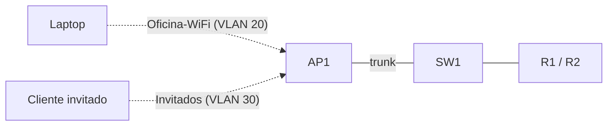

Cuarta parte de la serie. La red cableada del edificio ya es redundante y
segura. Ahora añade **acceso inalámbrico**: una WLAN corporativa para los
equipos de Sistemas y una WLAN para **invitados** aislada en su propia VLAN.



## Requisitos

- Red del [ejercicio anterior](../04-redundancy-security/ejercicio): VLANs 10,
  20 y 99, switches redundantes y HSRP.
- Un **AP autónomo** conectado por un puerto trunk de SW1.
- Nuevo segmento **VLAN 30 - Invitados** (192.168.30.0/24), sin acceso a la red
  interna.

## Objetivos

1. Crear la VLAN 30 (Invitados) y extenderla al router.
2. Configurar dos SSIDs: `Oficina-WiFi` (VLAN 20) y `Invitados` (VLAN 30).
3. Proteger las WLANs con WPA2/WPA3.
4. Verificar la asociación de un cliente y su segmentación.

## Pasos

### 1. VLAN de invitados en los switches y el router

```ios
SW1(config)# vlan 30
SW1(config-vlan)# name Invitados
SW1(config-vlan)# exit
SW1(config)# interface GigabitEthernet0/24
SW1(config-if)# switchport mode trunk
SW1(config-if)# switchport trunk allowed vlan 10,20,30,99
```

En el router, crea la subinterfaz y el grupo HSRP de la VLAN 30 (en R1 y R2,
con el mismo procedimiento que viste en el Módulo 4):

```ios
R1(config)# interface GigabitEthernet0/0.30
R1(config-subif)# encapsulation dot1q 30
R1(config-subif)# ip address 192.168.30.1 255.255.255.0
R1(config-subif)# standby 30 ip 192.168.30.254
R1(config-subif)# standby 30 priority 150
R1(config-subif)# standby 30 preempt
```

### 2. SSIDs en el AP autónomo

```ios
AP1(config)# dot11 ssid Oficina-WiFi
AP1(config-ssid)# authentication open
AP1(config-ssid)# mbssid guest-mode
AP1(config-ssid)# exit

AP1(config)# dot11 ssid Invitados
AP1(config-ssid)# authentication open
AP1(config-ssid)# mbssid guest-mode
AP1(config-ssid)# exit

AP1(config)# interface Dot11Radio0
AP1(config-if)# ssid Oficina-WiFi
AP1(config-if)# ssid Invitados
AP1(config-if)# station-role root
```

### 3. Seguridad WPA2/WPA3 (PSK)

En los WLC o en el AP por GUI, cada SSID lleva su clave:

| SSID         | Seguridad       | VLAN | Clave (ejemplo) |
| :----------- | :-------------- | :--- | :-------------- |
| Oficina-WiFi | WPA2/WPA3 (AES) | 20   | ClaveOficina!   |
| Invitados    | WPA2 (AES)      | 30   | ClaveGuest!     |

> En la **CLI del WLC** sería, por ejemplo:
> `config wlan security wpa akm psk set-key ascii ClaveOficina! 1`
> y `config wlan interface 1 vlan-20`.

### 4. Aislamiento de invitados

Para que los invitados no alcancen la red interna, restringe en el router el
tráfico entre la VLAN 30 y las VLANs 10/20. Eso se hace con **ACLs**, que
verás en detalle en el [Módulo 6](../06-ip-services/acls); aquí lo dejas
anotado para aplicarlo al final:

```ios
R1(config)# access-list 101 deny ip 192.168.30.0 0.0.0.255 192.168.0.0 0.0.255.255
R1(config)# access-list 101 permit ip any any
R1(config)# interface GigabitEthernet0/0.30
R1(config-subif)# ip access-group 101 in
```

## Verificación

En el **WLC** (o `show dot11 associations` en el AP autónomo):

```
(Cisco Controller) > show wlan summary
WLAN ID  WLAN Profile Name / SSID        Status
-------  ------------------------------  -------
1        Oficina-WiFi / Oficina-WiFi     ENABLED
2        Invitados / Invitados           ENABLED

(Cisco Controller) > show client summary
MAC Address    AP Name              WLAN  State  IP Address
-----------   -------------------  ----  -----  ------------
aaaa.bbbb.cccc AP-CORREDOR-01       1     Assoc  192.168.20.42
```

Prueba desde un **cliente de Oficina-WiFi**:

```bash
Laptop# ping 192.168.10.10       # hacia Ventas (VLAN 10): debe responder
Laptop# ping 192.168.30.50       # hacia un invitado: queda bloqueado por ACL
```

## Comprobación final

| Pregunta                             | Respuesta esperada               |
| :----------------------------------- | :------------------------------- |
| ¿El AP emite los dos SSIDs?          | Sí, `Oficina-WiFi` y `Invitados` |
| ¿Cliente corporativo en VLAN 20?     | Sí, con IP 192.168.20.x          |
| ¿Cliente invitado en VLAN 30?        | Sí, con IP 192.168.30.x          |
| ¿Invitados acceden a la red interna? | No (bloqueado por ACL)           |

## Resumen

- Se añadió el acceso **inalámbrico** con dos SSIDs: corporativo (VLAN 20) e
  invitados (VLAN 30).
- Cada WLAN usa **WPA2/WPA3** y queda mapeada a su VLAN.
- Los invitados quedan **aislados** de la red interna mediante una ACL.

En el [Módulo 6](../06-ip-services/) terminarás el edificio con los **servicios
IP**: DHCP automático, salida a internet con NAT/PAT y las ACLs.
