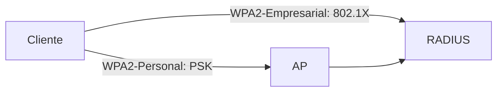

El medio inalámbrico es **público**: cualquiera puede capturar el tráfico. Por
eso el cifrado y la autenticación son imprescindibles. Este tema recorre la
evolución de la seguridad WiFi, de WEP a WPA3.

## La evolución de la seguridad WiFi

| Estándar | Cifrado         | Estado              |
| :------- | :-------------- | :------------------ |
| **WEP**  | RC4, 40/104 bits| Roto; se descifra en minutos |
| **WPA**  | TKIP (RC4)      | Transitorio, vulnerable |
| **WPA2** | AES-CCMP        | Estándar actual (802.11i) |
| **WPA3** | AES-GCMP        | Actual (WPA3-Personal/Empresarial) |

- **WEP** reutiliza claves RC4 débiles y se puede romper capturando poco
  tráfico. Nunca debe usarse.
- **TKIP** (WPA) fue un parche temporal; reemplazado por **AES**.

## WPA2

**WPA2** (802.11i) usa cifrado **AES-CCMP** y se ofrece en dos modos:

- **WPA2-Personal**: una **clave compartida (PSK)** para todos. Adecuado para
  redes domésticas y pequeñas.
- **WPA2-Empresarial (802.1X)**: cada usuario se autentica contra un servidor
  **RADIUS** con credenciales propias. Recomendado para empresas.

| Característica          | Personal (PSK)     | Empresarial (802.1X)      |
| :---------------------- | :----------------- | :------------------------ |
| Credenciales            | Una clave compartida | Usuario/contraseña por persona |
| Servidor RADIUS         | No                 | Sí                        |
| Gestión de usuarios     | Manual             | Centralizada              |
| Seguridad               | Buena              | Mayor (claves únicas)     |


## WPA3

**WPA3** mejora WPA2:

- **WPA3-Personal**: autenticación más fuerte (**SAE**, Simultaneous
  Authentication of Equals), resistente a ataques de diccionario offline.
- **WPA3-Empresarial**: cifrado AES-**GCMP** de 192 bits para alta seguridad.
- **Forward secrecy**: incluso si se captura el tráfico, no se descifra en el
  futuro.

> La mayoría de los equipos modernos soportan **WPA2/WPA3 transición** para que
> clientes antiguos (solo WPA2) sigan conectándose.

## Ataques inalámbricos comunes

| Ataque           | Qué hace                                             |
| :--------------- | :--------------------------------------------------- |
| **Evil twin**    | AP falso con el mismo SSID para robar credenciales   |
| **Rogue AP**     | AP no autorizado conectado a la red corporativa      |
| **Wardriving**   | Detección de redes WiFi en movimiento                |
| **Captura y crack PSK** | Captura el handshake y prueba claves por fuerza bruta |
| **Deauthentication** | Expulsa clientes para forzarlos a reconectar (y capturar el handshake) |

Contramedidas: WPA3/WPA2 con claves fuertes, **802.1X** con RADIUS, detección de
**rogue APs** (WIDS/WIPS), desactivar SSID broadcast no aporta seguridad real.

## Configuración de seguridad en una WLAN

En un **WLC**:

```
(Cisco Controller) > config wlan security wpa akm psk set-key ascii ClaveFuerte! 1
(Cisco Controller) > config wlan security wpa encryption aes 1
(Cisco Controller) > config wlan security wpa enable 1
```

Para **empresarial (802.1X)**:

```
(Cisco Controller) > config wlan security radius server 192.168.1.50 shared-secret MiSecreto 1
(Cisco Controller) > config wlan security wpa akm dot1x enable 1
```

En un **AP autónomo**:

```ios
AP1(config-ssid)# authentication open
AP1(config-ssid)# wpa-psk ascii ClaveFuerte!
AP1(config-ssid)# exit
AP1(config)# interface Dot11Radio0
AP1(config-if)# encryption vlan 1 mode ciphers aes-ccm
```

## Preguntas tipo CCNA

1. **¿Qué cifrado usan WPA2 y WPA3?**
   WPA2 usa **AES-CCMP**; WPA3 usa **AES-GCMP** (y SAE para la autenticación
   Personal).

2. **¿Qué diferencia hay entre WPA2-Personal y WPA2-Empresarial?**
   Personal usa una **clave compartida (PSK)**; Empresarial autentica cada
   usuario con **802.1X** contra un servidor **RADIUS**.

3. **¿Por qué WEP es inseguro?**
   Reutiliza claves RC4 débiles y puede descifrarse con poco tráfico capturado.

4. **¿Qué protege WPA3 frente a WPA2 en modo Personal?**
   **SAE**: resistente a ataques de diccionario offline.

5. **¿Qué es un rogue AP y cómo se detecta?**
   Un **AP no autorizado** conectado a la red; se detecta con sistemas
   **WIDS/WIPS** que monitorizan el espectro.

## Resumen

- Wifi pública: **siempre cifrar**. WEP y TKIP están obsoletos.
- **WPA2** = AES-CCMP en modo **Personal (PSK)** o **Empresarial (802.1X +
  RADIUS)**.
- **WPA3** = AES-GCMP + autenticación **SAE** (Personal).
- Ataques típicos: evil twin, rogue AP, crack de PSK, deauthentication.
- En empresas, usar **WPA2/WPA3-Empresarial** con servidor RADIUS.