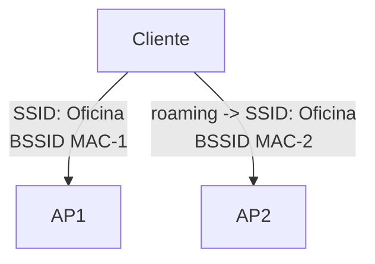

Una **WLAN** es una red inalámbrica definida por un **SSID** (nombre visible) y
su configuración de seguridad. Este tema cubre los elementos que se configuran
al crear una WLAN y la asociación de los clientes.

## SSID y BSSID

- **SSID** (Service Set Identifier): nombre de la red que ven los clientes
  (ej. `Oficina`). Debe coincidir exactamente en todos los APs para hacer
  roaming.
- **BSSID**: la dirección MAC de la radio del AP (identifica un AP concreto).
- Varias redes pueden tener el mismo SSID en distintos APs para dar cobertura
  continua.


## Bandas y canales

Las WLANs operan en dos bandas principales:

| Banda | Canales                        | Características              |
| :---- | :----------------------------- | :--------------------------- |
| **2.4 GHz** | 1-13 (solapados); canales no solapados: **1, 6, 11** | Mayor alcance, más interferencia |
| **5 GHz** | muchos canales no solapados   | Menos interferencia, mayor velocidad |

> En 2.4 GHz los canales se **solapan**; solo 1, 6 y 11 no se pisan entre sí.
> En 5 GHz hay canales no solapados abundantes.

Al configurar un AP:

- Seleccionar la **banda** (2.4 GHz, 5 GHz, o ambas).
- Elegir el **canal** y el **ancho de canal** (20/40/80 MHz).
- Ajustar la **potencia de transmisión** para la cobertura deseada.

> Con los **WLC** los canales y la potencia se asignan **automáticamente**
> (Radio Resource Management, RRM) para optimizar la cobertura.

## Elementos de configuración de una WLAN

Al crear una WLAN se definen, entre otros:

- **Nombre del perfil** (nombre interno) y **SSID**.
- **Seguridad**: cifrado y autenticación (WPA2/WPA3, ver [Seguridad Inalámbrica](./wireless-security)).
- **VLAN** a la que pertenece la WLAN.
- **Bandas** habilitadas (2.4/5 GHz).
- **DHCP** y políticas de cliente.

## Configuración en AP autónomo (CLI)

```ios
AP1(config)# dot11 ssid Oficina
AP1(config-ssid)# authentication open
AP1(config-ssid)# guest-mode
AP1(config-ssid)# exit

AP1(config)# interface Dot11Radio0
AP1(config-if)# ssid Oficina
AP1(config-if)# channel 6
AP1(config-if)# station-role root
```
## Configuración en WLC (CLI)

```
(Cisco Controller) > config wlan create 1 "Oficina" SSID-Oficina
(Cisco Controller) > config wlan ssid SSID-Oficina 1
(Cisco Controller) > config wlan security wpa akm psk set-key ascii ClaveFuerte! 1
(Cisco Controller) > config wlan security wpa encryption aes 1
(Cisco Controller) > config wlan interface 1 vlan-10
(Cisco Controller) > config wlan enable 1
```
> Lo habitual en producción es usar la **GUI del WLC**: *WLANs → Create New*,
> definir SSID, seguridad y VLAN, y habilitarla.

## Asociación de un cliente (resumen)

1. El cliente detecta los **beacons** o responde a su **probe request**.
2. Se **autentica** a nivel 802.11 (open o con credenciales).
3. Se **asocia** a la BSSID del AP.
4. Configura IP por **DHCP**.
5. (Con 802.1X) se autentica el usuario con un servidor RADIUS.

## Verificación

```
(Cisco Controller) > show wlan summary
WLAN ID  WLAN Profile Name / SSID        Status
-------  ------------------------------  -------
1        Oficina / SSID-Oficina          ENABLED

(Cisco Controller) > show client summary
MAC Address    AP Name              WLAN  State  IP Address
------------   -------------------  ----  -----  ------------
aaaa.bbbb.cccc AP-CORREDOR-01       1     Assoc  10.10.0.42
```

## Preguntas tipo CCNA

1. **¿Qué es el SSID y qué es el BSSID?**
   El **SSID** es el nombre de la red; el **BSSID** es la dirección MAC de la
   radio del AP que la emite.

2. **¿Qué canales de 2.4 GHz no se solapan?**
   **1, 6 y 11**.

3. **¿Qué ventaja tiene la banda de 5 GHz frente a la de 2.4 GHz?**
   Menos interferencia y mayor velocidad, aunque menor alcance.

4. **¿Qué configura el RRM de un WLC?**
   Asigna **canales y potencia** de forma automática a los APs para optimizar la
   cobertura.

5. **¿Qué pasos sigue un cliente para conectarse?**
   Detectar (beacon/probe) → autenticar (802.11) → asociarse → obtener IP por
   **DHCP** → (opcional) autenticación 802.1X.

## Resumen

- El **SSID** identifica la red; el **BSSID** identifica al AP.
- Bandas: **2.4 GHz** (canales 1, 6, 11 no solapados) y **5 GHz**.
- Se configura el SSID, la **seguridad**, la **VLAN** y las **bandas**.
- En un **WLC** las WLANs se crean una vez y se distribuyen a todos los APs.
- La asociación del cliente termina con la obtención de IP por DHCP.