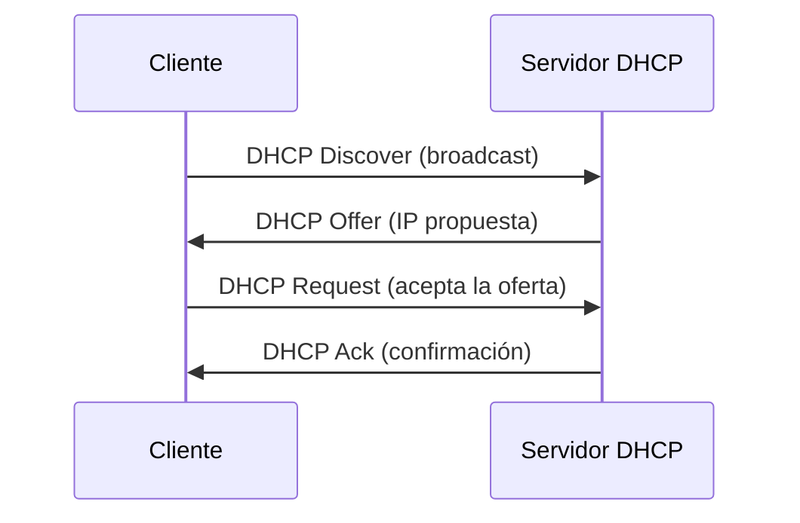

Tres servicios IP mantienen una red operativa de forma autónoma: **DHCP** asigna
direcciones automáticamente, **DNS** traduce nombres y **NTP** sincroniza el
reloj de todos los equipos.

## DHCP: configuración automática

**DHCP** (Dynamic Host Configuration Protocol) entrega a los clientes su IP,
máscara, gateway y DNS automáticamente (puerto **67** servidor / **68** cliente).

### Proceso DORA

1. **D**iscover: el cliente busca servidores DHCP (broadcast).
2. **O**ffer: el servidor ofrece una dirección.
3. **R**equest: el cliente pide la oferta.
4. **A**ck: el servidor confirma y el cliente configura la IP.


### Servidor DHCP en IOS

```ios
R1(config)# ip dhcp pool LAN-Oficina
R1(dhcp-config)# network 192.168.1.0 255.255.255.0
R1(dhcp-config)# default-router 192.168.1.1
R1(dhcp-config)# dns-server 8.8.8.8
R1(dhcp-config)# lease 7
```
| Comando                 | Función                              |
| :---------------------- | :----------------------------------- |
| `ip dhcp excluded-address` | Direcciones que NO se reparten    |
| `ip dhcp pool <nombre>` | Crea el pool                         |
| `network <red> <máscara>` | Rango de direcciones del pool      |
| `default-router <ip>`   | Gateway por defecto entregado        |
| `dns-server <ip>`       | Servidor DNS entregado               |
| `lease <días>`          | Duración del arrendamiento           |

> Las direcciones del router y de los servidores se **excluyen** del pool.

### DHCP Relay (ip helper-address)

Un servidor DHCP no responde broadcasts fuera de su subred. Si el servidor está
en otra red, el router intermedio la reenvía como **unicast** con `ip
helper-address`:

```ios
R1(config-if)# ip helper-address 10.0.0.5
```
### Verificación DHCP

```ios
Bindings from all pools not associated with VRF:
IP address      Client-ID/HW address    Lease expiration      Type
192.168.1.20    0100.5061.2bcc.20       Aug 21 2026 09:00    Automatic

R1# show ip dhcp pool LAN-Oficina
```
## DNS: resolución de nombres

**DNS** traduce nombres de dominio a direcciones IP (puerto **53**, UDP
principalmente).

```ios
R1(config)# ip domain lookup

R1# ping www.ejemplo.com
Translating "www.ejemplo.com"...domain server (8.8.8.8) [OK]
```
- `ip name-server` indica los servidores DNS del router.
- `ip domain lookup` habilita la resolución de nombres desde la CLI (se
  desactiva con `no ip domain lookup` para evitar retrasos al teclear mal).
- `ip domain name <dominio>` define el dominio por defecto al crear claves
  (necesario para SSH, ver [Módulo 2](../02-device-management/secure-remote-access)).

## NTP: sincronización de hora

**NTP** (Network Time Protocol) sincroniza el reloj de los equipos por red
(puerto **123**, UDP). Es imprescindible para **logs**, certificados y
diagnóstico.

| Modo        | Función                              |
| :---------- | :----------------------------------- |
| Cliente     | Toma la hora de un servidor NTP      |
| Servidor    | Sirve la hora a otros equipos        |
| Peer        | Se sincroniza entre iguales          |

```ios
R1(config)# ntp update-calendar

R1# show ntp status
Clock is synchronized, stratum 3, reference is 192.168.1.250

R1# show ntp associations
      address         ref clock     st   when   poll reach  delay  offset
*~192.168.1.250      216.239.35.0    2    15     64     1   0.952   -1.180
```

- **Stratum**: distancia respecto a la fuente de hora atómica (0 = reloj
  atómico; a más stratum, menos preciso).
- `*` indica el servidor elegido como referencia.
- `ntp update-calendar` copia la hora a la **hardware clock** (persistente).

> Buena práctica: que un router actúe como servidor NTP para la red y los demás
> como clientes, manteniendo así un solo punto de referencia.

## Preguntas tipo CCNA

1. **¿Qué puertos usa DHCP y cuál es su proceso?**
   Puerto **67** (servidor) y **68** (cliente); el proceso es **DORA**:
   Discover → Offer → Request → Ack.

2. **¿Cómo llega un cliente DHCP a un servidor en otra subred?**
   Con **`ip helper-address`** en el router, que convierte el broadcast en
   unicast hacia el servidor.

3. **¿Qué comando reserva direcciones que DHCP no debe repartir?**
   `ip dhcp excluded-address <inicio> <fin>`.

4. **¿Qué hace `ip name-server`?**
   Define el **servidor DNS** que usa el router para resolver nombres.

5. **¿Qué puerto usa NTP y qué es el stratum?**
   Puerto **123** (UDP); el **stratum** indica la distancia a la fuente de hora
   de referencia (menor = más preciso).

## Resumen

- **DHCP**: entrega IP, máscara, gateway y DNS (DORA, puertos 67/68). Se
  excluyen direcciones con `ip dhcp excluded-address`.
- **Relay**: `ip helper-address` reenvía DHCP entre subredes.
- **DNS**: resuelve nombres (puerto 53) con `ip name-server`.
- **NTP**: sincroniza la hora (puerto 123) con `ntp server`; se verifica con
  `show ntp status`.