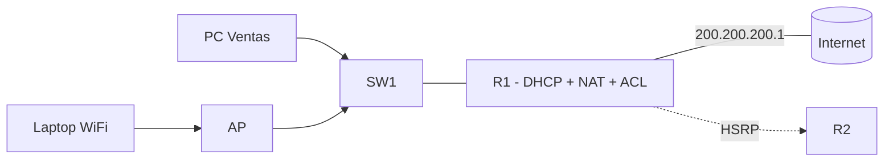

Última parte de la serie. La red del edificio ya es funcional, redundante,
segura e inalámbrica. Ahora le añades los **servicios IP** que la dejan
operativa de forma autónoma: **DHCP** para asignar direcciones, **NAT/PAT** para
salir a internet y **ACLs** para controlar el tráfico. Al terminar, las PCs se
configuran solas, navegan y el acceso está controlado.



## Requisitos

- Red completa del [ejercicio anterior](../05-wireless-networks/ejercicio):
  VLANs 10/20/30/99, routing, redundancia, seguridad y WLANs.
- Los switches tienen las **IPs de gestión excluidas** del pool DHCP.

## Objetivos

1. Configurar **DHCP** para las VLANs 10, 20 y 30 en R1.
2. Dar salida a internet con **NAT/PAT**.
3. Controlar el tráfico con **ACLs** (Ventas solo al servidor; invitados aislados).
4. Sincronizar la hora de los equipos con **NTP**.
5. Verificar de extremo a extremo.

## Pasos

### 1. DHCP en R1

Excluye las direcciones de los equipos fijos (gateways, switches) y crea un
pool por VLAN:

```ios
R1(config)# ip dhcp excluded-address 192.168.10.1 192.168.10.9
R1(config)# ip dhcp excluded-address 192.168.10.254
R1(config)# ip dhcp excluded-address 192.168.20.1 192.168.20.9
R1(config)# ip dhcp excluded-address 192.168.20.254
R1(config)# ip dhcp excluded-address 192.168.30.1 192.168.30.9
R1(config)# ip dhcp excluded-address 192.168.30.254

R1(config)# ip dhcp pool LAN-Ventas
R1(dhcp-config)# network 192.168.10.0 255.255.255.0
R1(dhcp-config)# default-router 192.168.10.254
R1(dhcp-config)# dns-server 8.8.8.8
R1(dhcp-config)# lease 7

R1(config)# ip dhcp pool LAN-Sistemas
R1(dhcp-config)# network 192.168.20.0 255.255.255.0
R1(dhcp-config)# default-router 192.168.20.254
R1(dhcp-config)# dns-server 8.8.8.8
R1(dhcp-config)# lease 7

R1(config)# ip dhcp pool LAN-Invitados
R1(dhcp-config)# network 192.168.30.0 255.255.255.0
R1(dhcp-config)# default-router 192.168.30.254
R1(dhcp-config)# dns-server 8.8.8.8
R1(dhcp-config)# lease 1
```

> El `default-router` de cada pool es la **IP virtual HSRP** (.254) que
> configuraste en los módulos anteriores: así, si falla R1, R2 sigue siendo el
> gateway que las PCs ya conocen.

### 2. NAT/PAT en la salida a internet

```ios
R1(config)# access-list 1 permit 192.168.10.0 0.0.0.255
R1(config)# access-list 1 permit 192.168.20.0 0.0.0.255
R1(config)# access-list 1 permit 192.168.30.0 0.0.0.255

R1(config)# ip nat pool PUBLICA 200.200.200.1 200.200.200.1 netmask 255.255.255.0
R1(config)# ip nat inside source list 1 pool PUBLICA overload

R1(config)# interface GigabitEthernet0/0.10
R1(config-subif)# ip nat inside
R1(config-subif)# exit
R1(config)# interface GigabitEthernet0/0.20
R1(config-subif)# ip nat inside
R1(config-subif)# exit
R1(config)# interface GigabitEthernet0/0.30
R1(config-subif)# ip nat inside
R1(config-subif)# exit
R1(config)# interface Serial0/0/0
R1(config-if)# ip nat outside
```

> El **`overload`** activa el PAT: todos los hosts comparten la única IP pública
> 200.200.200.1 usando distintos puertos.

### 3. ACLs de control

```ios
# Invitados (VLAN 30) no acceden a la red interna
R1(config)# access-list 101 deny ip 192.168.30.0 0.0.0.255 192.168.0.0 0.0.255.255
R1(config)# access-list 101 permit ip any any
R1(config)# interface GigabitEthernet0/0.30
R1(config-subif)# ip access-group 101 in

# Ventas (VLAN 10) solo llega al servidor de Sistemas 192.168.20.10
R1(config)# access-list 102 permit ip 192.168.10.0 0.0.0.255 host 192.168.20.10
R1(config)# interface GigabitEthernet0/0.10
R1(config-subif)# ip access-group 102 in
```

> Recuerda que las ACLs se evalúan **en orden** y que, al final de cada una, el
> `permit ip any any` evita bloquear el resto del tráfico.

### 4. NTP

Sincroniza los equipos del edificio con R1 como referencia:

```ios
R1(config)# ntp server 200.200.200.5     # o el servidor NTP del ISP
R1(config)# ntp update-calendar

SW1(config)# ntp server 192.168.99.254
SW2(config)# ntp server 192.168.99.254
AP1(config)# ntp server 192.168.99.254
```

## Verificación

### DHCP

```ios
R1# show ip dhcp binding
IP address      Client-ID/HW address     Lease expiration      Type
192.168.10.20   0100.1a2b.3c4d.20        Aug 21 2026 09:00    Automatic
192.168.20.42   0100.5061.2bcc.42        Aug 21 2026 09:00    Automatic
```

### NAT/PAT

```ios
R1# show ip nat translations
Pro  Inside global      Inside local       Outside local      Outside global
---  200.200.200.1      192.168.10.20      ---                ---
tcp  200.200.200.1:1050 192.168.10.20:1050 8.8.8.8:53         8.8.8.8:53

R1# show ip nat statistics
Total active translations: 12 (0 static, 12 dynamic; 12 extended)
```

### NTP

```ios
SW1# show ntp status
Clock is synchronized, stratum 4, reference is 192.168.99.254
```

### De extremo a extremo

```bash
PC-Ventas# ipconfig        # debe tener IP 192.168.10.x por DHCP
PC-Ventas# ping 8.8.8.8    # sale a internet vía NAT/PAT
PC-Ventas# ping 192.168.20.10   # solo al servidor (ACL 102)
```

## Comprobación final

| Pregunta                         | Respuesta esperada                   |
| :------------------------------- | :----------------------------------- |
| ¿Las PCs obtienen IP por DHCP?   | Sí, pool de su VLAN con gateway .254 |
| ¿Salida a internet?              | Sí, PAT con 200.200.200.1 (overload) |
| ¿Invitados aislados?             | Sí (ACL 101)                         |
| ¿Ventas accede solo al servidor? | Sí (ACL 102)                         |
| ¿Hora sincronizada en todos?     | Sí, contra R1 (NTP)                  |

## Resumen

- **DHCP** entrega IP, máscara, gateway y DNS a cada VLAN, excluyendo los
  equipos fijos.
- **NAT/PAT** da salida a internet compartiendo la IP pública con `overload`.
- **ACLs** controlan el acceso: invitados aislados y Ventas limitada al
  servidor.
- **NTP** mantiene la hora sincronizada en todos los equipos.
- Guarda la configuración final en todos los equipos:
  `copy running-config startup-config`.

Con esto, el edificio de un piso queda **completo**: identificado, conectado,
enrutado, redundante, seguro, inalámbrico y con servicios IP autónomos. Solo
falta la frontera con internet, que se configura en detalle en la
[Parte 6](../07-internet-wan/ejercicio).
