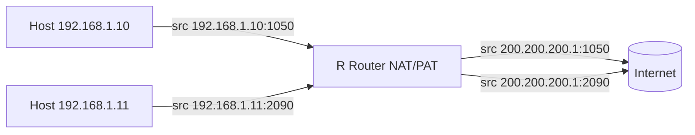

**NAT** (Network Address Translation) traduce direcciones IPv4 privadas a
públicas (y viceversa) en el router de borde. Así, las redes internas con
direcciones RFC 1918 pueden salir a internet sin agotar el espacio público.

## ¿Por qué usar NAT?

- **Ahorro de direcciones públicas**: muchas IPs privadas comparten pocas
  públicas.
- **Seguridad/apariencia**: las direcciones internas no se exponen.
- **Simplifica cambios**: se puede cambiar de ISP sin retocar los hosts.

Direcciones **privadas** (RFC 1918), que siempre se traducen en NAT:

| Clase | Rango                              |
| :---- | :--------------------------------- |
| A     | 10.0.0.0 – 10.255.255.255          |
| B     | 172.16.0.0 – 172.31.255.255        |
| C     | 192.168.0.0 – 192.168.255.255      |

## Tipos de NAT

| Tipo                    | Relación                         | Uso                          |
| :---------------------- | :------------------------------- | :--------------------------- |
| **Estático (1:1)**      | Una privada ↔ una pública fija   | Servidores accesibles desde fuera |
| **Dinámico**            | Pool de públicas, primera libre  | Sin sobrecarga               |
| **PAT (overloading)**   | Muchas privadas → una pública con puertos | Salida a internet de todos |

### PAT: sobrecarga con puertos

**PAT** (Port Address Translation) comparte **una sola IP pública** entre todos
los hosts usando el **puerto origen TCP/UDP** para distinguir las sesiones:

```
Privada   192.168.1.10:1050  -> 200.200.200.1:1050
Privada   192.168.1.11:2090  -> 200.200.200.1:2090
```


## Configuración de NAT estático

Permite que un servidor interno (ej. web) sea accesible desde internet con una
IP pública fija:

```ios

R1(config)# interface GigabitEthernet0/0
R1(config-if)# ip nat inside
R1(config)# interface GigabitEthernet0/1
R1(config-if)# ip nat outside
```
## Configuración de PAT (NAT con sobrecarga)

```ios
R1(config)# ip nat pool PUBLICA 200.200.200.1 200.200.200.1 netmask 255.255.255.0
R1(config)# ip nat inside source list 1 pool PUBLICA overload

R1(config)# interface GigabitEthernet0/0
R1(config-if)# ip nat inside
R1(config)# interface GigabitEthernet0/1
R1(config-if)# ip nat outside
```
| Comando                                       | Función                                  |
| :-------------------------------------------- | :--------------------------------------- |
| `access-list 1 permit 192.168.1.0 0.0.0.255`  | Qué hosts se traducen (ACL estándar)     |
| `ip nat pool PUBLICA ...`                     | Define el pool de direcciones públicas   |
| `ip nat inside source list 1 pool PUBLICA overload` | Aplica PAT (overload)               |
| `ip nat inside` / `ip nat outside`            | Marca el sentido (interno/externo) de la interfaz |

> **`overload`** es la palabra clave que activa el **PAT**. Sin ella, la
> traducción es dinámica sin compartir puertos.

## Terminología y traducciones

| Término         | Significado                          |
| :-------------- | :----------------------------------- |
| Inside local    | IP privada de un host interno        |
| Inside global   | IP pública que representa al host    |
| Outside local   | IP del host externo vista desde dentro |
| Outside global  | IP real del host externo             |

```R1# show ip nat translations
Pro  Inside global      Inside local       Outside local      Outside global
---  200.200.200.1      192.168.1.10       ---                ---
tcp  200.200.200.1:1050 192.168.1.10:1050  8.8.8.8:53         8.8.8.8:53
```
## Verificación

```ios
R1# show ip nat statistics
Total active translations: 12 (0 static, 12 dynamic; 12 extended)
Outside interfaces: GigabitEthernet0/1
Inside interfaces: GigabitEthernet0/0
Hits: 245  Misses: 3
```

- `Hits`: traducciones encontradas en la tabla (el host ya está traducido).
- `Misses`: primeras veces que hay que crear la traducción.

> **Debug:** `debug ip nat` muestra cada traducción en tiempo real (usar con
> cuidado en producción).

## Preguntas tipo CCNA

1. **¿Qué problema resuelve NAT/PAT?**
   La **escasez de direcciones IPv4 públicas**, permitiendo que muchos hosts
   privados compartan pocas (o una) públicas.

2. **¿Qué diferencia hay entre NAT dinámico y PAT?**
   PAT (**overload**) comparte **una IP pública con distintos puertos**; el NAT
   dinámico asigna una IP del pool por sesión sin compartir puertos.

3. **¿Qué comando activa la sobrecarga?**
   La palabra clave **`overload`** en `ip nat inside source ...`.

4. **¿Cómo se indica qué tráfico traducir?**
   Con una **ACL estándar** (`access-list 1 permit ...`) referenciada en el
   `ip nat inside source list`.

5. **¿Qué comandos marcan el interior y el exterior?**
   `ip nat inside` en la interfaz LAN y `ip nat outside` en la que va hacia el
   ISP.

## Resumen

- **NAT** traduce privadas↔públicas en el router de borde.
- Tipos: **estático** (1:1), **dinámico** (pool) y **PAT/overloading** (una
  pública, muchos puertos).
- Configuración: ACL de hosts + pool (o static) + `overload` + interfaces
  `inside`/`outside`.
- Se verifica con `show ip nat translations` y `show ip nat statistics`.