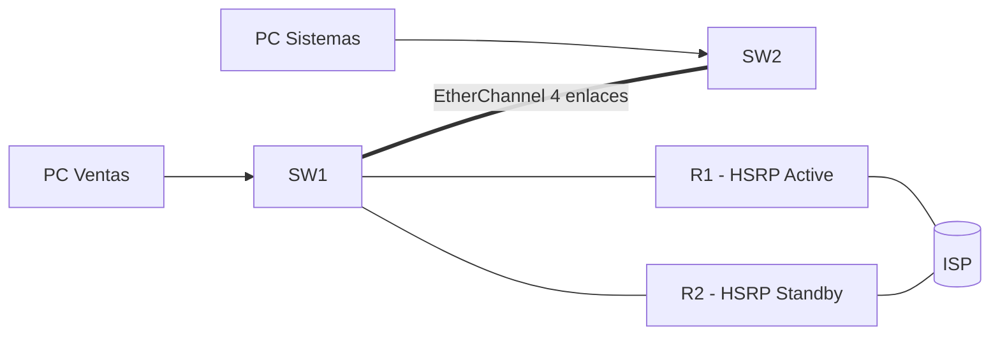

Cuarta parte de la serie. La red del [ejercicio anterior](../05-switching-security/exercise)
ya es redundante y segura en la capa 2 (EtherChannel, STP, protección de
puertos). Ahora le falta el mismo tratamiento en el **gateway**: si R1 se cae,
los hosts se quedan sin salida. Añade un segundo router (R2) y dale a la red un
**gateway virtual compartido** con HSRP, además de rutas hacia el ISP con un
respaldo en la distancia administrativa.



## Requisitos

- Red del [ejercicio anterior](../05-switching-security/exercise) funcionando:
  VLANs 10/20/99, EtherChannel entre SW1-SW2 y router-on-a-stick con R1.
- Se añade **R2**, un segundo router del edificio, conectado por trunk a SW1 y
  con su propio enlace al ISP (10.0.0.4/30, IP 10.0.0.5). Configúralo con la
  base del [Módulo 2](../02-device-management/exercise) (hostname, secret, SSH).

## Objetivos

1. Compartir un **gateway virtual** entre R1 y R2 con **HSRP** por VLAN.
2. Que el relevo sea automático: prioridad + **preempt** + **tracking** del
   enlace al ISP.
3. Mantener la **selección de ruta** correcta hacia el ISP (AD y ruta
   flotante).
4. Verificar el failover simulando la caída de R1 y de su enlace WAN.

## Pasos

### 1. Subinterfaces y HSRP en R1 (Active)

R1 sigue siendo el gateway principal. Ahora, en cada subinterfaz, la IP real y
la **IP virtual** que usarán los hosts (192.168.10.254, 192.168.20.254 y
192.168.99.254):

```ios
R1(config)# interface GigabitEthernet0/0.10
R1(config-subif)# encapsulation dot1q 10
R1(config-subif)# ip address 192.168.10.1 255.255.255.0
R1(config-subif)# standby version 2
R1(config-subif)# standby 10 ip 192.168.10.254
R1(config-subif)# standby 10 priority 150
R1(config-subif)# standby 10 preempt
R1(config-subif)# standby 10 track Serial0/0/0 30
R1(config-subif)# exit

R1(config)# interface GigabitEthernet0/0.20
R1(config-subif)# encapsulation dot1q 20
R1(config-subif)# ip address 192.168.20.1 255.255.255.0
R1(config-subif)# standby 20 ip 192.168.20.254
R1(config-subif)# standby 20 priority 150
R1(config-subif)# standby 20 preempt
R1(config-subif)# standby 20 track Serial0/0/0 30
R1(config-subif)# exit

R1(config)# interface GigabitEthernet0/0.99
R1(config-subif)# encapsulation dot1q 99 native
R1(config-subif)# ip address 192.168.99.1 255.255.255.0
R1(config-subif)# standby 99 ip 192.168.99.254
R1(config-subif)# standby 99 priority 150
R1(config-subif)# standby 99 preempt
R1(config-subif)# standby 99 track Serial0/0/0 30
R1(config-subif)# exit
```

### 2. Subinterfaces y HSRP en R2 (Standby)

Las mismas subinterfaces en R2 pero con **prioridad 100** (default). Las PCs y
los switches **no cambian su gateway**: siguen apuntando a las IP virtuales
`.254`, que ahora pertenecen al grupo HSRP.

```ios
R2(config)# interface GigabitEthernet0/0.10
R2(config-subif)# encapsulation dot1q 10
R2(config-subif)# ip address 192.168.10.2 255.255.255.0
R2(config-subif)# standby version 2
R2(config-subif)# standby 10 ip 192.168.10.254
R2(config-subif)# standby 10 preempt
R2(config-subif)# exit

R2(config)# interface GigabitEthernet0/0.20
R2(config-subif)# encapsulation dot1q 20
R2(config-subif)# ip address 192.168.20.2 255.255.255.0
R2(config-subif)# standby 20 ip 192.168.20.254
R2(config-subif)# standby 20 preempt
R2(config-subif)# exit

R2(config)# interface GigabitEthernet0/0.99
R2(config-subif)# encapsulation dot1q 99 native
R2(config-subif)# ip address 192.168.99.2 255.255.255.0
R2(config-subif)# standby 99 ip 192.168.99.254
R2(config-subif)# standby 99 preempt
R2(config-subif)# exit
```

> **Preemption** en ambos: si R1 (prioridad 150) vuelve tras una caída, vuelve
> a asumir el papel de Active automáticamente — sin `preempt` no recuperaría el
> rol.
>
> El **tracking** solo hace falta en R1: si su enlace al ISP (Serial0/0/0)
> cae, baja su prioridad 30 puntos (150 → 120) y R2 queda por encima. Sin
> tracking, un relé solo funcionaría si R1 se apaga del todo, no si pierde la
> salida.

### 3. Rutas hacia el ISP con respaldo

R1 y R2 necesitan la ruta por defecto hacia su propio enlace al ISP. En la
AD está el respaldo: una **ruta flotante** converge solo si la principal se
pierde.

```ios
R1(config)# ip route 0.0.0.0 0.0.0.0 10.0.0.2
R1(config)# ip route 0.0.0.0 0.0.0.0 10.0.0.6 200

R2(config)# ip route 0.0.0.0 0.0.0.0 10.0.0.6
R2(config)# ip route 0.0.0.0 0.0.0.0 10.0.0.2 200
```

R1 (Active) usa por defecto la ruta **AD 1** directa a su ISP; la ruta a `10.0.0.6`
con **AD 200** solo aparece en la tabla si la primera se pierde (por ejemplo,
cuando R1 pierde el enlace WAN y HSRP pasa el gateway a R2).

## Verificación

### Estado HSRP

```ios
R1# show standby
GigabitEthernet0/0.10 - Group 10
  State is Active
  Virtual IP address is 192.168.10.254
  Priority 150 (configured 150)
  Preemption enabled
  Track interface Serial0/0/0
    Decrement 30, state Up
  ...

R2# show standby
GigabitEthernet0/0.10 - Group 10
  State is Standby
  Virtual IP address is 192.168.10.254
  Priority 100 (default)
  ...
```

### Tabla de rutas

```ios
R1# show ip route
S*      0.0.0.0/0 [1/0] via 10.0.0.2
```

La ruta flotante (`AD 200` vía `10.0.0.6`) no aparece hasta que la principal
desaparezca — ese `[1/0]` es la confirmación de que la AD está eligiendo la
ruta directa.

### Prueba de falla

1. Conecta una PC de Ventas y verifica el ping normal a la otra VLAN y al ISP.
2. Apaga **R1** (o desconecta su enlace al ISP): el tráfico debe seguir saliendo
   por R2 en segundos. `show standby` en R2 debe pasar a `Active`.
3. Sin tocar R1, desconecta solo su **enlace WAN**: `show standby` en R1 baja la
   prioridad (150 → 120) y R2 asume; al restaurarlo, R1 recupera el papel por
   `preempt`.
4. `show ip route` de R1 durante la falla del enlace WAN debe mostrar que la ruta
   principal salió de la tabla (y que HSRP hizo el relevo).

## Comprobación final

| Pregunta                        | Respuesta esperada                                |
| :------------------------------ | :------------------------------------------------ |
| ¿Quién es el Active de HSRP?    | R1 (prioridad 150 + preempt)                      |
| ¿Qué pasa si R1 pierde el WAN?  | Tracking baja su prioridad 30 y R2 toma el relevo |
| ¿Vuelve R1 a ser Active?        | Sí, por `preempt` cuando la prioridad supera      |
| ¿Dónde está el respaldo de ruta?| Ruta flotante con AD 200 hacia el ISP de R2       |
| ¿Cambian las PCs su gateway?    | No, siguen apuntando a las IP virtuales `.254`    |

## Resumen

- **HSRP** comparte un gateway virtual entre R1 y R2; los hosts nunca cambian
  su configuración.
- **Prioridad + preempt** deciden quién es Active y permiten recuperar el rol.
- **Tracking de interfaz** provoca el failover cuando el enlace al ISP cae,
  aunque el router siga vivo.
- La **ruta flotante (AD 200)** es el soporte de routing que acompaña al
  relé: garantiza que siempre haya un camino al ISP en la tabla.
- Guarda la configuración de los dos routers:
  `copy running-config startup-config`.

En el [Módulo 7](../07-wireless-networks/) añadirás el acceso **inalámbrico**
(WLAN) a la misma red.