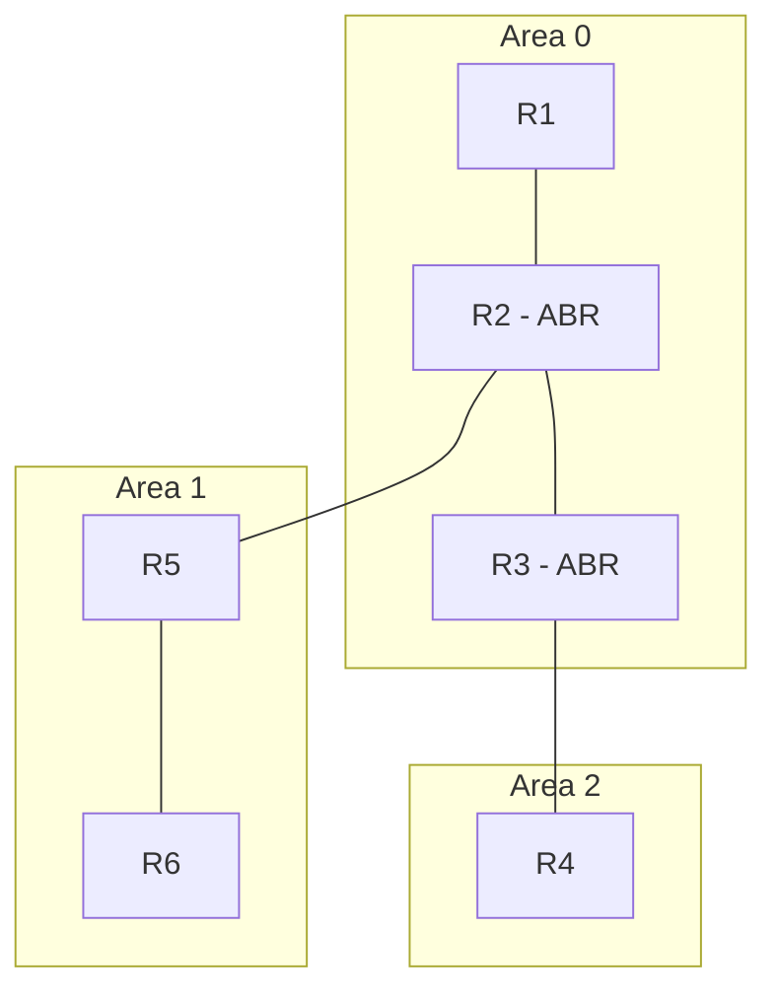
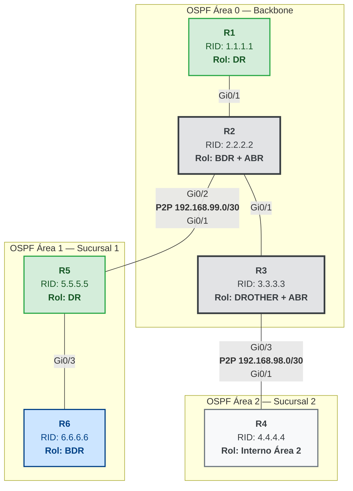

## Multi-área

El núcleo ya funciona, pero la empresa abre dos sucursales: la sucursal 1 tiene sus propios routers (R5 y R6) con sus LANs (`192.168.20.0/24` y `192.168.21.0/24`), y la sucursal 2 tiene su router (R4) con su LAN (`192.168.30.0/24`). La opción fácil sería meter a todos también en el área 0 — pero eso significa que la LSDB completa del núcleo crece con cada cambio de las sucursales, y un enlace inestable ahí fuerza un recálculo de SPF en los 3 routers del core, aunque no tenga nada que ver con ellos.

La solución es crear un área nueva para cada sucursal — el **área 1** y el **área 2** — y usar a **R2** y **R3** (que ya están en el segmento del core) como puentes hacia cada una: R2 agrega una interfaz punto a punto hacia R5 (área 1), y R3 agrega otra hacia R4 (área 2). Dentro del área 1, R5 y R6 se conectan por un segmento multiacceso donde R5 actúa como DR.



### Áreas, backbone y ABR

El **área 0**, también llamada **backbone**, es la única área que puede existir sola y a la que todas las demás deben conectarse — directa o indirectamente. El área 1 (la sucursal) solo conoce el detalle de sus propios enlaces; todo lo que hay en el área 0 le llega como rutas ya resumidas.

R2 pasa a ser el **ABR** (Area Border Router) porque queda con una pata en cada área: una hacia el segmento del core (área 0), otra hacia R5 (área 1). De la misma forma, R3 también es ABR — tiene una pata en el área 0 y otra hacia R4 (área 2). Ese es justamente el trabajo del ABR — mantener la LSDB completa de ambas áreas donde participa, y traducir entre ellas resumiendo lo que una necesita saber de la otra sin exponer el detalle completo de cada enlace. Si más adelante se abriera una tercera sucursal, tendría que llegar a la red también a través de un ABR conectado al área 0 — nunca directamente entre áreas, porque el backbone es el único tránsito permitido entre ellas.

Ese resumen entre áreas se anuncia con un tipo específico de LSA:

| LSA | Tipo         | Anuncia                                 |
| :-- | :----------- | :-------------------------------------- |
| 1   | Router LSA   | Las redes del propio router             |
| 2   | Network LSA  | La red multiacceso (la anuncia el DR)   |
| 3   | Summary LSA  | Redes de otras áreas — la genera el ABR |
| 4   | ASBR LSA     | Ubicación del ASBR                      |
| 5   | External LSA | Rutas externas (redistribución)         |

Es exactamente la LSA tipo 3 la que va a hacer que la LAN de la sucursal aparezca en la tabla de R1, sin que R1 sepa nada del detalle interno del área 1.

### Configuración

En **R2**, se agrega la interfaz hacia R5 (enlace punto a punto `192.168.99.0/30`) dentro del área 1:



**Área 0 — Segmento multiacceso y LAN Servidores:**

En **R2**, se agrega la interfaz hacia R5 (enlace punto a punto `192.168.99.0/30`) dentro del área 1:

```ios
R2(config)# interface GigabitEthernet0/2
R2(config-if)# ip address 192.168.99.1 255.255.255.252
R2(config-if)# ip ospf network point-to-point
R2(config-if)# no shutdown
R2(config-if)# exit
R2(config)# router ospf 1
R2(config-router)# no passive-interface GigabitEthernet0/2
R2(config-router)# exit
R2(config)# interface GigabitEthernet0/2
R2(config-if)# ip ospf 1 area 1
```

> **¿Por qué `point-to-point` entre ABR y routers internos?** Cuando un enlace conecta exactamente dos routers (como R2↔R5 o R3↔R4), configurarlo como `ip ospf network point-to-point` elimina la elección de DR/BDR — un proceso que en enlaces de solo dos nodos es overhead innecesario. Además, suppress la generación de LSA tipo 2 (Network LSA), manteniendo la LSDB más pequeña y la convergencia más rápida. En OSPFv3 (IPv6) este es el comportamiento por defecto.

**Área 1 — Segmento multiacceso y LANs sucursal:**

En **R5**, la interfaz hacia R2 es punto a punto, pero la interfaz hacia R6 es multiacceso (broadcast) para que se elija DR/BDR. La LAN de la sucursal también queda en área 1:

```ios
R5(config)# interface GigabitEthernet0/1
R5(config-if)# ip address 192.168.99.2 255.255.255.252
R5(config-if)# ip ospf network point-to-point
R5(config-if)# no shutdown
R5(config)# interface GigabitEthernet0/2
R5(config-if)# ip address 192.168.20.1 255.255.255.0
R5(config-if)# no shutdown
R5(config)# interface GigabitEthernet0/3
R5(config-if)# ip address 192.168.100.1 255.255.255.0
R5(config-if)# no shutdown
R5(config-if)# exit
R5(config)# router ospf 1
R5(config-router)# router-id 5.5.5.5
R5(config-router)# passive-interface default
R5(config-router)# no passive-interface GigabitEthernet0/1
R5(config-router)# no passive-interface GigabitEthernet0/3
R5(config-router)# exit
R5(config)# interface GigabitEthernet0/1
R5(config-if)# ip ospf 1 area 1
R5(config)# interface GigabitEthernet0/2
R5(config-if)# ip ospf 1 area 1
R5(config)# interface GigabitEthernet0/3
R5(config-if)# ip ospf 1 area 1
```

En **R6**, la interfaz hacia R5 y la LAN de la sucursal quedan las dos en área 1. Como la interfaz hacia R5 es broadcast, DR/BDR se elige automáticamente:

```ios
R6(config)# interface GigabitEthernet0/1
R6(config-if)# ip address 192.168.100.2 255.255.255.0
R6(config-if)# no shutdown
R6(config)# interface GigabitEthernet0/2
R6(config-if)# ip address 192.168.21.1 255.255.255.0
R6(config-if)# no shutdown
R6(config-if)# exit
R6(config)# router ospf 1
R6(config-router)# router-id 6.6.6.6
R6(config-router)# passive-interface default
R6(config-router)# no passive-interface GigabitEthernet0/1
R6(config-router)# exit
R6(config)# interface GigabitEthernet0/1
R6(config-if)# ip ospf 1 area 1
R6(config)# interface GigabitEthernet0/2
R6(config-if)# ip ospf 1 area 1
```

Como el enlace entre R5 y R6 es broadcast (multiacceso), OSPF elige un DR — R5, en este caso, por su Router ID más bajo.

**Área 2 — LAN sucursal 2:**

En **R4**, la interfaz hacia R3 y la LAN de la sucursal quedan las dos en área 2:

```ios
R4(config)# interface GigabitEthernet0/1
R4(config-if)# ip address 192.168.98.2 255.255.255.252
R4(config-if)# ip ospf network point-to-point
R4(config-if)# no shutdown
R4(config)# interface GigabitEthernet0/2
R4(config-if)# ip address 192.168.30.1 255.255.255.0
R4(config-if)# no shutdown
R4(config-if)# exit
R4(config)# router ospf 1
R4(config-router)# router-id 4.4.4.4
R4(config-router)# passive-interface default
R4(config-router)# no passive-interface GigabitEthernet0/1
R4(config-router)# exit
R4(config)# interface GigabitEthernet0/1
R4(config-if)# ip ospf 1 area 2
R4(config)# interface GigabitEthernet0/2
R4(config-if)# ip ospf 1 area 2
```

Verificando desde R3 — el enlace a R4 es punto a punto, así que no hay elección de DR/BDR:

```ios
R3# show ip ospf neighbor
Neighbor ID   Pri   State    Dead Time   Address        Interface
4.4.4.4         1   FULL/ -  00:00:35    192.168.98.2   GigabitEthernet0/3
```

Y desde R1, en el otro extremo del core, las LANs de ambas sucursales ya aparecen en la tabla — todas marcadas como rutas inter-area:

```ios
R1# show ip route ospf
O     10.0.30.0/24  [110/11] via 192.168.10.3, 00:03:12, GigabitEthernet0/1
O IA  192.168.20.0/24 [110/22] via 192.168.10.2, 00:01:15, GigabitEthernet0/1
O IA  192.168.21.0/24 [110/22] via 192.168.10.2, 00:00:52, GigabitEthernet0/1
O IA  192.168.30.0/24 [110/22] via 192.168.10.3, 00:00:45, GigabitEthernet0/1
```

`O IA` (_inter-area_) marca que esas rutas no se calcularon con el detalle completo del enlace — llegaron resumidas vía las LSA tipo 3 que generaron R2 y R3 como ABRs. Es la confirmación de que la separación en áreas está funcionando: R1 sabe llegar a ambas sucursales sin haber visto un solo detalle de sus topologías internas.

## Preguntas tipo CCNA

1. **¿Qué es un ABR y para qué sirven las áreas?** Un **ABR** tiene interfaces en dos o más áreas y resume entre ellas con LSA tipo 3; las áreas limitan el tamaño de la LSDB y evitan que un cambio remoto fuerza un recálculo de SPF en toda la red.

2. **¿Cómo se distingue en `show ip route` una ruta dentro del área de una que vino de otra área?** Con el código `O IA` (_inter-area_), a diferencia del `O` simple de una ruta calculada con el detalle completo dentro de la misma área.

3. **¿Por qué un enlace punto a punto no necesita DR/BDR?** Porque solo puede tener dos extremos — no hay un tercer router con el que competir por sincronizar. Con `ip ospf network point-to-point` la adyacencia pasa directo a `FULL/ -`, sin elección.

## Resumen

- En un diseño **full-mesh punto a punto** cada enlace une solo dos routers, la elección de DR/BDR se omite (`ip ospf network point-to-point`) y las adyacencias llegan a `FULL/ -` sin pasar por `2-Way`.
- **Multi-área** activa cuando un área única empieza a cargar cambios remotos innecesarios: el **ABR** resume con LSA tipo 3, y las rutas resumidas se identifican como `O IA` en la tabla. Un diseño puede tener múltiples ABRs, cada uno conectando diferentes áreas al backbone.
- El **área 0** (backbone) es el tránsito obligatorio entre áreas — nunca hay conexión directa área-a-área sin pasar por ella.
- Se verifica con `show ip ospf neighbor` (estado de las adyacencias) y `show ip route ospf` (rutas intra-área u `O IA`).

Los conceptos base (DR/BDR, Router ID, métrica coste, configuración de un área única) están en [OSPF](../04-routing-protocols/ospf).
