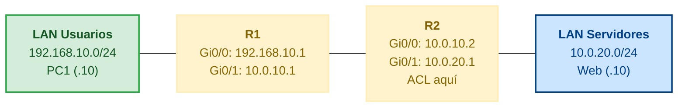

Una **ACL** (Access Control List) es una lista ordenada de permisos/denegaciones
(`permit`/`deny`) que filtra paquetes por IP, protocolo o puerto. Se aplican en
las interfaces para controlar el tráfico que entra o sale.

## Tipos de ACL

| Tipo      | Filtra                            | Números                |
| :-------- | :-------------------------------- | :--------------------- |
| **Estándar** | Solo **IP de origen**           | 1-99, 1300-1999        |
| **Extendida** | IP origen/destino, protocolo, **puerto** | 100-199, 2000-2699 |

- **Estándar**: simplista, se aplica lo más **cerca del destino** (no distingue
  a dónde va el tráfico).
- **Extendida**: más precisa, se aplica lo más **cerca del origen** (para no
  gastar ancho de banda enviando tráfico que será denegado).

### Wildcard mask

Las ACL usan **wildcards** (inversa de la máscara):

| Máscara subnet | Wildcard   |
| :------------- | :--------- |
| 255.255.255.0  | 0.0.0.255  |
| 255.255.255.128| 0.0.0.127  |
| 255.255.0.0    | 0.0.255.0  |

- **0** = el bit debe **coincidir**; **1** = el bit es **irrelevante**.
- `0.0.0.0` = coincide solo con esa IP (`host`). `255.255.255.255` =
  cualquiera (`any`).

```
permit 192.168.1.0 0.0.0.255   = cualquier host de 192.168.1.0/24
permit host 192.168.1.10       = solo la IP 192.168.1.10
permit any                     = todo el tráfico
```

## Reglas fundamentales

1. Las ACL se evalúan **en orden**: la primera coincidencia decide (no se siguen
   evaluando).
2. Hay un **deny all implícito** al final: si no coincide ninguna entrada, se
   deniega.
3. Por eso, si el objetivo es permitir solo ciertos flujos, hay que incluir
   **al menos un `permit`** (el resto queda denegado).
4. En una interfaz solo puede haber **una ACL por protocolo por dirección**.

## ACL estándar

Filtra por **IP de origen**. Configuración:

```ios
R1(config)# access-list 10 deny any

R1(config)# interface GigabitEthernet0/1
R1(config-if)# ip access-group 10 in
```
- `access-list <n> permit|deny <IP> <wildcard>` define la regla.
- `ip access-group <n> in|out` aplica la ACL a la interfaz (sentido).

## ACL extendida

Filtra por origen, destino, protocolo y puerto:

```ios
R1(config)# access-list 100 deny ip any any

R1(config)# interface GigabitEthernet0/0
R1(config-if)# ip access-group 100 out
```

| Partes del comando                    | Significado                         |
| :------------------------------------ | :---------------------------------- |
| `access-list 100 permit tcp`          | Permite TCP                         |
| `192.168.1.0 0.0.0.255`               | IPs de origen                       |
| `host 10.0.0.10`                      | Destino (una IP concreta)           |
| `eq 80`                               | Puerto destino 80 (HTTP)            |
| `deny ip any any`                     | Deniega todo lo demás               |

Otros operadores de puerto: `eq` (igual), `neq` (distinto), `gt` (mayor),
`lt` (menor), `range 1000 2000`.

### Keyword `established`

En ACLs extendidas TCP, el keyword **`established`** permite solo tráfico de
retorno — paquetes con ACK o RST activo, es decir, conexiones ya abiertas — y
bloquea las conexiones nuevas entrantes:

```ios
R1(config)# access-list 110 permit tcp any 10.0.20.0 0.0.0.255 established
R1(config)# access-list 110 deny   ip any any
```

Desde afuera no se puede iniciar una conexión hacia la subred `10.0.20.0/24`,
pero las respuestas a conexiones que nacieron desde dentro sí pasan. Es útil
cuando un servidor está detrás de un router y solo debe responder, no aceptar
nuevas conexiones de fuera.

## ACL con nombre (named ACL)

Más legible que las numéricas:

```ios
R1(config-ext-nacl)# deny tcp any any eq 80
R1(config-ext-nacl)# deny tcp any any eq 443
R1(config-ext-nacl)# permit ip any any

R1(config)# interface GigabitEthernet0/0
R1(config-if)# ip access-group BLOQUEAR-WEB in
```
> Con las **named ACL** se pueden **editar** reglas sin borrar toda la lista;
> en las numéricas, para cambiar hay que borrar y reescribir.

## ACL basada en tiempo (time-range)

Permite que una regla ACL solo esté activa en horarios definidos. Primero se
define el rango de tiempo, y luego se referencia desde la ACL:

```ios
R1(config)# time-range HORARIO-LABORAL
R1(config-time-range)# periodic weekdays 08:00 to 18:00
```

```ios
R1(config)# ip access-list extended FILTRAR-FUERA-HORARIO
R1(config-ext-nacl)# deny   tcp any 10.0.20.0 0.0.0.255 eq 80 time-range HORARIO-LABORAL
R1(config-ext-nacl)# deny   tcp any 10.0.20.0 0.0.0.255 eq 443 time-range HORARIO-LABORAL
R1(config-ext-nacl)# permit ip any any

R1(config)# interface GigabitEthernet0/0
R1(config-if)# ip access-group FILTRAR-FUERA-HORARIO in
```

Así el puerto 80 y 443 quedan bloqueados solo de lunes a viernes de 8:00 a
18:00; fuera de ese horario la travesía pasa libremente. Si el router no tiene
`clock set` o un servidor NTP, el `time-range` no funciona — el router no sabe
qué hora es.

```ios
R1# show time-range
time-range entry: HORARIO-LABORAL (active)
   periodic weekdays 08:00 to 18:00
```

`active` confirma que el rango está vigente ahora; `inactive` significa que
todavía no empezó o ya terminó.

## ACL para SSH (restringir administración)

Solo permite administración remota desde una subred de operaciones:

```ios
R1(config)# line vty 0 4
R1(config-line)# access-class 15 in
```

> Para líneas **VTY** la ACL se aplica con **`access-class`**, no con
> `ip access-group`.

## Escenario completo

La empresa tiene una LAN de usuarios (`192.168.10.0/24`) detrás de R1, un
servidor web interno (`10.0.20.10`) en la LAN de servidores (`10.0.20.0/24`),
y R2 de borde entre ambas. La política es:

- Solo se permite **HTTP/HTTPS** (puertos 80/443) al servidor `10.0.20.10`.
- Todo lo demás hacia `10.0.20.0/24` se deniega.
- El tráfico de retorno (ya establecido) siempre pasa.



La ACL se aplica en **R2, interfaz Gi0/1 sentido `out`** — justo antes de que
el tráfico llegue a la LAN de servidores. Ruta por defecto en ambos lados para
que se alcancen las subredes.

Configuración de la ACL en R2:

```ios
R2(config)# ip access-list extended FILTRO-SERVIDOR
R2(config-ext-nacl)# permit tcp 192.168.10.0 0.0.0.255 host 10.0.20.10 eq 80
R2(config-ext-nacl)# permit tcp 192.168.10.0 0.0.0.255 host 10.0.20.10 eq 443
R2(config-ext-nacl)# permit tcp any host 10.0.20.10 eq 80 established
R2(config-ext-nacl)# permit tcp any host 10.0.20.10 eq 443 established
R2(config-ext-nacl)# deny   ip any 10.0.20.0 0.0.0.255
R2(config-ext-nacl)# permit ip any any
```

```ios
R2(config)# interface GigabitEthernet0/1
R2(config-if)# ip access-group FILTRO-SERVIDOR out
```

Verificando:

```ios
R2# show ip access-lists FILTRO-SERVIDOR
Extended IP access list FILTRO-SERVIDOR
    10 permit tcp 192.168.10.0 0.0.0.255 host 10.0.20.10 eq www (247 matches)
    20 permit tcp 192.168.10.0 0.0.0.255 host 10.0.20.10 eq 443 (89 matches)
    30 permit tcp any host 10.0.20.10 eq www established (523 matches)
    40 permit tcp any host 10.0.20.10 eq 443 established (187 matches)
    50 deny ip any 10.0.20.0 0.0.0.255 (14 matches)
    60 permit ip any any (4021 matches)
```

## Verificación

```ios
Extended IP access list BLOQUEAR-WEB
    10 deny tcp any any eq www (34 matches)
    20 deny tcp any any eq 443 (12 matches)
    30 permit ip any any (1203 matches)

R1# show ip interface GigabitEthernet0/0
  Outgoing access list is 100
  Inbound access list is not set
```

- Los **matches** muestran cuántos paquetes coincidieron con cada regla; útil
  para depurar.

## Preguntas tipo CCNA

1. **¿Qué diferencia hay entre una ACL estándar y una extendida?**
   La estándar filtra solo por **IP de origen**; la extendida por **origen,
   destino, protocolo y puerto**.

2. **¿Dónde se coloca una ACL estándar y una extendida?**
   La estándar **cerca del destino**; la extendida **cerca del origen**.

3. **¿Qué hace el deny all implícito?**
   Deniega todo paquete que no coincida con ninguna regla; por eso casi siempre
   se necesita al menos un `permit`.

4. **¿Qué comando aplica una ACL a una interfaz?**
   `ip access-group <lista> in|out` en el modo interfaz.

5. **¿Cómo se restringe el acceso VTY (SSH/Telnet) con una ACL?**
   Con **`access-class`** dentro de `line vty` referenciando la ACL.

6. **¿Qué keyword permite en una ACL extendida que solo pase tráfico TCP de retorno ya establecido?**
   **`established`** — solo acepta paquetes con ACK o RST activo; bloquea
   conexiones nuevas entrantes.

7. **¿Cómo se define una ACL que solo actúe en ciertos horarios?**
   Se crea un **`time-range`** con periodicidad y horas, y se referencia con
   `time-range <nombre>` en la regla ACL. Sin un reloj válido (`clock set` o
   NTP) el rango no funciona.

8. **Si una ACL extendida se aplica `in` en Gi0/0 (subred 192.168.10.0/24), ¿qué tráfico está examinando?**
   El que **entra** al router desde los hosts de esa subred: es decir, los
   paquetes con origen en 192.168.10.0/24 hacia cualquier destino.

9. **¿Qué pasa si un paquete no coincide con ninguna regla de una ACL?**
   Lo captura el **deny all implícito** al final y se descarta.

## Resumen

- **ACL estándar** (1-99): solo IP origen. **Extendida** (100-199): origen,
  destino, protocolo y puerto.
- **`established`** (extendida TCP): permite solo tráfico de retorno; bloquea
  conexiones nuevas entrantes.
- **`time-range`**: hace que una regla solo esté activa en horarios definidos;
  requiere reloj válido.
- Orden de evaluación **secuencial** y **deny all implícito** final.
- Se aplican con **`ip access-group`** (interfaces) y **`access-class`** (VTY).
- **Wildcards** (`0.0.0.255`) definen rangos; `host` y `any` son atajos.
- Verifica con `show ip access-lists`, `show time-range` y los contadores de matches.