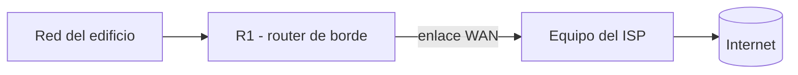
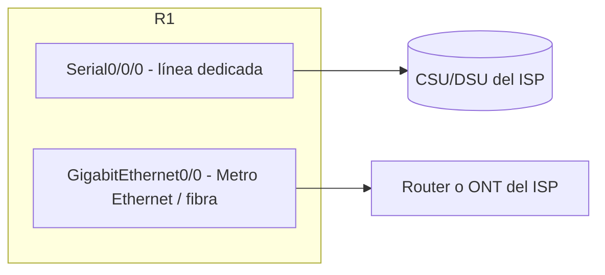

Este tema cubre la frontera de la red: qué hay del otro lado del cable de R1 y
cómo se configura.

## ¿Qué es un ISP y qué te entrega?

El **ISP** es el proveedor que conecta tu red con internet. Cuando contratas el
servicio, el ISP te entrega:

| Qué entrega           | Detalle                                                             |
| :-------------------- | :------------------------------------------------------------------ |
| **Enlace WAN**        | El medio físico que llega hasta tu router de borde                  |
| **Dirección pública** | Una IP IPv4 pública (o un rango) para tu borde                      |
| **Gateway del ISP**   | La IP del equipo del ISP al que apuntan tus rutas (salto siguiente) |



## Tipos de enlace WAN al ISP

Según la tecnología del proveedor, el enlace llega de distintas formas:

| Conexión                         | Medio             | Características                                         |
| :------------------------------- | :---------------- | :------------------------------------------------------ |
| **DSL (ADSL/VDSL)**              | Par de cobre      | Económica, velocidad media, distancia limitada          |
| **Cable (HFC)**                  | Coaxial           | Uso doméstico/pequeña empresa                           |
| **Fibra (FTTH/FTTP)**            | Fibra óptica      | Alta velocidad, bajo retardo                            |
| **Línea dedicada (Leased Line)** | Par/coaxial/fibra | Enlace punto a punto garantizado (E1/T1, 2 Mbps-1 Gbps) |
| **Metro Ethernet**               | Fibra             | Enlace Ethernet de empresa (10/100/1000 Mbps)           |

> En el examen CCNA la parte conceptual importa: saber distinguir que una
> **línea dedicada** es un enlace punto a punto contratado (generalmente con
> encapsulación HDLC o PPP), mientras que un enlace **Metro Ethernet** llega
> como una interfaz Ethernet normal.

## La interfaz de borde en R1

Según el tipo de enlace, el router usa una interfaz distinta:



- **Interfaz serial** (`Serial0/0/0`): línea dedicada; en el otro extremo hay
  un dispositivo del ISP (CSU/DSU, módem). Necesita reloj y encapsulación.
- **Interfaz Ethernet** (`GigabitEthernet0/1`): fibra o Metro Ethernet; se
  configura igual que cualquier interfaz LAN (IP + `no shutdown`).

```ios
# Línea dedicada (serial)
R1(config)# interface Serial0/0/0
R1(config-if)# description Enlace WAN hacia el ISP
R1(config-if)# ip address 10.0.0.1 255.255.255.252
R1(config-if)# encapsulation ppp
R1(config-if)# no shutdown

# Fibra / Metro Ethernet
R1(config)# interface GigabitEthernet0/1
R1(config-if)# description Enlace WAN hacia el ISP
R1(config-if)# ip address 200.200.200.1 255.255.255.252
R1(config-if)# no shutdown
```

## Encapsulación en enlaces seriales

En un enlace serial punto a punto hay que definir cómo se encapsulan las
tramas:

| Encapsulación | Estándar           | Características                                 |
| :------------ | :----------------- | :---------------------------------------------- |
| **HDLC**      | Propietaria Cisco  | Por defecto en routers Cisco; sin autenticación |
| **PPP**       | RFC 1661 (abierta) | Autenticación (PAP/CHAP), compresión, multilink |

> **HDLC de Cisco** no es compatible con equipos de otros fabricantes; si el
> equipo del ISP no es Cisco, hay que usar **PPP**. CCNA espera que sepas
> identificar que HDLC es la **propietaria** y PPP la **estándar**.

```ios
R1(config-if)# encapsulation ppp
```

## Direccionamiento hacia el ISP

El enlace hacia el ISP se numera con una **subred mínima** (normalmente `/30`,
con solo 2 hosts: tu router y el del proveedor):

| Elemento               | Ejemplo                                                                   |
| :--------------------- | :------------------------------------------------------------------------ |
| IP del enlace en R1    | 10.0.0.1 /30                                                              |
| IP del gateway del ISP | 10.0.0.2 /30                                                              |
| IP pública de tu borde | 200.200.200.1 (patada por NAT, ver [NAT / PAT](./nat-pat)) |

En algunos contratos el ISP entrega la IP pública por **DHCP**, y el router la
toma automáticamente como cliente:

```ios
R1(config)# interface GigabitEthernet0/1
R1(config-if)# ip address dhcp
R1(config-if)# no shutdown
```

## Ruta por defecto hacia el ISP

Con la interfaz WAN arriba, todo el tráfico sin destino local se envía al
gateway del ISP con una **ruta por defecto** (detalle en
[Rutas Estáticas y Default](../04-routing-protocols/static-default-routes)):

```ios
R1(config)# ip route 0.0.0.0 0.0.0.0 10.0.0.2
```

Para salir a internet además hace falta **NAT/PAT**, porque las redes internas
usan IPs privadas; eso se configura en el [NAT / PAT](./nat-pat).

## Verificación

```ios
R1# show ip interface brief
Interface             IP-Address      OK? Method Status                  Protocol
GigabitEthernet0/0    192.168.99.254  YES manual up                      up
Serial0/0/0           10.0.0.1        YES manual up                      up

R1# show ip route
S*   0.0.0.0/0 [1/0] via 10.0.0.2

R1# ping 8.8.8.8
```

- El enlace WAN debe estar `up/up` y tener su IP.
- La `S* 0.0.0.0/0` confirma la ruta por defecto hacia el ISP.
- El `ping 8.8.8.8` comprueba la salida (requiere NAT ya configurado, o que el
  destino responda a una IP pública enrutable).

## Preguntas tipo CCNA

1. **¿Qué es un ISP y qué entrega?**
   El **proveedor de servicios de internet**: entrega el **enlace WAN**, la
   **dirección pública** y el **gateway** al que apunta el router de borde.

2. **¿Qué encapsulación es propietaria de Cisco y cuál es el estándar?**
   **HDLC** (propietaria, por defecto) y **PPP** (estándar, con autenticación).

3. **¿Qué subred se usa típicamente para el enlace hacia el ISP?**
   Una **`/30`**: exactamente 2 hosts utilizables (R1 y el router del ISP).

4. **¿Cómo se llama la ruta que envía todo al ISP?**
   La **ruta por defecto** (`0.0.0.0/0`, gateway of last resort).

5. **¿Qué necesita una red con IPs privadas para salir a internet?**
   **NAT/PAT** en el router de borde, traduciendo las privadas a la IP pública.

## Resumen

- El **ISP** entrega el enlace WAN, la IP pública y el gateway del proveedor.
- Enlaces típicos: DSL, cable, **fibra**, **línea dedicada** (serial) y
  **Metro Ethernet** (Ethernet).
- En serial se elige encapsulación: **HDLC** (Cisco) o **PPP** (estándar).
- El enlace se numera con `/30`; el router puede tomar su IP por DHCP del ISP.
- La salida a internet usa **ruta por defecto** hacia el ISP + **NAT/PAT**.
