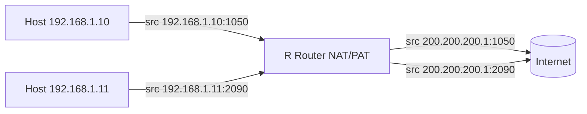
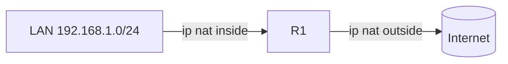
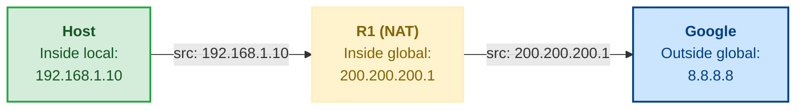

**NAT** (Network Address Translation) traduce direcciones IPv4 privadas a
públicas (y viceversa) en el router de borde. Así, las redes internas con
direcciones RFC 1918 pueden salir a internet sin agotar el espacio público.

## ¿Por qué usar NAT?

- **Ahorro de direcciones públicas**: muchas IPs privadas comparten pocas
  públicas.
- **Seguridad/apariencia**: las direcciones internas no se exponen.
- **Simplifica cambios**: se puede cambiar de ISP sin retocar los hosts.

Direcciones **privadas** (RFC 1918), que siempre se traducen en NAT:

| Clase | Rango                         |
| :---- | :---------------------------- |
| A     | 10.0.0.0 – 10.255.255.255     |
| B     | 172.16.0.0 – 172.31.255.255   |
| C     | 192.168.0.0 – 192.168.255.255 |

## Tipos de NAT

| Tipo                  | Relación                                  | Uso                               |
| :-------------------- | :---------------------------------------- | :-------------------------------- |
| **Estático (1:1)**    | Una privada ↔ una pública fija            | Servidores accesibles desde fuera |
| **Dinámico**          | Pool de públicas, primera libre           | Sin sobrecarga                    |
| **PAT (overloading)** | Muchas privadas → una pública con puertos | Salida a internet de todos        |

### PAT: sobrecarga con puertos

**PAT** (Port Address Translation) comparte **una sola IP pública** entre todos
los hosts usando el **puerto origen TCP/UDP** para distinguir las sesiones:

```
Privada   192.168.1.10:1050  -> 200.200.200.1:1050
Privada   192.168.1.11:2090  -> 200.200.200.1:2090
```



## Las interfaces inside y outside

NAT solo funciona si el router sabe **de qué lado está cada red**, y eso se le
indica marcando las interfaces:

- **`ip nat inside`** (interfaz **interna**): la que mira hacia la **red
  privada** (la LAN, las IPs RFC 1918).
- **`ip nat outside`** (interfaz **externa**): la que mira hacia el **ISP o
  internet** (las IPs públicas).



Con los sentidos marcados, la traducción ocurre al **cruzar de un lado al
otro**: una trama que entra por una interfaz inside y sale por la outside ve
traducida su IP de origen (privada → pública), y la respuesta que entra por la
outside deshace la traducción antes de entregarla en la LAN.

| Paso | Paquete                                     | Interfaz              | Qué hace el router                                                           |
| :--- | :------------------------------------------ | :-------------------- | :--------------------------------------------------------------------------- |
| 1    | `src 192.168.1.10:1050 → 8.8.8.8:53`        | Entra por **inside**  | Marca el paquete como candidato a traducción                                 |
| 2    | Sale hacia internet                         | Sale por **outside**  | Traduce el origen: `200.200.200.1:1050`, y guarda la entrada en la tabla NAT |
| 3    | Respuesta `8.8.8.8:53 → 200.200.200.1:1050` | Entra por **outside** | Consulta la tabla y restaura el origen: `192.168.1.10:1050`                  |
| 4    | Se entrega en la LAN                        | Sale por **inside**   | Entrega la trama al host original                                            |

> Sin las marcas, el router **no traduce nada**: el comando
> `ip nat inside source ...` define _qué_ y _cómo_ traducir, pero son
> `ip nat inside` / `ip nat outside` los que definen _dónde_ — es el error más
> común cuando "el NAT está bien configurado" pero no funciona.

## Configuración de NAT estático

Permite que un servidor interno (ej. web) sea accesible desde internet con una
IP pública fija. La traducción es **permanente**: siempre que el router vea
tráfico dirigido a la IP pública, lo envía a la IP interna correspondiente, y
cualquier tráfico que salga desde la IP interna se traduce a la pública — sin
necesidad de ACL ni pool.

```ios
R1(config)# interface GigabitEthernet0/0
R1(config-if)# ip nat inside
R1(config)# interface GigabitEthernet0/1
R1(config-if)# ip nat outside

R1(config)# ip nat inside source static 192.168.1.10 200.200.200.10
```

```ios
R1# show ip nat translations
Pro  Inside global      Inside local       Outside local      Outside global
---  200.200.200.10     192.168.1.10       ---                ---
```

Una entrada permanente sin protocolo ni puerto: la traducción existe en la tabla
desde que se configura, sin que haya tráfico previo. Si el servidor fuera UDP
(ajedrez, VoIP) o tuviera varios puertos, se usaría `ip nat inside source
static tcp/udp` con los puertos.

## Configuración de NAT dinámico

Asigna **una IP del pool por sesión**, pero sin sobrecarga — cuando se agotan
las IPs del pool, los hosts adicionales no pueden salir. Sin `overload` y sin
puertos: una IP = una traducción activa a la vez.

```ios
R1(config)# ip nat pool PUBLICAS 200.200.200.1 200.200.200.5 netmask 255.255.255.0
R1(config)# access-list 1 permit 192.168.1.0 0.0.0.255
R1(config)# ip nat inside source list 1 pool PUBLICAS
```

La diferencia con PAT es la ausencia de `overload`: el router asigna la primera
IP libre del pool a un host, la siguiente al siguiente, y cuando el host deja
de usarla (timer de inactividad, por defecto 24h), la devuelve al pool. Si los
5 clientes del pool están activos al mismo tiempo, el sexto host no puede
traducir hasta que alguno libere su dirección.

```ios
R1# show ip nat translations
Pro  Inside global      Inside local       Outside local      Outside global
---  200.200.200.1      192.168.1.10       ---                ---
---  200.200.200.2      192.168.1.11       ---                ---
```

Cada host obtuvo una IP distinta del pool, sin compartirla. Si el pool se
agota, la solución es pasar a PAT con `overload` — que es lo que hace la
mayoría de las empresas con una sola IP pública.

## Configuración de PAT (NAT con sobrecarga)

```ios
R1(config)# ip nat pool PUBLICA 200.200.200.1 200.200.200.1 netmask 255.255.255.0
R1(config)# ip nat inside source list 1 pool PUBLICA overload

R1(config)# interface GigabitEthernet0/0
R1(config-if)# ip nat inside
R1(config)# interface GigabitEthernet0/1
R1(config-if)# ip nat outside
```

| Comando                                             | Función                                           |
| :-------------------------------------------------- | :------------------------------------------------ |
| `access-list 1 permit 192.168.1.0 0.0.0.255`        | Qué hosts se traducen (ACL estándar)              |
| `ip nat pool PUBLICA ...`                           | Define el pool de direcciones públicas            |
| `ip nat inside source list 1 pool PUBLICA overload` | Aplica PAT (overload)                             |
| `ip nat inside` / `ip nat outside`                  | Marca el sentido (interno/externo) de la interfaz |

> **`overload`** es la palabra clave que activa el **PAT**. Sin ella, la
> traducción es dinámica sin compartir puertos.

## Terminología y traducciones

La terminología del CCNA se centra en **cuatro nombres** que describen la misma
dirección IP desde distintas perspectivas — el host interno, el ISP y el router
NAT. Se entienden mejor con un ejemplo concreto:

Un host interno (`192.168.1.10`) abre una conexión a Google (`8.8.8.8`) y el
router traduce su origen a `200.200.200.1`:



| Término         | Valor en el ejemplo         | Desde el punto de vista de…                  |
| :-------------- | :-------------------------- | :------------------------------------------- |
| **Inside local**  | `192.168.1.10`             | La LAN: la IP real del host interno           |
| **Inside global** | `200.200.200.1`            | El ISP: la IP pública que representa al host |
| **Outside local** | `8.8.8.8`                  | La LAN: cómo ven los hosts internos al destino |
| **Outside global**| `8.8.8.8`                  | Internet: la IP real del servidor externo     |

En el `show ip nat translations` aparecen así:

```ios
R1# show ip nat translations
Pro  Inside global       Inside local        Outside local       Outside global
---  200.200.200.1       192.168.1.10        ---                 ---
tcp  200.200.200.1:1050  192.168.1.10:1050   8.8.8.8:53          8.8.8.8:53
```

> Cuando Outside local y Outside global son la misma IP (como aquí), es porque
> el tráfico va directo a internet sin traducción en el destino. Si hubiera un
> segundo NAT en el otro extremo, Outside local y Outside global serían
> distintos.

## Verificación

```ios
R1# show ip nat statistics
Total active translations: 12 (0 static, 12 dynamic; 12 extended)
Outside interfaces: GigabitEthernet0/1
Inside interfaces: GigabitEthernet0/0
Hits: 245  Misses: 3
```

- `Hits`: traducciones encontradas en la tabla (el host ya está traducido).
- `Misses`: primeras veces que hay que crear la traducción.

> **Debug:** `debug ip nat` muestra cada traducción en tiempo real (usar con
> cuidado en producción).

## Preguntas tipo CCNA

1. **¿Qué problema resuelve NAT/PAT?**
   La **escasez de direcciones IPv4 públicas**, permitiendo que muchos hosts
   privados compartan pocas (o una) públicas.

2. **¿Qué diferencia hay entre NAT dinámico y PAT?**
   PAT (**overload**) comparte **una IP pública con distintos puertos**; el NAT
   dinámico asigna una IP del pool por sesión sin compartir puertos.

3. **¿Qué comando activa la sobrecarga?**
   La palabra clave **`overload`** en `ip nat inside source ...`.

4. **¿Cómo se indica qué tráfico traducir?**
   Con una **ACL estándar** (`access-list 1 permit ...`) referenciada en el
   `ip nat inside source list`.

5. **¿Qué comandos marcan el interior y el exterior?**
   `ip nat inside` en la interfaz LAN y `ip nat outside` en la que va hacia el
   ISP.

6. **¿Cuál es la diferencia entre NAT dinámico y PAT overload?**
   En **dinámico** cada host obtiene una IP distinta del pool (una traducción =
   una IP pública); en **PAT overload** todos comparten la misma IP pública
   distinguiéndose por el puerto origen.

7. **¿Cómo se define un NAT estático y cuándo se usa?**
   Con **`ip nat inside source static <privada> <pública>`**. Se usa cuando un
   servidor interno debe ser accesible desde internet con una IP pública fija
   (web, correo, VPN).

## Resumen

- **NAT** traduce privadas↔públicas en el router de borde.
- Tipos: **estático** (`ip nat inside source static`, IP fija), **dinámico**
  (pool sin `overload`, una IP por sesión) y **PAT/overloading** (una pública,
  muchos puertos).
- **Terminología**: Inside local (IP real del host), Inside global (IP pública
  que lo representa), Outside local (destino visto desde dentro), Outside global
  (IP real del destino).
- Configuración: interfaces `ip nat inside`/`ip nat outside` + ACL de hosts +
  pool (o static) + `overload` para PAT.
- Se verifica con `show ip nat translations` y `show ip nat statistics`.
