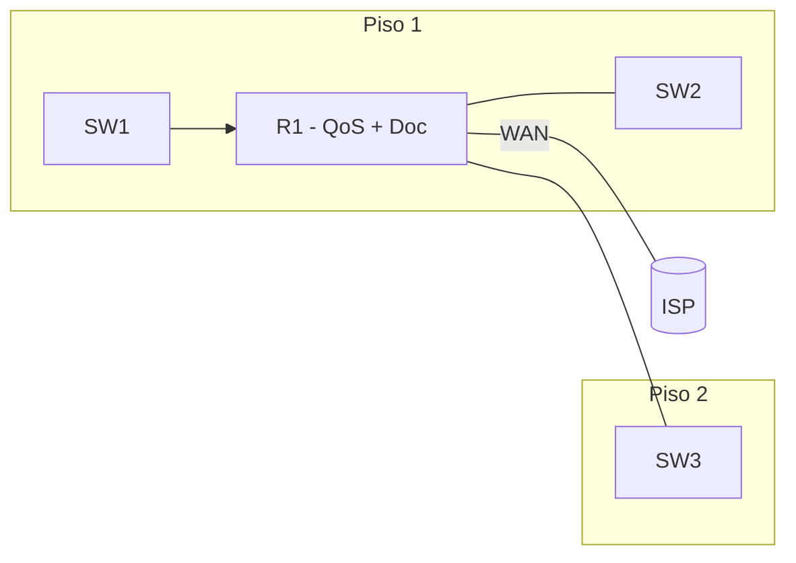

Sexta parte de la serie. La red del edificio es funcional, redundante, segura,
inalámbrica y tiene servicios IP. Ahora le das **calidad de servicio** al
tráfico y **documentas** toda la infraestructura. Al terminar, la voz y el
video funcionan correctamente incluso bajo carga, y tienes un registro completo
de la red.



## Requisitos

- Red completa del [ejercicio anterior](../07-ip-services/exercise):
  VLANs, routing, redundancia, seguridad, WLANs y servicios IP (DHCP, NAT,
  ACLs, NTP).
- R1 ya tiene configuración de NAT, DHCP y ACLs.

## Objetivos

1. Configurar **QoS** en R1 para priorizar VoIP sobre datos.
2. Habilitar **CDP/LLDP** en todos los switches.
3. **Documentar** la topología, tablas de IPs y puertos.
4. Verificar que la voz funciona bajo congestión.

## Pasos

### 1. QoS en R1 (LLQ para VoIP)

Prioriza el tráfico VoIP (DSCP EF) con cola estricta y garantiza ancho de
banda para datos.

La teoría completa está en
[Algoritmos de Encolamiento](../08-qos-network-design/queuing-algorithms) y
[Calidad de Transmisión](../08-qos-network-design/network-transmission-quality).

```ios
R1(config)# class-map match-any VOZ
R1(config-cmap)# match dscp ef
R1(config-cmap)# exit

R1(config)# class-map match-any VIDEO
R1(config-cmap)# match dscp af41
R1(config-cmap)# exit

R1(config)# policy-map WAN-QOS
R1(config-pmap)# class VOZ
R1(config-pmap-c)# priority 256
R1(config-pmap-c)# exit
R1(config-pmap)# class VIDEO
R1(config-pmap-c)# bandwidth percent 30
R1(config-pmap-c)# exit
R1(config-pmap)# class class-default
R1(config-pmap-c)# bandwidth percent 20
R1(config-pmap-c)# fair-queue
R1(config-pmap-c)# exit

R1(config)# interface Serial0/0/0
R1(config-if)# service-policy output WAN-QOS
```

### 2. QoS en switches (confianza de CoS)

Configura los switches para que confíen en la marca CoS de los teléfonos IP.

```ios
SW1(config)# mls qos
SW1(config)# interface range FastEthernet0/1 - 23
SW1(config-if-range)# mls qos trust cos
SW1(config-if-range)# exit
```

### 3. CDP y LLDP en switches

Habilita ambos protocolos de descubrimiento para documentar la topología.

```ios
SW1(config)# cdp run
SW1(config)# lldp run

SW1(config)# interface range FastEthernet0/1 - 24
SW1(config-if-range)# cdp enable
SW1(config-if-range)# lldp enable
SW1(config-if-range)# exit
```

### 4. Verificar descubrimiento de vecinos

```ios
SW1# show cdp neighbors
SW1# show cdp neighbors detail
SW1# show lldp neighbors
SW1# show lldp neighbors detail
```

### 5. Documentar la red

Crea los siguientes documentos:

**Topología:**
- Diagrama con todos los dispositivos, enlaces y puertos.
- Incluir VLANs y direcciones IP de cada interfaz.

**Tabla de IPs:**

| Dispositivo | Interfaz | IP | Máscara | VLAN |
| :---------- | :------- | :- | :------ | :--- |
| R1 | Gi0/0.10 | 192.168.10.1 | /24 | 10 |
| R1 | Gi0/0.20 | 192.168.20.1 | /24 | 20 |
| R1 | Gi0/0.30 | 192.168.30.1 | /24 | 30 |
| R1 | Gi0/0.99 | 192.168.99.1 | /24 | 99 |
| SW1 | VLAN 99 | 192.168.99.10 | /24 | 99 |
| SW2 | VLAN 99 | 192.168.99.11 | /24 | 99 |
| SW3 | VLAN 99 | 192.168.99.12 | /24 | 99 |

**Tabla de puertos:**

| Switch | Puerto | Dispositivo | VLAN | Tipo |
| :----- | :----- | :---------- | :--- | :--- |
| SW1 | Fa0/1 | PC Ventas | 10 | Acceso |
| SW1 | Fa0/2 | Teléfono IP | 20 | Acceso (Voice) |
| SW1 | Fa0/24 | Impresora | 30 | Acceso |
| SW1 | Gi0/1 | R1 | Trunk | Todas |

### 6. Verificar QoS bajo congestión

Genera tráfico de datos y verifica que la voz mantiene prioridad:

```ios
R1# show policy-map interface Serial0/0/0
```

Verificar que la cola VOZ tiene más paquetes transmitidos y cero drops
mientras que la cola de datos puede tener drops aceptables.

### 7. Verificación de extremo a extremo

```ios
R1# show policy-map interface Serial0/0/0   # QoS activo
R1# show ip route                          # Rutas completas
R1# show access-lists                      # Contadores ACL
SW1# show mls qos interface FastEthernet0/1  # Confianza CoS
SW1# show cdp neighbors                    # Topología descubierta
SW1# show vlan brief                       # VLANs activas
```

## Resultado esperado

Al completar este ejercicio:
- La voz (VoIP) tiene **prioridad** sobre datos en el enlace WAN.
- Los switches **descubren** vecinos con CDP/LLDP.
- Tienes **documentación completa** de la red: topología, IPs, puertos.
- La red está lista para ser **monitoreada** y **troubleshooting**.
