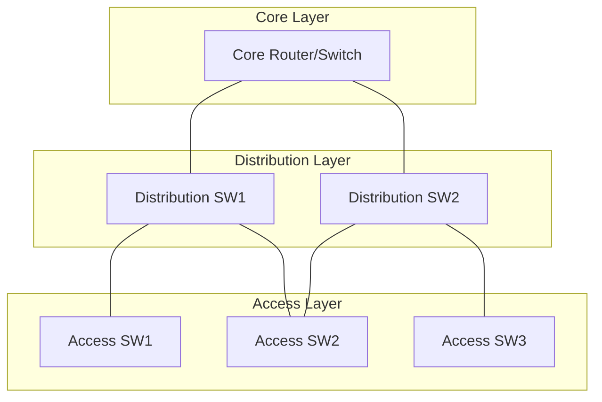
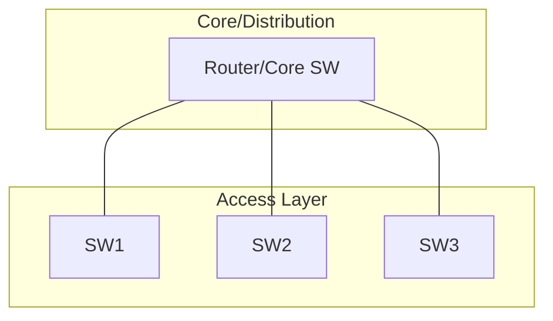
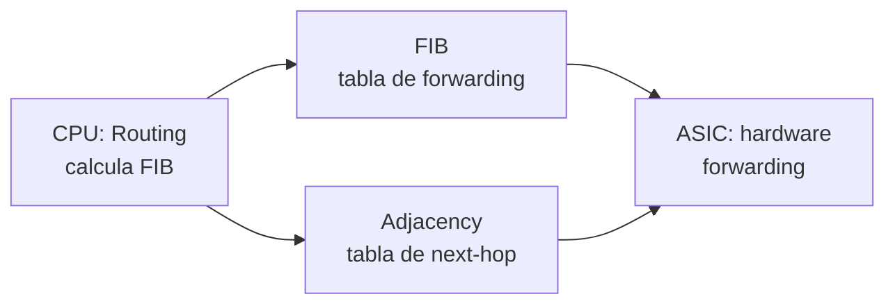
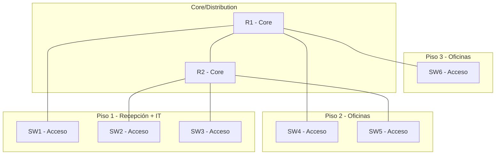

Una red profesional no se diseña al azar. El **modelo jerárquico** divide la
red en capas con responsabilidades claras, facilitando la escalabilidad, el
mantenimiento y la resolución de problemas.

## Modelo jerárquico de tres capas



### Core Layer (Núcleo)

La **columna vertebral** de alta velocidad. Conecta las capas de distribución
y mueve la mayor cantidad de tráfico a la mayor velocidad posible.

| Característica | Descripción |
| :------------- | :---------- |
| Velocidad | Máxima (10 Gbps+, 40 Gbps+) |
| Función | Transporte puro, switching rápido |
| **NO hace** | Filtrado,ACLs, QoS complejo, enrutamiento lento |
| Dispositivos | Routers de alta gama, Nexus, Catalyst 9500 |

> **Regla de oro**: el Core solo mueve paquetes. Si necesitas filtrar o
> procesar, no es Core.

### Distribution Layer (Distribución)

La capa de **resumen y políticas**. Agrega los enlaces de Access y aplica
políticas (QoS, ACLs, filtrado, enrutamiento entre VLANs).

| Característica | Descripción |
| :------------- | :---------- |
| Velocidad | Alta (1 Gbps – 10 Gbps) |
| Función | Resumen de rutas, políticas, L3 routing |
| **Hace** | Enrutamiento inter-VLAN, ACLs, QoS, DHCP relay |
| Dispositivos | Catalyst 3850/9300, routers con switching |

### Access Layer (Acceso)

Donde los **hosts se conectan** a la red. switches de acceso con puertos de
1 Gbps para PCs, teléfonos, APs, impresoras.

| Característica | Descripción |
| :------------- | :---------- |
| Velocidad | 100 Mbps – 1 Gbps por puerto |
| Función | Conexión de endpoints |
| **Hace** | VLANs, Port Security, BPDU Guard, PoE |
| Dispositivos | Catalyst 2960, 9200, puertos de acceso |

## Modelo colapsado (Core/Distribution)

En redes **pequeñas y medianas**, las capas Core y Distribution se combinan
en una sola. Es el caso más común en edificios de oficinas.



- Un solo dispositivo hace routing, QoS, ACLs y connectividad al ISP.
- Los switches de acceso se conectan directamente a este equipo.
- Es el escenario del **edificio de un piso** en los ejercicios de esta guía.

## Hardware de switching

### ASICs (Application-Specific Integrated Circuits)

Chips **diseñados exclusivamente** para switching. A diferencia de un router
que usa CPU general, un switch usa ASICs para procesar tramas a velocidad
cableada.

- **No ejecutan IOS** como los routers; usan firmware especializado.
- Velocidad de switching: millones de paquetes por segundo (pps).
- No son programables (a diferencia de switches SDN).

### TCAM (Ternary Content-Addressable Memory)

Memoria **especializada** que busca en paralelo múltiples entradas en un solo
ciclo de reloj. Se usa para:

| Tabla | Uso |
| :---- | :-- |
| MAC address table | Forwarding de tramas L2 |
| ACL CAM | Evaluación de ACLs |
| QoS CAM | Clasificación de tráfico |
| Routing CAM | Tabla de enrutamiento CEF |

- Un TCAM típico tiene **256K–1M entradas** de 160–320 bits.
- Si la tabla TCAM se llena, el dispositivo puede funcionar en **software
  fallback** (mucho más lento).

### CEF (Cisco Express Forwarding)

Mecanismo de **forwarding en hardware** que pre-calcula la tabla de
enrutamiento FIB (Forwarding Information Base) y la tabla adjacency.



- **FIB**: tabla de forwarding derivada de la tabla de routing (RIB).
- **Adjacency table**: next-hop MAC addresses pre-calculadas.
- **Sin CEF**: el router busca en la tabla de routing por cada paquete (lento).
- **Con CEF**: el ASIC busca en FIB/Adjacency y procesa a velocidad cableada.

```ios
R1(config)# ip cef           # Habilitar CEF (viene habilitado por defecto)
R1# show ip cef              # Ver tabla FIB
R1# show ip cef exact-route 10.0.0.1 10.0.0.2  # Ruta exacta de un paquete
```

## Diseñar una red escalable

### Principios clave

1. **Modularidad**: dividir en bloques funcionales (pisos, departamentos).
2. **Redundancia**: doble enlace entre capas (EtherChannel, STP).
3. **Resumen**: las rutas se resumen en Distribution, no en Access.
4. **Separación**: datos, voz y gestión en VLANs separadas.
5. **Documentación**: topología, IPs, cambios.

### Ejemplo: red de un edificio de 3 pisos



- Cada piso es un **bloque de acceso** independiente.
- R1 y R2 son **Core/Distribution** con HSRP para redundancia.
- Las VLANs se mapean por función (10=datos, 20=voz, 30=WiFi, 99=gestión).

## Verificación de hardware

```ios
SW1# show version                              # Modelo, memoria, ASICs
SW1# show platform                             # Información del hardware
SW1# show mac address-table                     # Tabla MAC (CAM)
SW1# show interfaces counters                   # Contadores de tráfico
SW1# show processes cpu history                  # Uso de CPU历史
SW1# show tcam utilization                      # Uso de TCAM
```
