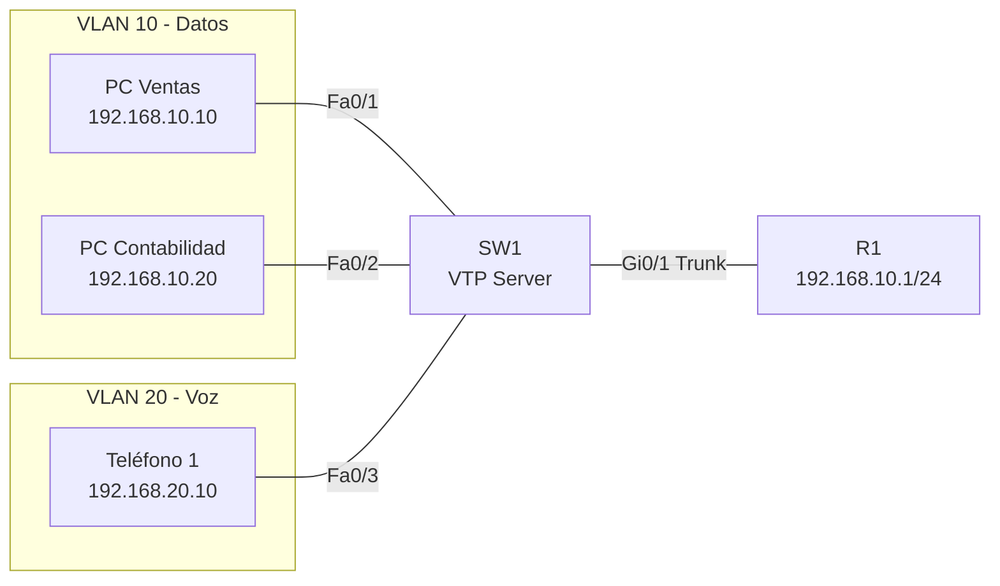

Una red sin documentación es una **caja negra**: cuando algo falla, nadie sabe
cómo está configurada ni qué cambió. La documentación no es opcional — es un
requisito profesional que ahorra horas de troubleshooting.

## Tipos de documentación

### Topology Diagram (Diagrama de Topología)

Representación visual de cómo están conectados todos los dispositivos. Incluye:

- Dispositivos (routers, switches, APs, servidores)
- Enlaces (cuántos cables, de qué tipo, a qué puerto)
- Direcciones IP y VLANs
- Etiquetas de interfaces



**Herramientas para crear diagramas:**

| Herramienta | Tipo | Uso típico |
| :---------- | :--- | :--------- |
| Draw.io (diagrams.net) | Web/Desktop | Diagramas generales |
| Lucidchart | Web | Diagramas colaborativos |
| Visio | Desktop | Documentación empresarial |
| Mermaid | Markdown | Diagramas en documentación técnica |
| `show cdp neighbors` | IOS | Descubrir topología real |

### Tabla de Direccionamiento IP

Registro de todas las direcciones IP asignadas en la red:

| Dispositivo | Interfaz | Dirección IP | Máscara | VLAN | Gateway |
| :---------- | :------- | :----------- | :------ | :--- | :------ |
| R1 | Gi0/0.10 | 192.168.10.1 | /24 | 10 | - |
| R1 | Gi0/0.20 | 192.168.20.1 | /24 | 20 | - |
| R1 | Gi0/1 | 200.200.200.1 | /30 | - | ISP |
| SW1 | VLAN 99 | 192.168.99.10 | /24 | 99 | 192.168.99.1 |
| PC Ventas | NIC | 192.168.10.10 | /24 | 10 | 192.168.10.1 |
| PC Contab | NIC | 192.168.10.20 | /24 | 10 | 192.168.10.1 |

### Tabla de Puertos y VLANs

Registro de a qué puerto está conectado cada dispositivo y en qué VLAN:

| Switch | Puerto | Dispositivo | VLAN | Tipo |
| :----- | :----- | :---------- | :--- | :--- |
| SW1 | Fa0/1 | PC Ventas | 10 | Acceso |
| SW1 | Fa0/2 | PC Contabilidad | 10 | Acceso |
| SW1 | Fa0/3 | Teléfono IP | 20 | Acceso (Voice) |
| SW1 | Fa0/24 | Impresora | 30 | Acceso |
| SW1 | Gi0/1 | R1 | Trunk | 10,20,30,99 |

### Tabla de Enrutamiento

Documento que lista las redes alcanzables y cómo se llega a ellas:

| Red destino | Máscara | Next-hop | Protocolo | Métrica |
| :---------- | :------ | :------- | :-------- | :------ |
| 192.168.10.0 | /24 | Directamente conectada | C | 0 |
| 192.168.20.0 | /24 | Directamente conectada | C | 0 |
| 10.0.0.0 | /30 | 200.200.200.2 (ISP) | S | 1 |

## Gestión de cambios (Change Management)

Proceso formal para **registrar, aprobar e implementar** cambios en la red.

### Por qué documentar cambios

- Si un cambio rompe la red, hay que saber **qué cambió** y **quién lo hizo**.
- Permite **revertir** a una configuración anterior.
- Cumple con auditorías y compliance.

### Plantilla de cambio

```text
Fecha:       2026-08-25
Autor:       [Nombre]
Aprobado:    [Nombre del responsable]
Descripción: Agregar VLAN 40 para el departamento de IT
Cambios:
  - SW1: crear VLAN 40, nombre IT
  - SW1: Fa0/24 → acceso VLAN 40
  - R1: subinterface Gi0/0.40, IP 192.168.40.1/24
  - DHCP pool para VLAN 40
Riesgo:      Bajo (VLAN aislada)
Rollback:    Revertir configuración de VLAN y subinterface
```

### Proceso de cambio

1. **Solicitar**: el usuario pide el cambio.
2. **Evaluar**: verificar impacto, riesgo y dependencias.
3. **Aprobar**: el responsable autoriza.
4. **Implementar**: aplicar los cambios.
5. **Verificar**: confirmar que funciona.
6. **Documentar**: registrar qué se hizo y por qué.

## Baseline operacional

Un **baseline** es una instantánea del estado "normal" de la red. Se usa como
punto de comparación cuando algo falla.

### Qué documentar en un baseline

| Métrica | Cómo obtener | Frecuencia |
| :------ | :----------- | :--------- |
| Utilización de CPU | `show processes cpu` | Semanal |
| Utilización de interfaces | `show interfaces` | Semanal |
| Tabla MAC | `show mac address-table` | Mensual |
| Tabla ARP | `show arp` | Mensual |
| Tabla de routing | `show ip route` | Mensual |
| Errores de interfaz | `show interfaces` (errors) | Semanal |
| Memoria libre | `show memory` | Semanal |
| Uso de TCAM | `show tcam utilization` | Mensual |

### Ejemplo de baseline

```text
Fecha baseline: 2026-08-25
R1 CPU avg: 12% (5min), pico 34%
SW1 CPU avg: 5% (5min), pico 15%
Enlace WAN: 38% utilización promedio
Memoria R1: 65% libre (256 MB / 512 MB)
TCAM SW1: 12% utilizado
```

## Documentación de configuración

### Copias de configuración

Siempre mantener copias **actualizadas** de las configuraciones:

```ios
R1# show running-config
R1# copy running-config tftp:     # Copiar a servidor TFTP
```

### Versionamiento

Usar **Git** para controlar versiones de configuraciones:

```bash
git add configs/R1-running-config.cfg
git commit -m "Agregar VLAN 40 y subinterface Gi0/0.40"
```

## Verificar y descubrir topología

```ios
SW1# show cdp neighbors            # Descubrir vecinos CDP
SW1# show cdp neighbors detail     # IPs, plataformas, puertos
SW1# show lldp neighbors           # Vecinos LLDP
SW1# show lldp neighbors detail    # Detalle LLDP
SW1# show interfaces status        # Estado de puertos
SW1# show vlan brief               # VLANs configuradas
```
