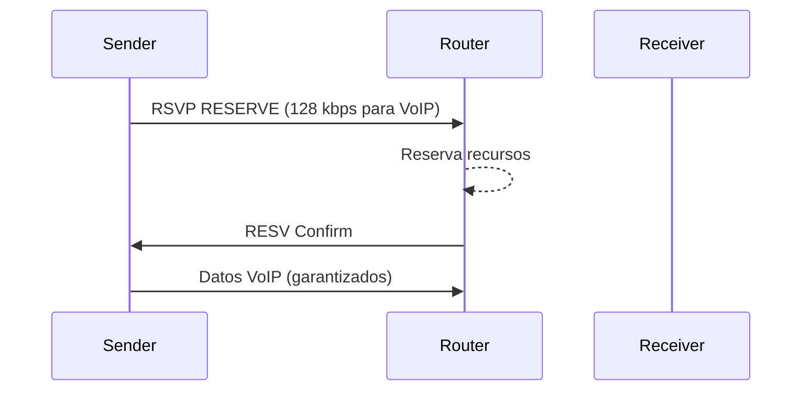

**Quality of Service (QoS)** es el conjunto de técnicas que garantizan que el
tráfico crítico recibe los recursos que necesita, incluso cuando la red está
congestionada. Sin QoS, todos los paquetes se tratan igual y la VoIP se corta
mientras alguien descarga un archivo.

## Métricas de calidad

Cuando un usuario reporta que "la red va lenta", hay que medir **qué** está
pasando. Las cuatro métricas fundamentales son:

### Bandwidth (Ancho de Banda)

La **cantidad máxima** de datos que puede fluir por un enlace, medida en bits
por segundo (bps).

- No es la velocidad real del tráfico, es el **límite** del tubo.
- Si la demanda supera el ancho de banda disponible, hay congestión.
- Se mide con `show interface` → `bandwidth` (configurado) y `rate`
  (utilización real).

```ios
R1# show interfaces Serial0/0/0
  5 minute input rate 8,200,000 bits/sec    ← utilización actual
  5 minute output rate 3,100,000 bits/sec
```

### Delay (Latencia)

El **tiempo** que tarda un paquete en ir del origen al destino. Se mide en
milisegundos (ms).

| Componente | Descripción |
| :--------- | :---------- |
| Serialization | Tiempo en colocar los bits en el enlace |
| Propagation | Tiempo en viajar por el medio (cable, fibra) |
| Processing | Tiempo en procesar el paquete en cada hop |
| Queuing | Tiempo en la cola del router/switch |

- La latencia **se acumula** en cada salto.
- Para VoIP, la latencia total no debe superar **150 ms**.
- Se mida con `ping` (RTT = round-trip time, dividir entre 2 para ida).

### Jitter (Variación de Latencia)

La **diferencia** en el delay entre paquetes consecutivos del mismo flujo.

- VoIP y video son muy sensibles al jitter: los paquetes llegan
  con tiempos irregulares y el buffer del receptor no alcanza.
- Se tolera hasta **30 ms** de jitter para VoIP.
- Se mida con `ping -t` (variación entre tiempos de respuesta).

### Packet Loss (Pérdida de Paquetes)

El **porcentaje de paquetes** que no llegan a destino. Causas:

1. **Congestión**: la cola se llena y se descartan paquetes (tail drop).
2. **Errores de enlace**: daño físico en el medio.
3. **Descarte QoS**: el policer o shaper descarta tráfico que excede la cuota.

- Para VoIP, la pérdida no debe superar el **1%**.
- Se mide con `ping` (contar lost) o `show interfaces` (input/output errors).

```text
Ping 10.0.0.1: 100 paquetes enviados, 97 recibidos, 3% pérdida
RTT min/avg/max = 12/18/35 ms
```

## Modelos de QoS

### Best-Effort (sin QoS)

No hay priorización. Todos los paquetes se tratan igual. Funciona para red
simple sin tráfico de tiempo real.

- **Ventaja**: cero configuración.
- **Desventaja**: VoIP y video se degradan bajo congestión.

### IntServ (Integrated Services)

Reserva **recursos端 a端** para cada flujo antes de enviar datos (RSVP
protocol). Garantiza QoS absoluta pero no escala.



- **Ventaja**: garantía absoluta de calidad.
- **Desventaja**: no escala (cada flujo reserva, routers mantienen estado).

### DiffServ (Differentiated Services)

**El modelo estándar actual**. No reserva por flujo; clasifica los paquetes
en **clases** y aplica políticas por clase.

1. **Classification**: marcar paquetes con DSCP/CoS en la entrada.
2. **Marking**: re-marcar si es necesario (policy-map set).
3. **Queuing**: encolar según la marca (CBWFQ/LLQ).
4. **Policing/Shaper**: limitar o suavizar tráfico que excede la cuota.


- **Ventaja**: escalable, no mantiene estado por flujo.
- **Desventaja**: garantía por clase, no por flujo individual.

## QoS en switches Cisco (Catalyst)

Los switches Catalyst aplican QoS en la **ingress** (entrada) y **egress**
(salida). Configuración global:

```ios
SW1(config)# mls qos                          # Habilitar QoS
SW1(config)# mls qos map dscp-cos 46 5 10 18 24 34 46 56  # Mapeo DSCP→CoS
SW1(config)# mls qos map cos-dscp 32 40 48 56 64 72 88 96  # Mapeo CoS→DSCP
```

### trust y mls qos vlan

En interfaces de acceso, se configura **confianza** del valor de marca:

```ios
SW1(config)# interface FastEthernet0/1
SW1(config-if)# mls qos trust cos        # Confiar en CoS del dispositivo
```

En troncales, se confía en DSCP:

```ios
SW1(config)# interface GigabitEthernet0/1
SW1(config-if)# mls qos trust dscp
```

### Mapas de cola

```ios
SW1(config)# mls qos queue-set output qsets 1
SW1(config)# mls qos queue-set output 1 queue 1 threshold 1 100 100 100
SW1(config)# mls qos queue-set output 1 queue 2 threshold 1 200 200 200
```

## Configuración QoS en routers (MQC)

El **Modular QoS CLI (MQC)** es el framework estándar de Cisco para configurar
QoS en routers. Tres pasos:

### 1. Class Map (clasificar)

```ios
R1(config)# class-map match-any VOZ
R1(config-cmap)# match dscp ef
R1(config-cmap)# exit

R1(config)# class-map match-any VIDEO
R1(config-cmap)# match dscp af41
R1(config-cmap)# exit

R1(config)# class-map match-any CONTROL
R1(config-cmap)# match dscp cs3
R1(config-cmap)# exit
```

### 2. Policy Map (política)

```ios
R1(config)# policy-map WAN-POLICY
R1(config-pmap)# class VOZ
R1(config-pmap-c)# priority 256                    # Cola estricta
R1(config-pmap-c)# exit
R1(config-pmap)# class VIDEO
R1(config-pmap-c)# bandwidth percent 30            # 30% garantizado
R1(config-pmap-c)# exit
R1(config-pmap)# class CONTROL
R1(config-pmap-c)# bandwidth percent 10
R1(config-pmap-c)# exit
R1(config-pmap)# class class-default
R1(config-pmap-c)# bandwidth percent 20
R1(config-pmap-c)# fair-queue
R1(config-pmap-c)# exit
```

### 3. Service Policy (aplicar)

```ios
R1(config)# interface Serial0/0/0
R1(config-if)# service-policy output WAN-POLICY
```

## Verificación

```ios
R1# show policy-map                          # Ver políticas configuradas
R1# show policy-map interface Serial0/0/0    # Ver contadores y drops
R1# show class-map                           # Ver clases
SW1# show mls qos                            # Estado global QoS
SW1# show mls qos interface FastEthernet0/1  # Confianza por interfaz
```

## Resumen

| Métrica | Ideal para VoIP | Se mide con |
| :------ | :-------------- | :---------- |
| Bandwidth | Suficiente para todas las clases | `show interface` |
| Delay | < 150 ms total | `ping` |
| Jitter | < 30 ms | `ping -t` |
| Packet Loss | < 1% | `ping`, `show interfaces` |

| Modelo | Escala | Garantía | Complejidad |
| :----- | :----- | :------- | :---------- |
| Best-Effort | ∞ | Ninguna | Nula |
| IntServ | Baja | Absoluta | Alta |
| DiffServ | Alta | Por clase | Media |
