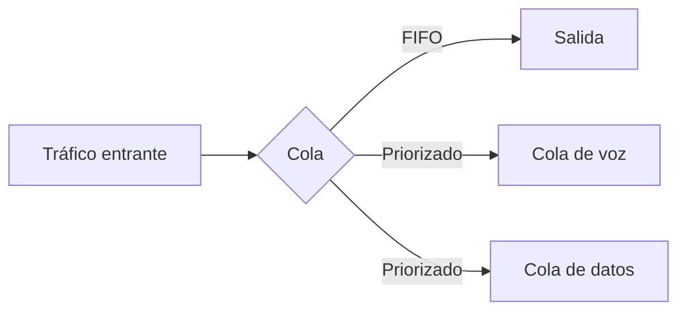

Cuando la tasa de llegada de paquetes supera la capacidad de salida de una
interfaz, el dispositivo los **encola**. El algoritmo de encolamiento decide
**en qué orden** salen y **cuáles se descartan** cuando la cola se llena.

## Por qué importa el encolamiento

Sin control de colas, toda la tratamiento es **FIFO**: el primer paquete en
llegar es el primero en salir. Esto significa que un backup grande puede
bloquear una llamada VoIP en tiempo real.



## Algoritmos clásicos

### FIFO (First In, First Out)

El algoritmo por defecto. No distingue tipos de tráfico. Solo funciona bien
cuando **no hay congestión**.

- **Una sola cola** para todos los paquetes.
- Si la cola se llena, descarta el último en llegar (tail drop).
- No hay priorización ni公平idad.

### Priority Queuing (PQ)

Divide el tráfico en **4 colas** con prioridad estricta: High, Medium, Normal,
Low. La cola alta se vacía **completamente** antes de pasar a la siguiente.

| Cola | Prioridad | Riesgo |
| :--- | :-------- | :----- |
| High | Primero siempre | Puede **starve** (denegar) las otras colas |
| Medium | Después de High | - |
| Normal | Después de Medium | - |
| Low | Última | Puede nunca salir si hay mucho tráfico |

> **PQ no se usa en producción** porque puede denegar servicio a las colas
> bajas indefinidamente.

### Custom Queuing (CQ)

Distribuye el ancho de banda entre **16 colas** (CQ 0 a CQ 15). Cada cola
tiene un **byte count**: cuántos bytes se transmiten antes de pasar a la
siguiente cola.

- CQ 0 es la cola de sistema (se procesa primero).
- CQ 1–15 reparten el ancho de banda de forma round-robin.
- Permite **garantizar un mínimo** de ancho de banda por cola.

```
CQ 1 → 4000 bytes (VoIP)
CQ 2 → 8000 bytes (HTTP)
CQ 3 → 4000 bytes (resto)
```

### Weighted Fair Queuing (WFQ)

Cada flujo IP crea una **cola automática** con un peso calculado
proporcionalmente a la IP Precedence del paquete.

- **Automático**: no hay que definir clases.
- **Equitativo**: los flujos grandes no dominan los pequeños.
- **Weighted**: flujos con mayor precedencia obtienen más ancho de banda.

```
R1(config-if)# fair-queue
```

| IP Precedence | Peso relativo |
| :------------ | :------------ |
| 0 (routine) | Bajo |
| 5 (voice) | Alto |

> WFQ es el algoritmo **por defecto** en interfaces serial de IOS.

### Class-Based Weighted Fair Queuing (CBWFQ)

WFQ manual: el administrador define **clases de tráfico** con un ancho de
banda **garantizado** y un **máximo** de cola.

```ios
R1(config)# class-map match-any VOICE
R1(config-cmap)# match dscp ef
R1(config-cmap)# exit

R1(config)# policy-map QOS-POLICY
R1(config-pmap)# class VOICE
R1(config-pmap-c)# bandwidth 256
R1(config-pmap-c)# exit
R1(config-pmap)# class class-default
R1(config-pmap-c)# bandwidth 128
R1(config-pmap-c)# exit

R1(config)# interface Serial0/0/0
R1(config-if)# service-policy output QOS-POLICY
```

| Comando | Función |
| :------ | :------ |
| `class-map match-any` | Define una clase con criterios OR |
| `class-map match-all` | Define una clase con criterios AND |
| `match dscp <valor>` | Clasifica por DSCP |
| `match access-group <n>` | Clasifica por ACL |
| `bandwidth <kbps>` | Ancho de banda garantizado |
| `service-policy output` | Aplica la política en salida |

### Low Latency Queuing (LLQ)

CBWFQ con una **cola estricta de prioridad** para tráfico de tiempo real
(VoIP, videoconferencia). La cola de prioridad se vacía primero y **tiene un
límite** (Policer) para evitar que monopolice el enlace.

```ios
R1(config-pmap)# class VOICE
R1(config-pmap-c)# priority 256    # Cola estricta, máx 256 kbps
```

> **LLQ es el estándar recomendado** para producción. Combina la garantía de
> CBWFQ con la baja latencia de una cola de prioridad.

## Marcado: DSCP y CoS

Para que los dispositivos sepan qué cola asignar, los paquetes se **marcan**
en la entrada.

### DSCP (Differentiated Services Code Point)

- **6 bits** en el campo ToS del header IPv2 (valores 0–63).
- Es el estándar actual para QoS en IP.
- Los valores más comunes:

| DSCP | Nombre | Uso típico |
| :--- | :----- | :--------- |
| 0 | BE (Best Effort) | Tráfico por defecto |
| 8 | CS1 | Control de red |
| 24 | CS3 | Señalización (SIP) |
| 34 | AF31 | Video streaming |
| 46 | EF (Expedited Forwarding) | VoIP (tiempo real) |
| 48 | CS6 | Protocolos de enrutamiento |

### CoS (Class of Service)

- **3 bits** en la cabecera 802.1Q de tramas Ethernet (capa 2).
- Solo funciona dentro de un dominio VLAN (se pierde al enrutar).
- Valores 0–7; se mapea a DSCP al pasar a capa 3.

```
CoS 5 → DSCP EF (voz)
CoS 3 → DSCP AF31 (video)
CoS 0 → DSCP BE (datos)
```

## Resumen de algoritmos

| Algoritmo | Colas | Garantía | Complejidad | Riesgo |
| :-------- | :---- | :------- | :---------- | :----- |
| FIFO | 1 | Ninguna | Baja | Tail drop |
| PQ | 4 (fijas) | Prioridad estricta | Baja | Starving |
| CQ | 16 (fijas) | Round-robin | Media | Configuración |
| WFQ | Automáticas | Por peso | Baja | Sin control fino |
| CBWFQ | Manuales | Ancho de banda | Media | - |
| LLQ | Manuales + prioridad | Baja latencia + garantía | Media | Policier |

## Verificación

```ios
R1# show policy-map interface Serial0/0/0
R1# show queue Serial0/0/0
R1# show class-map
```
