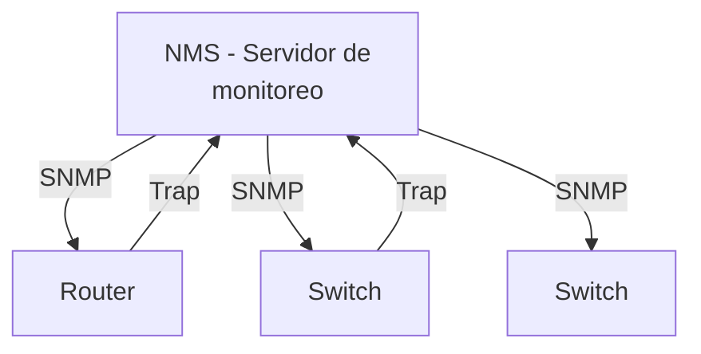

SNMP y Syslog son los dos pilares del **monitoreo proactivo** de red. SNMP
te permite **preguntar** al dispositivo cómo está; Syslog le permite **contarte**
cuando algo pasa.

## SNMP (Simple Network Management Protocol)

SNMP permite a un **NMS** (Network Management System) consultar y configurar
dispositivos de red de forma remota.

### Arquitectura SNMP



| Rol | Descripción |
| :-- | :---------- |
| NMS (Manager) | Servidor que consulta/recibe datos (Cacti, Zabbix, PRTG) |
| Agent | Software SNMP en el dispositivo Cisco |
| MIB | Base de datos de objetos que el agente expone |
| OID | Identificador numérico de cada objeto en la MIB |

### Versiones de SNMP

| Versión | Seguridad | Autenticación | Cifrado | Uso |
| :------ | :-------- | :------------ | :------ | :-- |
| v1 | Ninguna | Community string (texto plano) | No | Legacy, evitar |
| v2c | Ninguna | Community string (texto plano) | No | Común pero inseguro |
| v3 | **Alta** | USM (hash MD5/SHA) | DES/AES | **Recomendado** |

### Configuración SNMP v2c

```ios
R1(config)# snmp-server community COMMUNITY-string RO    # Solo lectura
R1(config)# snmp-server community WRITE-string RW         # Lectura/escritura
R1(config)# snmp-server host 10.0.0.100 version 2c COMMUNITY-string  # NMS
R1(config)# snmp-server enable traps                       # Habilitar traps
```

| Comando | Función |
| :------ | :------ |
| `snmp-server community <string> RO` | Community de solo lectura |
| `snmp-server community <string> RW` | Community de lectura/escritura |
| `snmp-server host <ip>` | IP del servidor NMS |
| `snmp-server enable traps` | Enviar traps (eventos) al NMS |
| `snmp-server contact <texto>` | Información de contacto |
| `snmp-server location <texto>` | Ubicación del dispositivo |

### Configuración SNMP v3

```ios
R1(config)# username admin privilege 15 secret MyP@ss
R1(config)# snmp-server group MONITOREO v3 priv
R1(config)# snmp-server user monitorador MONITOREO v3
  auth sha AuthP@ss1 priv aes 128 PrivP@ss1
R1(config)# snmp-server host 10.0.0.100 version 3 priv monitorador
R1(config)# snmp-server enable traps
```

### MIB y OID

La **MIB** (Management Information Base) es un árbol jerárquico de objetos.
Cada objeto tiene un **OID** (Object Identifier) numérico.

```
MIB-2 (1.3.6.1.2.1)
  └── interfaces (1.3.6.1.2.1.2)
       └── ifTable (1.3.6.1.2.1.2.2)
            └── ifOperStatus (1.3.6.1.2.1.2.2.1.8)
                 1 = up, 2 = down
```

| MIB | OID base | Contiene |
| :-- | :------- | :------- |
| IF-MIB | 1.3.6.1.2.1.2 | Interfaces (estado, velocidad, errores) |
| SNMPv2-MIB | 1.3.6.1.2.1.1 | Sistema (nombre, uptime, contacto) |
| IP-MIB | 1.3.6.1.2.1.4 | Tabla de routing, estadísticas IP |
| CISCO-PROCESS-MIB | 1.3.6.1.4.1.9.9.109.1 | Uso de CPU |

### Verificación SNMP

```ios
R1# show snmp
R1# show snmp user
R1# show snmp group
R1# show snmp host
```

## Syslog

Syslog **registra eventos** del dispositivo (errores, cambios, advertencias)
y los envía a un **servidor centralizado** para análisis.

### Niveles de severidad

| Nivel | Nombre | Descripción | Ejemplo |
| :---- | :----- | :---------- | :------ |
| 0 | Emergencies | Sistema inoperativo | - |
| 1 | Alerts | Acción inmediata requerida | - |
| 2 | Critical | Condiciones críticas | Fuente de energía falla |
| 3 | Errors | Errores de hardware/software | Interface down |
| 4 | Warnings | Advertencias | Alto uso de memoria |
| 5 | Notifications | Eventos normales significativos | Interface up/down |
| 6 | Informational | Información general | Config change |
| 7 | Debugging | Información de debug | Paquete procesado |

> **Regla**: en producción, guardar niveles **0–4** (errores y alerts) y
> excluir **6–7** (demasiado verbosos para almacenar).

### Local logging

```ios
R1(config)# logging buffered 64000         # Buffer circular (bytes)
R1(config)# logging buffered 6            # Guardar niveles 0-6 en buffer
R1(config)# show logging                   # Ver buffer local
```

### Envío a servidor Syslog

```ios
R1(config)# logging host 10.0.0.200       # IP del servidor syslog
R1(config)# logging trap warnings          # Nivel 0-4 (warnings y arriba)
R1(config)# logging source-interface Loopback0  # IP de origen
R1(config)# service timestamps log datetime msec  # Timestamps precisos
```

| Comando | Función |
| :------ | :------ |
| `logging host <ip>` | Servidor syslog destino |
| `logging trap <nivel>` | Severidad mínima a enviar |
| `logging source-interface <iface>` | IP de origen en los mensajes |
| `service timestamps log datetime msec` | Marca de tiempo con milisegundos |
| `logging buffered <bytes>` | Tamaño del buffer local |
| `logging persistent` | Guardar logs en memoria persistente |

### Formato del mensaje

```
*Aug 25 12:34:56.789: %LINEPROTO-5-UPDOWN: Line protocol on Interface GigabitEthernet0/0, changed state to down
 │              │       │  │                    │
 │              │       │  │                    └── Descripción
 │              │       │  └── Código del mensaje
 │              │       └── Severidad (5 = notification)
 │              └── Timestamp
 └── Fecha
```

### Verificación

```ios
R1# show logging
R1# show logging history              # Historial de eventos
R1# clear logging                     # Limpiar buffer
```

## SNMP + Syslog juntos

| Función | SNMP | Syslog |
| :------ | :--- | :----- |
| Consultar estado actual | **Sí** (get/walk) | No |
| Recibir notificaciones | **Traps** | **Syslog messages** |
| Configurar dispositivos | **Sí** (set) | No |
| Auditoría de cambios | No | **Sí** (config log) |
| Monitoreo histórico | Con NMS | Con servidor syslog |

**Complementarios**: SNMP para monitoreo activo, Syslog para registro y auditoría.
