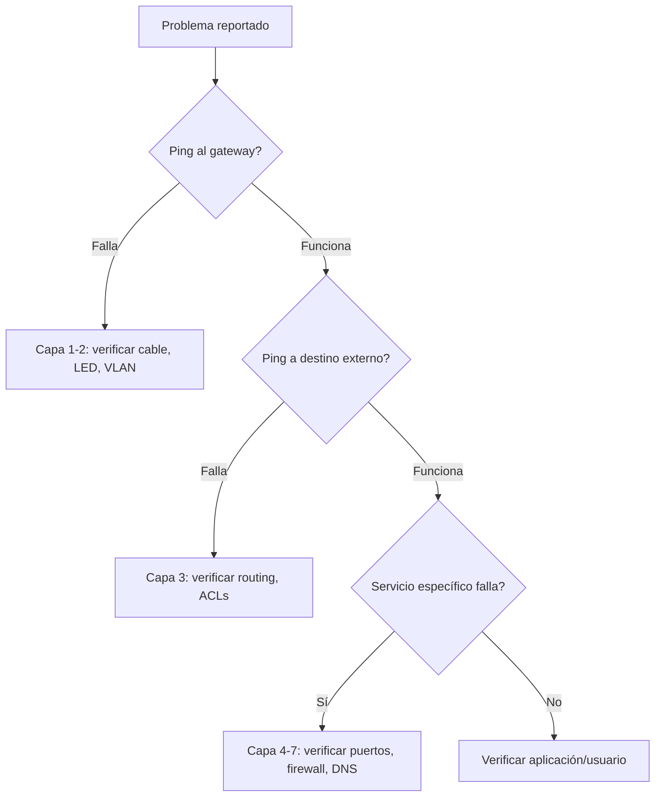

Cuando la red falla, el troubleshooting **no es adivinar**. Es un proceso
metódico que sigue pasos definidos para encontrar la causa raíz y resolverla.

## Proceso de troubleshooting (6 pasos)

### Paso 1: Definir el problema

- **Qué falla exactamente?** (no puedo hacer ping, no hay internet, VoIP corta).
- **Cuándo empezó?** (antes funcionaba, después de un cambio).
- **A quién afecta?** (todos, un departamento, una VLAN).
- **Es consistente o intermitente?**

### Paso 2: Recopilar información

Obtener datos **de todas las fuentes posibles**:

| Fuente | Qué buscar |
| :----- | :--------- |
| Usuario | Síntomas exactos, cuándo empezó |
| `show interfaces` | Errores, CRC, drops, cola llena |
| `show ip route` | Rutas faltantes o incorrectas |
| `show vlan brief` | VLAN incorrecta o faltante |
| `show cdp neighbors` | Vecino esperado no aparece |
| `show log` | Mensajes de error recientes |
| `show running-config` | Configuración incorrecta |
| Ping/Traceroute | Dónde se pierde la conectividad |

### Paso 3: Analizar la información

- **Por qué capa OSI falla?** (física, enlace, red, transporte...)
- **Hay patrones?** (afecta solo una VLAN, solo cierto horario).
- **Qué cambió recientemente?** (configuración, hardware, software).

### Paso 4: Eliminar posibilidades

Por cada causa potencial, **descartar o confirmar** con evidencia:

```text
Posible causa 1: Cable dañado → Verificar LED del puerto → Descartado
Posible causa 2: VLAN incorrecta → show vlan brief → Confirmado
Posible causa 3: Ruta faltante → show ip route → Descartado
Causa raíz: VLAN 10 no tiene gateway configurado en el switch
```

### Paso 5: Implementar la solución

- Aplicar el cambio.
- Verificar que resuelve el problema **sin crear otros**.
- Documentar qué se hizo.

### Paso 6: Verificar y documentar

- Confirmar que el problema está resuelto.
- Verificar que no hay efectos colaterales.
- Actualizar la documentación si es necesario.

## Troubleshooting por capa OSI

### Capa 1 (Física)

**Síntomas**: no hay link, intermitencia, errores CRC altos.

```ios
SW1# show interfaces FastEthernet0/1        # Estado de la interfaz
SW1# show interfaces status                 # Resumen de puertos
SW1# show environment all                   # Temperatura, fans, voltaje
```

| Verificar | Comando |
| :-------- | :------ |
| Cable conectado | Físicamente + LED del puerto |
| Estado de interfaz | `show interfaces` → `up/up` o `down/down` |
| Velocidad/Duplex | `show interfaces` → `full-duplex, 100Mb/s` |
| Errores | `show interfaces` → CRC, giants, runts |

### Capa 2 (Enlace de datos)

**Síntomas**: MAC no aprendida, tramas descartadas, STP bloqueando.

```ios
SW1# show mac address-table                  # Tabla MAC
SW1# show spanning-tree                      # Estado STP
SW1# show etherchannel summary               # Estado de Port-Channel
SW1# show interfaces trunk                   # Troncales activos
```

| Verificar | Comando |
| :-------- | :------ |
| MAC aprendida | `show mac address-table vlan <n>` |
| STP bloqueando | `show spanning-tree` → `BLK` state |
| Trunk funcionando | `show interfaces trunk` |
| VLAN correcta | `show vlan brief` → puerto en VLAN correcta |

### Capa 3 (Red)

**Síntomas**: no puede hacer ping, rutas faltantes, gateway incorrecto.

```ios
R1# show ip route                           # Tabla de routing
R1# show ip interface brief                 # IPs en interfaces
R1# show ip arp                             # Tabla ARP
R1# ping 192.168.10.1                       # Conectividad
R1# traceroute 10.0.0.1                     # Ruta que toma
```

| Verificar | Comando |
| :-------- | :------ |
| IP configurada | `show ip interface brief` |
| Ruta existe | `show ip route <red>` |
| Gateway accesible | `ping <gateway>` |
| ARP funciona | `show ip arp` → MAC del gateway presente |

### Capa 4 (Transporte)

**Síntomas**: conexión establecida pero no funciona el servicio, puertos bloqueados.

```ios
R1# show access-lists                       # ACLs bloqueando tráfico
R1# test ip port 80 192.168.10.10           # Probar conectividad TCP
```

| Verificar | Comando |
| :-------- | :------ |
| Puerto abierto | `test ip port <puerto> <ip>` |
| ACLs no bloquean | `show access-lists` → contadores |
| NAT funciona | `show ip nat translations` |

### Capas 5–7 (Sesión, Presentación, Aplicación)

**Síntomas**: servicio específico no funciona (HTTP falla, DNS no resuelve).

```ios
R1# show processes cpu                      # CPU alta = procesamiento lento
R1# show memory                             # Memoria insuficiente
R1# show users                              # Sesiones activas
```

## Herramientas de Cisco

### ping extendido

Más detallado que un ping normal:

```ios
R1# ping
Protocol [ip]: ip
Target IP address: 10.0.0.1
Repeat count [5]: 10
Datagram size [100]: 1500
Timeout in seconds [2]: 1
Extended commands [n]: y
Source address or interface: 192.168.10.1
Type of service [0]:
Set DF bit in IP header? [no]:
Validate reply data? [no]:
Data pattern [0xABCD]:
Loose, Strict, Record, Timestamp, Verbose[none]: r
Number of hops [ 9 ]: 10
Sweep range of sizes [n]: y
  Sweep min size [36]: 64
  Sweep max size [18026]: 1500
  Sweep interval [1]: 10

Type escape sequence to abort.
Sending 10, [64..1500]-byte ICMP Echos to 10.0.0.1
!!!!!!!!!!
Success rate is 100 percent (10/10)
```

### traceroute

Muestra cada hop hasta el destino:

```ios
R1# traceroute 10.0.0.1
Type escape sequence to abort.
Tracing the route to 10.0.0.1
 1  192.168.10.1  0 msec  0 msec  0 msec
 2  10.0.0.1  4 msec  4 msec  4 msec
```

### show commands esenciales

| Comando | Qué muestra |
| :------ | :---------- |
| `show interfaces` | Estado, errores, tráfico de cada interfaz |
| `show ip route` | Tabla de routing completa |
| `show vlan brief` | VLANs y puertos asignados |
| `show mac address-table` | Tabla de direcciones MAC |
| `show arp` | Tabla ARP (IP → MAC) |
| `show cdp neighbors` | Vecinos descubiertos |
| `show running-config` | Configuración activa |
| `show log` | Mensajes del buffer de logging |
| `show processes cpu` | Uso de CPU por proceso |
| `show memory` | Uso de memoria |

### debug (usar con precaución)

```ios
R1# debug ip packet                         # Ver paquetes IP en tiempo real
R1# debug ip icmp                           # Ver pings
R1# debug spanning-tree events              # Ver eventos STP
R1# undebug all                             # Apagar todos los debugs
```

> **Precaución**: `debug` consume CPU. Usar solo en entornos de laboratorio o
> con filtro específico. Siempre apagar con `undebug all` o `no debug all`.

## Troubleshooting rápido: flujo de decisión


