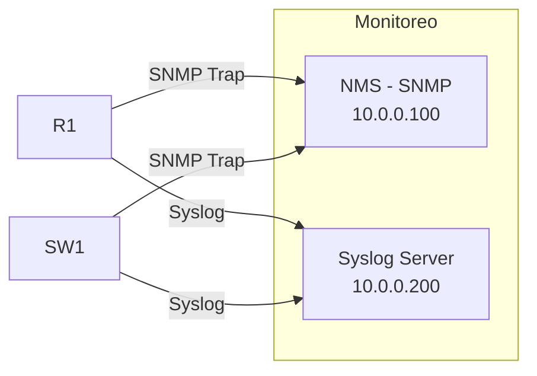

Octava parte de la serie. La red del edificio tiene QoS y documentación. Ahora
configuras **monitoreo proactivo** con SNMP y Syslog, y practicas el
**troubleshooting metódico** resolviendo problemas inyectados en la red.



## Requisitos

- Red completa del [ejercicio anterior](../09-qos-network-design/exercise):
  VLANs, routing, redundancia, seguridad, WLANs, servicios IP y QoS.
- Un servidor con IP 10.0.0.100 (NMS) y otro con IP 10.0.0.200 (Syslog).

## Objetivos

1. Configurar **SNMP v2c** en R1 y SW1 para monitoreo desde el NMS.
2. Configurar **Syslog** para enviar logs a un servidor centralizado.
3. Verificar **CDP/LLDP** y documentar la topología descubierta.
4. Diagnosticar y resolver **3 problemas** inyectados en la red.

## Pasos

### 1. SNMP en R1

```ios
R1(config)# snmp-server community CCNA-SNMP RO
R1(config)# snmp-server host 10.0.0.100 version 2c CCNA-SNMP
R1(config)# snmp-server enable traps
R1(config)# snmp-server contact "Admin CCNA"
R1(config)# snmp-server location "Edificio Piso 1"
```

### 2. SNMP en SW1

```ios
SW1(config)# snmp-server community CCNA-SNMP RO
SW1(config)# snmp-server host 10.0.0.100 version 2c CCNA-SNMP
SW1(config)# snmp-server enable traps
SW1(config)# snmp-server contact "Admin CCNA"
SW1(config)# sw1-server location "Edificio Piso 1 - Switch 1"
```

### 3. Syslog en R1

```ios
R1(config)# logging host 10.0.0.200
R1(config)# logging trap warnings
R1(config)# logging source-interface Loopback0
R1(config)# service timestamps log datetime msec
R1(config)# logging buffered 64000
```

### 4. Verificar SNMP

Desde el NMS (10.0.0.100), hacer `snmpwalk`:

```bash
snmpwalk -v 2c -c CCNA-SNMP 192.168.99.1 1.3.6.1.2.1.1.1
```

En R1, verificar configuración:

```ios
R1# show snmp
R1# show snmp user
R1# show snmp host
```

### 5. Verificar Syslog

En el servidor syslog (10.0.0.200), verificar que llegan mensajes. En R1:

```ios
R1# show logging
```

### 6. Verificar CDP/LLDP

```ios
SW1# show cdp neighbors
SW1# show lldp neighbors
SW1# show cdp neighbors detail
```

### 7. Problemas de troubleshooting

#### Problema 1: PC de Ventas no puede hacer ping al gateway

```ios
SW1# show interfaces FastEthernet0/1
SW1# show vlan brief
SW1# show mac address-table vlan 10
```

**Diagnóstico esperado**: el puerto Fa0/1 está en la VLAN incorrecta.

**Solución**: mover el puerto a la VLAN correcta.

```ios
SW1(config)# interface FastEthernet0/1
SW1(config-if)# switchport access vlan 10
```

#### Problema 2: VoIP con cortes intermitentes

```ios
R1# show policy-map interface Serial0/0/0
R1# show interfaces Serial0/0/0
```

**Diagnóstico esperado**: la cola de VoIP está descartando paquetes porque el
ancho de banda reservado es insuficiente.

**Solución**: ajustar el ancho de banda de la cola de prioridad.

```ios
R1(config)# policy-map WAN-QOS
R1(config-pmap)# class VOZ
R1(config-pmap-c)# priority 384    # Aumentar de 256 a 384 kbps
```

#### Problema 3: Servidor Syslog no recibe mensajes

```ios
R1# show logging
R1# show ip route 10.0.0.200
R1# ping 10.0.0.200
```

**Diagnóstico esperado**: falta la ruta al servidor syslog (10.0.0.200 está en
una red diferente).

**Solución**: agregar ruta estática o verificar que la ruta existe.

```ios
R1(config)# ip route 10.0.0.200 255.255.255.255 <next-hop>
```

### 8. Verificación final

```ios
R1# show snmp                              # SNMP activo
R1# show logging                           # Syslog funcionando
R1# show policy-map interface Serial0/0/0  # QoS sin drops en voz
SW1# show cdp neighbors                    # Topología descubierta
SW1# show lldp neighbors                   # Vecinos LLDP
SW1# show vlan brief                       # VLANs correctas
SW1# show interfaces status                # Todos los puertos up
```

## Resultado esperado

Al completar este ejercicio:
- SNMP envía traps al NMS y el servidor puede consultar dispositivos.
- Syslog registra eventos centralmente.
- CDP/LLDP descubren la topología completa.
- Los 3 problemas de troubleshooting están resueltos y documentados.
