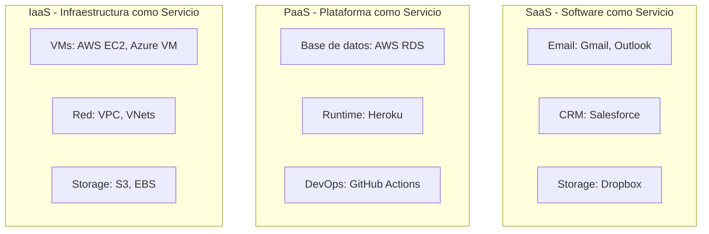
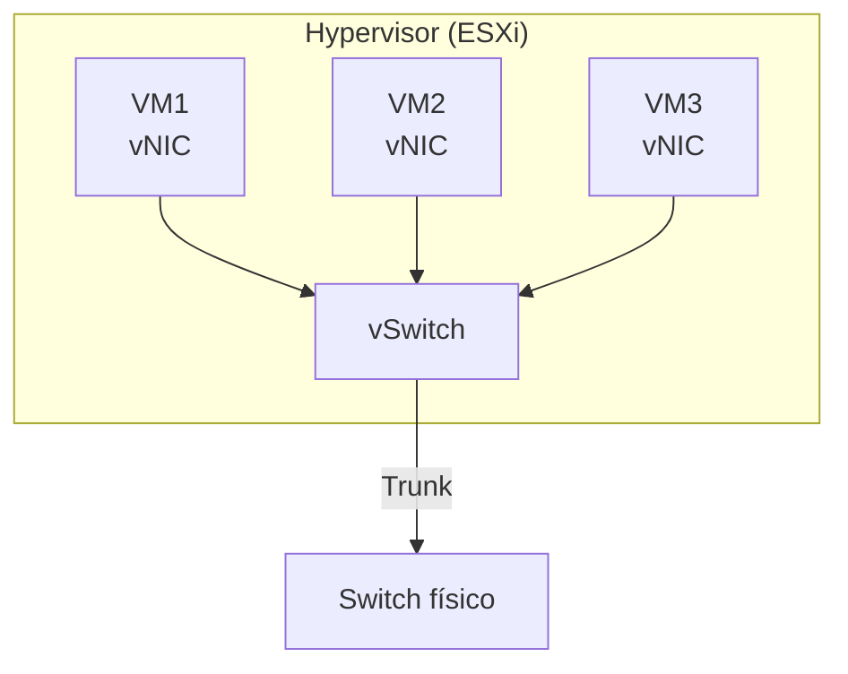

**Cloud computing** es la entrega de recursos de TI (computo, almacenamiento,
red) bajo demanda por internet, con pago por uso. La virtualización de red es
lo que hace posible que el cloud funcione.

## Modelos de servicio



| Modelo | El usuario administra | El proveedor administra | Ejemplo |
| :----- | :------------------- | :---------------------- | :------ |
| **IaaS** | SO, aplicaciones, datos | Hardware, red, virtualización | AWS EC2, Azure VM |
| **PaaS** | Aplicaciones, datos | Todo lo demás | Heroku, Google App Engine |
| **SaaS** | Nada (solo usa) | Todo | Gmail, Office 365 |

### IaaS (Infrastructure as a Service)

El proveedor entrega **máquinas virtuales** con recursos de CPU, RAM y red.
El usuario instala el SO y las aplicaciones.

- **Control total** sobre el sistema operativo.
- **Flexibilidad**: se puede configurar la red (VPC, subnets, firewalls).
- **Escalable**: se pueden agregar/quitar VMs bajo demanda.

### PaaS (Platform as a Service)

El proveedor entrega una **plataforma completa** (runtime, base de datos,
middleware). El usuario solo sube el código.

- **No hay que administrar** el SO ni la infraestructura.
- **Rápido para desarrollar**: deploy en minutos.
- **Limitado**: no se puede personalizar el SO.

### SaaS (Software as a Service)

El usuario **usa el software** directamente por internet. No instala nada.

- **Cero mantenimiento**: el proveedor actualiza todo.
- **Accesible**: desde cualquier dispositivo con internet.
- **Dependencia**: si el servicio cae, no hay acceso.

## Modelos de despliegue

| Modelo | Propiedad | Acceso | Seguridad | Costo |
| :----- | :-------- | :----- | :-------- | :---- |
| **Private** | Una organización | Interno | Alto control | Alto |
| **Public** | Proveedor | Internet | Compartido | Pay-as-you-go |
| **Hybrid** | Combinación | Interno + Internet | Flexible | Mixto |

### Cloud Privado

Infraestructura dedicada a **una sola organización**. Puede estar on-premise
o en un data center dedicado.

- **Ventaja**: control total sobre datos y seguridad.
- **Desventaja**: alto costo de mantenimiento.

### Cloud Público

Infraestructura **compartida** entre múltiples clientes (multi-tenant) del
mismo proveedor (AWS, Azure, GCP).

- **Ventaja**: bajo costo de entrada, escalabilidad infinita.
- **Desventaja**: menor control sobre la infraestructura física.

### Cloud Hybrid

Combina cloud privado y público. Por ejemplo, datos sensibles en private y
carga variable en public.

- **Ventaja**: flexibilidad y optimización de costos.
- **Desventaja**: complejidad de gestión y conectividad.

## Virtualización y Hypervisors

El hypervisor es el software que crea y ejecuta **máquinas virtuales** sobre
hardware físico.

### Tipo 1 (Bare-metal)

Se instala **directamente** sobre el hardware, sin SO intermedio.

```
┌─────────────────────────┐
│  VM1    VM2    VM3      │
├─────────────────────────┤
│  Hypervisor Tipo 1     │  ← VMware ESXi, Hyper-V, KVM
├─────────────────────────┤
│  Hardware físico        │
└─────────────────────────┘
```

- **Ventaja**: rendimiento máximo, sin sobrecapa de SO.
- **Uso**: data centers, servidores de producción.
- **Ejemplos**: VMware ESXi, Microsoft Hyper-V, Xen, KVM.

### Tipo 2 (Hosted)

Se instala **sobre un SO** existente (como una aplicación más).

```
┌─────────────────────────┐
│  VM1    VM2    VM3      │
├─────────────────────────┤
│  Hypervisor Tipo 2     │  ← VirtualBox, VMware Workstation
├─────────────────────────┤
│  SO (Windows/Linux)    │
├─────────────────────────┤
│  Hardware físico        │
└─────────────────────────┘
```

- **Ventaja**: fácil de usar, ideal para desarrollo/pruebas.
- **Desventaja**: menor rendimiento (depende del SO host).
- **Ejemplos**: VirtualBox, VMware Workstation, Parallels.

## Impacto en la red

La virtualización crea **redes virtuales** sobre la infraestructura física:

- **vSwitch**: switch virtual dentro del hypervisor.
- **vNIC**: tarjeta de red virtual conectada a la VM.
- **Port Group**: segmento de red virtual (equivalente a una VLAN).
- **vLAN**: cada port group puede estar en una VLAN diferente.



## Verificación de virtualización

```ios
SW1# show mac address-table          # Ver MACs de VMs
SW1# show interfaces trunk           # Troncales al hypervisor
SW1# show vlan brief                 # VLANs de port groups
```
