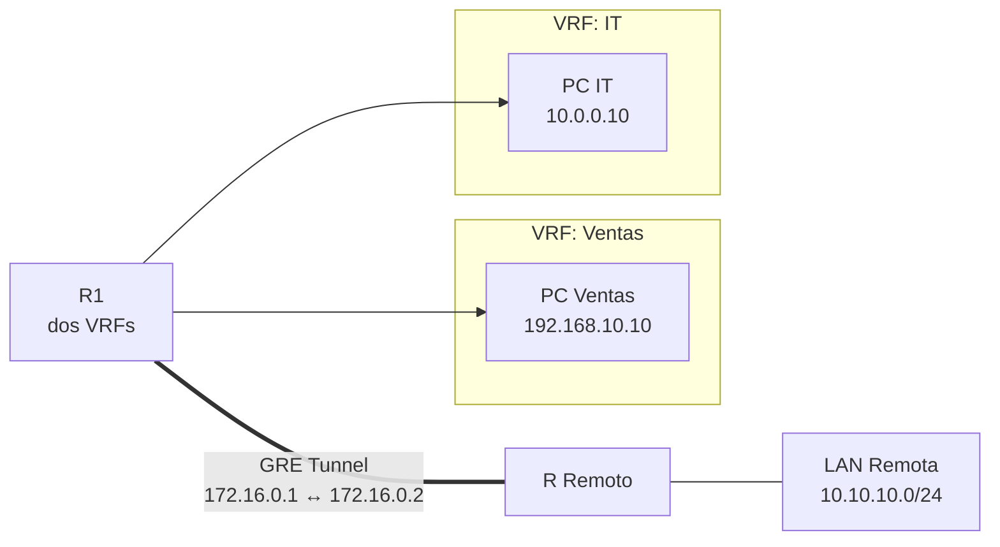

Octava parte de la serie. La red del edificio tiene monitoreo y troubleshooting.
Ahora aplicas **virtualización de red** para segmentar el tráfico de Ventas e
IT con **VRF**, y conectas una red remota con un **túnel GRE**.



## Requisitos

- Red completa del [ejercicio anterior](../09-management-troubleshooting/exercise).
- Un segundo router (RREMOTE) con enlace hacia R1.

## Objetivos

1. Configurar **VRF** en R1 para separar Ventas e IT.
2. Mover las subinterfaces de Ventas e IT a sus VRFs.
3. Configurar un **túnel GRE** entre R1 y RREMOTE.
4. Verificar que las VRFs están aisladas y el túnel funciona.

## Pasos

### 1. Crear las VRFs en R1

```ios
R1(config)# vrf definition VENTAS
R1(config-vrf)# rd 65000:10
R1(config-vrf)# address-family ipv4
R1(config-vrf-af)# route-target export 65000:10
R1(config-vrf-af)# route-target import 65000:10
R1(config-vrf-af)# exit
R1(config-vrf)# exit

R1(config)# vrf definition IT
R1(config-vrf)# rd 65000:20
R1(config-vrf)# address-family ipv4
R1(config-vrf-af)# route-target export 65000:20
R1(config-vrf-af)# route-target import 65000:20
R1(config-vrf-af)# exit
R1(config-vrf)# exit
```

### 2. Asignar interfaces a las VRFs

```ios
R1(config)# interface GigabitEthernet0/0.10
R1(config-subif)# vrf forwarding VENTAS
R1(config-subif)# ip address 192.168.10.1 255.255.255.0

R1(config)# interface GigabitEthernet0/0.20
R1(config-subif)# vrf forwarding IT
R1(config-subif)# ip address 10.0.0.1 255.255.255.0
```

> **Nota**: al asignar una interfaz a una VRF, se borra la IP previa. Reasignar
> la IP después del comando `vrf forwarding`.

### 3. Crear VRF para voz (opcional, separada)

```ios
R1(config)# vrf definition VOZ
R1(config-vrf)# rd 65000:30
R1(config-vrf)# address-family ipv4
R1(config-vrf-af)# exit

R1(config)# interface GigabitEthernet0/0.30
R1(config-subif)# vrf forwarding VOZ
R1(config-subif)# ip address 192.168.30.1 255.255.255.0
```

### 4. Verificar aislamiento VRF

```ios
R1# show vrf
R1# show ip route vrf VENTAS
R1# show ip route vrf IT
R1# ping vrf VENTAS 192.168.10.10
R1# ping vrf IT 10.0.0.10
```

Las PCs de Ventas **no deben** poder hacer ping a PCs de IT (aislamiento).

### 5. Configurar túnel GRE entre R1 y RREMOTE

**En R1:**

```ios
R1(config)# interface Tunnel0
R1(config-if)# ip address 172.16.0.1 255.255.255.252
R1(config-if)# tunnel source 200.200.200.1
R1(config-if)# tunnel destination 200.200.200.2
R1(config-if)# tunnel mode gre ip
R1(config-if)# exit

R1(config)# ip route 10.10.10.0 255.255.255.0 172.16.0.2
```

**En RREMOTE:**

```ios
RREMOTE(config)# interface Tunnel0
RREMOTE(config-if)# ip address 172.16.0.2 255.255.255.252
RREMOTE(config-if)# tunnel source 200.200.200.2
RREMOTE(config-if)# tunnel destination 200.200.200.1
RREMOTE(config-if)# tunnel mode gre ip
RREMOTE(config-if)# exit

RREMOTE(config)# ip route 192.168.10.0 255.255.255.0 172.16.0.1
RREMOTE(config)# ip route 10.0.0.0 255.255.255.0 172.16.0.1
```

### 6. Verificar túnel GRE

```ios
R1# show interface Tunnel0                     # Estado up/up
R1# show tunnel interface Tunnel0             # Detalle del túnel
R1# ping 10.10.10.10                          # Ping a LAN remota
R1# traceroute 10.10.10.10                    # Ver hops a través del túnel
```

### 7. Verificación de extremo a extremo

```ios
R1# show vrf                                 # 3 VRFs activas
R1# show ip route vrf VENTAS                 # Rutas de Ventas
R1# show ip route vrf IT                     # Rutas de IT
R1# ping vrf VENTAS 192.168.10.10           # Ping dentro de VRF
R1# show interface Tunnel0                   # Túnel GRE activo
R1# ping 10.10.10.10                         # LAN remota accesible
```

## Resultado esperado

Al completar este ejercicio:
- Ventas e IT están **aisladas** en VRFs separadas (no pueden comunicarse).
- El **túnel GRE** conecta la red del edificio con la LAN remota.
- La voz y datos siguen funcionando dentro de sus VRFs.
- La red del edificio ahora soporta **virtualización** y **conectividad remota**.
