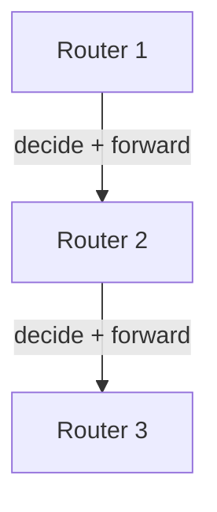
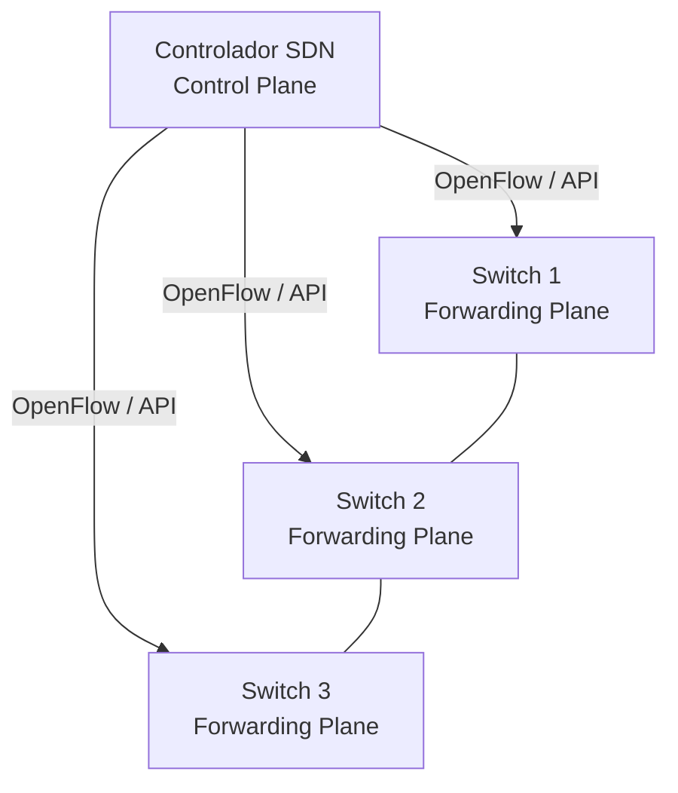
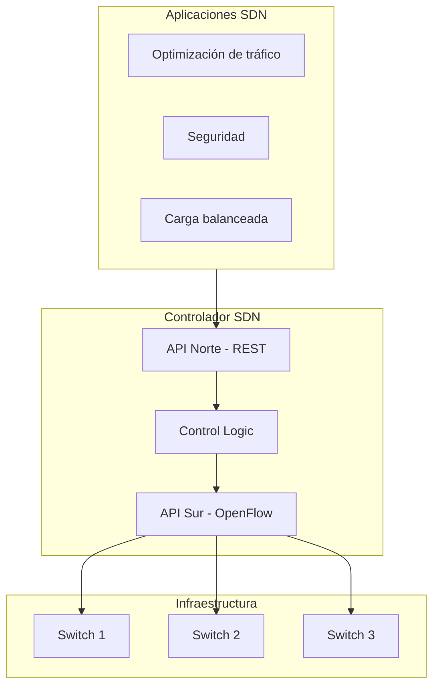
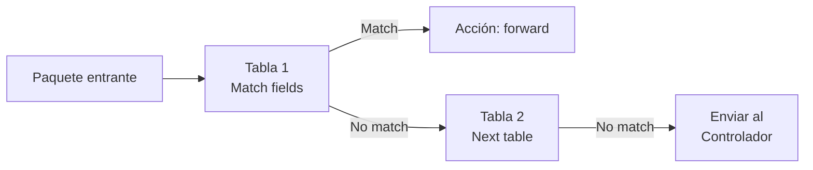
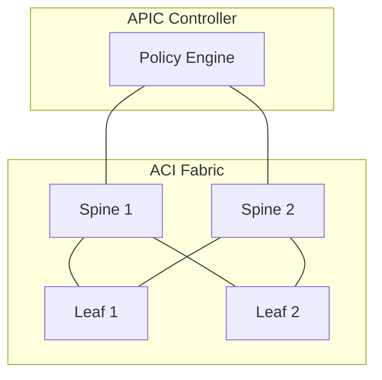
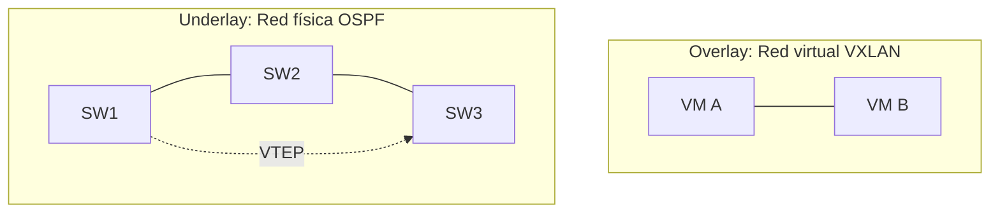

**SDN** (Software-Defined Networking) separa el **plano de control** (decisiones
de enrutamiento) del **plano de datos** (forwarding de paquetes) y lo
centraliza en un controlador. Esto convierte la red en una plataforma
programable.

## Plano de control vs plano de datos

### Tradicional (sin SDN)

Cada dispositivo **toma sus propias decisiones** de forwarding. El control y
los datos están **acoplados** en el mismo hardware.



- Cada router ejecuta protocolos de enrutamiento (OSPF, BGP).
- No hay vista global de la red.
- Los cambios se hacen dispositivo por dispositivo.

### SDN

Un **controlador centralizado** toma las decisiones. Los dispositivos solo
**forwarding** según las instrucciones del controlador.



- El controlador tiene **visibilidad global** de la red.
- Los switches se configuran **programáticamente**.
- La red se puede adaptar dinámicamente a cambios de tráfico.

## Arquitectura SDN



### Capas SDN

| Capa | Función | Ejemplo |
| :--- | :------ | :------ |
| **Application** | Apps de red (seguridad, QoS, monitoring) | Cisco APIC-EM |
| **Control** | Controlador centralizado con vista global | OpenDaylight, ONOS |
| **Infrastructure** | Dispositivos con plano de datos programable | Switches OpenFlow |

### APIs

| API | Dirección | Función |
| :-- | :-------- | :------ |
| **Norte** (Northbound) | App → Controlador | REST API para aplicaciones |
| **Sur** (Southbound) | Controlador → Dispositivos | OpenFlow, NETCONF, gNMI |

## OpenFlow

Protocolo **estándar** de SDN para comunicar el controlador con los switches.
Define cómo el controlador puede **leer, modificar y enviar** tablas de
forwarding en los switches.

### Flujo OpenFlow



### Campos de match

| Campo | Ejemplo |
| :---- | :------ |
| Ingress port | Puerto de entrada |
| Source MAC | MAC del remitente |
| Destination MAC | MAC del destino |
| EtherType | IPv4, IPv6, ARP |
| VLAN ID | 10, 20, 30 |
| Source IP | 192.168.10.10 |
| Destination IP | 10.0.0.1 |
| IP Protocol | TCP, UDP, ICMP |
| TCP/UDP Port | 80, 443, 5060 |

### Acciones OpenFlow

| Acción | Descripción |
| :----- | :---------- |
| Forward | Enviar a un puerto específico |
| Drop | Descartar el paquete |
| Modify field | Cambiar VLAN tag, DSCP, etc. |
| Send to controller | Enviar al controlador para decisión |

## Cisco ACI (Application Centric Infrastructure)

La implementación de SDN de **Cisco** para data centers. Usa el **APIC**
(Application Policy Infrastructure Controller) como controlador central.

### Componentes ACI

| Componente | Función |
| :--------- | :------ |
| **APIC** | Controlador central (maneja políticas) |
| **Spine** | Switches de backbone (alto rendimiento) |
| **Leaf** | Switches de acceso (conectan VMs/servidores) |
| **Fabric** | Red completa Spine-Leaf con ACI |



### Modelo de datos en ACI

ACI usa un **modelo de datos** declarativo: defines el **estado deseado** y el
controlador ejecuta los cambios necesarios.

- **Tenant**: división lógica (multi-tenant).
- **Application Profile**: agrupación de EPGs por aplicación.
- **EPG** (Endpoint Group): grupo de endpoints con la misma política.
- **Contract**: reglas de comunicación entre EPGs.

## Overlay vs Underlay

| Concepto | Underlay | Overlay |
| :------- | :------- | :------ |
| Qué es | Red física IP | Red virtual construida sobre el underlay |
| Capa | L2/L3 real | L2/L3 virtual |
| Ejemplo | OSPF entre switches | VXLAN entre VTEPs |
| Propósito | Transporte | Segmentación, extensión |



- **Underlay** transporta paquetes IP normales.
- **Overlay** crea dominios L2 virtuales sobre el underlay.
- Los protocolos overlay (VXLAN, GRE) encapsulan tramas L2 dentro de paquetes L3.

## Beneficios de SDN

| Beneficio | Descripción |
| :-------- | :---------- |
| Centralización | Un solo punto de gestión y visibilidad |
| Programabilidad | APIs para automatizar y personalizar |
| Agilidad | Cambios en minutos, no horas |
| Visibilidad | Vista global de la red en tiempo real |
| Segmentación | Políticas basadas en aplicación, no en IP |

## Verificación

```ios
R1# show ip ospf neighbor                  # Underlay routing
R1# show interface nve 1                   # VXLAN (NVE interface)
SW1# show vxlan vni                       # VNIs activos
SW1# show nve peers                       # VTEPs vecinos
```
