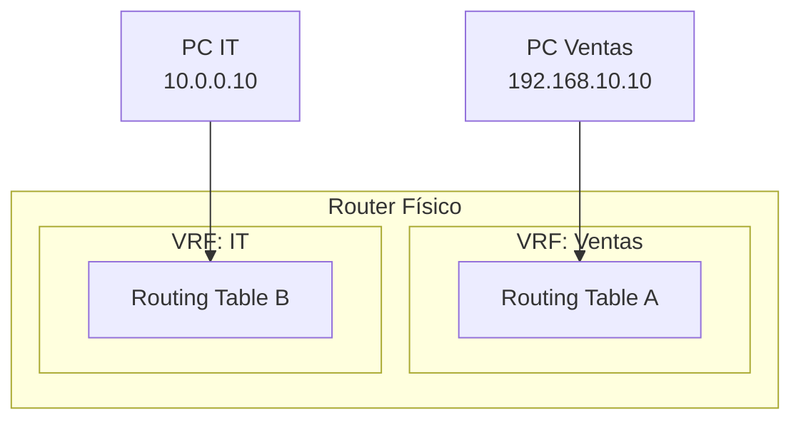
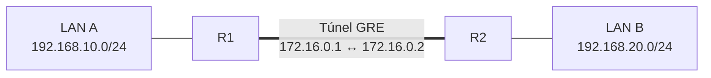
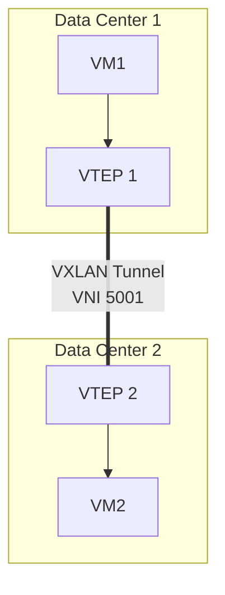

La infraestructura virtual de red crea **redes lógicas aisladas** sobre la
misma infraestructura física. VRF separa el routing, GRE extiende el L3
a través de túneles, y VXLAN extiende dominios L2 sobre L3.

## VRF (Virtual Routing and Forwarding)

VRF permite que un **mismo router** tenga **múltiples tablas de routing**
independientes. Cada VRF es como un router lógico separado.



### Por qué VRF

- **Segmentación**: Ventas e IT no pueden verse entre sí (aunque estén en
  el mismo router).
- **Multi-tenant**: un ISP puede tener múltiples clientes en un solo router.
- **Compartición**: dos VRF pueden compartir enlaces pero con tablas separadas.

### Configuración de VRF

```ios
R1(config)# vrf definition VENTAS
R1(config-vrf)# rd 65000:10
R1(config-vrf)# address-family ipv4
R1(config-vrf-af)# exit
R1(config-vrf)# exit

R1(config)# vrf definition IT
R1(config-vrf)# rd 65000:20
R1(config-vrf)# address-family ipv4
R1(config-vrf-af)# exit
R1(config-vrf)# exit

R1(config)# interface GigabitEthernet0/0.10
R1(config-subif)# encapsulation dot1Q 10
R1(config-subif)# vrf forwarding VENTAS
R1(config-subif)# ip address 192.168.10.1 255.255.255.0

R1(config)# interface GigabitEthernet0/0.20
R1(config-subif)# encapsulation dot1Q 20
R1(config-subif)# vrf forwarding IT
R1(config-subif)# ip address 10.0.0.1 255.255.255.0
```

| Comando | Función |
| :------ | :------ |
| `vrf definition <nombre>` | Crear VRF |
| `rd <ASN>:<id>` | Route Distinguisher (unique ID) |
| `vrf forwarding <nombre>` | Asignar interfaz a VRF |
| `ip route vrf <nombre>` | Ruta estática en VRF específica |

### Verificación VRF

```ios
R1# show vrf                              # Listar VRFs
R1# show vrf interfaces                   # Interfaces por VRF
R1# show ip route vrf VENTAS               # Rutas de VRF específica
R1# show ip vrf                           # Resumen VRF
R1# ping vrf VENTAS 192.168.10.10         # Ping dentro de VRF
```

### Route Target (RT)

Controla **qué rutas se importan/exportan** entre VRFs. Permite conectividad
selectiva entre VRFs o con la tabla global (default VRF).

```ios
R1(config)# vrf definition VENTAS
R1(config-vrf)# address-family ipv4
R1(config-vrf-af)# route-target export 65000:10
R1(config-vrf-af)# route-target import 65000:10
```

## GRE (Generic Routing Encapsulation)

Túnel **point-to-point** que encapsula paquetes de un protocolo dentro de
otro. Permite conectar redes a través de una infraestructura IP intermedia.



### Configuración GRE

```ios
! En R1
R1(config)# interface Tunnel0
R1(config-if)# ip address 172.16.0.1 255.255.255.252
R1(config-if)# tunnel source 200.200.200.1
R1(config-if)# tunnel destination 200.200.200.2
R1(config-if)# tunnel mode gre ip
R1(config-if)# exit

R1(config)# ip route 192.168.20.0 255.255.255.0 172.16.0.2
```

```ios
! En R2
R2(config)# interface Tunnel0
R2(config-if)# ip address 172.16.0.2 255.255.255.252
R2(config-if)# tunnel source 200.200.200.2
R2(config-if)# tunnel destination 200.200.200.1
R2(config-if)# tunnel mode gre ip
R2(config-if)# exit

R2(config)# ip route 192.168.10.0 255.255.255.0 172.16.0.1
```

### Verificación GRE

```ios
R1# show interface Tunnel0                    # Estado del túnel
R1# show ip route                            # Rutas a través del túnel
R1# ping 192.168.20.10                       # Ping a través del túnel
R1# show tunnel interface Tunnel0            # Detalle del túnel
```

### Limitaciones de GRE

- **No cifra**: los datos viajan en texto plano (usar IPsec para cifrado).
- **Overhead**: añade 24 bytes de cabecera por paquete.
- **Point-to-point**: solo conecta dos extremos.

## VXLAN (Virtual Extensible LAN)

Tecnología **overlay** que extiende dominios L2 sobre una red L3. Crea túneles
VXLAN (VNI de 24 bits) entre VTEPs.

### Por qué VXLAN

- **VLAN limit**: solo 4096 VLANs (12 bits). VXLAN permite **16 millones** de
  segmentos (24 bits = VNI).
- **Extensión L2**: permite que el mismo dominio L2 abarque múltiples data
  centers o la nube.
- **Multitenant**: cada VNI es un dominio L2 independiente.

### Conceptos VXLAN

| Concepto | Descripción |
| :------- | :---------- |
| VTEP | VXLAN Tunnel Endpoint (físico o virtual) |
| VNI | VXLAN Network Identifier (24 bits, como VLAN pero mayor) |
| Underlay | Red física IP que transporta los paquetes VXLAN |
| Overlay | Red virtual L2 construida sobre el underlay |



### Encapsulamiento VXLAN

```
[Header Ethernet][Header IP][Header UDP:4789][Header VXLAN: VNI][Trama Ethernet original]
```

- UDP destino: **4789** (puerto estándar VXLAN).
- El underlay solo ve tráfico UDP/IP normal.
- El VTEP encapsula/desencapsula las tramas L2.

### Verificación VXLAN

```ios
SW1# show nve peers                        # VTEPs vecinos
SW1# show nve interface nve 1              # Estado de la interface NVE
SW1# show vxlan vni                        # VNIs activos
SW1# show mac address-table                 # MACs aprendidas por VXLAN
```

## Comparación de tecnologías overlay

| Tecnología | Capa | Alcance | Escala | Uso |
| :--------- | :--- | :------ | :----- | :-- |
| VLAN | L2 | Local (switch) | 4096 | Segmentación básica |
| VRF | L3 | Router | Miles | Aislamiento de routing |
| GRE | L3 | Túnel p2p | Ilimitado | Conectar redes remotas |
| VXLAN | L2 sobre L3 | Data center | 16M | Extensión L2 moderna |
