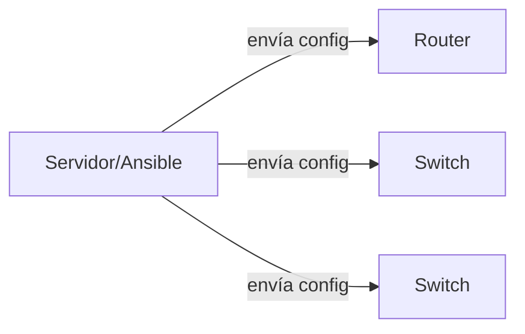
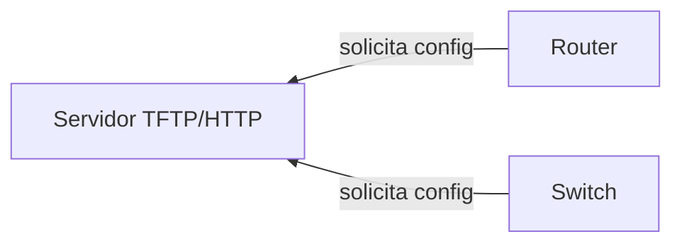
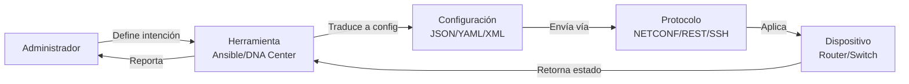

Configurar dispositivos de red **uno por uno** por CLI es lento, propenso a
errores y no escala. La **automatización** ejecuta cambios a través de scripts,
APIs y herramientas, reduciendo errores y acelerando los despliegues.

## Por qué automatizar

| Problema manual | Solución automatizada |
| :-------------- | :-------------------- |
| Configurar 50 switches = 50 sesiones SSH | Script ejecuta en paralelo |
| Error de typo en VLAN | Plantilla validada automáticamente |
| No saber qué cambió | Git registra cada cambio |
| Restore lento después de fallo | Configuración restaurada en segundos |
| Auditoría imposible | Logs de cambios automatizados |

## Push vs Pull

### Push (empujar)

El servidor o plataforma **envía** la configuración al dispositivo.



- **Cómo**: SSH, NETCONF, API REST.
- **Cuándo**: cuando el administrador ejecuta el playbook/script.
- **Herramientas**: Ansible, Puppet, scripts Python.
- **Ventaja**: control total sobre cuándo se aplica el cambio.

### Pull (traer)

El dispositivo **solicita** su configuración a un servidor.



- **Cómo**: TFTP, HTTP, DHCP option 66.
- **Cuándo**: al arrancar o cada X tiempo.
- **Uso típico**:,ZTP (Zero Touch Provisioning), config inicial.
- **Ventaja**: el dispositivo se configura solo al arrancar.

## Formatos de datos

### JSON (JavaScript Object Notation)

Formato **ligero y legible**, nativo de APIs REST. Estándar para intercambio
de datos en automatización de red.

```json
{
  "hostname": "R1",
  "interfaces": [
    {
      "name": "GigabitEthernet0/0",
      "ip_address": "192.168.10.1",
      "subnet_mask": "255.255.255.0",
      "status": "up"
    },
    {
      "name": "GigabitEthernet0/1",
      "ip_address": "200.200.200.1",
      "subnet_mask": "255.255.255.252",
      "status": "up"
    }
  ]
}
```

| Característica | Descripción |
| :------------- | :---------- |
| Sintaxis | Llave-valor `{}` y arrays `[]` |
| Comentario | **No permitido** |
| Tipos | String, number, boolean, null, array, object |
| Uso en redes | APIs REST, salidas de `show` en IOS-XE |

### YAML (YAML Ain't Markup Language)

Formato **ultra legible** para humanos. Es el estándar para playbooks de
Ansible y configuraciones de dispositivos modernos.

```yaml
hostname: R1
interfaces:
  - name: GigabitEthernet0/0
    ip_address: 192.168.10.1
    subnet_mask: 255.255.255.0
    status: up
  - name: GigabitEthernet0/1
    ip_address: 200.200.200.1
    subnet_mask: 255.255.255.252
    status: up
```

| Característica | Descripción |
| :------------- | :---------- |
| Sintaxis | Indentación (2 espacios) |
| Comentario | `#` al inicio de línea |
| Tipos | Inferidos (string, int, bool) |
| Uso en redes | Playbooks Ansible, configuraciones YANG |

### XML (eXtensible Markup Language)

Formato **estructurado** con tags. Usado por NETCONF y configuraciones de
Cisco IOS.

```xml
<config>
  <hostname>R1</hostname>
  <interfaces>
    <interface>
      <name>GigabitEthernet0/0</name>
      <ip-address>192.168.10.1</ip-address>
      <subnet-mask>255.255.255.0</subnet-mask>
    </interface>
  </interfaces>
</config>
```

| Característica | Descripción |
| :------------- | :---------- |
| Sintaxis | Tags `<tag></tag>` |
| Comentario | `<!-- comentario -->` |
| Verbosidad | Alta (más caracteres que JSON/YAML) |
| Uso en redes | NETCONF, configuraciones Cisco |

### Comparación de formatos

| Formato | Legibilidad | Verbosidad | Comentario | Uso principal |
| :------ | :---------- | :--------- | :--------- | :------------ |
| JSON | Media | Media | No | APIs REST |
| YAML | Alta | Baja | Sí | Ansible, config |
| XML | Baja | Alta | Sí | NETCONF |

## YANG (Yet Another Next Generation)

**Modelo de datos** que define la estructura de configuración y estado de
un dispositivo. Es el lenguaje que NETCONF usa.

### Qué es YANG

```
module Cisco-IOS-XE-native {
  container hostname {
    leaf hostname {
      type string;
      description "Nombre del dispositivo";
    }
  }
  container interfaces {
    list interface {
      key "name";
      leaf name {
        type string;
      }
      leaf ip-address {
        type string;
      }
    }
  }
}
```

- **YANG** define **qué datos existen** (estructura).
- **NETCONF** define **cómo se transfieren** (protocolo).
- **JSON/XML** define **cómo se representan** (formato).

### Uso en IOS-XE

```ios
R1# show yum(YANG)                      # Módulos YANG disponibles
R1# show running-config | section ^interface  # Configuración actual
```

Los dispositivos Cisco IOS-XE exponen YANG models que se pueden consultar y
modificar vía NETCONF, RESTCONF o APIs de Cisco DNA Center.

## Flujo completo de automatización


